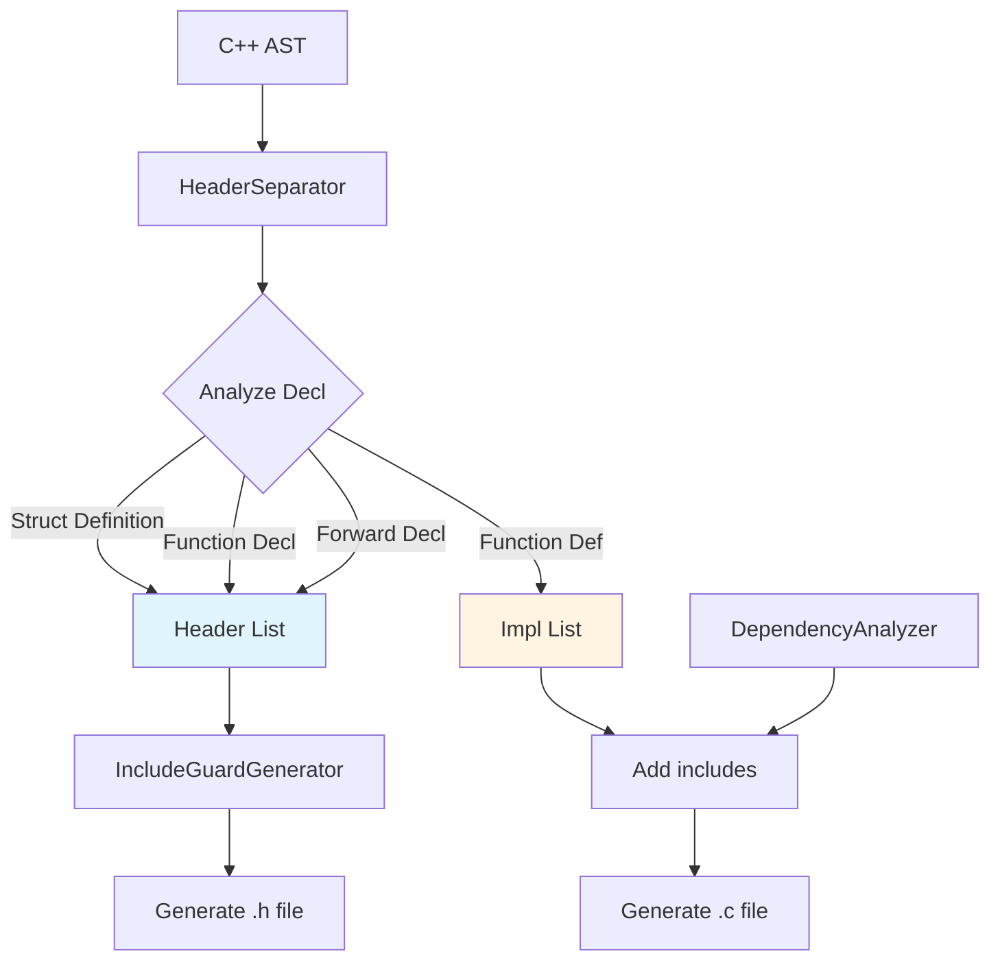

# Meta-Prompt: Header File Support Architecture & GitHub Project Integration

## Context

The C++ to C transpiler currently outputs all generated code to a single stream (stdout). For production use, we need to generate separate `.h` (header) and `.c` (implementation) files with proper include guards, forward declarations, and dependency management.

**Current State:**
- Phase 1 POC complete ✅ - single-file output works
- No header file generation strategy defined
- Forward declarations currently skipped
- No include guard generation
- No dependency tracking

**Research Complete:** Comprehensive analysis in conversation shows three viable strategies (single file, separate .c/.h, inline headers) with recommendation for Option B (separate .c/.h files).

## Meta-Prompt Objectives

Create three sequential prompts that will:

1. **Architecture Design Prompt**: Design header file support in ARCHITECTURE.md
2. **Epic Creation Prompt**: Create GitHub Epic in EPICS.md and GitHub Issues
3. **User Stories Prompt**: Generate User Stories as GitHub Issues and add to Project #14

## Research Stage Output

Your research stage investigation has concluded with these findings:

### Key Design Decisions Needed

1. **Output Strategy**: Separate .c/.h files (Option B) recommended for production quality
2. **Header Contents**: Struct definitions, function declarations, include guards, dependencies
3. **Forward Declarations**: Generate when needed for pointer types
4. **Multi-File Support**: Start with single input → pair of outputs, defer multi-file to Phase 3
5. **Include Management**: Begin with simple runtime.h includes, add full dependency analysis later

### Recommended Implementation Phases

**Phase 2.5 (Recommended Insertion Point)**
- Add between current Phase 2 and Phase 3
- Weeks: 2 weeks (12.5-13.5)
- After: Templates/Name Mangling (Epic #8)
- Before: Virtual Functions (Epic #9)
- Rationale: Need header separation before vtable declarations (Phase 3)

**Deliverables for Phase 2.5:**
- Header/implementation file separation
- Include guard generation
- Declaration vs definition analysis
- Basic forward declaration support
- Runtime library dependency inclusion

### Technical Approach

**New Components Needed:**
```cpp
class HeaderSeparator {
    std::vector<Decl*> headerDecls;   // → .h file
    std::vector<Decl*> implDecls;     // → .c file
    void analyzeDecl(Decl *D);
    void separateDeclarations();
};

class IncludeGuardGenerator {
    std::string generateGuardName(StringRef filename);
    void emitGuard(raw_ostream &OS, StringRef guard);
};

class DependencyAnalyzer {
    void trackDependencies(Decl *D);
    std::vector<std::string> getRequiredIncludes();
};
```

**CodeGenerator Changes:**
```cpp
class CodeGenerator {
    // Add dual-stream support
    raw_ostream *HeaderOS;
    raw_ostream *ImplOS;

    void printHeader(Decl *D);
    void printImpl(Decl *D);
};
```

---

## Prompt 1: Architecture Design

**Objective:** Update ARCHITECTURE.md with comprehensive header file support design.

**Input Files:**
- `docs/ARCHITECTURE.md` (current architecture)
- Research findings from conversation

**Tasks:**

1. **Add New Phase 2.5 Section** (insert after Weeks 12-13)
   - Title: "Weeks 12.5-13.5: Header File Generation & Separation"
   - Duration: 2 weeks
   - Placement rationale: After name mangling, before virtual functions
   - Dependencies: Epic #8 (Templates/Name Mangling)

2. **Section Content Structure:**

```markdown
### Weeks 12.5-13.5: Header File Generation & Separation

**Goal:** Enable production-quality output with separate .h/.c files for modularity and reusability.

**Deliverables:**
- Header/implementation file separation
- Include guard generation (standard #ifndef/#define/#endif)
- Declaration vs definition analysis
- Forward declaration generation
- Dependency tracking (runtime library includes)

**Architecture Components:**

#### HeaderSeparator
**Purpose:** Analyze declarations and route to appropriate output file.

**Algorithm:**
1. Traverse TranslationUnitDecl
2. For each Decl:
   - RecordDecl (struct/class) → header if complete definition
   - FunctionDecl → declaration to header, definition to impl
   - Forward declarations → header when needed by pointers
3. Build separate declaration lists for each output

#### IncludeGuardGenerator
**Purpose:** Generate standard C include guards.

**Format:**
```c
#ifndef FILENAME_H
#define FILENAME_H
// ... declarations ...
#endif
```

**Naming Convention:**
- Input: `MyClass.cpp` → Guard: `MYCLASS_H`
- Uppercase, replace special chars with underscore

#### DependencyAnalyzer
**Purpose:** Track which headers must be included.

**Initial Implementation (Phase 2.5):**
- Always include: `#include "cpptoc_runtime.h"` (when runtime features used)
- Track exception usage → include runtime
- Track RTTI usage → include runtime

**Future (Phase 3+):**
- Full dependency graph analysis
- Minimal include sets
- Transitive dependency elimination

#### Code Generation Flow



**Example Translation:**

C++ Input (`Point.cpp`):
```cpp
class Point {
    int x, y;
public:
    Point(int x, int y);
    int getX() const;
};

Point::Point(int x, int y) : x(x), y(y) {}
int Point::getX() const { return x; }
```

Generated Header (`Point.h`):
```c
#ifndef POINT_H
#define POINT_H

// Struct definition
struct Point {
    int x;
    int y;
};

// Function declarations
void Point_ctor(struct Point *this, int x, int y);
int Point_getX(const struct Point *this);

#endif
```

Generated Implementation (`Point.c`):
```c
#include "Point.h"

void Point_ctor(struct Point *this, int x, int y) {
    this->x = x;
    this->y = y;
}

int Point_getX(const struct Point *this) {
    return this->x;
}
```

**Success Criteria:**
- Header compiles standalone (no missing dependencies)
- Implementation compiles with header included
- Include guards prevent multiple inclusion
- No duplicate definitions
- Forward declarations resolve all pointer types

**Testing Strategy:**
```bash
# Test header standalone
gcc -c Point.h -o /dev/null

# Test implementation
gcc -c Point.c -o Point.o

# Test multiple inclusion
cat > test.c << EOF
#include "Point.h"
#include "Point.h"  // Should not cause errors
int main() { return 0; }
EOF
gcc test.c Point.o -o test
```
```

3. **Update Section Numbering:**
   - Current "Weeks 13-16: Virtual Functions" → "Weeks 14-17: Virtual Functions"
   - Current "Weeks 17-20: Exceptions" → "Weeks 18-21: Exceptions"
   - All subsequent phase numbers shift by +1 week
   - Update final timeline from "46 weeks" → "47 weeks"

4. **Update Component Design Section (Section 3):**
   - Add HeaderSeparator to component diagram
   - Add IncludeGuardGenerator to component list
   - Add DependencyAnalyzer to component list

5. **Update Implementation Roadmap (Section 6):**
   - Add Phase 2.5 to Gantt chart
   - Update timeline milestones
   - Adjust dependent phases

**Output Format:**
- Preserve all existing architecture content
- Insert new Phase 2.5 section in chronological order
- Update all affected week numbers throughout document
- Maintain consistent Mermaid diagram style
- Keep all code examples formatted correctly

**Validation Checklist:**
- [ ] Phase 2.5 inserted between Phases 2 and 3
- [ ] All week numbers updated consistently
- [ ] Mermaid diagrams render correctly
- [ ] Code examples are valid C/C++
- [ ] Success criteria are measurable
- [ ] Component integration clear

---

## Prompt 2: Epic Creation

**Objective:** Create Epic #19 in EPICS.md and GitHub Issues.

**Input Files:**
- `EPICS.md` (epic registry)
- Updated `docs/ARCHITECTURE.md` (from Prompt 1)

**Tasks:**

1. **Add Epic #19 to EPICS.md**

Insert after Epic #8 (Templates), before Epic #9 (Virtual Functions):

```markdown
### Epic #19: Header File Generation & Separation

**GitHub Issue:** [#TBD](https://github.com/o2alexanderfedin/cpp-to-c-transpiler/issues/TBD)
**Weeks:** Weeks 12.5-13.5 (2 weeks)
**Priority:** Critical
**Type:** Core Infrastructure
**Dependencies:** Epic #8 (Name Mangling + Templates)

**Architecture References:**
- [ARCHITECTURE.md - Phase 2.5, Weeks 12.5-13.5](docs/ARCHITECTURE.md#weeks-125-135-header-file-generation--separation)

**Deliverables:**
- Header/implementation file separation
- Include guard generation (#ifndef/#define/#endif)
- Declaration vs definition analysis
- Forward declaration support for pointer types
- Dependency tracking (runtime library includes)
- Dual output streams (header + implementation)

**Success Criteria:**
- Generated .h files compile standalone
- Generated .c files compile with corresponding .h
- Include guards prevent multiple inclusion errors
- No duplicate definitions between .h and .c
- Forward declarations resolve pointer dependencies
- Runtime library included only when features used

**Technical Foundation:**
Implements production-quality multi-file output with proper C header/implementation separation. Critical for Phase 3+ features (virtual functions require vtable declarations in headers).

**Components:**
- HeaderSeparator: Routes declarations to header vs implementation
- IncludeGuardGenerator: Creates standard include guards
- DependencyAnalyzer: Tracks required includes
- CodeGenerator dual-stream: Separate outputs for .h and .c

**Translation Example:**

C++ Input:
```cpp
class Point {
    int x, y;
public:
    Point(int x, int y);
    int getX() const;
};
```

Generated Output:
- `Point.h`: Struct definition + function declarations + include guards
- `Point.c`: Function definitions + `#include "Point.h"`

**Complexity:** 8 Story Points

**User Stories:** 6 stories (see User Stories section below)
```

2. **Create GitHub Epic Issue**

Use GitHub CLI to create Epic #19:

```bash
gh issue create \
  --repo o2alexanderfedin/cpp-to-c-transpiler \
  --title "Epic #19: Header File Generation & Separation" \
  --body "$(cat <<'EOF'
## Epic Overview

Enable production-quality output with separate `.h` (header) and `.c` (implementation) files with proper include guards, forward declarations, and dependency management.

**Phase:** 2.5 (Weeks 12.5-13.5)
**Duration:** 2 weeks
**Priority:** Critical
**Dependencies:** Epic #8 (Name Mangling + Templates)

## Architecture Reference

[ARCHITECTURE.md - Phase 2.5](docs/ARCHITECTURE.md#weeks-125-135-header-file-generation--separation)

## Problem Statement

Current transpiler outputs all code to single stream (stdout):
- ❌ No header files generated
- ❌ Cannot compile generated code in modular fashion
- ❌ No include guards
- ❌ Forward declarations skipped
- ❌ Phase 3+ features (vtables) need header declarations

## Deliverables

1. **HeaderSeparator Component**
   - Analyze declarations (struct defs, func decls, func defs)
   - Route to header vs implementation lists
   - Handle forward declarations

2. **IncludeGuardGenerator Component**
   - Generate standard #ifndef/#define/#endif guards
   - Naming: FILENAME_H convention
   - Prevent multiple inclusion

3. **DependencyAnalyzer Component**
   - Track runtime library usage
   - Generate #include directives
   - Future: full dependency graph

4. **CodeGenerator Dual-Stream**
   - Separate output streams for .h and .c
   - printHeader() vs printImpl() methods
   - Coordinate between streams

5. **File Output System**
   - Command-line options: --output-header, --output-impl
   - Default: <input_base>.h and <input_base>.c
   - Handle file I/O with error handling

## Success Criteria

- [ ] Generated .h files compile standalone (no missing deps)
- [ ] Generated .c files compile with corresponding .h
- [ ] Include guards prevent multiple inclusion
- [ ] No duplicate definitions between .h and .c
- [ ] Forward declarations resolve pointer types
- [ ] Runtime library included only when needed
- [ ] File I/O handles errors gracefully
- [ ] All tests pass (unit + integration)

## Example Translation

**Input:** `Point.cpp`
```cpp
class Point {
    int x, y;
public:
    Point(int x, int y);
    int getX() const;
};
Point::Point(int x, int y) : x(x), y(y) {}
int Point::getX() const { return x; }
```

**Output:** `Point.h`
```c
#ifndef POINT_H
#define POINT_H

struct Point {
    int x;
    int y;
};

void Point_ctor(struct Point *this, int x, int y);
int Point_getX(const struct Point *this);

#endif
```

**Output:** `Point.c`
```c
#include "Point.h"

void Point_ctor(struct Point *this, int x, int y) {
    this->x = x;
    this->y = y;
}

int Point_getX(const struct Point *this) {
    return this->x;
}
```

## Technical Components

- **HeaderSeparator** (150-200 LOC): Declaration routing logic
- **IncludeGuardGenerator** (50-80 LOC): Guard name generation + emission
- **DependencyAnalyzer** (100-150 LOC): Track includes
- **CodeGenerator updates** (100-150 LOC): Dual-stream support
- **File I/O System** (80-120 LOC): Command-line + file handling

**Total Estimated LOC:** 480-700 LOC

## User Stories

6 User Stories will be created (Story Points: 8 total):
1. Header/Implementation Separation (Story #136) - 2 SP
2. Include Guard Generation (Story #137) - 1 SP
3. Forward Declaration Support (Story #138) - 2 SP
4. Dependency Tracking (Story #139) - 1 SP
5. File Output System (Story #140) - 1 SP
6. Integration Testing (Story #141) - 1 SP

## Testing Strategy

**Unit Tests:**
- HeaderSeparator routing logic
- Include guard name generation
- Dependency detection

**Integration Tests:**
- Full .h/.c generation from sample C++ classes
- Compile generated .h standalone
- Compile generated .c with .h
- Multiple inclusion test

**Validation:**
```bash
cpptoc Point.cpp --output-header Point.h --output-impl Point.c
gcc -c Point.h -o /dev/null  # Header compiles standalone
gcc -c Point.c -o Point.o     # Implementation compiles
```

## Traceability

- **Architecture:** docs/ARCHITECTURE.md (Phase 2.5, Weeks 12.5-13.5)
- **Roadmap:** docs/feasibility-and-roadmap.md
- **EPICS.md:** Epic #19
- **GitHub Project:** [#14](https://github.com/users/o2alexanderfedin/projects/14)

## Story Points

**Total:** 8 Story Points (2 weeks, 1 FTE)

## Labels

`epic`, `phase-2`, `core-infrastructure`, `critical`

---

**Created:** $(date +%Y-%m-%d)
**Status:** Planning
**Assignee:** TBD
EOF
)" \
  --label "epic,phase-2,core-infrastructure,critical"
```

3. **Add to GitHub Project #14**

```bash
# Get issue number from creation
EPIC_NUM=$(gh issue list --repo o2alexanderfedin/cpp-to-c-transpiler --label epic --limit 1 --json number --jq '.[0].number')

# Add to project
gh project item-add 14 --owner o2alexanderfedin --url "https://github.com/o2alexanderfedin/cpp-to-c-transpiler/issues/$EPIC_NUM"

# Set Type field to "Epic"
ITEM_ID=$(gh project item-list 14 --owner o2alexanderfedin --format json --limit 1000 | jq -r ".items[] | select(.content.number == $EPIC_NUM) | .id")
gh project item-edit --project-id PVT_kwHOBJ7Qkc4BKHLI --id "$ITEM_ID" --field-id PVTSSF_lAHOBJ7Qkc4BKHLIzg6E1I4 --single-select-option-id f75ad846  # Epic option ID
```

4. **Update EPICS.md Traceability Matrix**

Add Epic #19 row to Complete Traceability Matrix table:

```markdown
| 19 | [#TBD](link) | [Header Generation](docs/ARCHITECTURE.md#weeks-125-135) | Weeks 12.5-13.5 | Phase 2.5 | Critical | 📝 Open |
```

**Output:**
- Updated EPICS.md with Epic #19 section
- GitHub Epic Issue #19 created
- Epic added to Project #14 with Type="Epic"
- Traceability matrix updated

**Validation:**
- [ ] Epic #19 visible in EPICS.md
- [ ] GitHub issue created and labeled
- [ ] Issue added to Project #14
- [ ] Type field set to "Epic"
- [ ] Traceability matrix includes Epic #19

---

## Prompt 3: User Stories Generation

**Objective:** Create 6 User Stories as GitHub Issues for Epic #19.

**Input Files:**
- `EPICS.md` (with Epic #19)
- Updated `docs/ARCHITECTURE.md`
- Epic #19 GitHub Issue number (from Prompt 2)

**Tasks:**

1. **Generate 6 User Stories**

Create User Story markdown files in `/tmp/` directory:

**Story #136: Header/Implementation Separation (2 SP)**
```markdown
## User Story

As a C++ to C transpiler developer, I want declaration routing logic, So that struct definitions and function declarations go to .h files while function definitions go to .c files.

## Parent Epic

**Epic #19: Header File Generation & Separation** - Issue #[EPIC_NUM]

## Acceptance Criteria

- [ ] HeaderSeparator class analyzes Decl nodes
- [ ] RecordDecl (complete definitions) routed to header
- [ ] FunctionDecl declarations routed to header
- [ ] FunctionDecl definitions routed to implementation
- [ ] Maintains separate lists: headerDecls, implDecls
- [ ] Integration with existing CppToCVisitor
- [ ] Unit tests for routing logic

## Technical Details

**Key Files:** src/HeaderSeparator.h, src/HeaderSeparator.cpp, include/HeaderSeparator.h

**Implementation:**
```cpp
class HeaderSeparator {
    std::vector<Decl*> headerDecls;
    std::vector<Decl*> implDecls;

    void analyzeDecl(Decl *D) {
        if (auto *RD = dyn_cast<RecordDecl>(D)) {
            if (RD->isCompleteDefinition()) {
                headerDecls.push_back(D);
            }
        } else if (auto *FD = dyn_cast<FunctionDecl>(D)) {
            if (FD->hasBody()) {
                implDecls.push_back(FD);
                // Also need declaration in header
                headerDecls.push_back(createFunctionDecl(FD));
            } else {
                headerDecls.push_back(FD);
            }
        }
    }

    void separateTranslationUnit(TranslationUnitDecl *TU);
    const std::vector<Decl*>& getHeaderDecls() const;
    const std::vector<Decl*>& getImplDecls() const;
};
```

## Test Cases

1. Simple struct → header only
2. Function declaration → header
3. Function definition → impl + declaration in header
4. Class with methods → struct in header, methods in impl
5. Multiple classes → all structs in header
6. Empty translation unit → empty lists

## Definition of Done

- [ ] Core functionality implemented per Epic #19
- [ ] Unit tests pass (6+ tests)
- [ ] Integration tests pass
- [ ] Code passes linters and type checks
- [ ] Documentation updated (Doxygen comments)

## Traceability

**Architecture:** docs/ARCHITECTURE.md (Phase 2.5, Weeks 12.5-13.5), Epic #19
**Component:** HeaderSeparator

## Complexity

**Story Points:** 2
```

**Story #137: Include Guard Generation (1 SP)**
```markdown
## User Story

As a C++ to C transpiler developer, I want include guard generation, So that .h files have standard #ifndef/#define/#endif guards preventing multiple inclusion.

## Parent Epic

**Epic #19: Header File Generation & Separation** - Issue #[EPIC_NUM]

## Acceptance Criteria

- [ ] IncludeGuardGenerator class implemented
- [ ] Guard names follow FILENAME_H convention
- [ ] Special characters replaced with underscores
- [ ] Uppercase transformation
- [ ] emitGuard() writes #ifndef/#define/#endif
- [ ] Integration with CodeGenerator header output
- [ ] Unit tests for guard name generation

## Technical Details

**Key Files:** src/IncludeGuardGenerator.h, src/IncludeGuardGenerator.cpp

**Implementation:**
```cpp
class IncludeGuardGenerator {
public:
    std::string generateGuardName(StringRef filename) {
        // Point.h → POINT_H
        std::string guard = filename.str();
        // Replace . with _
        std::replace(guard.begin(), guard.end(), '.', '_');
        // Uppercase
        std::transform(guard.begin(), guard.end(), guard.begin(), ::toupper);
        return guard;
    }

    void emitGuard(raw_ostream &OS, StringRef guardName) {
        OS << "#ifndef " << guardName << "\n";
        OS << "#define " << guardName << "\n\n";
    }

    void emitGuardEnd(raw_ostream &OS, StringRef guardName) {
        OS << "\n#endif // " << guardName << "\n";
    }
};
```

## Test Cases

1. "Point.h" → "POINT_H"
2. "MyClass.h" → "MYCLASS_H"
3. "my-class.h" → "MY_CLASS_H"
4. "name_space_class.h" → "NAME_SPACE_CLASS_H"
5. Full emission test: emitGuard + content + emitGuardEnd

## Definition of Done

- [ ] Core functionality implemented per Epic #19
- [ ] Unit tests pass (5+ tests)
- [ ] Integration with CodeGenerator
- [ ] Code passes linters and type checks
- [ ] Documentation updated

## Traceability

**Architecture:** docs/ARCHITECTURE.md (Phase 2.5), Epic #19
**Component:** IncludeGuardGenerator

## Complexity

**Story Points:** 1
```

**Story #138: Forward Declaration Support (2 SP)**
```markdown
## User Story

As a C++ to C transpiler developer, I want forward declaration generation, So that pointer types can reference incomplete structs without requiring full definitions.

## Parent Epic

**Epic #19: Header File Generation & Separation** - Issue #[EPIC_NUM]

## Acceptance Criteria

- [ ] Detect incomplete struct references (pointers)
- [ ] Generate forward declarations: `struct MyClass;`
- [ ] Place forward decls before structs that use them
- [ ] Avoid redundant forward declarations
- [ ] Handle circular dependencies (A → B, B → A)
- [ ] Integration with HeaderSeparator
- [ ] Unit tests for forward declaration detection

## Technical Details

**Key Files:** src/HeaderSeparator.cpp (add forward decl logic)

**Implementation:**
```cpp
class HeaderSeparator {
    std::set<std::string> forwardDeclared;

    void analyzeForwardDecls(Decl *D) {
        if (auto *RD = dyn_cast<RecordDecl>(D)) {
            // Scan fields for pointer types
            for (auto *Field : RD->fields()) {
                QualType FT = Field->getType();
                if (const PointerType *PT = FT->getAs<PointerType>()) {
                    QualType PointeeType = PT->getPointeeType();
                    if (const RecordType *RT = PointeeType->getAs<RecordType>()) {
                        std::string name = RT->getDecl()->getName().str();
                        if (forwardDeclared.find(name) == forwardDeclared.end()) {
                            // Emit forward declaration
                            emitForwardDecl(name);
                            forwardDeclared.insert(name);
                        }
                    }
                }
            }
        }
    }

    void emitForwardDecl(StringRef name) {
        headerDecls.insert(headerDecls.begin(),
            createForwardDecl(name));
    }
};
```

## Test Cases

1. Struct with pointer to another struct → forward decl emitted
2. Circular dependency: A → B, B → A → both forward declared
3. Multiple pointers to same type → single forward decl
4. Non-pointer field → no forward decl
5. Pointer to primitive type (int*) → no forward decl
6. Complex case: 3 structs with cross-references

## Definition of Done

- [ ] Core functionality implemented per Epic #19
- [ ] Unit tests pass (6+ tests)
- [ ] Integration tests pass
- [ ] Circular dependency handled correctly
- [ ] Code passes linters and type checks
- [ ] Documentation updated

## Traceability

**Architecture:** docs/ARCHITECTURE.md (Phase 2.5), Epic #19
**Component:** HeaderSeparator (forward decl logic)

## Complexity

**Story Points:** 2
```

**Story #139: Dependency Tracking (1 SP)**
```markdown
## User Story

As a C++ to C transpiler developer, I want dependency tracking, So that generated .c files include the correct header files (runtime library, own header, etc.).

## Parent Epic

**Epic #19: Header File Generation & Separation** - Issue #[EPIC_NUM]

## Acceptance Criteria

- [ ] DependencyAnalyzer class implemented
- [ ] Detect runtime library usage (exceptions, RTTI)
- [ ] Track own header dependency (.c includes .h)
- [ ] Generate #include directives in correct order
- [ ] Avoid redundant includes
- [ ] Integration with CodeGenerator impl output
- [ ] Unit tests for dependency detection

## Technical Details

**Key Files:** src/DependencyAnalyzer.h, src/DependencyAnalyzer.cpp

**Implementation:**
```cpp
class DependencyAnalyzer {
    bool usesRuntimeLibrary;
    std::string ownHeaderName;

public:
    void analyzeDecl(Decl *D) {
        // Check for exception handling (future: Phase 3)
        // Check for RTTI usage (future: Phase 3)
        // For now, simple: track own header
    }

    void setOwnHeader(StringRef headerFilename) {
        ownHeaderName = headerFilename.str();
    }

    std::vector<std::string> getRequiredIncludes() const {
        std::vector<std::string> includes;

        // Own header always first
        includes.push_back("#include \"" + ownHeaderName + "\"");

        // Runtime library if needed (future phases)
        if (usesRuntimeLibrary) {
            includes.push_back("#include \"cpptoc_runtime.h\"");
        }

        return includes;
    }
};
```

## Test Cases

1. Simple class → includes own .h only
2. Exception usage → includes runtime + own .h (future)
3. RTTI usage → includes runtime + own .h (future)
4. No features → includes own .h only
5. Multiple dependencies → correct order

## Definition of Done

- [ ] Core functionality implemented per Epic #19
- [ ] Unit tests pass (5+ tests)
- [ ] Integration with CodeGenerator
- [ ] Code passes linters and type checks
- [ ] Documentation updated
- [ ] Extensible for future dependency types

## Traceability

**Architecture:** docs/ARCHITECTURE.md (Phase 2.5), Epic #19
**Component:** DependencyAnalyzer

## Complexity

**Story Points:** 1
```

**Story #140: File Output System (1 SP)**
```markdown
## User Story

As a C++ to C transpiler user, I want command-line file output options, So that I can specify where .h and .c files are written.

## Parent Epic

**Epic #19: Header File Generation & Separation** - Issue #[EPIC_NUM]

## Acceptance Criteria

- [ ] Command-line options: --output-header, --output-impl
- [ ] Default behavior: <input_base>.h and <input_base>.c
- [ ] File I/O error handling (permissions, disk full, etc.)
- [ ] Integration with CodeGenerator dual-stream
- [ ] Help text documents new options
- [ ] Unit tests for option parsing
- [ ] Integration tests for file creation

## Technical Details

**Key Files:** src/main.cpp, src/CodeGenerator.cpp

**Command-Line Options:**
```cpp
static llvm::cl::opt<std::string> OutputHeader(
    "output-header",
    llvm::cl::desc("Output header file path (default: <input>.h)"),
    llvm::cl::value_desc("filename"),
    llvm::cl::cat(ToolCategory)
);

static llvm::cl::opt<std::string> OutputImpl(
    "output-impl",
    llvm::cl::desc("Output implementation file path (default: <input>.c)"),
    llvm::cl::value_desc("filename"),
    llvm::cl::cat(ToolCategory)
);
```

**File Creation:**
```cpp
void CodeGenerator::openOutputFiles(StringRef headerPath, StringRef implPath) {
    std::error_code HeaderEC;
    HeaderOS = std::make_unique<raw_fd_ostream>(headerPath, HeaderEC);
    if (HeaderEC) {
        llvm::errs() << "Error opening header file: " << HeaderEC.message() << "\n";
        return;
    }

    std::error_code ImplEC;
    ImplOS = std::make_unique<raw_fd_ostream>(implPath, ImplEC);
    if (ImplEC) {
        llvm::errs() << "Error opening impl file: " << ImplEC.message() << "\n";
        return;
    }
}
```

## Test Cases

1. Default: `cpptoc Point.cpp` → Point.h + Point.c
2. Custom header: `cpptoc --output-header out.h Point.cpp`
3. Custom impl: `cpptoc --output-impl out.c Point.cpp`
4. Both custom: specify both paths
5. Error: write-protected directory → error message
6. Error: disk full simulation → graceful failure
7. Help text: `cpptoc --help` shows new options

## Definition of Done

- [ ] Core functionality implemented per Epic #19
- [ ] Unit tests pass (command-line parsing)
- [ ] Integration tests pass (file creation)
- [ ] Error handling comprehensive
- [ ] Code passes linters and type checks
- [ ] Documentation updated (README.md)
- [ ] Help text clear and complete

## Traceability

**Architecture:** docs/ARCHITECTURE.md (Phase 2.5), Epic #19
**Component:** File Output System

## Complexity

**Story Points:** 1
```

**Story #141: Integration Testing (1 SP)**
```markdown
## User Story

As a C++ to C transpiler developer, I want comprehensive integration tests, So that header file generation works end-to-end with real compilation.

## Parent Epic

**Epic #19: Header File Generation & Separation** - Issue #[EPIC_NUM]

## Acceptance Criteria

- [ ] Integration test suite created (5+ tests)
- [ ] Test: Generate .h/.c from sample C++ class
- [ ] Test: Compile generated .h standalone
- [ ] Test: Compile generated .c with .h
- [ ] Test: Multiple inclusion (include .h twice)
- [ ] Test: Forward declarations resolve correctly
- [ ] Automated test script (run_integration_tests.sh)
- [ ] All tests pass in CI/CD

## Technical Details

**Key Files:** tests/integration/test_header_generation.cpp, scripts/run_integration_tests.sh

**Test Structure:**
```bash
#!/bin/bash
# run_integration_tests.sh

# Test 1: Simple class
echo "Test 1: Simple class generation"
cpptoc tests/integration/SimpleClass.cpp --output-header /tmp/SimpleClass.h --output-impl /tmp/SimpleClass.c

# Verify header compiles standalone
gcc -c /tmp/SimpleClass.h -o /dev/null || exit 1

# Verify impl compiles
gcc -c /tmp/SimpleClass.c -o /tmp/SimpleClass.o || exit 1

# Test 2: Multiple inclusion
echo "Test 2: Multiple inclusion"
cat > /tmp/test_multi_include.c << EOF
#include "SimpleClass.h"
#include "SimpleClass.h"  // Should not cause errors
int main() { return 0; }
EOF
gcc /tmp/test_multi_include.c /tmp/SimpleClass.o -o /tmp/test || exit 1

# Test 3: Forward declarations
echo "Test 3: Forward declarations"
cpptoc tests/integration/CircularDeps.cpp --output-header /tmp/CircularDeps.h --output-impl /tmp/CircularDeps.c
gcc -c /tmp/CircularDeps.c -o /tmp/CircularDeps.o || exit 1

# Test 4: Full program
echo "Test 4: Full program compilation and execution"
cpptoc tests/integration/Point.cpp --output-header /tmp/Point.h --output-impl /tmp/Point.c
cpptoc tests/integration/main.cpp --output-impl /tmp/main.c
gcc /tmp/Point.c /tmp/main.c -o /tmp/program || exit 1
/tmp/program || exit 1

echo "All integration tests passed!"
```

**Sample Test Inputs:**
```cpp
// tests/integration/SimpleClass.cpp
class SimpleClass {
    int value;
public:
    SimpleClass(int v) : value(v) {}
    int getValue() const { return value; }
};

// tests/integration/CircularDeps.cpp
class B;
class A {
    B* ptr;
public:
    A();
};
class B {
    A* ptr;
public:
    B();
};
```

## Test Cases

1. SimpleClass: Basic class with method
2. Multiple inclusion: Include header twice
3. CircularDeps: Forward declarations
4. Full program: Main + class compilation + execution
5. Error cases: Invalid input, compilation failures

## Definition of Done

- [ ] Core functionality implemented per Epic #19
- [ ] 5+ integration tests implemented
- [ ] All tests pass locally
- [ ] All tests pass in CI/CD
- [ ] Test script documented
- [ ] Code passes linters and type checks
- [ ] README.md updated with testing instructions

## Traceability

**Architecture:** docs/ARCHITECTURE.md (Phase 2.5), Epic #19
**Component:** Integration Testing

## Complexity

**Story Points:** 1
```

2. **Create GitHub Issues for User Stories**

For each story, create GitHub issue:

```bash
# Create temporary files with story content
for story_num in 136 137 138 139 140 141; do
    gh issue create \
        --repo o2alexanderfedin/cpp-to-c-transpiler \
        --title "Story #${story_num}: [TITLE from story]" \
        --body "$(cat /tmp/story${story_num}.md)" \
        --label "user-story,phase-2,epic-19"
done
```

3. **Add User Stories to GitHub Project #14**

```bash
# Add each story to project
for story_num in 136 137 138 139 140 141; do
    gh project item-add 14 --owner o2alexanderfedin \
        --url "https://github.com/o2alexanderfedin/cpp-to-c-transpiler/issues/${story_num}"
done

# Set Type field to "User Story" for each
for story_num in 136 137 138 139 140 141; do
    ITEM_ID=$(gh project item-list 14 --owner o2alexanderfedin --format json --limit 1000 | \
        jq -r ".items[] | select(.content.number == ${story_num}) | .id")
    gh project item-edit --project-id PVT_kwHOBJ7Qkc4BKHLI --id "$ITEM_ID" \
        --field-id PVTSSF_lAHOBJ7Qkc4BKHLIzg6E1I4 --single-select-option-id 839ffda1
done
```

4. **Link User Stories to Epic #19**

```bash
# Get Epic ID
EPIC_ID=$(gh api graphql -f query='query {
    repository(owner:"o2alexanderfedin", name:"cpp-to-c-transpiler") {
        issue(number:[EPIC_NUM]) { id }
    }
}' | jq -r '.data.repository.issue.id')

# Link each story to epic
for story_num in 136 137 138 139 140 141; do
    STORY_ID=$(gh api graphql -f query="query {
        repository(owner:\"o2alexanderfedin\", name:\"cpp-to-c-transpiler\") {
            issue(number:${story_num}) { id }
        }
    }" | jq -r '.data.repository.issue.id')

    gh api graphql -f query="mutation {
        addSubIssue(input: {
            issueId: \"$EPIC_ID\",
            subIssueId: \"$STORY_ID\"
        }) {
            issue { number }
            subIssue { number }
        }
    }"
done
```

5. **Update EPICS.md with User Stories Reference**

Add to Epic #19 section:

```markdown
**User Stories:** 6 stories created
- Story #136: Header/Implementation Separation (2 SP)
- Story #137: Include Guard Generation (1 SP)
- Story #138: Forward Declaration Support (2 SP)
- Story #139: Dependency Tracking (1 SP)
- Story #140: File Output System (1 SP)
- Story #141: Integration Testing (1 SP)

**Total Story Points:** 8 SP
```

**Output:**
- 6 User Story markdown files in /tmp/
- 6 GitHub Issues created (Stories #136-141)
- All stories added to Project #14
- Type field set to "User Story"
- All stories linked to Epic #19
- EPICS.md updated with story references

**Validation:**
- [ ] 6 User Stories visible in GitHub Issues
- [ ] All stories in Project #14
- [ ] Type field = "User Story" for all
- [ ] Epic #19 shows 6 sub-issues
- [ ] Story points sum to 8
- [ ] EPICS.md lists all 6 stories

---

## Execution Sequence

**Run prompts in order:**

1. **Architecture Design** → Update `docs/ARCHITECTURE.md` with Phase 2.5
2. **Epic Creation** → Create Epic #19 in EPICS.md and GitHub
3. **User Stories** → Generate 6 User Stories as GitHub Issues

**Dependencies:**
- Prompt 2 depends on Prompt 1 (needs updated architecture)
- Prompt 3 depends on Prompt 2 (needs Epic #19 number)

**Validation After Each Prompt:**
- Prompt 1: Architecture doc builds without errors, week numbers consistent
- Prompt 2: Epic visible in GitHub Project #14 with Type="Epic"
- Prompt 3: All 6 stories visible, linked to Epic, Type="User Story"

---

## Success Criteria for Complete Meta-Prompt Execution

- [ ] ARCHITECTURE.md includes Phase 2.5 (Weeks 12.5-13.5)
- [ ] All subsequent phase numbers updated (+1 week)
- [ ] EPICS.md includes Epic #19 section
- [ ] GitHub Epic #19 created and in Project #14
- [ ] 6 User Stories created as GitHub Issues (#136-141)
- [ ] All stories added to Project #14
- [ ] All stories linked to Epic #19 as sub-issues
- [ ] Type fields set correctly (Epic, User Story)
- [ ] Total story points = 8 SP
- [ ] Traceability matrix updated
- [ ] Total timeline = 47 weeks (was 46)

---

## Notes for Executor

**Context Optimization:**
- Each prompt can be executed in a separate Claude Code session
- Pass essential context between prompts (Epic number, story numbers)
- Use Task tool with parallel execution where possible

**GitHub CLI Requirements:**
- `gh` CLI authenticated
- Access to project field IDs (provided in prompts)
- GraphQL API access for issue linking

**Validation Commands:**
```bash
# Verify Epic created
gh issue view [EPIC_NUM] --repo o2alexanderfedin/cpp-to-c-transpiler

# Verify stories created
gh issue list --repo o2alexanderfedin/cpp-to-c-transpiler --label "epic-19"

# Verify project items
gh project item-list 14 --owner o2alexanderfedin --format json | \
    jq '.items[] | select(.content.labels[] | contains("epic-19"))'
```

**Estimated Execution Time:**
- Prompt 1 (Architecture): 15-20 minutes
- Prompt 2 (Epic): 10-15 minutes
- Prompt 3 (Stories): 20-25 minutes
- **Total: 45-60 minutes**

---

**Meta-Prompt Created:** $(date +%Y-%m-%d)
**Version:** 1.0
**Status:** Ready for Execution
