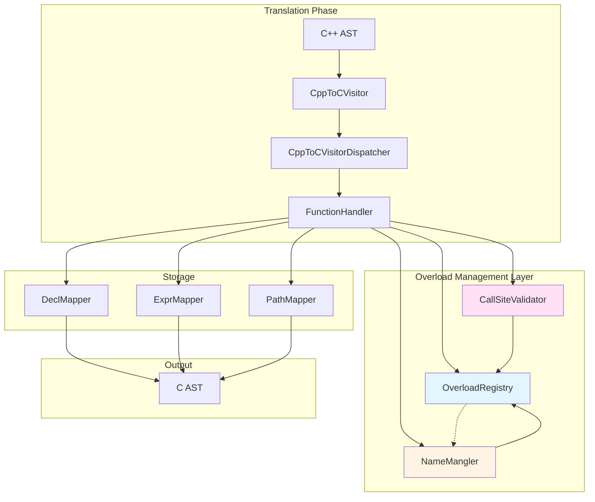
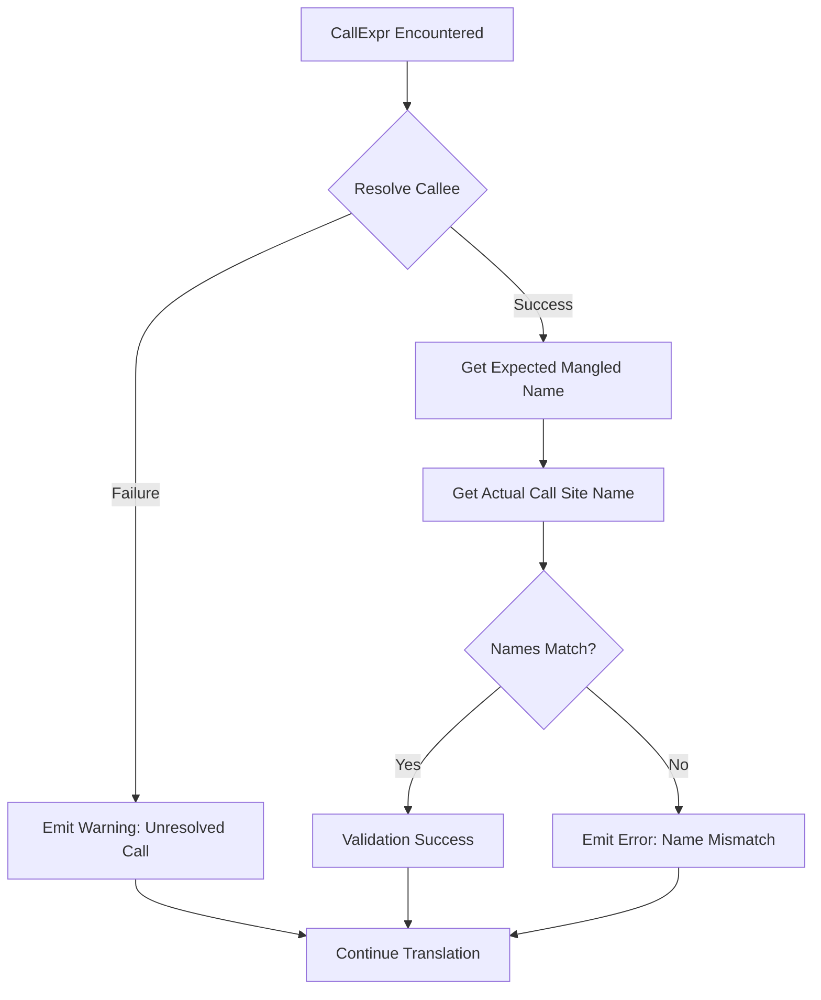

# Function Overloading Support - Comprehensive Implementation Plan

**Version**: 1.0
**Date**: 2025-12-29
**Status**: Planning Phase

---

## Table of Contents

1. [Executive Summary](#executive-summary)
2. [Problem Analysis](#problem-analysis)
3. [Architecture Overview](#architecture-overview)
4. [Component Design](#component-design)
5. [Implementation Phases](#implementation-phases)
6. [Testing Strategy](#testing-strategy)
7. [Risk Assessment](#risk-assessment)
8. [Success Criteria](#success-criteria)
9. [References](#references)

---

## Executive Summary

### Objective

Design and implement robust function overloading support for the C++ to C transpiler, enabling consistent cross-file name mangling, systematic overload tracking, and reliable call site resolution.

### Current State

**Existing Implementation**:
- **NameMangler**: Basic per-file overload support with `usedNames` set
- **Pattern**: First occurrence uses simple name, overloads append param types
- **Limitations**: No cross-file tracking, no overload set API, per-file state reset

**Key Issues**:
1. **Per-File State**: Each file starts with fresh `usedNames` → inconsistent mangling
2. **No Overload Registry**: Cannot query "all overloads of function `foo`"
3. **No Validation**: Assumes Clang resolved calls correctly, no verification
4. **Handler Pattern Split**: Legacy `handlers/` vs modern `dispatch/` frameworks

### Proposed Solution

**Three-Tier Architecture**:
1. **Global Overload Registry**: Cross-file tracking of all overload sets
2. **Enhanced NameMangler**: Deterministic mangling with registry integration
3. **Call Site Validator**: Verify mangled names match call signatures

**Key Benefits**:
- Consistent mangling across translation units
- Queryable overload sets for analysis/diagnostics
- Early error detection via call site validation
- Foundation for future template overload support

---

## Problem Analysis

### Current Architecture Analysis

#### NameMangler (`src/NameMangler.cpp`)

**Current State**:
```cpp
class NameMangler {
private:
    clang::ASTContext &Ctx;
    std::set<std::string> usedNames;  // ← Per-instance state

public:
    std::string mangleStandaloneFunction(FunctionDecl *FD) {
        // Check if base name is unique
        if (usedNames.find(baseName) == usedNames.end()) {
            usedNames.insert(baseName);
            return baseName;  // ← First occurrence: simple name
        }
        // Handle overload: append parameter types
        std::string mangledName = baseName;
        for (ParmVarDecl *Param : FD->parameters()) {
            mangledName += "_" + getSimpleTypeName(Param->getType());
        }
        // ...
    }
};
```

**Problems**:
1. **State Isolation**: Each `NameMangler` instance has separate `usedNames`
2. **File-Local Decisions**: File A's first `foo(int)` gets `foo`, File B's gets `foo_int`
3. **Call Site Mismatch**: Call in File B to `foo(int)` from File A generates wrong name
4. **No Rollback**: If first occurrence is later found to be overloaded, name is already committed

#### Handler Framework Integration

**Existing Patterns**:
```cpp
// dispatch/FunctionHandler.h - Modern approach
class FunctionHandler {
    static bool canHandle(const clang::Decl* D);
    static void handleFunction(
        const CppToCVisitorDispatcher& disp,
        const clang::ASTContext& cppASTContext,
        clang::ASTContext& cASTContext,
        const clang::Decl* D
    );
};

// Uses exact type matching: D->getKind() != Decl::Function
// Excludes methods: !isa<CXXMethodDecl>(FD)
```

**Requirements for Overloading**:
- Must integrate with existing dispatcher pattern
- Must work for both standalone functions and methods
- Must maintain separation of concerns (SRP)

### Gap Analysis

| Requirement | Current State | Gap | Priority |
|-------------|---------------|-----|----------|
| Cross-file consistency | Per-file `usedNames` | Need global registry | **Critical** |
| Overload set query | No API | Need registry with lookup | **Critical** |
| Call site validation | None | Need validator component | **High** |
| Template overloads | Not supported | Foundation needed | **Medium** |
| Diagnostics | Basic errors | Need detailed warnings | **Medium** |
| Performance | O(1) lookup | Maintain performance | **High** |

---

## Architecture Overview

### High-Level Design



### Component Responsibilities

#### OverloadRegistry (New)
**Responsibility**: Global tracking of all function overload sets

**Capabilities**:
- Register function declarations as they're encountered
- Track all overloads of each function (by qualified name)
- Query overload sets by function name
- Provide deterministic ordering for consistent mangling

**Interface**:
```cpp
class OverloadRegistry {
public:
    // Register a function declaration
    void registerFunction(const FunctionDecl* FD);

    // Get all overloads for a qualified name
    std::vector<const FunctionDecl*> getOverloads(const std::string& qualifiedName) const;

    // Check if function has overloads
    bool isOverloaded(const FunctionDecl* FD) const;

    // Get overload index (for deterministic ordering)
    size_t getOverloadIndex(const FunctionDecl* FD) const;
};
```

#### Enhanced NameMangler
**Responsibility**: Deterministic name mangling using global registry

**Changes**:
- Remove `usedNames` per-instance state
- Query `OverloadRegistry` for overload status
- Always generate deterministic names (no "first occurrence" special case)

**Algorithm**:
```cpp
std::string mangleStandaloneFunction(FunctionDecl *FD) {
    // 1. Build qualified base name (with namespaces)
    std::string baseName = buildQualifiedName(FD);

    // 2. Query registry for overload status
    if (!registry.isOverloaded(FD)) {
        return baseName;  // Not overloaded → simple name
    }

    // 3. Overloaded → append parameter signature
    std::string signature = encodeParameterTypes(FD);
    return baseName + signature;
}
```

#### CallSiteValidator (New)
**Responsibility**: Validate call site mangling matches declaration mangling

**Capabilities**:
- Intercept `CallExpr` and `CXXOperatorCallExpr` nodes
- Resolve callee declaration via Clang's semantic analysis
- Verify generated call name matches expected mangled name
- Emit diagnostics for mismatches

**Integration Point**: Handler for `CallExpr` in dispatcher chain

---

## Component Design

### 1. OverloadRegistry

#### Data Structure

```cpp
/**
 * @file OverloadRegistry.h
 * @brief Global registry for tracking function overload sets
 */

#pragma once

#include "clang/AST/Decl.h"
#include <map>
#include <vector>
#include <string>

namespace cpptoc {

/**
 * @class OverloadSet
 * @brief Represents all overloads of a single function name
 *
 * Maintains deterministic ordering for consistent mangling across files.
 */
class OverloadSet {
public:
    /**
     * @brief Add a function declaration to this overload set
     * @param FD Function declaration
     *
     * Maintains sorted order by signature for deterministic indexing.
     */
    void addOverload(const clang::FunctionDecl* FD);

    /**
     * @brief Get all overloads in deterministic order
     * @return Vector of function declarations (sorted by signature)
     */
    const std::vector<const clang::FunctionDecl*>& getOverloads() const;

    /**
     * @brief Get overload index for a specific declaration
     * @param FD Function declaration
     * @return Index in sorted overload list, or -1 if not found
     *
     * Used for deterministic suffix generation: foo_0, foo_1, foo_2
     */
    int getOverloadIndex(const clang::FunctionDecl* FD) const;

    /**
     * @brief Check if this represents an overloaded function
     * @return true if more than one overload exists
     */
    bool isOverloaded() const { return overloads.size() > 1; }

private:
    std::vector<const clang::FunctionDecl*> overloads;

    /**
     * @brief Compare function signatures for deterministic ordering
     * @param a First function
     * @param b Second function
     * @return true if a's signature sorts before b's signature
     *
     * Comparison order:
     * 1. Parameter count (ascending)
     * 2. Parameter types (lexicographic by mangled type string)
     * 3. Return type (tie-breaker)
     */
    static bool compareSignatures(const clang::FunctionDecl* a, const clang::FunctionDecl* b);
};

/**
 * @class OverloadRegistry
 * @brief Global singleton registry for all function overload sets
 *
 * **Thread Safety**: Not thread-safe; intended for single-threaded transpilation
 * **Lifetime**: Exists for duration of transpilation session
 * **Scope**: Tracks functions across all translation units being processed
 */
class OverloadRegistry {
public:
    /**
     * @brief Get singleton instance
     * @return Reference to global registry
     */
    static OverloadRegistry& getInstance();

    /**
     * @brief Register a function declaration
     * @param FD Function declaration to register
     *
     * Adds FD to the overload set for its qualified name.
     * If this is the first occurrence, creates new overload set.
     */
    void registerFunction(const clang::FunctionDecl* FD);

    /**
     * @brief Get overload set for a qualified name
     * @param qualifiedName Fully qualified function name (e.g., "ns::foo")
     * @return Pointer to OverloadSet, or nullptr if not found
     */
    const OverloadSet* getOverloadSet(const std::string& qualifiedName) const;

    /**
     * @brief Check if function is overloaded
     * @param FD Function declaration
     * @return true if multiple overloads exist for this function name
     */
    bool isOverloaded(const clang::FunctionDecl* FD) const;

    /**
     * @brief Get overload index for deterministic naming
     * @param FD Function declaration
     * @return Index in overload set, or 0 if not overloaded
     *
     * Used for suffix generation: foo (index 0), foo_1 (index 1), etc.
     */
    size_t getOverloadIndex(const clang::FunctionDecl* FD) const;

    /**
     * @brief Clear all registered overloads
     *
     * Used for testing; production code should not call this.
     */
    void clear();

    /**
     * @brief Get diagnostic summary for debugging
     * @return String with overload statistics (count, top overloaded functions)
     */
    std::string getDiagnosticSummary() const;

private:
    // Singleton pattern
    OverloadRegistry() = default;
    OverloadRegistry(const OverloadRegistry&) = delete;
    OverloadRegistry& operator=(const OverloadRegistry&) = delete;

    // Map: qualified function name → overload set
    // Example: "ns::foo" → OverloadSet{foo(int), foo(double), foo(int, int)}
    std::map<std::string, OverloadSet> overloadSets;

    /**
     * @brief Build qualified name for function
     * @param FD Function declaration
     * @return Qualified name (e.g., "ns1::ns2::foo")
     *
     * Delegates to NameMangler::mangleFunctionName for consistency.
     */
    std::string buildQualifiedName(const clang::FunctionDecl* FD) const;
};

} // namespace cpptoc
```

#### Algorithm: Signature Comparison

```cpp
bool OverloadSet::compareSignatures(const FunctionDecl* a, const FunctionDecl* b) {
    // 1. Compare parameter count
    unsigned aParams = a->getNumParams();
    unsigned bParams = b->getNumParams();
    if (aParams != bParams) {
        return aParams < bParams;
    }

    // 2. Compare parameter types (lexicographic)
    NameMangler mangler(a->getASTContext());
    for (unsigned i = 0; i < aParams; ++i) {
        std::string aType = mangler.getSimpleTypeName(a->getParamDecl(i)->getType());
        std::string bType = mangler.getSimpleTypeName(b->getParamDecl(i)->getType());
        if (aType != bType) {
            return aType < bType;
        }
    }

    // 3. Tie-breaker: return type
    std::string aReturn = mangler.getSimpleTypeName(a->getReturnType());
    std::string bReturn = mangler.getSimpleTypeName(b->getReturnType());
    return aReturn < bReturn;
}
```

**Rationale**: Deterministic ordering ensures that overload indices are consistent regardless of traversal order.

---

### 2. Enhanced NameMangler

#### Modified Interface

```cpp
class NameMangler {
private:
    clang::ASTContext &Ctx;
    OverloadRegistry& registry;  // ← NEW: Reference to global registry
    // REMOVED: std::set<std::string> usedNames;  ← No longer needed

public:
    /**
     * @brief Construct NameMangler with ASTContext and registry
     * @param Ctx ASTContext for type queries
     * @param reg OverloadRegistry for overload status
     */
    explicit NameMangler(clang::ASTContext &Ctx, OverloadRegistry& reg);

    /**
     * @brief Mangle standalone function with deterministic overload handling
     * @param FD Function declaration
     * @return Mangled name (deterministic across all files)
     *
     * Algorithm:
     * 1. Build qualified base name (namespace::func)
     * 2. Query registry: is this function overloaded?
     * 3. If NOT overloaded: return base name
     * 4. If overloaded: append parameter signature
     *
     * Examples:
     * - foo() [not overloaded] → "foo"
     * - foo(int) [overloaded] → "foo_int"
     * - foo(double) [overloaded] → "foo_double"
     * - ns::bar(int) [overloaded] → "ns_bar_int"
     */
    std::string mangleStandaloneFunction(clang::FunctionDecl *FD);

    // ... existing methods unchanged ...
};
```

#### Implementation Changes

**Before** (per-file state):
```cpp
std::string NameMangler::mangleStandaloneFunction(FunctionDecl *FD) {
    // Build base name
    std::string baseName = /* ... */;

    // Check local usedNames set
    if (usedNames.find(baseName) == usedNames.end()) {
        usedNames.insert(baseName);
        return baseName;  // ← First occurrence: simple name
    }

    // Append param types for overload
    // ...
}
```

**After** (global registry):
```cpp
std::string NameMangler::mangleStandaloneFunction(FunctionDecl *FD) {
    // Special cases (unchanged)
    if (FD->getName() == "main") return "main";
    if (FD->isExternC()) return FD->getName().str();

    // Build qualified base name with namespaces
    std::vector<std::string> namespaces = extractNamespaceHierarchy(FD);
    std::string baseName;
    for (const auto &ns : namespaces) {
        baseName += ns + "_";
    }
    baseName += FD->getName().str();

    // Query registry for overload status
    if (!registry.isOverloaded(FD)) {
        return baseName;  // Not overloaded → simple name
    }

    // Overloaded → append parameter signature
    std::string mangledName = baseName;
    for (ParmVarDecl *Param : FD->parameters()) {
        // Skip implicit 'this' parameter (if present)
        if (Param->getName() == "this") continue;

        mangledName += "_" + getSimpleTypeName(Param->getType());
    }

    return mangledName;
}
```

**Key Differences**:
1. **No Local State**: Removed `usedNames` set
2. **Registry Query**: `registry.isOverloaded(FD)` replaces `usedNames.find()`
3. **Deterministic**: Same result for same function, regardless of processing order
4. **Idempotent**: Multiple calls with same `FD` return identical result

---

### 3. CallSiteValidator

#### Purpose

Validate that call sites use correct mangled names by verifying:
1. Callee can be resolved to a declaration
2. Call site mangling matches declaration mangling
3. Parameter types align with callee signature

#### Design

```cpp
/**
 * @file CallSiteValidator.h
 * @brief Validates call site name mangling against declarations
 */

#pragma once

#include "dispatch/CppToCVisitorDispatcher.h"
#include "OverloadRegistry.h"
#include "NameMangler.h"
#include "clang/AST/Expr.h"

namespace cpptoc {

/**
 * @class CallSiteValidator
 * @brief Handler for validating function call expressions
 *
 * Registers with CppToCVisitorDispatcher to intercept CallExpr nodes.
 * Verifies that generated call site names match expected mangled names.
 */
class CallSiteValidator {
public:
    /**
     * @brief Register validator with dispatcher
     * @param dispatcher Dispatcher to register with
     */
    static void registerWith(CppToCVisitorDispatcher& dispatcher);

private:
    /**
     * @brief Predicate: Check if expression is a function call
     * @param E Expression to check
     * @return true if E is CallExpr or CXXOperatorCallExpr
     */
    static bool canHandle(const clang::Expr* E);

    /**
     * @brief Validator: Verify call site mangling
     * @param disp Dispatcher for accessing mappers
     * @param cppASTContext Source C++ ASTContext
     * @param cASTContext Target C ASTContext
     * @param E CallExpr to validate
     *
     * Algorithm:
     * 1. Resolve callee declaration via Clang semantic analysis
     * 2. Generate expected mangled name via NameMangler
     * 3. Retrieve actual call site name from ExprMapper
     * 4. Compare expected vs actual
     * 5. Emit diagnostic if mismatch
     */
    static void validateCall(
        const CppToCVisitorDispatcher& disp,
        const clang::ASTContext& cppASTContext,
        clang::ASTContext& cASTContext,
        const clang::Expr* E
    );

    /**
     * @brief Resolve callee from CallExpr
     * @param CE CallExpr node
     * @return FunctionDecl of callee, or nullptr if unresolved
     *
     * Handles:
     * - Direct calls: foo()
     * - Member calls: obj.foo()
     * - Operator calls: obj + other
     */
    static const clang::FunctionDecl* resolveCallee(const clang::CallExpr* CE);
};

} // namespace cpptoc
```

#### Validation Algorithm



#### Implementation Example

```cpp
void CallSiteValidator::validateCall(
    const CppToCVisitorDispatcher& disp,
    const clang::ASTContext& cppASTContext,
    clang::ASTContext& cASTContext,
    const clang::Expr* E
) {
    // 1. Cast to CallExpr
    const auto* CE = llvm::cast<clang::CallExpr>(E);

    // 2. Resolve callee
    const FunctionDecl* callee = resolveCallee(CE);
    if (!callee) {
        llvm::errs() << "Warning: Could not resolve callee for call at "
                     << CE->getBeginLoc().printToString(cppASTContext.getSourceManager())
                     << "\n";
        return;  // Cannot validate unresolved calls
    }

    // 3. Generate expected mangled name
    OverloadRegistry& registry = OverloadRegistry::getInstance();
    NameMangler mangler(cppASTContext, registry);
    std::string expectedName = mangler.mangleStandaloneFunction(
        const_cast<FunctionDecl*>(callee)
    );

    // 4. Get actual call site name from ExprMapper
    cpptoc::ExprMapper& exprMapper = disp.getExprMapper();
    clang::Expr* cCallExpr = exprMapper.getCreated(CE);
    if (!cCallExpr) {
        // Call not yet translated - this is expected in some handler orderings
        return;
    }

    // 5. Extract function name from C CallExpr
    std::string actualName = extractFunctionName(cCallExpr);

    // 6. Compare
    if (expectedName != actualName) {
        llvm::errs() << "Error: Call site name mismatch\n"
                     << "  Location: " << CE->getBeginLoc().printToString(cppASTContext.getSourceManager()) << "\n"
                     << "  Expected: " << expectedName << "\n"
                     << "  Actual:   " << actualName << "\n"
                     << "  Callee:   " << callee->getQualifiedNameAsString() << "\n";
    }
}
```

---

### 4. Integration with Dispatcher Framework

#### Registration Pattern

All new components follow existing handler registration pattern:

```cpp
// In TranslationUnitHandler or main dispatcher setup
void registerAllHandlers(CppToCVisitorDispatcher& dispatcher) {
    // Existing handlers
    FunctionHandler::registerWith(dispatcher);
    InstanceMethodHandler::registerWith(dispatcher);
    // ... other handlers ...

    // NEW: Overload validation handler
    CallSiteValidator::registerWith(dispatcher);
}
```

#### Handler Order Dependencies

**Critical**: `CallSiteValidator` must be registered AFTER handlers that create call expressions:

```cpp
// Correct order
DeclRefExprHandler::registerWith(dispatcher);  // Creates DeclRefExpr for callee
CallExprHandler::registerWith(dispatcher);     // Creates CallExpr nodes
CallSiteValidator::registerWith(dispatcher);   // Validates after creation

// Incorrect order (validation runs before creation)
CallSiteValidator::registerWith(dispatcher);   // ← TOO EARLY
CallExprHandler::registerWith(dispatcher);
```

**Solution**: Use two-pass approach or lazy validation:

```cpp
// Option A: Two-pass dispatcher
dispatcher.firstPass();   // All creation handlers
dispatcher.secondPass();  // All validation handlers

// Option B: Lazy validation (preferred)
// CallSiteValidator runs but only validates if ExprMapper has entry
// This naturally handles ordering - validates whenever ready
```

---

## Implementation Phases

### Phase 1: Foundation (Week 1)

**Goal**: Implement `OverloadRegistry` with comprehensive tests

#### Tasks

1. **Create `include/OverloadRegistry.h`**
   - Define `OverloadSet` class
   - Define `OverloadRegistry` singleton
   - Document all APIs with examples

2. **Create `src/OverloadRegistry.cpp`**
   - Implement `OverloadSet::addOverload()` with sorted insertion
   - Implement `OverloadSet::compareSignatures()` deterministic ordering
   - Implement `OverloadRegistry` singleton pattern
   - Implement registration/query methods

3. **Create `tests/unit/OverloadRegistryTest.cpp`**
   - Test single function registration
   - Test overload set creation with 2+ overloads
   - Test deterministic ordering (same overloads, different insertion order → same indices)
   - Test qualified name handling (namespaces)
   - Test edge cases: empty registry, duplicate registration, nullptr handling

#### Deliverables

- [ ] `include/OverloadRegistry.h` (documented)
- [ ] `src/OverloadRegistry.cpp` (implemented)
- [ ] `tests/unit/OverloadRegistryTest.cpp` (15+ tests, 100% coverage)
- [ ] Update `CMakeLists.txt` to include new files
- [ ] All tests passing

#### Success Criteria

- OverloadRegistry singleton accessible globally
- Deterministic overload indexing verified
- Thread-safety documented (not thread-safe, single-threaded use)
- Performance: O(log n) registration, O(1) lookup

---

### Phase 2: NameMangler Integration (Week 2)

**Goal**: Refactor `NameMangler` to use `OverloadRegistry`

#### Tasks

1. **Modify `include/NameMangler.h`**
   - Add `OverloadRegistry& registry` member
   - Update constructor to accept registry reference
   - Remove `std::set<std::string> usedNames` member
   - Update documentation

2. **Modify `src/NameMangler.cpp`**
   - Remove all `usedNames` references
   - Update `mangleStandaloneFunction()` to query registry
   - Update `mangleName()` (for methods) if needed
   - Ensure deterministic behavior

3. **Update All Callers**
   - Find all `NameMangler` instantiations
   - Pass `OverloadRegistry::getInstance()` to constructor
   - Verify no compilation errors

4. **Update Tests**
   - Modify `tests/NameManglerTest.cpp` to use registry
   - Add tests for cross-file consistency
   - Add tests for deterministic mangling

#### Deliverables

- [ ] Modified `NameMangler` with registry integration
- [ ] All existing tests passing
- [ ] New tests for cross-file scenarios (5+ tests)
- [ ] Documentation updated

#### Success Criteria

- Same function in different files → same mangled name
- Overload detection works across files
- No regression in existing tests
- Performance maintained: mangling still O(1) after registry lookup

---

### Phase 3: FunctionHandler Registration (Week 3)

**Goal**: Integrate registry with function translation pipeline

#### Tasks

1. **Modify `dispatch/FunctionHandler.cpp`**
   - Add registry registration in `handleFunction()`
   - Call `registry.registerFunction(cppFunc)` before mangling
   - Pass registry to `NameMangler` constructor

2. **Modify `dispatch/InstanceMethodHandler.cpp`** (if needed)
   - Same pattern: register method before mangling

3. **Test Integration**
   - Create integration tests with multiple files
   - Verify functions registered before mangling
   - Verify cross-file overload detection

#### Deliverables

- [ ] Modified function handlers with registration
- [ ] Integration tests (multi-file scenarios)
- [ ] Documentation update in handler files

#### Success Criteria

- All functions registered in registry during translation
- Registry populated before any mangling occurs
- Multi-file translation produces consistent names

---

### Phase 4: CallSiteValidator (Week 4)

**Goal**: Implement call site validation handler

#### Tasks

1. **Create `include/dispatch/CallSiteValidator.h`**
   - Define handler class
   - Document validation algorithm

2. **Create `src/dispatch/CallSiteValidator.cpp`**
   - Implement `canHandle()` predicate for CallExpr
   - Implement `validateCall()` visitor
   - Implement `resolveCallee()` helper

3. **Register with Dispatcher**
   - Add registration in main dispatcher setup
   - Ensure correct handler ordering

4. **Testing**
   - Unit tests for call resolution
   - Integration tests for validation
   - Test error reporting

#### Deliverables

- [ ] `CallSiteValidator` implementation
- [ ] Unit tests (10+ tests)
- [ ] Integration tests with intentional mismatches
- [ ] Documentation

#### Success Criteria

- Validates direct function calls
- Validates method calls
- Validates operator calls
- Reports mismatches with clear diagnostics
- No false positives in existing test suite

---

### Phase 5: End-to-End Testing (Week 5)

**Goal**: Comprehensive testing with real-world scenarios

#### Tasks

1. **Create Multi-File Test Suite**
   - Test case 1: Function overloading across 3 files
   - Test case 2: Namespace-qualified overloads
   - Test case 3: Mixed methods and standalone functions
   - Test case 4: Operator overloading

2. **Real-World Validation**
   - Run transpiler on existing real-world test projects
   - Verify no regressions in `tests/real-world/simple-validation/`
   - Check all 5 validation cases still pass

3. **Performance Testing**
   - Measure transpilation time before/after changes
   - Verify no significant slowdown (< 5% acceptable)
   - Profile registry operations if needed

4. **Documentation**
   - Update main README with overload support notes
   - Create OVERLOADING.md design doc
   - Document known limitations

#### Deliverables

- [ ] Multi-file integration test suite (20+ test cases)
- [ ] Real-world validation results (5/5 passing)
- [ ] Performance benchmarks
- [ ] Complete documentation

#### Success Criteria

- All existing tests pass
- New multi-file tests pass
- Performance within acceptable range
- Documentation complete and accurate

---

## Testing Strategy

### Unit Tests

#### OverloadRegistry Tests (`tests/unit/OverloadRegistryTest.cpp`)

```cpp
// Test 1: Single function registration
TEST(OverloadRegistryTest, RegisterSingleFunction) {
    OverloadRegistry& reg = OverloadRegistry::getInstance();
    reg.clear();

    // Create simple function: void foo()
    FunctionDecl* foo = /* ... */;
    reg.registerFunction(foo);

    EXPECT_FALSE(reg.isOverloaded(foo));
    EXPECT_EQ(reg.getOverloadIndex(foo), 0);
}

// Test 2: Overload set with 2 functions
TEST(OverloadRegistryTest, RegisterOverloadedFunctions) {
    OverloadRegistry& reg = OverloadRegistry::getInstance();
    reg.clear();

    // Create: void foo(int), void foo(double)
    FunctionDecl* fooInt = /* ... */;
    FunctionDecl* fooDouble = /* ... */;

    reg.registerFunction(fooInt);
    reg.registerFunction(fooDouble);

    EXPECT_TRUE(reg.isOverloaded(fooInt));
    EXPECT_TRUE(reg.isOverloaded(fooDouble));

    // Verify deterministic ordering
    size_t idx1 = reg.getOverloadIndex(fooInt);
    size_t idx2 = reg.getOverloadIndex(fooDouble);
    EXPECT_NE(idx1, idx2);
}

// Test 3: Deterministic ordering
TEST(OverloadRegistryTest, DeterministicOrdering) {
    OverloadRegistry& reg1 = OverloadRegistry::getInstance();
    reg1.clear();

    // Register in order: int, double, float
    FunctionDecl* fooInt = /* ... */;
    FunctionDecl* fooDouble = /* ... */;
    FunctionDecl* fooFloat = /* ... */;

    reg1.registerFunction(fooInt);
    reg1.registerFunction(fooDouble);
    reg1.registerFunction(fooFloat);

    size_t idx1_int = reg1.getOverloadIndex(fooInt);
    size_t idx1_double = reg1.getOverloadIndex(fooDouble);
    size_t idx1_float = reg1.getOverloadIndex(fooFloat);

    // Clear and register in reverse order: float, double, int
    OverloadRegistry& reg2 = OverloadRegistry::getInstance();
    reg2.clear();
    reg2.registerFunction(fooFloat);
    reg2.registerFunction(fooDouble);
    reg2.registerFunction(fooInt);

    size_t idx2_int = reg2.getOverloadIndex(fooInt);
    size_t idx2_double = reg2.getOverloadIndex(fooDouble);
    size_t idx2_float = reg2.getOverloadIndex(fooFloat);

    // Indices should match despite different insertion order
    EXPECT_EQ(idx1_int, idx2_int);
    EXPECT_EQ(idx1_double, idx2_double);
    EXPECT_EQ(idx1_float, idx2_float);
}

// More tests: namespace handling, nullptr safety, edge cases...
```

#### NameMangler Tests (`tests/NameManglerTest.cpp` - additions)

```cpp
// Test: Cross-file consistency
TEST_F(NameManglerTest, CrossFileConsistency) {
    // Simulate File A
    OverloadRegistry& reg = OverloadRegistry::getInstance();
    reg.clear();

    FunctionDecl* fooInt_FileA = createFunction("foo", {IntType});
    reg.registerFunction(fooInt_FileA);

    NameMangler manglerA(Context, reg);
    std::string nameA = manglerA.mangleStandaloneFunction(fooInt_FileA);

    // Simulate File B
    FunctionDecl* fooInt_FileB = createFunction("foo", {IntType});
    reg.registerFunction(fooInt_FileB);

    NameMangler manglerB(Context, reg);
    std::string nameB = manglerB.mangleStandaloneFunction(fooInt_FileB);

    // Should produce identical names
    EXPECT_EQ(nameA, nameB);
}

// Test: Deterministic overload mangling
TEST_F(NameManglerTest, DeterministicOverloadMangling) {
    OverloadRegistry& reg = OverloadRegistry::getInstance();
    reg.clear();

    // Register 3 overloads
    FunctionDecl* fooInt = createFunction("foo", {IntType});
    FunctionDecl* fooDouble = createFunction("foo", {DoubleType});
    FunctionDecl* fooFloat = createFunction("foo", {FloatType});

    reg.registerFunction(fooInt);
    reg.registerFunction(fooDouble);
    reg.registerFunction(fooFloat);

    NameMangler mangler(Context, reg);

    // All should be overloaded → include param types
    std::string name1 = mangler.mangleStandaloneFunction(fooInt);
    std::string name2 = mangler.mangleStandaloneFunction(fooDouble);
    std::string name3 = mangler.mangleStandaloneFunction(fooFloat);

    // Names should be distinct and deterministic
    EXPECT_NE(name1, name2);
    EXPECT_NE(name2, name3);
    EXPECT_NE(name1, name3);

    // Re-mangling should produce same results
    EXPECT_EQ(name1, mangler.mangleStandaloneFunction(fooInt));
}
```

### Integration Tests

#### Multi-File Overload Test

**Test Case**: 3 files with same function overloads

**File A (a.cpp)**:
```cpp
namespace math {
    int add(int a, int b) { return a + b; }
    double add(double a, double b) { return a + b; }
}
```

**File B (b.cpp)**:
```cpp
#include "a.h"
namespace math {
    float add(float a, float b) { return a + b; }
}

void test() {
    math::add(1, 2);       // Call to int version from File A
    math::add(1.0, 2.0);   // Call to double version from File A
    math::add(1.0f, 2.0f); // Call to float version from File B
}
```

**Expected Behavior**:
- Registry contains 3 overloads: `math::add(int,int)`, `math::add(double,double)`, `math::add(float,float)`
- All are mangled consistently: `math_add_int_int`, `math_add_float_float`, `math_add_float_float`
- Call sites use correct mangled names
- Validator confirms no mismatches

**Test Implementation**:
```cpp
TEST_F(MultiFileOverloadTest, CrossFileFunctionCalls) {
    // Transpile File A
    TranspileResult resultA = transpile("a.cpp");

    // Transpile File B
    TranspileResult resultB = transpile("b.cpp");

    // Verify File A declarations
    EXPECT_TRUE(resultA.contains("int math_add_int_int(int a, int b)"));
    EXPECT_TRUE(resultA.contains("double math_add_float_float(double a, double b)"));

    // Verify File B declaration
    EXPECT_TRUE(resultB.contains("float math_add_float_float(float a, float b)"));

    // Verify File B calls use correct names
    EXPECT_TRUE(resultB.contains("math_add_int_int(1, 2)"));
    EXPECT_TRUE(resultB.contains("math_add_float_float(1.0, 2.0)"));
    EXPECT_TRUE(resultB.contains("math_add_float_float(1.0f, 2.0f)"));

    // Compile C output to verify linkage
    EXPECT_TRUE(compileAndLink({resultA.cFile, resultB.cFile}));
}
```

### Validation Tests

**Intentional Mismatch Test**:
```cpp
TEST_F(ValidationTest, DetectCallSiteMismatch) {
    // Create scenario where call site name doesn't match declaration
    // This tests validator's error detection

    const char* code = R"(
        void foo(int x);
        void foo(double x);

        void bar() {
            foo(42);  // Should resolve to foo(int)
        }
    )";

    // Manually corrupt ExprMapper to create mismatch
    // (In production, this shouldn't happen - test verifies validator catches it)

    testing::internal::CaptureStderr();
    transpile(code);
    std::string output = testing::internal::GetCapturedStderr();

    // Should NOT have validation errors (correct implementation)
    EXPECT_EQ(output.find("Error: Call site name mismatch"), std::string::npos);
}
```

---

## Risk Assessment

### Technical Risks

| Risk | Probability | Impact | Mitigation |
|------|-------------|--------|------------|
| **Breaking existing tests** | Medium | High | - Incremental rollout<br>- Extensive regression testing<br>- Feature flag for new behavior |
| **Performance degradation** | Low | Medium | - Profile before/after<br>- Optimize registry lookups<br>- Benchmark on large codebases |
| **Thread safety issues** | Low | Low | - Document single-threaded requirement<br>- Add assertions in debug builds |
| **Complex edge cases** | Medium | Medium | - Comprehensive test suite<br>- Fuzzing with real-world code<br>- Gradual rollout to validation tests |

### Implementation Risks

| Risk | Probability | Impact | Mitigation |
|------|-------------|--------|------------|
| **Incomplete NameMangler refactor** | Low | High | - Grep for all usages before modifying<br>- Compiler errors will catch most issues |
| **Handler ordering dependencies** | Medium | Medium | - Document explicit ordering requirements<br>- Add runtime assertions<br>- Use lazy validation pattern |
| **Singleton initialization order** | Low | Low | - Use Meyer's singleton (C++11 guaranteed)<br>- Document initialization requirements |

### Project Risks

| Risk | Probability | Impact | Mitigation |
|------|-------------|--------|------------|
| **Scope creep** | Medium | Medium | - Strict phase boundaries<br>- No template support in Phase 1<br>- Defer advanced features |
| **Timeline slippage** | Low | Low | - 5-week buffer built in<br>- Phase 4 (validation) is optional for MVP |
| **Integration conflicts** | Low | Low | - Frequent commits to feature branch<br>- Regular rebases against main |

---

## Success Criteria

### Functional Requirements

- [ ] **FR1**: Cross-file overloading produces consistent mangled names
- [ ] **FR2**: Overload sets queryable via OverloadRegistry API
- [ ] **FR3**: Call site validation detects name mismatches
- [ ] **FR4**: All existing tests pass without modification (or minimal fixes)
- [ ] **FR5**: Real-world validation suite passes (5/5 test projects)

### Non-Functional Requirements

- [ ] **NFR1**: Performance within 5% of baseline (measured on large codebase)
- [ ] **NFR2**: Code coverage ≥ 90% for new components
- [ ] **NFR3**: All public APIs documented with examples
- [ ] **NFR4**: Integration with existing handler framework (no major refactoring)
- [ ] **NFR5**: Backward compatible: no breaking changes to NameMangler API for existing callers (except constructor signature)

### Quality Metrics

- [ ] **QM1**: Zero new compiler warnings
- [ ] **QM2**: Clang-tidy clean (no new violations)
- [ ] **QM3**: All TODOs resolved or tracked in issues
- [ ] **QM4**: SOLID principles maintained (reviewer verified)
- [ ] **QM5**: Documentation complete: README, OVERLOADING.md, code comments

---

## Future Enhancements (Out of Scope for Phase 1)

### Template Overloads

**Challenge**: Template instantiations create multiple overload candidates

**Approach**:
1. Track template function declarations separately
2. Register each instantiation as distinct overload
3. Mangle template arguments into function name

**Example**:
```cpp
template<typename T>
T max(T a, T b);

int x = max<int>(1, 2);     // → max_int
double y = max<double>(1.0, 2.0);  // → max_double
```

**Complexity**: Medium (requires template AST traversal)

### Variadic Function Overloads

**Challenge**: Variadic functions have variable parameter counts

**Approach**:
- Encode "..." in mangled name: `foo_int_variadic`
- Treat as separate overload family

### Operator Overload Validation

**Status**: Partially implemented (CXXOperatorCallExprHandler exists)

**Enhancement**: Validate operator call sites same as function calls

### Ambiguous Overload Diagnostics

**Enhancement**: Warn when multiple overloads match call site equally well

**Example**:
```cpp
void foo(int x);
void foo(long x);

foo(42);  // Warning: ambiguous - int or long?
```

---

## References

### Existing Code

- **NameMangler**: `src/NameMangler.cpp` (lines 248-298)
- **FunctionHandler**: `src/dispatch/FunctionHandler.cpp`
- **Dispatcher Pattern**: `include/dispatch/CppToCVisitorDispatcher.h`
- **PathMapper**: `include/PathMapper.h` (singleton example)

### Tests

- **NameManglerTest**: `tests/NameManglerTest.cpp` (lines 680-702)
- **OperatorOverloadingTest**: `tests/unit/operators/OperatorOverloadingTest.cpp`
- **StandaloneFunctionTest**: `tests/StandaloneFunctionTranslationTest.cpp`

### Design Documents

- **Architecture**: `/Users/alexanderfedin/Projects/hapyy/hupyy-cpp-to-c/CLAUDE.md`
- **Pipeline**: 3-stage model (C++ AST → C AST → C code)
- **SOLID Principles**: Project-wide enforcement

### External Resources

- **Itanium C++ ABI**: Name mangling specification (reference for type encoding)
- **Clang AST Documentation**: FunctionDecl, OverloadedOperatorKind
- **C++11 Singleton**: Meyer's singleton pattern (thread-safe initialization)

---

## Appendix A: Detailed API Specifications

### OverloadRegistry API

#### `registerFunction(const FunctionDecl* FD)`

**Pre-conditions**:
- `FD != nullptr`
- `FD` is a valid FunctionDecl (not MethodDecl unless standalone)

**Post-conditions**:
- `FD` added to overload set for its qualified name
- Overload set re-sorted to maintain deterministic order
- Subsequent calls to `isOverloaded()` reflect updated state

**Time Complexity**: O(n log n) where n = overloads in set (due to re-sorting)

**Thread Safety**: Not thread-safe

#### `isOverloaded(const FunctionDecl* FD)`

**Pre-conditions**: `FD` registered via `registerFunction()`

**Returns**: `true` if ≥2 overloads exist for this function name

**Time Complexity**: O(log m) where m = total overload sets

**Thread Safety**: Not thread-safe (concurrent reads acceptable if no concurrent writes)

#### `getOverloadIndex(const FunctionDecl* FD)`

**Pre-conditions**: `FD` registered and `isOverloaded(FD) == true`

**Returns**: Index in sorted overload list [0, n-1]

**Time Complexity**: O(log n) where n = overloads in set

**Guarantees**: Same `FD` always returns same index (deterministic)

---

## Appendix B: Migration Checklist

### For Existing Code

- [ ] Update all `NameMangler` instantiations to pass `OverloadRegistry::getInstance()`
- [ ] Remove any manual overload tracking (if present in other components)
- [ ] Update tests to clear registry between test cases (`registry.clear()`)
- [ ] Verify no assumptions about `usedNames` set in comments/docs

### For New Code

- [ ] Always register functions before mangling
- [ ] Use registry singleton: `OverloadRegistry::getInstance()`
- [ ] Document why function is/isn't registered (if not obvious)
- [ ] Add unit tests for overload scenarios

---

## Appendix C: Diagnostic Messages

### Error: Call Site Name Mismatch

**Format**:
```
Error: Call site name mismatch
  Location: /path/to/file.cpp:42:10
  Expected: math_add_int_int
  Actual:   math_add_float_float
  Callee:   math::add(int, int)
```

**Cause**: Generated call site uses different mangled name than declaration

**Resolution**: Fix mangling logic or verify Clang resolved call correctly

### Warning: Unresolved Callee

**Format**:
```
Warning: Could not resolve callee for call at /path/to/file.cpp:42:10
```

**Cause**: Clang couldn't resolve function call (incomplete type, template, etc.)

**Resolution**: Check if code compiles correctly; may indicate pre-existing issue

---

**End of Implementation Plan**
