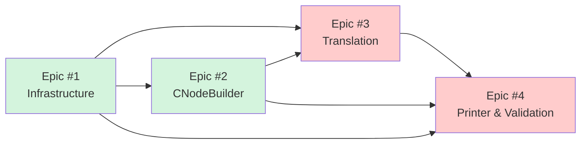
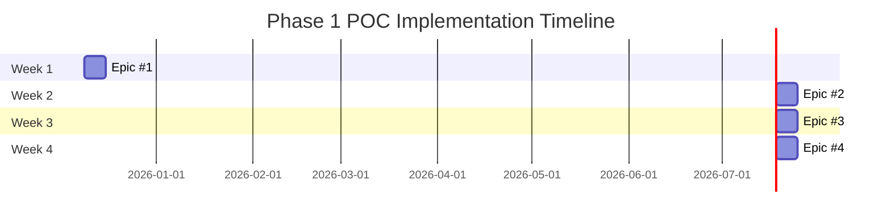

# Epics Traceability Matrix

**Project:** C++ to C Transpiler
**Phase:** Phase 1 POC (Proof of Concept)
**Duration:** 4 weeks (2025-12-09 to 2026-01-06)
**GitHub Project:** [#14](https://github.com/users/o2alexanderfedin/projects/14)

## Overview

This document provides traceability from Architecture documentation to GitHub Epics for Phase 1 POC implementation.

**Architecture Source:** [docs/ARCHITECTURE.md](docs/ARCHITECTURE.md)
**Roadmap Source:** [docs/feasibility-and-roadmap.md](docs/feasibility-and-roadmap.md)

## Phase 1 POC - Epics

### Epic #1: Infrastructure Setup & Clang Integration

**GitHub Issue:** [#1](https://github.com/o2alexanderfedin/cpp-to-c-transpiler/issues/1)
**Week:** Week 1 (2025-12-09 to 2025-12-16)
**Priority:** High
**Type:** Foundation

**Architecture References:**
- [ARCHITECTURE.md - Phase 1, Week 1](docs/ARCHITECTURE.md#week-1-infrastructure)
- [ARCHITECTURE.md - Translation Layer](docs/ARCHITECTURE.md#32-translation-layer-recursiveastvisitor)
- [Clang LibTooling Documentation](https://clang.llvm.org/docs/LibTooling.html)

**Deliverables:**
- ✓ CMake build system setup
- ✓ Clang LibTooling integration
- ✓ ASTConsumer + ASTFrontendAction boilerplate
- ✓ Basic RecursiveASTVisitor skeleton

**Success Criteria:**
- Tool can parse C++ file and access AST
- Prints basic AST information (node count or similar)
- Compiles without errors on macOS and Linux

**Technical Foundation:**
Establishes the infrastructure for all subsequent Epics. Integrates Clang's LibTooling to enable AST access and manipulation.

---

### Epic #2: CNodeBuilder Helper Library

**GitHub Issue:** [#2](https://github.com/o2alexanderfedin/cpp-to-c-transpiler/issues/2)
**Week:** Week 2 (2025-12-16 to 2025-12-23)
**Priority:** High
**Type:** Core Library
**Dependencies:** Epic #1

**Architecture References:**
- [ARCHITECTURE.md - CNodeBuilder Component](docs/ARCHITECTURE.md#31-cnodebuilder)
- [ARCHITECTURE.md - Phase 1, Week 2](docs/ARCHITECTURE.md#week-2-node-builder-helpers)
- [Clang AST Nodes](https://clang.llvm.org/doxygen/group__AST.html)

**Deliverables:**
- ✓ CNodeBuilder class (500-800 LOC)
- ✓ Helper methods for C constructs (VarDecl, CallExpr, IfStmt, etc.)
- ✓ Unit tests for node creation

**Success Criteria:**
- 20+ helper methods covering all C constructs
- Clean API: `builder.intVar("x", 42)` vs raw Clang API
- All methods tested independently
- Doxygen documentation complete

**Technical Foundation:**
Wraps verbose Clang C node creation APIs into clean, maintainable helper methods. Enables efficient AST #2 construction in Epic #3.

**Code Quality Impact:**
- Without CNodeBuilder: 15+ lines per simple node
- With CNodeBuilder: 1 line per node
- Improvement: 15x more concise, readable, maintainable

---

### Epic #3: Simple Class Translation

**GitHub Issue:** [#3](https://github.com/o2alexanderfedin/cpp-to-c-transpiler/issues/3)
**Week:** Week 3 (2025-12-23 to 2025-12-30)
**Priority:** Critical
**Type:** Core Translation
**Dependencies:** Epic #1, Epic #2

**Architecture References:**
- [ARCHITECTURE.md - Translation Layer](docs/ARCHITECTURE.md#32-translation-layer-recursiveastvisitor)
- [ARCHITECTURE.md - Data Flow](docs/ARCHITECTURE.md#5-data-flow--transformations)
- [ARCHITECTURE.md - Name Mangling](docs/ARCHITECTURE.md#52-name-mangling)
- [ARCHITECTURE.md - Phase 1, Week 3](docs/ARCHITECTURE.md#week-3-simple-translation)

**Deliverables:**
- ✓ Class → struct conversion
- ✓ Member function → C function with `this*` parameter
- ✓ Basic name mangling
- ✓ AST #2 (C AST) construction

**Success Criteria:**
- `VisitCXXRecordDecl()` generates C struct with same layout
- `VisitCXXMethodDecl()` generates C function with this parameter
- Constructor translation to `ClassName__ctor()`
- Member access transformed to `this->member`
- Simple name mangling: `ClassName_methodName`

**Technical Foundation:**
Implements core translation logic that proves the Two-Phase Translation architecture. This is the heart of the POC - if this works, the architecture is validated.

**Translation Example:**
```cpp
// Input C++ (AST #1)
class Point {
    int x, y;
public:
    Point(int x, int y) : x(x), y(y) {}
    int getX() { return x; }
};

// Output C (AST #2)
struct Point { int x; int y; };
void Point__ctor(struct Point *this, int x, int y) {
    this->x = x; this->y = y;
}
int Point_getX(struct Point *this) {
    return this->x;
}
```

---

### Epic #4: Clang Printer Integration & Validation

**GitHub Issue:** [#4](https://github.com/o2alexanderfedin/cpp-to-c-transpiler/issues/4)
**Week:** Week 4 (2025-12-30 to 2026-01-06)
**Priority:** Critical
**Type:** Integration & Validation
**Dependencies:** Epic #1, Epic #2, Epic #3

**Architecture References:**
- [ARCHITECTURE.md - Clang Printer Integration](docs/ARCHITECTURE.md#33-clang-printer-integration)
- [ARCHITECTURE.md - Phase 1, Week 4](docs/ARCHITECTURE.md#week-4-clang-printer--validation)
- [Clang DeclPrinter Source](https://clang.llvm.org/doxygen/DeclPrinter_8cpp_source.html)
- [Clang StmtPrinter Source](https://clang.llvm.org/doxygen/StmtPrinter_8cpp_source.html)

**Deliverables:**
- ✓ DeclPrinter/StmtPrinter integration
- ✓ PrintingPolicy C99 configuration
- ✓ #line directive injection
- ✓ Validate: compile generated C, verify behavior matches C++

**Success Criteria:**
- Generated C compiles without warnings (gcc/clang)
- Generated C produces identical output to original C++
- #line directives map back to C++ source
- No memory leaks (validated with valgrind)
- Tested with 5+ example C++ classes

**Technical Foundation:**
Leverages Clang's battle-tested printers (15+ years production use) instead of custom code generation. Proves the architecture decision to use AST #2 + Clang printer.

**Validation Strategy:**
1. Compile original C++ → output1.txt
2. Generate C code → simple.c
3. Compile generated C → output2.txt
4. Compare: `diff output1.txt output2.txt` (should be identical)
5. Memory test: `valgrind --leak-check=full ./test_c`

**Architecture Validation:**
This Epic validates the complete Two-Phase Translation architecture:
- C++ AST → Translation Layer → C AST → Clang Printer → Clean C Code ✅

---

## Phase 1 POC Summary

**Total Epics:** 4
**Total Duration:** 4 weeks
**Total Effort:** ~160 hours (1 FTE)

### Epic Dependencies



**Legend:**
- Green: Foundation (High priority)
- Red: Critical path (Critical priority)

### Timeline (Gantt Chart)



### Success Metrics

**By End of Phase 1 POC (2026-01-06):**
- ✅ Tool converts simple C++ class to compilable C code
- ✅ Generated C produces identical behavior to original C++
- ✅ Two-Phase Translation architecture validated
- ✅ Foundation established for Phase 2 (Core Features)
- ✅ Confidence level: 97%+ → 99%+ (POC proves architecture)

### Next Phase Preview

**Phase 2: Core Features (4-8 weeks)**
- RAII with CFG-based destructor injection
- Single inheritance + vtables
- Constructors/destructors (full semantics)
- Name mangling (with namespaces)
- Virtual functions

Epics for Phase 2 will be created after successful completion of Phase 1 POC.

---

## Traceability Matrix

| Epic # | GitHub Issue | Architecture Section | Week | Priority | Type |
|--------|--------------|---------------------|------|----------|------|
| 1 | [#1](https://github.com/o2alexanderfedin/cpp-to-c-transpiler/issues/1) | [Infrastructure](docs/ARCHITECTURE.md#week-1-infrastructure) | Week 1 | High | Foundation |
| 2 | [#2](https://github.com/o2alexanderfedin/cpp-to-c-transpiler/issues/2) | [CNodeBuilder](docs/ARCHITECTURE.md#31-cnodebuilder) | Week 2 | High | Core Library |
| 3 | [#3](https://github.com/o2alexanderfedin/cpp-to-c-transpiler/issues/3) | [Translation Layer](docs/ARCHITECTURE.md#32-translation-layer-recursiveastvisitor) | Week 3 | Critical | Core Translation |
| 4 | [#4](https://github.com/o2alexanderfedin/cpp-to-c-transpiler/issues/4) | [Clang Printer](docs/ARCHITECTURE.md#33-clang-printer-integration) | Week 4 | Critical | Integration |

## Architecture Coverage

**Components Covered in Phase 1:**
- ✅ Infrastructure (Clang LibTooling integration)
- ✅ CNodeBuilder (helper library)
- ✅ Translation Layer (C++ → C AST)
- ✅ Clang Printer (AST → C code)

**Components Deferred to Later Phases:**
- ⏭ Runtime Library (Phase 2-3)
- ⏭ Advanced Features (Phase 3-4: RTTI, virtual inheritance, coroutines)
- ⏭ Frama-C Integration (Phase 5)

## References

**Architecture Documentation:**
- [ARCHITECTURE.md](docs/ARCHITECTURE.md) - Complete technical architecture
- [feasibility-and-roadmap.md](docs/feasibility-and-roadmap.md) - Implementation roadmap
- [SUMMARY.md](docs/SUMMARY.md) - Executive summary

**GitHub Project:**
- [Project #14](https://github.com/users/o2alexanderfedin/projects/14) - C++ to C Transpiler

**External References:**
- [Clang LibTooling](https://clang.llvm.org/docs/LibTooling.html)
- [Clang AST](https://clang.llvm.org/doxygen/group__AST.html)
- [Itanium C++ ABI](https://itanium-cxx-abi.github.io/cxx-abi/abi.html)

---

**Created:** 2025-12-08
**Last Updated:** 2025-12-08
**Status:** Phase 1 POC Ready for Implementation

*This document will be updated as Epics are broken down into User Stories and Tasks.*
