```mermaid
graph LR
    P4[Phase 4<br/>Complete] --> E15[Epic #15<br/>Frama-C]
    E15 --> E16[Epic #16<br/>Optimization]
    E16 --> E17[Epic #17<br/>Testing + Docs]
    E17 --> COMPLETE[🎉 Production<br/>Ready]

    style P4 fill:#d4f4dd
    style E15 fill:#fff3cd
    style E16 fill:#fff3cd
    style E17 fill:#ffcccc
    style COMPLETE fill:#90EE90

    classDef high fill:#fff3cd
    classDef critical fill:#ffcccc
```

# Epics Traceability Matrix

**Project:** C++ to C Transpiler
**Phase:** Phase 1 POC (Proof of Concept)
**Duration:** 4 weeks (2025-12-09 to 2026-01-06)
**GitHub Project:** [#14](https://github.com/users/o2alexanderfedin/projects/14)

## Overview

This document provides traceability from Architecture documentation to GitHub Epics for Phase 1 POC implementation.

**Architecture Source:** [docs/ARCHITECTURE.md](docs/ARCHITECTURE.md)
**Roadmap Source:** [docs/feasibility-and-roadmap.md](docs/feasibility-and-roadmap.md)

## Phase 1 POC - Epics

### Epic #1: Infrastructure Setup & Clang Integration

**GitHub Issue:** [#1](https://github.com/o2alexanderfedin/cpp-to-c-transpiler/issues/1)
**Week:** Week 1 (2025-12-09 to 2025-12-16)
**Priority:** High
**Type:** Foundation

**Architecture References:**
- [ARCHITECTURE.md - Phase 1, Week 1](docs/ARCHITECTURE.md#week-1-infrastructure)
- [ARCHITECTURE.md - Translation Layer](docs/ARCHITECTURE.md#32-translation-layer-recursiveastvisitor)
- [Clang LibTooling Documentation](https://clang.llvm.org/docs/LibTooling.html)

**Deliverables:**
- ✓ CMake build system setup
- ✓ Clang LibTooling integration
- ✓ ASTConsumer + ASTFrontendAction boilerplate
- ✓ Basic RecursiveASTVisitor skeleton

**Success Criteria:**
- Tool can parse C++ file and access AST
- Prints basic AST information (node count or similar)
- Compiles without errors on macOS and Linux

**Technical Foundation:**
Establishes the infrastructure for all subsequent Epics. Integrates Clang's LibTooling to enable AST access and manipulation.

---

### Epic #2: CNodeBuilder Helper Library

**GitHub Issue:** [#2](https://github.com/o2alexanderfedin/cpp-to-c-transpiler/issues/2)
**Week:** Week 2 (2025-12-16 to 2025-12-23)
**Priority:** High
**Type:** Core Library
**Dependencies:** Epic #1

**Architecture References:**
- [ARCHITECTURE.md - CNodeBuilder Component](docs/ARCHITECTURE.md#31-cnodebuilder)
- [ARCHITECTURE.md - Phase 1, Week 2](docs/ARCHITECTURE.md#week-2-node-builder-helpers)
- [Clang AST Nodes](https://clang.llvm.org/doxygen/group__AST.html)

**Deliverables:**
- ✓ CNodeBuilder class (500-800 LOC)
- ✓ Helper methods for C constructs (VarDecl, CallExpr, IfStmt, etc.)
- ✓ Unit tests for node creation

**Success Criteria:**
- 20+ helper methods covering all C constructs
- Clean API: `builder.intVar("x", 42)` vs raw Clang API
- All methods tested independently
- Doxygen documentation complete

**Technical Foundation:**
Wraps verbose Clang C node creation APIs into clean, maintainable helper methods. Enables efficient AST #2 construction in Epic #3.

**Code Quality Impact:**
- Without CNodeBuilder: 15+ lines per simple node
- With CNodeBuilder: 1 line per node
- Improvement: 15x more concise, readable, maintainable

---

### Epic #3: Simple Class Translation

**GitHub Issue:** [#3](https://github.com/o2alexanderfedin/cpp-to-c-transpiler/issues/3)
**Week:** Week 3 (2025-12-23 to 2025-12-30)
**Priority:** Critical
**Type:** Core Translation
**Dependencies:** Epic #1, Epic #2

**Architecture References:**
- [ARCHITECTURE.md - Translation Layer](docs/ARCHITECTURE.md#32-translation-layer-recursiveastvisitor)
- [ARCHITECTURE.md - Data Flow](docs/ARCHITECTURE.md#5-data-flow--transformations)
- [ARCHITECTURE.md - Name Mangling](docs/ARCHITECTURE.md#52-name-mangling)
- [ARCHITECTURE.md - Phase 1, Week 3](docs/ARCHITECTURE.md#week-3-simple-translation)

**Deliverables:**
- ✓ Class → struct conversion
- ✓ Member function → C function with `this*` parameter
- ✓ Basic name mangling
- ✓ AST #2 (C AST) construction

**Success Criteria:**
- `VisitCXXRecordDecl()` generates C struct with same layout
- `VisitCXXMethodDecl()` generates C function with this parameter
- Constructor translation to `ClassName__ctor()`
- Member access transformed to `this->member`
- Simple name mangling: `ClassName_methodName`

**Technical Foundation:**
Implements core translation logic that proves the Two-Phase Translation architecture. This is the heart of the POC - if this works, the architecture is validated.

**Translation Example:**
```cpp
// Input C++ (AST #1)
class Point {
    int x, y;
public:
    Point(int x, int y) : x(x), y(y) {}
    int getX() { return x; }
};

// Output C (AST #2)
struct Point { int x; int y; };
void Point__ctor(struct Point *this, int x, int y) {
    this->x = x; this->y = y;
}
int Point_getX(struct Point *this) {
    return this->x;
}
```

---

### Epic #4: Clang Printer Integration & Validation

**GitHub Issue:** [#4](https://github.com/o2alexanderfedin/cpp-to-c-transpiler/issues/4)
**Week:** Week 4 (2025-12-30 to 2026-01-06)
**Priority:** Critical
**Type:** Integration & Validation
**Dependencies:** Epic #1, Epic #2, Epic #3

**Architecture References:**
- [ARCHITECTURE.md - Clang Printer Integration](docs/ARCHITECTURE.md#33-clang-printer-integration)
- [ARCHITECTURE.md - Phase 1, Week 4](docs/ARCHITECTURE.md#week-4-clang-printer--validation)
- [Clang DeclPrinter Source](https://clang.llvm.org/doxygen/DeclPrinter_8cpp_source.html)
- [Clang StmtPrinter Source](https://clang.llvm.org/doxygen/StmtPrinter_8cpp_source.html)

**Deliverables:**
- ✓ DeclPrinter/StmtPrinter integration
- ✓ PrintingPolicy C99 configuration
- ✓ #line directive injection
- ✓ Validate: compile generated C, verify behavior matches C++

**Success Criteria:**
- Generated C compiles without warnings (gcc/clang)
- Generated C produces identical output to original C++
- #line directives map back to C++ source
- No memory leaks (validated with valgrind)
- Tested with 5+ example C++ classes

**Technical Foundation:**
Leverages Clang's battle-tested printers (15+ years production use) instead of custom code generation. Proves the architecture decision to use AST #2 + Clang printer.

**Validation Strategy:**
1. Compile original C++ → output1.txt
2. Generate C code → simple.c
3. Compile generated C → output2.txt
4. Compare: `diff output1.txt output2.txt` (should be identical)
5. Memory test: `valgrind --leak-check=full ./test_c`

**Architecture Validation:**
This Epic validates the complete Two-Phase Translation architecture:
- C++ AST → Translation Layer → C AST → Clang Printer → Clean C Code ✅

---

## Phase 1 POC Summary

**Total Epics:** 4
**Total Duration:** 4 weeks
**Total Effort:** ~160 hours (1 FTE)

### Epic Dependencies


**Legend:**
- Green: Foundation (High priority)
- Red: Critical path (Critical priority)

### Timeline (Gantt Chart)


### Success Metrics

**By End of Phase 1 POC (2026-01-06):**
- ✅ Tool converts simple C++ class to compilable C code
- ✅ Generated C produces identical behavior to original C++
- ✅ Two-Phase Translation architecture validated
- ✅ Foundation established for Phase 2 (Core Features)
- ✅ Confidence level: 97%+ → 99%+ (POC proves architecture)

### Next Phase Preview

**Phase 2: Core Features (4-8 weeks)**
- RAII with CFG-based destructor injection
- Single inheritance + vtables
- Constructors/destructors (full semantics)
- Name mangling (with namespaces)
- Virtual functions

Epics for Phase 2 will be created after successful completion of Phase 1 POC.

---

## Traceability Matrix

| Epic # | GitHub Issue | Architecture Section | Week | Priority | Type |
|--------|--------------|---------------------|------|----------|------|
| 1 | [#1](https://github.com/o2alexanderfedin/cpp-to-c-transpiler/issues/1) | [Infrastructure](docs/ARCHITECTURE.md#week-1-infrastructure) | Week 1 | High | Foundation |
| 2 | [#2](https://github.com/o2alexanderfedin/cpp-to-c-transpiler/issues/2) | [CNodeBuilder](docs/ARCHITECTURE.md#31-cnodebuilder) | Week 2 | High | Core Library |
| 3 | [#3](https://github.com/o2alexanderfedin/cpp-to-c-transpiler/issues/3) | [Translation Layer](docs/ARCHITECTURE.md#32-translation-layer-recursiveastvisitor) | Week 3 | Critical | Core Translation |
| 4 | [#4](https://github.com/o2alexanderfedin/cpp-to-c-transpiler/issues/4) | [Clang Printer](docs/ARCHITECTURE.md#33-clang-printer-integration) | Week 4 | Critical | Integration |

## Architecture Coverage

**Components Covered in Phase 1:**
- ✅ Infrastructure (Clang LibTooling integration)
- ✅ CNodeBuilder (helper library)
- ✅ Translation Layer (C++ → C AST)
- ✅ Clang Printer (AST → C code)

**Components Deferred to Later Phases:**
- ⏭ Runtime Library (Phase 2-3)
- ⏭ Advanced Features (Phase 3-4: RTTI, virtual inheritance, coroutines)
- ⏭ Frama-C Integration (Phase 5)

## References

**Architecture Documentation:**
- [ARCHITECTURE.md](docs/ARCHITECTURE.md) - Complete technical architecture
- [feasibility-and-roadmap.md](docs/feasibility-and-roadmap.md) - Implementation roadmap
- [SUMMARY.md](docs/SUMMARY.md) - Executive summary

**GitHub Project:**
- [Project #14](https://github.com/users/o2alexanderfedin/projects/14) - C++ to C Transpiler

**External References:**
- [Clang LibTooling](https://clang.llvm.org/docs/LibTooling.html)
- [Clang AST](https://clang.llvm.org/doxygen/group__AST.html)
- [Itanium C++ ABI](https://itanium-cxx-abi.github.io/cxx-abi/abi.html)

---

---

## Phase 2: Core Features 🚀 READY TO START

### Epic #5: RAII + Automatic Destructor Injection ✅ COMPLETED

**GitHub Issue:** [#37](https://github.com/o2alexanderfedin/cpp-to-c-transpiler/issues/37)
**Status:** ✅ Completed (v0.3.0)
**Story Points:** 13 SP (100% delivered)
**Weeks:** Weeks 5-6 (2 weeks)
**Priority:** High
**Type:** Core Feature
**Dependencies:** Phase 1 POC Complete (Epics #1-4)

**Architecture References:**
- [ARCHITECTURE.md - Phase 2, Weeks 5-6](docs/ARCHITECTURE.md#weeks-5-6-raii--destructors)
- [ARCHITECTURE.md - CFG Analysis](docs/ARCHITECTURE.md)

**Deliverables:**
- ✅ CFG (Control Flow Graph) analysis (Story #151)
- ✅ Destructor injection at function exit (Story #152)
- ✅ Destructor injection at early returns (Story #153)
- ✅ Nested scope destruction (Story #154)
- ✅ Goto statement handling (Story #155)
- ✅ Loop break/continue handling (Story #156)
- ✅ Comprehensive integration testing (Story #157)

**Success Criteria - ALL MET:**
- ✅ All objects destroyed exactly once
- ✅ Destruction in reverse construction order
- ✅ Control flow preserved
- ✅ 100% test pass rate (18/18 tests)
- ✅ Zero regressions

**Delivery Summary:**
- **Release:** v0.3.0
- **Commits:** 42c266e, e8d43b1
- **Tests:** 18 test suites, 22 new test cases
- **Pass Rate:** 100% (18/18)
- **GitHub Release:** https://github.com/o2alexanderfedin/cpp-to-c-transpiler/releases/tag/v0.3.0

**Technical Foundation:**
Implements RAII support by analyzing control flow and automatically injecting destructor calls at all scope exit points using Clang's CFG API.

---

### Epic #6: Single Inheritance Support ✅ COMPLETED

**GitHub Issue:** [#38](https://github.com/o2alexanderfedin/cpp-to-c-transpiler/issues/38)
**Status:** ✅ Completed (v0.4.0)
**Story Points:** 10 SP (100% delivered)
**Weeks:** Weeks 7-8 (2 weeks)
**Priority:** High
**Type:** Core Feature
**Dependencies:** Epic #5

**Architecture References:**
- [ARCHITECTURE.md - Phase 2, Weeks 7-8](docs/ARCHITECTURE.md#weeks-7-8-single-inheritance)

**Deliverables:**
- ✅ Base class embedding in struct layout
- ✅ Base constructor calls (before derived constructor)
- ✅ Base destructor calls (after derived destructor)
- ✅ Member access through inheritance chain
- ✅ Derived-to-base pointer conversions (upcasting)
- ✅ Member function overriding (non-virtual)
- ✅ Multi-level inheritance support

**Success Criteria - ALL MET:**
- ✅ Base class fields embedded at struct beginning (offset 0)
- ✅ Constructor chaining works correctly (base before derived)
- ✅ Destructor chaining works correctly (derived before base)
- ✅ Member lookup through inheritance chain
- ✅ Upcast (Derived* → Base*) works
- ✅ sizeof(Derived) = sizeof(Base) + sizeof(derived fields)
- ✅ Memory layout matches C++ ABI
- ✅ All tests pass (17/17)
- ✅ Zero regressions

**Delivery Summary:**
- **Release:** v0.4.0
- **Commits:** 7f5ceab, 145a405, 752f3b9
- **Tests:** 17 test cases across 7 feature areas
- **Pass Rate:** 100% (17/17)
- **GitHub Release:** Ready for release tagging

**Technical Foundation:**
Enables single inheritance by embedding base class data and properly chaining constructors. Provides foundation for Epic #7 (Advanced Constructors) and Epic #9 (Virtual Functions).

---

### Epic #7: Advanced Constructor/Destructor Features ✅ COMPLETED

**GitHub Issue:** [#39](https://github.com/o2alexanderfedin/cpp-to-c-transpiler/issues/39)
**Weeks:** Weeks 9-10 (2 weeks)
**Priority:** High
**Type:** Core Feature
**Dependencies:** Epic #6
**Status:** ✅ Completed on 2025-12-08

**Architecture References:**
- [ARCHITECTURE.md - Phase 2, Weeks 9-10](docs/ARCHITECTURE.md#weeks-9-10-constructorsdestructors)

**Deliverables:**
- ✅ Constructor chaining (base → members → derived)
- ✅ Member initialization lists
- ✅ Default constructors
- ✅ Copy constructors
- ✅ Destructor chaining (derived → members → base)

**Success Criteria:**
- ✅ Base constructors called before derived
- ✅ Member init lists translated correctly
- ✅ Members initialized in declaration order
- ✅ Default and copy constructors work
- ✅ Destructor chaining in reverse order

**Completed Stories:**
- Story #61: Member Initialization Lists with Declaration Order (2 SP)
- Story #62: Default and Copy Constructor Generation (3 SP)
- Story #63: Complete Constructor/Destructor Chaining (3 SP)

**Technical Foundation:**
Completes constructor/destructor support with full C++ semantics including initialization lists, proper chaining order, and automatic generation of implicit constructors.

---

### Epic #8: Name Mangling + Template Monomorphization

**GitHub Issue:** [#40](https://github.com/o2alexanderfedin/cpp-to-c-transpiler/issues/40)
**Weeks:** Weeks 11-12 (2 weeks)
**Priority:** Critical
**Type:** Core Feature
**Dependencies:** Epic #7

**Architecture References:**
- [ARCHITECTURE.md - Phase 2, Weeks 11-12](docs/ARCHITECTURE.md#weeks-11-12-name-mangling--templates)
- [Itanium C++ ABI](https://itanium-cxx-abi.github.io/cxx-abi/abi.html)

**Deliverables:**
- Namespace-aware mangling (Itanium ABI)
- Overload resolution via parameter types
- Template instantiation extraction from AST
- Monomorphization (generate C per instantiation)

**Success Criteria:**
- Unique names for all functions (including overloads)
- Namespace encoding in mangled names
- Templates generate separate C functions per instantiation
- No name collisions

**Technical Foundation:**
Implements production-quality name mangling and template monomorphization for real-world C++ codebases.

---

### Epic #19: Header File Generation & Separation

**GitHub Issue:** [#136](https://github.com/o2alexanderfedin/cpp-to-c-transpiler/issues/136)
**Weeks:** Weeks 12.5-13.5 (2 weeks)
**Priority:** Critical
**Type:** Core Infrastructure
**Dependencies:** Epic #8 (Name Mangling + Templates)

**Architecture References:**
- [ARCHITECTURE.md - Phase 2.5, Weeks 12.5-13.5](docs/ARCHITECTURE.md#weeks-125-135-header-file-generation--separation)
- [ARCHITECTURE.md - Header File Generation Component](docs/ARCHITECTURE.md#46-header-file-generation--separation)

**Deliverables:**
- Header/implementation file separation
- Include guard generation (#ifndef/#define/#endif)
- Declaration vs definition analysis
- Forward declaration support for pointer types
- Dependency tracking (runtime library includes)
- Dual output streams (header + implementation)
- File output system with command-line options

**Success Criteria:**
- Generated .h files compile standalone
- Generated .c files compile with corresponding .h
- Include guards prevent multiple inclusion errors
- No duplicate definitions between .h and .c
- Forward declarations resolve pointer dependencies
- Runtime library included only when features used
- File I/O handles errors gracefully
- All tests pass (unit + integration)

**Technical Foundation:**
Implements production-quality multi-file output with proper C header/implementation separation. Critical for Phase 3+ features (virtual functions require vtable declarations in headers). Enables modular compilation and library distribution.

**Components:**
- **HeaderSeparator** (150-200 LOC): Routes declarations to header vs implementation
- **IncludeGuardGenerator** (50-80 LOC): Creates standard include guards
- **DependencyAnalyzer** (100-150 LOC): Tracks required includes
- **CodeGenerator updates** (100-150 LOC): Dual-stream support
- **File I/O System** (80-120 LOC): Command-line + file handling

**Total Estimated LOC:** 480-700 LOC

**Translation Example:**

C++ Input (`Point.cpp`):
```cpp
class Point {
    int x, y;
public:
    Point(int x, int y);
    int getX() const;
};
Point::Point(int x, int y) : x(x), y(y) {}
int Point::getX() const { return x; }
```

Generated Header (`Point.h`):
```c
#ifndef POINT_H
#define POINT_H

struct Point {
    int x;
    int y;
};

void Point_ctor(struct Point *this, int x, int y);
int Point_getX(const struct Point *this);

#endif
```

Generated Implementation (`Point.c`):
```c
#include "Point.h"

void Point_ctor(struct Point *this, int x, int y) {
    this->x = x;
    this->y = y;
}

int Point_getX(const struct Point *this) {
    return this->x;
}
```

**User Stories:** 6 stories (Story Points: 8 total)
- Story #137: Header/Implementation Separation (2 SP)
- Story #138: Include Guard Generation (1 SP)
- Story #139: Forward Declaration Support (2 SP)
- Story #140: Dependency Tracking (1 SP)
- Story #141: File Output System (1 SP)
- Story #142: Integration Testing (1 SP)

**Complexity:** 8 Story Points (2 weeks, 1 FTE)

---

## Phase 2 Core Features Summary (Updated)

**Total Epics:** 5 (includes Phase 2.5)
**Total Duration:** 10 weeks (Weeks 5-13.5)
**Total Effort:** ~400 hours (1 FTE)

### Epic Dependencies


**Legend:**
- Green: Phase 1 Complete ✅
- Yellow: High priority (Phase 2)
- Red: Critical path (Phase 2.5)

### Timeline (Gantt Chart)


### Success Metrics

**By End of Phase 2 + 2.5 (Week 13.5):**
- ✓ RAII support with automatic destruction
- ✓ Single inheritance with proper layout
- ✓ Complete constructor/destructor semantics
- ✓ Template monomorphization
- ✓ Header/implementation file separation
- ✓ Include guards and forward declarations
- ✓ Production-quality subset ready for real codebases

### Next Phase Preview

**Phase 3: Advanced Features (12 weeks)**
- Virtual functions + vtables (Weeks 14-17)
- Exception handling (PNaCl SJLJ) (Weeks 18-21)
- RTTI (Itanium ABI) (Weeks 22-25)

Epics for Phase 3 will be created after successful completion of Phase 2.

---

## Phase 3: Advanced Features 🔥 READY

### Epic #9: Virtual Functions + Vtables

**GitHub Issue:** [#41](https://github.com/o2alexanderfedin/cpp-to-c-transpiler/issues/41)
**Weeks:** Weeks 13-16 (4 weeks)
**Priority:** Critical
**Type:** Advanced Feature
**Dependencies:** Epic #8

**Architecture References:**
- [ARCHITECTURE.md - Phase 3, Weeks 13-16](docs/ARCHITECTURE.md#weeks-13-16-virtual-functions--vtables)
- [ARCHITECTURE.md - Virtual Functions](docs/ARCHITECTURE.md#45-other-features-brief)

**Deliverables:**
- Vtable struct generation
- Vptr field injection
- Virtual dispatch (obj->vptr->func(obj))
- Override resolution

**Success Criteria:**
- All virtual calls dispatch through vtable correctly
- Overridden methods use derived implementation
- Pure virtual functions prevent instantiation
- Memory layout matches C++ ABI (vptr at offset 0)

**Technical Foundation:**
Implements C++ virtual function dispatch through vtables, enabling runtime polymorphism by generating vtable structs with function pointers and injecting vptr fields as the first field in polymorphic classes.

---

### Epic #10: Exception Handling (PNaCl SJLJ)

**GitHub Issue:** [#42](https://github.com/o2alexanderfedin/cpp-to-c-transpiler/issues/42)
**Weeks:** Weeks 17-20 (4 weeks)
**Priority:** Critical
**Type:** Advanced Feature
**Dependencies:** Epic #9

**Architecture References:**
- [ARCHITECTURE.md - Phase 3, Weeks 17-20](docs/ARCHITECTURE.md#weeks-17-20-exception-handling-pnacl-sjlj)
- [ARCHITECTURE.md - Exception Handling](docs/ARCHITECTURE.md#41-exception-handling)
- [features/exceptions.md](features/exceptions.md)

**Deliverables:**
- Exception frame generation
- Action table creation (CFG-based)
- setjmp/longjmp injection
- Catch handler type matching
- Thread-local exception stack

**Success Criteria:**
- All exceptions caught by appropriate handler
- Destructors called during unwinding (RAII preserved)
- Thread-safe exception handling
- Performance overhead: 5-20%

**Technical Foundation:**
Implements C++ exception handling using PNaCl-style SJLJ pattern with action tables for destructor unwinding. Uses thread-local exception stack and setjmp/longjmp for non-local control flow.

---

### Epic #11: RTTI Implementation (Itanium ABI)

**GitHub Issue:** [#43](https://github.com/o2alexanderfedin/cpp-to-c-transpiler/issues/43)
**Weeks:** Weeks 21-24 (4 weeks)
**Priority:** Critical
**Type:** Advanced Feature
**Dependencies:** Epic #9, Epic #10

**Architecture References:**
- [ARCHITECTURE.md - Phase 3, Weeks 21-24](docs/ARCHITECTURE.md#weeks-21-24-rtti-itanium-abi)
- [ARCHITECTURE.md - RTTI](docs/ARCHITECTURE.md#42-rtti-runtime-type-information)
- [features/rtti.md](features/rtti.md)
- [Itanium C++ ABI](https://itanium-cxx-abi.github.io/cxx-abi/abi.html)

**Deliverables:**
- type_info structure generation (3 classes)
- dynamic_cast implementation
- Hierarchy traversal algorithm
- typeid operator support

**Success Criteria:**
- typeid returns correct type_info reference
- dynamic_cast returns correct pointer or NULL
- Safe downcast and cross-casting work
- Type comparison by pointer equality

**Technical Foundation:**
Implements C++ RTTI following Itanium ABI specification. Generates type_info structures and implements libcxxabi dynamic_cast algorithm for safe downcasting and cross-casting.

---

## Phase 3 Advanced Features Summary

**Total Epics:** 3
**Total Duration:** 12 weeks (Weeks 13-24)
**Total Effort:** ~480 hours (1 FTE)

### Epic Dependencies


**Legend:**
- Green: Phase 2 Complete ✅
- Red: Critical path (Phase 3)

### Timeline (Gantt Chart)


### Success Metrics

**By End of Phase 3 (Week 24):**
- ✓ Virtual function dispatch working
- ✓ Complete exception handling (try-catch-throw)
- ✓ RTTI support (typeid, dynamic_cast)
- ✓ Production-quality polymorphic C++ translation

### Next Phase Preview

**Phase 4: Expert Features (14 weeks)**
- Virtual inheritance + VTT (Weeks 25-29)
- Multiple inheritance (Weeks 30-33)
- C++20 coroutines (Weeks 34-38)

Epics for Phase 4 will be created after successful completion of Phase 3.

---

## Phase 4: Expert Features ⚡ COMPLETE FEATURE SET

### Epic #12: Virtual Inheritance + VTT

**GitHub Issue:** [#44](https://github.com/o2alexanderfedin/cpp-to-c-transpiler/issues/44)
**Weeks:** Weeks 25-29 (5 weeks)
**Priority:** Critical
**Type:** Expert Feature
**Dependencies:** Epic #11

**Architecture References:**
- [ARCHITECTURE.md - Phase 4, Weeks 25-29](docs/ARCHITECTURE.md#weeks-25-29-virtual-inheritance--vtt)
- [ARCHITECTURE.md - Virtual Inheritance](docs/ARCHITECTURE.md#43-virtual-inheritance)
- [features/virtual-inheritance.md](features/virtual-inheritance.md)

**Deliverables:**
- Virtual base offset tables
- VTT generation
- Constructor splitting (C1/C2 pattern)
- Most-derived class detection

**Success Criteria:**
- Virtual base appears exactly once (diamond pattern)
- VTT provides correct vtables during construction
- Constructor splitting (complete vs base) works
- All virtual inheritance tests pass

**Technical Foundation:**
Implements Itanium ABI Virtual Table Tables (VTT) to solve diamond inheritance problem. Ensures shared base classes appear only once with proper construction order.

---

### Epic #13: Multiple Inheritance

**GitHub Issue:** [#45](https://github.com/o2alexanderfedin/cpp-to-c-transpiler/issues/45)
**Weeks:** Weeks 30-33 (4 weeks)
**Priority:** Critical
**Type:** Expert Feature
**Dependencies:** Epic #12

**Architecture References:**
- [ARCHITECTURE.md - Phase 4, Weeks 30-33](docs/ARCHITECTURE.md#weeks-30-33-multiple-inheritance)
- [ARCHITECTURE.md - Memory Layout - Multiple Inheritance](docs/ARCHITECTURE.md#53-memory-layout)

**Deliverables:**
- Multiple vtable pointers
- Pointer adjustment thunks
- Non-virtual base layout
- Cast operations

**Success Criteria:**
- Multiple base classes embedded sequentially
- Pointer adjustment works for all casts
- Thunks adjust `this` pointer correctly
- All multiple inheritance tests pass

**Technical Foundation:**
Implements proper multiple inheritance with sequential base embedding, multiple vtable pointers, and automatic pointer adjustment thunks for correct virtual dispatch.

---

### Epic #14: C++20 Coroutines

**GitHub Issue:** [#46](https://github.com/o2alexanderfedin/cpp-to-c-transpiler/issues/46)
**Weeks:** Weeks 34-38 (5 weeks)
**Priority:** Critical
**Type:** Expert Feature
**Dependencies:** Epic #5, Epic #8

**Architecture References:**
- [ARCHITECTURE.md - Phase 4, Weeks 34-38](docs/ARCHITECTURE.md#weeks-34-38-c20-coroutines)
- [ARCHITECTURE.md - C++20 Coroutines](docs/ARCHITECTURE.md#44-c20-coroutines)
- [features/coroutines.md](features/coroutines.md)
- [LLVM Coroutines](https://llvm.org/docs/Coroutines.html)

**Deliverables:**
- State machine transformation
- Coroutine frame allocation
- Promise object translation
- Suspend/resume mechanics
- co_await/co_yield/co_return

**Success Criteria:**
- Coroutines suspend and resume correctly
- Local variables preserved across suspend points
- Generators work end-to-end
- All coroutine tests pass

**Technical Foundation:**
Implements C++20 coroutines via state machine transformation with heap-allocated frames. Follows LLVM CoroSplit pattern for generators and async functions.

---

## Phase 4 Expert Features Summary

**Total Epics:** 3
**Total Duration:** 14 weeks (Weeks 25-38)
**Total Effort:** ~560 hours (1 FTE)

### Epic Dependencies


**Legend:**
- Green: Prerequisites Complete
- Red: Critical path (Phase 4)

### Timeline (Gantt Chart)


### Success Metrics

**By End of Phase 4 (Week 38):**
- ✓ Virtual inheritance (diamond problem solved)
- ✓ Multiple inheritance with thunks
- ✓ C++20 coroutines (generators, async)
- ✓ **Feature parity with emmtrix eCPP2C achieved**

### Next Phase Preview

**Phase 5: Production Hardening (6-8 weeks)**
- Frama-C compatibility (Weeks 39-42)
- Runtime optimization (Weeks 43-44)
- Testing + Documentation (Weeks 45-46)

Epics for Phase 5 will be created after successful completion of Phase 4.

---

## Complete Traceability Matrix

| Epic # | GitHub Issue | Architecture Section | Weeks | Phase | Priority | Status |
|--------|--------------|---------------------|-------|-------|----------|--------|
| 1 | [#1](https://github.com/o2alexanderfedin/cpp-to-c-transpiler/issues/1) | [Infrastructure](docs/ARCHITECTURE.md#week-1-infrastructure) | Week 1 | Phase 1 | High | ✅ Closed |
| 2 | [#2](https://github.com/o2alexanderfedin/cpp-to-c-transpiler/issues/2) | [CNodeBuilder](docs/ARCHITECTURE.md#31-cnodebuilder) | Week 2 | Phase 1 | High | ✅ Closed |
| 3 | [#3](https://github.com/o2alexanderfedin/cpp-to-c-transpiler/issues/3) | [Translation](docs/ARCHITECTURE.md#32-translation-layer-recursiveastvisitor) | Week 3 | Phase 1 | Critical | ✅ Closed |
| 4 | [#4](https://github.com/o2alexanderfedin/cpp-to-c-transpiler/issues/4) | [Printer](docs/ARCHITECTURE.md#33-clang-printer-integration) | Week 4 | Phase 1 | Critical | ✅ Closed |
| 5 | [#37](https://github.com/o2alexanderfedin/cpp-to-c-transpiler/issues/37) | [RAII](docs/ARCHITECTURE.md#weeks-5-6-raii--destructors) | Weeks 5-6 | Phase 2 | High | 📝 Open |
| 6 | [#38](https://github.com/o2alexanderfedin/cpp-to-c-transpiler/issues/38) | [Inheritance](docs/ARCHITECTURE.md#weeks-7-8-single-inheritance) | Weeks 7-8 | Phase 2 | High | 📝 Open |
| 7 | [#39](https://github.com/o2alexanderfedin/cpp-to-c-transpiler/issues/39) | [Constructors](docs/ARCHITECTURE.md#weeks-9-10-constructorsdestructors) | Weeks 9-10 | Phase 2 | High | 📝 Open |
| 8 | [#40](https://github.com/o2alexanderfedin/cpp-to-c-transpiler/issues/40) | [Templates](docs/ARCHITECTURE.md#weeks-11-12-name-mangling--templates) | Weeks 12-13 | Phase 2 | Critical | 📝 Open |
| 19 | [#136](https://github.com/o2alexanderfedin/cpp-to-c-transpiler/issues/136) | [Header Generation](docs/ARCHITECTURE.md#weeks-125-135-header-file-generation--separation) | Weeks 12.5-13.5 | Phase 2.5 | Critical | 📝 Open |
| 9 | [#41](https://github.com/o2alexanderfedin/cpp-to-c-transpiler/issues/41) | [Virtual Functions](docs/ARCHITECTURE.md#weeks-14-17-virtual-functions--vtables) | Weeks 14-17 | Phase 3 | Critical | 📝 Open |
| 10 | [#42](https://github.com/o2alexanderfedin/cpp-to-c-transpiler/issues/42) | [Exceptions](docs/ARCHITECTURE.md#weeks-18-21-exception-handling-pnacl-sjlj) | Weeks 18-21 | Phase 3 | Critical | 📝 Open |
| 11 | [#43](https://github.com/o2alexanderfedin/cpp-to-c-transpiler/issues/43) | [RTTI](docs/ARCHITECTURE.md#weeks-22-25-rtti-itanium-abi) | Weeks 22-25 | Phase 3 | Critical | 📝 Open |
| 12 | [#44](https://github.com/o2alexanderfedin/cpp-to-c-transpiler/issues/44) | [Virtual Inheritance](docs/ARCHITECTURE.md#weeks-26-30-virtual-inheritance--vtt) | Weeks 26-30 | Phase 4 | Critical | 📝 Open |
| 13 | [#45](https://github.com/o2alexanderfedin/cpp-to-c-transpiler/issues/45) | [Multiple Inheritance](docs/ARCHITECTURE.md#weeks-31-34-multiple-inheritance) | Weeks 31-34 | Phase 4 | Critical | 📝 Open |
| 14 | [#46](https://github.com/o2alexanderfedin/cpp-to-c-transpiler/issues/46) | [C++20 Coroutines](docs/ARCHITECTURE.md#weeks-35-39-c20-coroutines) | Weeks 35-39 | Phase 4 | Critical | 📝 Open |
| 15 | [#47](https://github.com/o2alexanderfedin/cpp-to-c-transpiler/issues/47) | [Frama-C Compatibility](docs/ARCHITECTURE.md#weeks-40-43-frama-c-compatibility) | Weeks 40-43 | Phase 5 | High | 📝 Open |
| 16 | [#48](https://github.com/o2alexanderfedin/cpp-to-c-transpiler/issues/48) | [Runtime Optimization](docs/ARCHITECTURE.md#weeks-44-45-runtime-optimization) | Weeks 44-45 | Phase 5 | High | 📝 Open |
| 17 | [#49](https://github.com/o2alexanderfedin/cpp-to-c-transpiler/issues/49) | [Testing + Documentation](docs/ARCHITECTURE.md#weeks-46-47-testing--documentation) | Weeks 46-47 | Phase 5 | Critical | 📝 Open |

---

## Phase 5: Production Hardening 🎯 FINAL PHASE

### Epic #15: Frama-C Compatibility & Formal Verification

**GitHub Issue:** [#47](https://github.com/o2alexanderfedin/cpp-to-c-transpiler/issues/47)
**Weeks:** Weeks 39-42 (4 weeks)
**Priority:** High
**Type:** Production Hardening
**Dependencies:** All Phase 4 Epics Complete

**Architecture References:**
- [ARCHITECTURE.md - Phase 5, Weeks 39-42](docs/ARCHITECTURE.md#weeks-39-42-frama-c-compatibility)
- [ARCHITECTURE.md - Frama-C Integration](docs/ARCHITECTURE.md)

**Deliverables:**
- ACSL annotation generation
- Invariant extraction from C++ contracts
- Frama-C verification pipeline
- Verification certificate generation
- Proof obligations documentation

**Success Criteria:**
- Generated C code parseable by Frama-C WP
- All preconditions/postconditions verified
- Memory safety proven
- Verification certificates generated
- No false positives in verification

**Technical Foundation:**
Ensures formal verification of generated C code using Frama-C framework. Converts C++ contracts and invariants to ACSL annotations for mathematical proof of correctness.

---

### Epic #16: Runtime Optimization & Configuration

**GitHub Issue:** [#48](https://github.com/o2alexanderfedin/cpp-to-c-transpiler/issues/48)
**Weeks:** Weeks 43-44 (2 weeks)
**Priority:** High
**Type:** Production Hardening
**Dependencies:** Epic #15

**Architecture References:**
- [ARCHITECTURE.md - Phase 5, Weeks 43-44](docs/ARCHITECTURE.md#weeks-43-44-runtime-optimization)
- [ARCHITECTURE.md - Runtime Library](docs/ARCHITECTURE.md#runtime-library)

**Deliverables:**
- Inline vs library mode configuration
- Runtime feature toggles
- Dead code elimination
- Modular runtime selection
- Performance profiling infrastructure

**Success Criteria:**
- Inline mode reduces overhead to <5%
- Unused features eliminated from binary
- Runtime library < 50KB per feature
- All optimization tests pass
- Performance benchmarks documented

**Technical Foundation:**
Optimizes runtime library with configurable features and inline expansion. Enables minimal binary size for embedded systems while maintaining full feature set for general use.

---

### Epic #17: Comprehensive Testing + Documentation

**GitHub Issue:** [#49](https://github.com/o2alexanderfedin/cpp-to-c-transpiler/issues/49)
**Weeks:** Weeks 45-46 (2 weeks)
**Priority:** Critical
**Type:** Production Hardening
**Dependencies:** Epic #16

**Architecture References:**
- [ARCHITECTURE.md - Phase 5, Weeks 45-46](docs/ARCHITECTURE.md#weeks-45-46-testing--documentation)

**Deliverables:**
- 1000+ unit tests (all features)
- 100+ integration tests (real-world code)
- 5+ codebase tests (Boost, Abseil, etc.)
- Complete user documentation (50+ pages)
- 5 example projects with tutorials
- CI/CD pipeline configuration

**Success Criteria:**
- 95%+ code coverage
- All test suites pass
- Documentation covers every feature
- 5 working examples with explanations
- CI/CD runs all tests automatically
- **PROJECT COMPLETE - PRODUCTION READY**

**Technical Foundation:**
Validates entire transpiler with comprehensive test suite and creates production-quality documentation. Marks project completion with full test coverage and user guides.

---

## Phase 5 Production Hardening Summary

**Total Epics:** 3
**Total Duration:** 8 weeks (Weeks 39-46)
**Total Effort:** ~320 hours (1 FTE)

### Epic Dependencies



**Legend:**
- Green: Phase 4 Complete
- Yellow: High priority (Phase 5)
- Red: Critical path
- Light Green: Production Ready 🎉

### Timeline (Gantt Chart)


### Success Metrics

**By End of Phase 5 (Week 46):**
- ✓ Frama-C formal verification working
- ✓ Runtime optimized for production
- ✓ 1000+ tests passing (95%+ coverage)
- ✓ Complete documentation
- ✓ **PROJECT PRODUCTION READY** 🎉

### Project Completion

**🎉 FINAL EPIC - PROJECT COMPLETE AFTER THIS**

After Epic #17 completion:
- Full C++ to C transpiler operational
- Feature parity with commercial tools (emmtrix eCPP2C)
- Formal verification support (Frama-C)
- Production-quality codebase with full test coverage
- Ready for real-world embedded systems deployment

---

**Created:** 2025-12-08
**Last Updated:** 2025-12-08
**Status:** Phase 1 Complete ✅ | Phase 2 Ready 🚀 | Phase 3 Ready 🔥 | Phase 4 Ready ⚡ | Phase 5 Ready 🎯

*This document will be updated as Epics are broken down into User Stories and Tasks.*
