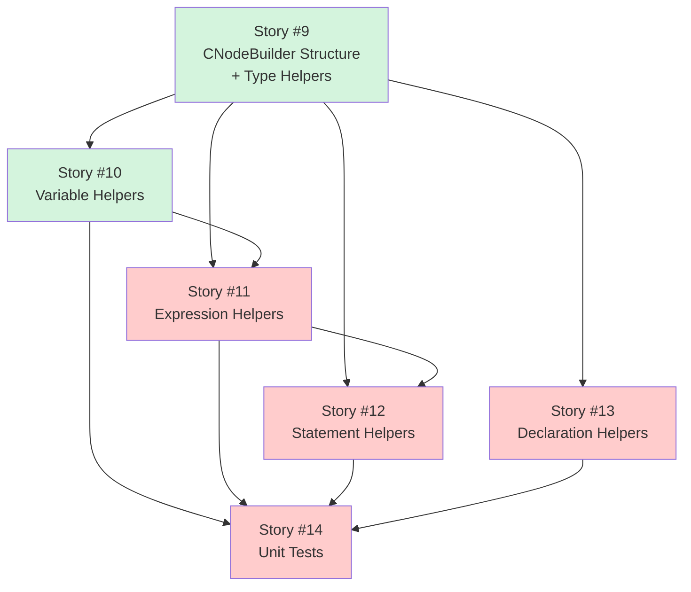
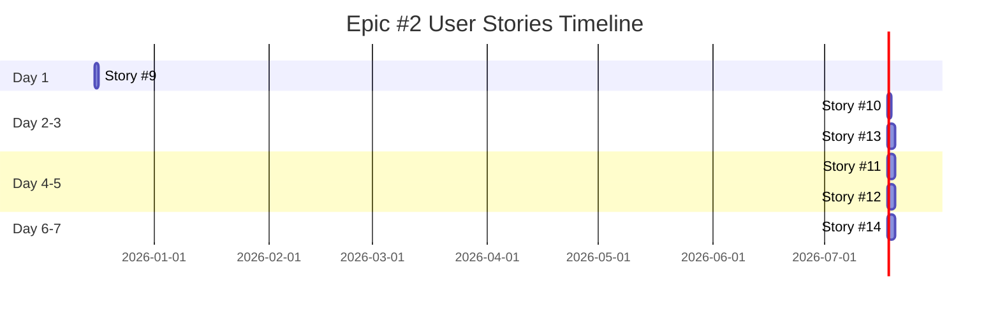

# User Stories Traceability Matrix - Epic #2

**Epic:** [#2 CNodeBuilder Helper Library](https://github.com/o2alexanderfedin/cpp-to-c-transpiler/issues/2)
**Phase:** Phase 1 POC - Week 2
**Duration:** 1 week (with parallelization)
**Total Story Points:** 26

## Overview

This document provides traceability from Epic #2 to its User Stories, showing how the Epic's acceptance criteria map to individual stories.

## User Stories Breakdown

### Story #9: CNodeBuilder Class Structure and Type Helpers

**GitHub Issue:** [#9](https://github.com/o2alexanderfedin/cpp-to-c-transpiler/issues/9)
**Title:** As a developer, I want CNodeBuilder class structure and type helpers so that I can create C type nodes

**Priority:** High
**Effort:** S (2-4 hours)
**Story Points:** 3
**Dependencies:** Stories #5, #6 (Infrastructure complete)

**Epic Acceptance Criteria Covered:**
- ✅ Header file `include/CNodeBuilder.h` with public API
- ✅ Implementation in `src/CNodeBuilder.cpp`
- ✅ ASTContext reference stored for node creation
- ✅ Helper methods (types): `intType()`, `structType()`, `ptrType()`, `voidType()`, `charType()`

**Deliverables:**
- CNodeBuilder.h header with class declaration
- CNodeBuilder.cpp implementation file
- Constructor accepting ASTContext reference
- Type helper methods (5 methods)
- Unit tests for type helpers
- Doxygen documentation

**Testing:**
```cpp
TEST(CNodeBuilderTest, TypeHelpers) {
    CNodeBuilder builder(Context);

    QualType intTy = builder.intType();
    EXPECT_TRUE(intTy->isIntegerType());

    QualType ptrTy = builder.ptrType(intTy);
    EXPECT_TRUE(ptrTy->isPointerType());
}
```

---

### Story #10: Variable Declaration Helpers

**GitHub Issue:** [#10](https://github.com/o2alexanderfedin/cpp-to-c-transpiler/issues/10)
**Title:** As a developer, I want variable declaration helpers so that I can create C variable declarations

**Priority:** High
**Effort:** S (2-4 hours)
**Story Points:** 3
**Dependencies:** Story #9

**Epic Acceptance Criteria Covered:**
- ✅ Helper methods (variables): `intVar()`, `structVar()`, `ptrVar()`

**Deliverables:**
- Variable declaration helpers:
  - `intVar(StringRef name, int initVal)` - int variable with initializer
  - `intVar(StringRef name)` - int variable without initializer
  - `structVar(QualType type, StringRef name)` - struct variable
  - `ptrVar(QualType pointee, StringRef name)` - pointer variable
  - `var(QualType type, StringRef name, Expr* init = nullptr)` - generic variable
- Unit tests for each helper
- Doxygen documentation

**Testing:**
```cpp
TEST(CNodeBuilderTest, VariableDeclarations) {
    CNodeBuilder builder(Context);

    VarDecl* x = builder.intVar("x", 42);
    EXPECT_EQ(x->getName(), "x");
    EXPECT_TRUE(x->getType()->isIntegerType());
    EXPECT_TRUE(x->hasInit());
}
```

---

### Story #11: Expression Helpers

**GitHub Issue:** [#11](https://github.com/o2alexanderfedin/cpp-to-c-transpiler/issues/11)
**Title:** As a developer, I want expression helpers so that I can create C expressions

**Priority:** High
**Effort:** M (1-2 days)
**Story Points:** 5
**Dependencies:** Stories #9, #10

**Epic Acceptance Criteria Covered:**
- ✅ Helper methods (expressions): `intLit()`, `varRef()`, `call()`, `memberAccess()`

**Deliverables:**
- Literal helpers: `intLit()`, `stringLit()`, `nullPtr()`
- Reference helpers: `ref(VarDecl*)`, `ref(FunctionDecl*)`
- Call helpers: `call(StringRef, ArrayRef<Expr*>)`, `call(FunctionDecl*, ArrayRef<Expr*>)`
- Member access: `member()`, `arrowMember()`
- Operators: `assign()`, `addrOf()`, `deref()`
- Unit tests for all helpers (10+ test cases)
- Doxygen documentation

**Testing:**
```cpp
TEST(CNodeBuilderTest, Expressions) {
    CNodeBuilder builder(Context);

    IntegerLiteral* lit = builder.intLit(42);
    EXPECT_EQ(lit->getValue(), 42);

    CallExpr* call = builder.call("printf", {
        builder.stringLit("Hello %d"),
        builder.ref(xVar)
    });
    EXPECT_EQ(call->getNumArgs(), 2);
}
```

---

### Story #12: Statement Helpers

**GitHub Issue:** [#12](https://github.com/o2alexanderfedin/cpp-to-c-transpiler/issues/12)
**Title:** As a developer, I want statement helpers so that I can create C statements and control flow

**Priority:** High
**Effort:** M (1-2 days)
**Story Points:** 5
**Dependencies:** Stories #9, #11

**Epic Acceptance Criteria Covered:**
- ✅ Helper methods (statements): `ifStmt()`, `whileStmt()`, `returnStmt()`, `block()`

**Deliverables:**
- Statement helpers: `block()`, `returnStmt()`, `declStmt()`, `exprStmt()`
- Control flow helpers: `ifStmt()`, `whileStmt()`, `forStmt()`, `breakStmt()`, `continueStmt()`
- Unit tests for all helpers (10+ test cases)
- Doxygen documentation

**Testing:**
```cpp
TEST(CNodeBuilderTest, Statements) {
    CNodeBuilder builder(Context);

    CompoundStmt* block = builder.block({stmt1, stmt2});
    EXPECT_EQ(block->size(), 2);

    IfStmt* ifStmt = builder.ifStmt(
        condExpr,
        builder.returnStmt(builder.intLit(1)),
        builder.returnStmt(builder.intLit(0))
    );
    EXPECT_TRUE(ifStmt->hasElseStorage());
}
```

---

### Story #13: Declaration Helpers

**GitHub Issue:** [#13](https://github.com/o2alexanderfedin/cpp-to-c-transpiler/issues/13)
**Title:** As a developer, I want declaration helpers so that I can create C struct and function declarations

**Priority:** High
**Effort:** M (1-2 days)
**Story Points:** 5
**Dependencies:** Story #9

**Epic Acceptance Criteria Covered:**
- ✅ Helper methods (declarations): `structDecl()`, `funcDecl()`, `param()`

**Deliverables:**
- Struct declaration helpers: `structDecl()`, `fieldDecl()`, `forwardStructDecl()`
- Function declaration helpers: `funcDecl()`, `param()`
- Unit tests for all helpers (8+ test cases)
- Doxygen documentation

**Testing:**
```cpp
TEST(CNodeBuilderTest, Declarations) {
    CNodeBuilder builder(Context);

    RecordDecl* rec = builder.structDecl("Point", {
        builder.fieldDecl(builder.intType(), "x"),
        builder.fieldDecl(builder.intType(), "y")
    });
    EXPECT_EQ(rec->getName(), "Point");
    EXPECT_EQ(rec->field_size(), 2);
}
```

---

### Story #14: CNodeBuilder Unit Tests

**GitHub Issue:** [#14](https://github.com/o2alexanderfedin/cpp-to-c-transpiler/issues/14)
**Title:** As a developer, I want CNodeBuilder unit tests so that I can verify all helpers work correctly

**Priority:** High
**Effort:** M (1-2 days)
**Story Points:** 5
**Dependencies:** Stories #9, #10, #11, #12, #13

**Epic Acceptance Criteria Covered:**
- ✅ Unit tests using GoogleTest or similar
- ✅ Test each helper method independently
- ✅ Test composition (create complex AST)
- ✅ Memory leak validation (AST owned by ASTContext)

**Deliverables:**
- Test framework setup (GoogleTest)
- Test suite structure (CNodeBuilderTypeTest, CNodeBuilderVarTest, CNodeBuilderExprTest, CNodeBuilderStmtTest, CNodeBuilderDeclTest, CNodeBuilderIntegrationTest)
- 30+ unit tests covering all helpers
- Integration tests for complex AST composition
- Memory leak validation with sanitizers
- CMake integration (test target)
- CI/CD integration

**Testing Strategy:**
1. Unit tests for each helper method (25+ tests)
2. Integration tests for complex AST composition (5+ tests)
3. Edge case tests (null handling, empty arrays)
4. Memory leak validation with sanitizers

---

## Dependency Graph



**Legend:**
- Green: Foundation (High priority, small stories)
- Red: Core implementation (High priority, critical path)

## Implementation Timeline



**Total Duration:** 1 week (with parallelization of independent stories)

## Story Points Summary

| Story | Priority | Effort | Points | Duration | Can Parallelize |
|-------|----------|--------|--------|----------|-----------------|
| #9 Structure + Types | High | S | 3 | 1 day | No (foundation) |
| #10 Variables | High | S | 3 | 1 day | Yes (with #13) |
| #11 Expressions | High | M | 5 | 2 days | Yes (with #12 after #10) |
| #12 Statements | High | M | 5 | 2 days | Yes (with #11) |
| #13 Declarations | High | M | 5 | 2 days | Yes (with #10) |
| #14 Unit Tests | High | M | 5 | 2 days | No (needs all) |
| **Total** | | | **26** | **7 days** | |

**Velocity Estimate:** 26 story points / 1 week = high velocity (foundation work)

## Epic Completion Criteria

Epic #2 is complete when:
- ✅ All 6 User Stories marked as Done
- ✅ All acceptance criteria met
- ✅ CNodeBuilder class with 20+ helper methods implemented
- ✅ 30+ unit tests passing
- ✅ Code quality: reduces C node creation from 15+ lines to 1 line
- ✅ Doxygen documentation complete
- ✅ Code committed to `develop` branch
- ✅ No memory leaks (validated with sanitizers)

## API Quality Validation

**Before (without CNodeBuilder):**
```cpp
// 15+ lines of verbose Clang API calls
VarDecl *VD = VarDecl::Create(Context, DC, SourceLocation(),
    SourceLocation(), &Context.Idents.get("x"),
    Context.IntTy, Context.getTrivialTypeSourceInfo(Context.IntTy),
    SC_None);
IntegerLiteral *IL = IntegerLiteral::Create(Context,
    llvm::APInt(32, 42), Context.IntTy, SourceLocation());
VD->setInit(IL);
```

**After (with CNodeBuilder):**
```cpp
// 1 line, readable, maintainable
VarDecl *x = builder.intVar("x", 42);
```

**Quality Metric:** 15x code reduction = Epic success ✅

## Next Steps After Epic #2

Once Epic #2 is complete:
1. **Epic #3: Simple Class Translation** (Week 3)
   - Break down into User Stories
   - Use CNodeBuilder to generate C AST
   - Implement class → struct, method → function transformations

2. **Sprint Planning**
   - Review velocity from Epic #1 (15 points) + Epic #2 (26 points) = 41 points/2 weeks
   - Plan Sprint 2 capacity
   - Select stories from Epic #3

## Traceability Matrix

| Epic Acceptance Criteria | Story | Status |
|--------------------------|-------|--------|
| Header file `include/CNodeBuilder.h` | #9 | ⏳ Todo |
| Implementation `src/CNodeBuilder.cpp` | #9 | ⏳ Todo |
| ASTContext reference stored | #9 | ⏳ Todo |
| Type helpers (5 methods) | #9 | ⏳ Todo |
| Variable helpers (intVar, structVar, ptrVar) | #10 | ⏳ Todo |
| Expression helpers (intLit, varRef, call, memberAccess) | #11 | ⏳ Todo |
| Statement helpers (ifStmt, whileStmt, returnStmt, block) | #12 | ⏳ Todo |
| Declaration helpers (structDecl, funcDecl, param) | #13 | ⏳ Todo |
| Unit tests (GoogleTest) | #14 | ⏳ Todo |
| Test each helper independently | #14 | ⏳ Todo |
| Test complex AST composition | #14 | ⏳ Todo |
| Memory leak validation | #14 | ⏳ Todo |
| Doxygen documentation | #9-14 | ⏳ Todo |
| 20+ helper methods total | #9-13 | ⏳ Todo |
| Clean API (1 line vs 15 lines) | #9-13 | ⏳ Todo |

**Legend:** ⏳ Todo | 🔄 In Progress | ✅ Done

## References

**Epic Documentation:**
- [Epic #2](https://github.com/o2alexanderfedin/cpp-to-c-transpiler/issues/2) - CNodeBuilder Helper Library
- [EPICS.md](EPICS.md) - Complete Epic traceability
- [ARCHITECTURE.md](docs/ARCHITECTURE.md) - Technical architecture
- [ARCHITECTURE.md - CNodeBuilder Component](docs/ARCHITECTURE.md#31-cnodebuilder)

**GitHub Project:**
- [Project #14](https://github.com/users/o2alexanderfedin/projects/14) - C++ to C Transpiler

**External References:**
- [Clang AST Nodes](https://clang.llvm.org/doxygen/group__AST.html)
- [Clang VarDecl API](https://clang.llvm.org/doxygen/classclang_1_1VarDecl.html)
- [Clang RecordDecl API](https://clang.llvm.org/doxygen/classclang_1_1RecordDecl.html)
- [GoogleTest Documentation](https://google.github.io/googletest/)

---

**Created:** 2025-12-08
**Last Updated:** 2025-12-08
**Epic Status:** Ready for Implementation (depends on Epic #1 completion)
**Next Epic:** #3 Simple Class Translation (Week 3)

*This document will be updated as User Stories progress through implementation.*
