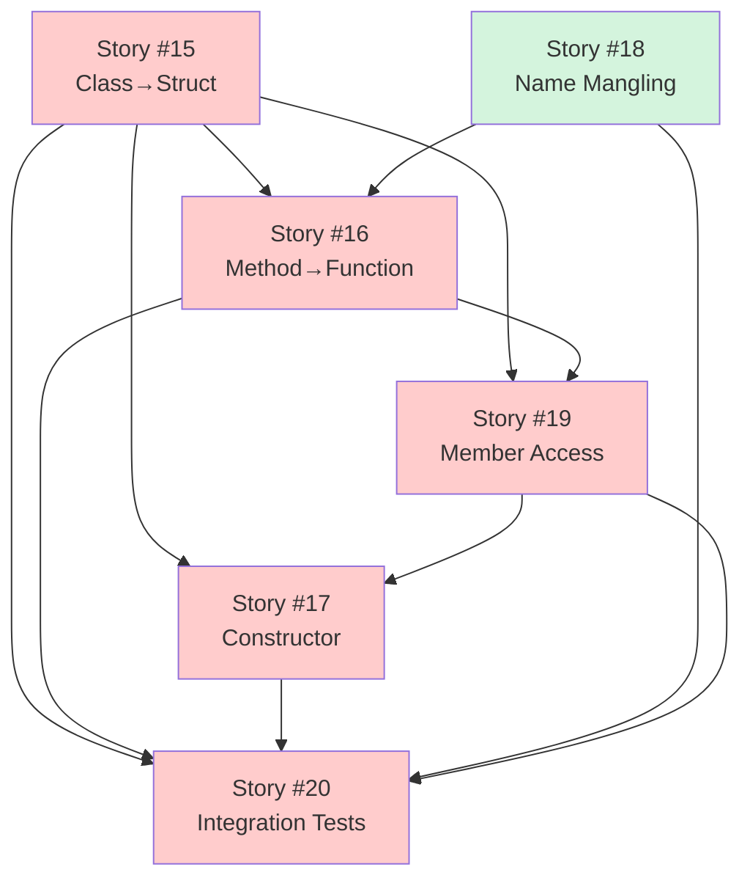
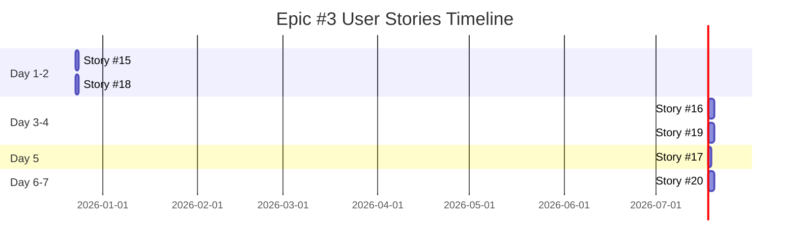

# User Stories Traceability Matrix - Epic #3

**Epic:** [#3 Simple Class Translation](https://github.com/o2alexanderfedin/cpp-to-c-transpiler/issues/3)
**Phase:** Phase 1 POC - Week 3
**Duration:** 1 week (with parallelization)
**Total Story Points:** 26

## Overview

This document provides traceability from Epic #3 to its User Stories, showing how the Epic's acceptance criteria map to individual stories. Epic #3 is the **heart of the POC** - it validates the Two-Phase Translation architecture by implementing the core transformation logic.

## User Stories Breakdown

### Story #15: Class-to-Struct Conversion

**GitHub Issue:** [#15](https://github.com/o2alexanderfedin/cpp-to-c-transpiler/issues/15)
**Title:** As a developer, I want class-to-struct conversion so that I can translate C++ classes to C structs

**Priority:** Critical
**Effort:** S (2-4 hours)
**Story Points:** 3
**Dependencies:** Stories #9, #13 (CNodeBuilder)

**Epic Acceptance Criteria Covered:**
- ✅ `VisitCXXRecordDecl()` handles class declarations
- ✅ Generate C struct with same member layout
- ✅ Preserve member variable names and types
- ✅ Handle access specifiers (public/private/protected)

**Deliverables:**
- VisitCXXRecordDecl() implementation
- C struct generation with CNodeBuilder
- Field preservation (names, types, order)
- C++ class → C struct mapping storage
- Skip incomplete definitions (forward declarations)

**Testing:**
```cpp
TEST(ClassTranslationTest, EmptyClass) {
    // class Empty {}; → struct Empty {};
}

TEST(ClassTranslationTest, SimpleDataMembers) {
    // class Point { int x, y; }; → struct Point { int x; int y; };
}
```

---

### Story #16: Method-to-Function Conversion

**GitHub Issue:** [#16](https://github.com/o2alexanderfedin/cpp-to-c-transpiler/issues/16)
**Title:** As a developer, I want method-to-function conversion so that I can translate C++ methods to C functions

**Priority:** Critical
**Effort:** M (1-2 days)
**Story Points:** 5
**Dependencies:** Stories #15, #18

**Epic Acceptance Criteria Covered:**
- ✅ `VisitCXXMethodDecl()` handles member functions
- ✅ Add `struct ClassName *this` as first parameter
- ✅ Generate function name: `ClassName_methodName`

**Deliverables:**
- VisitCXXMethodDecl() implementation
- This parameter injection as first parameter
- Original parameters preserved
- Function signature generation
- Skip virtual methods (Phase 1 POC scope)

**Testing:**
```cpp
TEST(MethodTranslationTest, SimpleMethod) {
    // int getX() → int Point_getX(struct Point *this)
}

TEST(MethodTranslationTest, MethodWithParams) {
    // void setX(int x) → void Point_setX(struct Point *this, int x)
}
```

---

### Story #17: Constructor Translation

**GitHub Issue:** [#17](https://github.com/o2alexanderfedin/cpp-to-c-transpiler/issues/17)
**Title:** As a developer, I want constructor translation so that I can convert C++ constructors to C init functions

**Priority:** Critical
**Effort:** M (1-2 days)
**Story Points:** 5
**Dependencies:** Stories #15, #19

**Epic Acceptance Criteria Covered:**
- ✅ Generate `ClassName__ctor(struct ClassName *this, ...params)`
- ✅ Translate member initializers to assignments
- ✅ Handle constructor body translation

**Deliverables:**
- VisitCXXConstructorDecl() implementation
- ClassName__ctor function generation
- Member initializer list translation to assignments
- Constructor body translation
- Default constructor support
- Parameterized constructor support

**Testing:**
```cpp
TEST(ConstructorTranslationTest, MemberInitializers) {
    // Point(int x, int y) : x(x), y(y) {}
    // → assignments: this->x = x; this->y = y;
}
```

---

### Story #18: Basic Name Mangling

**GitHub Issue:** [#18](https://github.com/o2alexanderfedin/cpp-to-c-transpiler/issues/18)
**Title:** As a developer, I want basic name mangling so that I can generate unique C function names

**Priority:** High
**Effort:** S (2-4 hours)
**Story Points:** 3
**Dependencies:** None (can implement in parallel)

**Epic Acceptance Criteria Covered:**
- ✅ Simple mangling: `ClassName_methodName`
- ✅ Handle overloads: append parameter types `_int_float`
- ✅ No namespace mangling yet (Phase 1 scope)

**Deliverables:**
- NameMangler class
- Simple mangling algorithm (ClassName_methodName)
- Overload handling (append parameter types)
- Constructor mangling (ClassName__ctor)
- Uniqueness validation

**Testing:**
```cpp
TEST(NameManglingTest, SimpleMethod) {
    // Point::getX() → Point_getX
}

TEST(NameManglingTest, OverloadedMethods) {
    // Math::add(int, int) → Math_add_int_int
    // Math::add(float, float) → Math_add_float_float
}
```

---

### Story #19: Member Access Transformation

**GitHub Issue:** [#19](https://github.com/o2alexanderfedin/cpp-to-c-transpiler/issues/19)
**Title:** As a developer, I want member access transformation so that I can translate C++ member access to C

**Priority:** Critical
**Effort:** M (1-2 days)
**Story Points:** 5
**Dependencies:** Stories #15, #16, #11 (CNodeBuilder expressions)

**Epic Acceptance Criteria Covered:**
- ✅ Translate member access to `this->member`

**Deliverables:**
- translateExpr() framework
- MemberExpr translation (obj.member → this->member)
- Implicit this made explicit
- DeclRefExpr translation (member variable references)
- Expression type preservation
- Value category preservation

**Testing:**
```cpp
TEST(MemberAccessTest, ImplicitThisRead) {
    // return x; → return this->x;
}

TEST(MemberAccessTest, ImplicitThisWrite) {
    // x = val; → this->x = val;
}
```

---

### Story #20: Translation Integration Tests

**GitHub Issue:** [#20](https://github.com/o2alexanderfedin/cpp-to-c-transpiler/issues/20)
**Title:** As a developer, I want translation integration tests so that I can verify end-to-end class translation

**Priority:** Critical
**Effort:** M (1-2 days)
**Story Points:** 5
**Dependencies:** Stories #15-19 (all translation stories)

**Epic Acceptance Criteria Covered:**
- ✅ AST #2 (C AST) construction
- ✅ Maintain mapping: C++ decl → C decl

**Deliverables:**
- Integration test framework setup
- 5+ end-to-end test cases
- Complete C++ class → C struct + functions transformation tests
- C AST structure validation
- C++ to C mapping correctness verification
- AST validation (no null nodes, correct types)

**Testing:**
```cpp
TEST_F(TranslationIntegrationTest, CompleteClassTranslation) {
    const char *cpp = R"(
        class Point {
            int x, y;
        public:
            Point(int x, int y) : x(x), y(y) {}
            int getX() { return x; }
        };
    )";

    TranslationUnit TU = translateCode(cpp);

    // Validate: struct Point + Point__ctor + Point_getX generated
    // Check all transformations correct
}
```

---

## Dependency Graph



**Legend:**
- Red: Critical priority (core translation logic)
- Green: High priority (supporting infrastructure)

## Implementation Timeline



**Total Duration:** 1 week (with parallelization of independent stories)

## Story Points Summary

| Story | Priority | Effort | Points | Duration | Can Parallelize |
|-------|----------|--------|--------|----------|-----------------|
| #15 Class→Struct | Critical | S | 3 | 1 day | Yes (with #18) |
| #16 Method→Function | Critical | M | 5 | 2 days | Yes (with #19 after #15) |
| #17 Constructor | Critical | M | 5 | 1 day | No (needs #19) |
| #18 Name Mangling | High | S | 3 | 1 day | Yes (with #15) |
| #19 Member Access | Critical | M | 5 | 2 days | Yes (with #16 after #15) |
| #20 Integration Tests | Critical | M | 5 | 2 days | No (needs all) |
| **Total** | | | **26** | **7 days** | |

**Velocity Estimate:** 26 story points / 1 week = critical path implementation

## Epic Completion Criteria

Epic #3 is complete when:
- ✅ All 6 User Stories marked as Done
- ✅ All acceptance criteria met
- ✅ Tool translates simple C++ class to C struct + functions
- ✅ Generated C AST is valid and complete
- ✅ C++ to C mapping maintained
- ✅ Integration tests pass (5+ scenarios)
- ✅ Code committed to `develop` branch
- ✅ **Two-Phase Translation architecture validated** ✅

## Architecture Validation

Epic #3 validates the core architecture decision:

**Two-Phase Translation Pipeline:**
```
C++ Source → Clang Parser → C++ AST (#1) → Translation Visitor → C AST (#2) → Clang Printer → C Code
```

**Proof Point:**
```cpp
// Input: Point.cpp (C++ AST #1)
class Point {
    int x, y;
public:
    Point(int x, int y) : x(x), y(y) {}
    int getX() { return x; }
};

// Translation Visitor: C++ AST → C AST

// Output: Point.c (from C AST #2 via Clang Printer)
struct Point { int x; int y; };

void Point__ctor(struct Point *this, int x, int y) {
    this->x = x;
    this->y = y;
}

int Point_getX(struct Point *this) {
    return this->x;
}
```

**If Epic #3 succeeds:**
- ✅ Two-Phase Translation architecture is validated
- ✅ CNodeBuilder API is proven effective
- ✅ Clang Printer integration works
- ✅ Foundation for Phase 2 (Core Features) is established
- ✅ Confidence level: 97%+ → 99%+

## Translation Patterns Implemented

### Pattern 1: Class → Struct
```cpp
// C++: class Point { int x, y; };
// C: struct Point { int x; int y; };
```

### Pattern 2: Method → Function with this
```cpp
// C++: int Point::getX() { return x; }
// C: int Point_getX(struct Point *this) { return this->x; }
```

### Pattern 3: Constructor → Init Function
```cpp
// C++: Point::Point(int x, int y) : x(x), y(y) {}
// C: void Point__ctor(struct Point *this, int x, int y) { this->x = x; this->y = y; }
```

### Pattern 4: Member Access → Explicit this
```cpp
// C++: return x;  (implicit this->x)
// C: return this->x;  (explicit)
```

### Pattern 5: Name Mangling → Unique Names
```cpp
// C++: Math::add(int, int) and Math::add(float, float)
// C: Math_add_int_int(...) and Math_add_float_float(...)
```

## Next Steps After Epic #3

Once Epic #3 is complete:
1. **Epic #4: Clang Printer Integration & Validation** (Week 4)
   - Break down into User Stories
   - Integrate DeclPrinter/StmtPrinter
   - Add #line directives
   - Validate: compile generated C, verify behavior matches C++

2. **Phase 1 POC Complete**
   - All 4 Epics done
   - Tool converts simple C++ class to compilable C code
   - Architecture fully validated
   - Ready for Phase 2 planning

## Traceability Matrix

| Epic Acceptance Criteria | Story | Status |
|--------------------------|-------|--------|
| VisitCXXRecordDecl() handles classes | #15 | ⏳ Todo |
| Generate C struct with same layout | #15 | ⏳ Todo |
| Preserve member variable names/types | #15 | ⏳ Todo |
| Handle access specifiers | #15 | ⏳ Todo |
| VisitCXXMethodDecl() handles methods | #16 | ⏳ Todo |
| Add struct ClassName *this parameter | #16 | ⏳ Todo |
| Generate function name | #16, #18 | ⏳ Todo |
| Generate ClassName__ctor() | #17 | ⏳ Todo |
| Translate member initializers | #17 | ⏳ Todo |
| Handle constructor body | #17 | ⏳ Todo |
| Simple mangling: ClassName_methodName | #18 | ⏳ Todo |
| Handle overloads: _int_float | #18 | ⏳ Todo |
| No namespace mangling (Phase 1) | #18 | ⏳ Todo |
| Translate member access to this->member | #19 | ⏳ Todo |
| Build C AST using CNodeBuilder | #15-17, #19 | ⏳ Todo |
| Store C++ → C mapping | #15, #16 | ⏳ Todo |
| Integration tests pass | #20 | ⏳ Todo |

**Legend:** ⏳ Todo | 🔄 In Progress | ✅ Done

## References

**Epic Documentation:**
- [Epic #3](https://github.com/o2alexanderfedin/cpp-to-c-transpiler/issues/3) - Simple Class Translation
- [EPICS.md](EPICS.md) - Complete Epic traceability
- [ARCHITECTURE.md](docs/ARCHITECTURE.md) - Technical architecture
- [ARCHITECTURE.md - Translation Layer](docs/ARCHITECTURE.md#32-translation-layer-recursiveastvisitor)
- [ARCHITECTURE.md - Data Flow](docs/ARCHITECTURE.md#5-data-flow--transformations)

**GitHub Project:**
- [Project #14](https://github.com/users/o2alexanderfedin/projects/14) - C++ to C Transpiler

**External References:**
- [Clang RecursiveASTVisitor](https://clang.llvm.org/doxygen/classclang_1_1RecursiveASTVisitor.html)
- [Clang CXXRecordDecl](https://clang.llvm.org/doxygen/classclang_1_1CXXRecordDecl.html)
- [Clang CXXMethodDecl](https://clang.llvm.org/doxygen/classclang_1_1CXXMethodDecl.html)
- [Clang CXXConstructorDecl](https://clang.llvm.org/doxygen/classclang_1_1CXXConstructorDecl.html)

---

**Created:** 2025-12-08
**Last Updated:** 2025-12-08
**Epic Status:** Ready for Implementation (depends on Epic #1 + Epic #2 completion)
**Next Epic:** #4 Clang Printer Integration & Validation (Week 4)

**Critical Note:** Epic #3 is the **heart of the POC**. If this Epic succeeds, the entire Two-Phase Translation architecture is validated, and confidence level increases from 97%+ to 99%+.

*This document will be updated as User Stories progress through implementation.*
