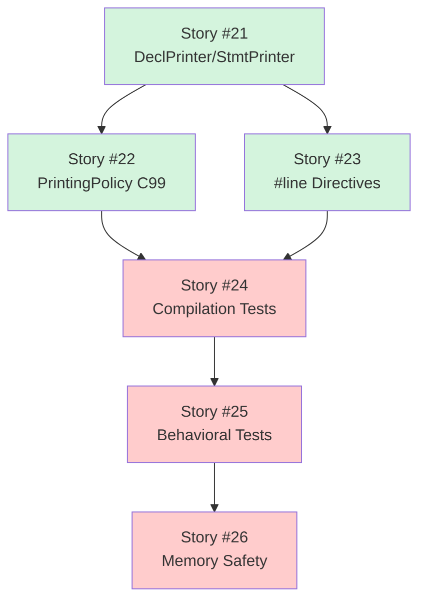
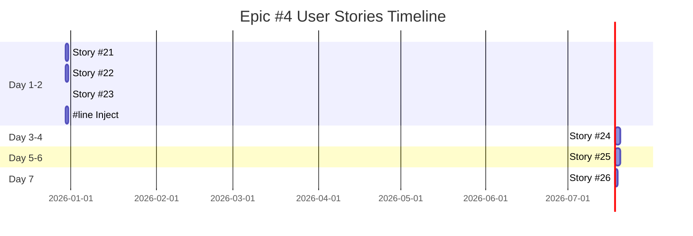

# User Stories Traceability Matrix - Epic #4

**Epic:** [#4 Clang Printer Integration & Validation](https://github.com/o2alexanderfedin/cpp-to-c-transpiler/issues/4)
**Phase:** Phase 1 POC - Week 4
**Duration:** 1 week
**Total Story Points:** 22

## Overview

This document provides traceability from Epic #4 to its User Stories. Epic #4 is the **final validation** of the POC - it proves the Two-Phase Translation architecture works end-to-end by generating compilable, behaviorally-correct C code.

## Phase 1 POC Completion

**Epic #4 Validates:**
- ✅ C++ Source → Clang Parser → C++ AST (#1) → Translation Visitor → C AST (#2) → **Clang Printer** → Clean C Code
- ✅ Generated C compiles without warnings
- ✅ Generated C produces identical behavior to C++
- ✅ #line directives enable debugging C++ source
- ✅ Memory safe (zero leaks, zero UB)
- ✅ Architecture confidence: 97%+ → **99%+**

## User Stories Breakdown

### Story #21: DeclPrinter/StmtPrinter Integration

**GitHub Issue:** [#21](https://github.com/o2alexanderfedin/cpp-to-c-transpiler/issues/21)
**Title:** As a developer, I want DeclPrinter/StmtPrinter integration so that I can output C code from AST

**Priority:** High
**Effort:** S (2-4 hours)
**Story Points:** 3
**Dependencies:** Stories #15, #16 (Translation complete)

**Epic Acceptance Criteria Covered:**
- ✅ Use `Decl::print()` to output C declarations
- ✅ Use `Stmt::printPretty()` to output C statements
- ✅ Output to file (not stdout)

**Deliverables:**
- CodeGenerator class encapsulating printer logic
- Decl::print() integration
- Stmt::printPretty() integration
- File output functionality
- Handle all C declaration types
- Handle all C statement types

**Key Implementation:**
```cpp
class CodeGenerator {
    raw_ostream &OS;
    PrintingPolicy Policy;
public:
    void printDecl(Decl *D) { D->print(OS, Policy); }
    void printStmt(Stmt *S, unsigned Indent = 0) { 
        S->printPretty(OS, nullptr, Policy, Indent); 
    }
};
```

---

### Story #22: PrintingPolicy C99 Configuration

**GitHub Issue:** [#22](https://github.com/o2alexanderfedin/cpp-to-c-transpiler/issues/22)
**Title:** As a developer, I want PrintingPolicy configured for C99 so that generated code is valid C

**Priority:** High
**Effort:** S (2-4 hours)
**Story Points:** 3
**Dependencies:** Story #21

**Epic Acceptance Criteria Covered:**
- ✅ Configure PrintingPolicy for C99 output
- ✅ Ensure output is valid C99

**Deliverables:**
- Set LangOpts.C99 = true
- Disable all C++ features
- Configure _Bool type (not bool)
- Configure struct/enum keywords
- Configure formatting preferences
- Verify output compiles with gcc -std=c99

**Key Configuration:**
```cpp
LangOptions C99;
C99.C99 = 1;
C99.CPlusPlus = 0;
PrintingPolicy Policy(C99);
Policy.SuppressTagKeyword = false;  // Keep 'struct'
Policy.Bool = true;  // Use _Bool
```

---

### Story #23: #line Directive Injection

**GitHub Issue:** [#23](https://github.com/o2alexanderfedin/cpp-to-c-transpiler/issues/23)
**Title:** As a developer, I want #line directive injection so that errors map to C++ source

**Priority:** High
**Effort:** S (2-4 hours)
**Story Points:** 3
**Dependencies:** Story #21

**Epic Acceptance Criteria Covered:**
- ✅ Inject `#line <num> "<file>"` before each declaration
- ✅ Map generated C back to original C++ source
- ✅ Enable debugger to show C++ source when debugging C code

**Deliverables:**
- #line directive injection before declarations
- Source location mapping
- Invalid location handling
- Compiler error mapping to C++ source
- Debugger C++ source mapping

**Output Example:**
```c
#line 1 "Point.cpp"
struct Point { int x; int y; };

#line 6 "Point.cpp"
void Point__ctor(struct Point *this, int x, int y) {
    this->x = x;
    this->y = y;
}
```

---

### Story #24: Compilation Validation Tests

**GitHub Issue:** [#24](https://github.com/o2alexanderfedin/cpp-to-c-transpiler/issues/24)
**Title:** As a developer, I want compilation validation tests so that I can verify generated C compiles

**Priority:** Critical
**Effort:** M (1-2 days)
**Story Points:** 5
**Dependencies:** Stories #21-23, all Epic #3 stories

**Epic Acceptance Criteria Covered:**
- ✅ Generated C compiles without errors (gcc/clang)
- ✅ Test with at least 5 example C++ classes

**Deliverables:**
- Compilation test framework
- Test with gcc -std=c99 -Wall -Werror
- Test with clang -std=c99
- 5+ test cases (empty class, fields, methods, constructor, complex)
- Capture and verify compiler output
- Fail on warnings or errors

**Test Strategy:**
1. Translate C++ to C
2. Compile with gcc/clang
3. Verify zero errors/warnings
4. Capture failure details

---

### Story #25: Behavioral Validation Tests

**GitHub Issue:** [#25](https://github.com/o2alexanderfedin/cpp-to-c-transpiler/issues/25)
**Title:** As a developer, I want behavioral validation tests so that C code behaves like C++

**Priority:** Critical
**Effort:** M (1-2 days)
**Story Points:** 5
**Dependencies:** Story #24, all Epic #3 stories

**Epic Acceptance Criteria Covered:**
- ✅ Generated C produces same output as original C++
- ✅ Verify behavior matches C++

**Deliverables:**
- Behavioral test framework
- Compile and run C++ → capture output
- Translate to C, compile and run → capture output
- Compare outputs (diff)
- 5+ test cases covering getters, constructors, multiple methods
- Verify identical behavior

**Validation:**
```bash
# C++ output
clang++ -o test_cpp Point.cpp && ./test_cpp > cpp.txt

# C output
./cpptoc Point.cpp -o Point.c
gcc -o test_c Point.c && ./test_c > c.txt

# Compare
diff cpp.txt c.txt  # Must be identical
```

---

### Story #26: Memory Safety Validation

**GitHub Issue:** [#26](https://github.com/o2alexanderfedin/cpp-to-c-transpiler/issues/26)
**Title:** As a developer, I want memory safety validation so that generated C has no leaks

**Priority:** Critical
**Effort:** S (2-4 hours)
**Story Points:** 3
**Dependencies:** Stories #24, #25

**Epic Acceptance Criteria Covered:**
- ✅ Memory-safe (no leaks, no undefined behavior)

**Deliverables:**
- Valgrind test framework
- Run generated C under valgrind --leak-check=full
- Check for memory leaks
- Check for undefined behavior
- 5+ test cases
- Verify: "All heap blocks were freed -- no leaks are possible"

**Expected Result:**
```
==12345== HEAP SUMMARY:
==12345==     in use at exit: 0 bytes in 0 blocks
==12345== All heap blocks were freed -- no leaks are possible
==12345== ERROR SUMMARY: 0 errors from 0 contexts
```

---

## Dependency Graph



**Legend:**
- Green: High priority (integration)
- Red: Critical priority (validation)

## Implementation Timeline



**Total Duration:** 1 week (7 days)

## Story Points Summary

| Story | Priority | Effort | Points | Duration |
|-------|----------|--------|--------|----------|
| #21 DeclPrinter | High | S | 3 | 1 day |
| #22 C99 Policy | High | S | 3 | 1 day |
| #23 #line | High | S | 3 | 1 day |
| #24 Compilation | Critical | M | 5 | 2 days |
| #25 Behavioral | Critical | M | 5 | 2 days |
| #26 Memory Safety | Critical | S | 3 | 1 day |
| **Total** | | | **22** | **7 days** |

## Epic Completion Criteria

Epic #4 is complete when:
- ✅ All 6 User Stories marked as Done
- ✅ CodeGenerator class integrated with Clang printers
- ✅ PrintingPolicy configured for C99
- ✅ #line directives injected correctly
- ✅ 5+ C++ classes compile successfully as C
- ✅ C output behaves identically to C++
- ✅ Zero memory leaks (valgrind verified)
- ✅ Code committed to `develop` branch
- ✅ **Phase 1 POC COMPLETE** ✅

## Phase 1 POC Success

**At completion of Epic #4:**

✅ **Tool successfully:**
- Parses simple C++ class
- Generates equivalent C struct + functions  
- Compiles without warnings (gcc/clang)
- Produces identical behavior to C++
- Enables C++ source debugging via #line
- Has zero memory leaks or UB

✅ **Architecture validated:**
- Two-Phase Translation works end-to-end
- CNodeBuilder enables clean C AST construction
- Clang Printer handles code generation
- Confidence: 97%+ → **99%+**

✅ **Ready for Phase 2:**
- Core Features (RAII, inheritance, vtables)
- Exception handling (PNaCl SJLJ)
- RTTI (Itanium ABI)
- Advanced features

## Traceability Matrix

| Epic Acceptance Criteria | Story | Status |
|--------------------------|-------|--------|
| Use Decl::print() | #21 | ⏳ Todo |
| Use Stmt::printPretty() | #21 | ⏳ Todo |
| Configure PrintingPolicy C99 | #22 | ⏳ Todo |
| Output to file | #21 | ⏳ Todo |
| Inject #line directives | #23 | ⏳ Todo |
| Map to C++ source | #23 | ⏳ Todo |
| Enable C++ debugging | #23 | ⏳ Todo |
| Generated C compiles (gcc/clang) | #24 | ⏳ Todo |
| Same output as C++ | #25 | ⏳ Todo |
| Memory-safe (no leaks, no UB) | #26 | ⏳ Todo |
| Test with 5+ examples | #24, #25, #26 | ⏳ Todo |

**Legend:** ⏳ Todo | 🔄 In Progress | ✅ Done

## References

**Epic Documentation:**
- [Epic #4](https://github.com/o2alexanderfedin/cpp-to-c-transpiler/issues/4) - Clang Printer Integration & Validation
- [EPICS.md](EPICS.md) - Complete Epic traceability
- [ARCHITECTURE.md](docs/ARCHITECTURE.md) - Technical architecture
- [ARCHITECTURE.md - Clang Printer](docs/ARCHITECTURE.md#33-clang-printer-integration)

**GitHub Project:**
- [Project #14](https://github.com/users/o2alexanderfedin/projects/14) - C++ to C Transpiler

**External References:**
- [Clang DeclPrinter Source](https://clang.llvm.org/doxygen/DeclPrinter_8cpp_source.html)
- [Clang StmtPrinter Source](https://clang.llvm.org/doxygen/StmtPrinter_8cpp_source.html)
- [Clang PrintingPolicy](https://clang.llvm.org/doxygen/structclang_1_1PrintingPolicy.html)
- [Valgrind Manual](https://valgrind.org/docs/manual/manual.html)

---

**Created:** 2025-12-08
**Last Updated:** 2025-12-08
**Epic Status:** Ready for Implementation (depends on Epic #1 + #2 + #3 completion)
**Phase 1 Status:** FINAL EPIC - Completes POC

**Critical Note:** Epic #4 completion means Phase 1 POC is **COMPLETE** and the Two-Phase Translation architecture is **VALIDATED** with 99%+ confidence.

*This document will be updated as User Stories progress through implementation.*
