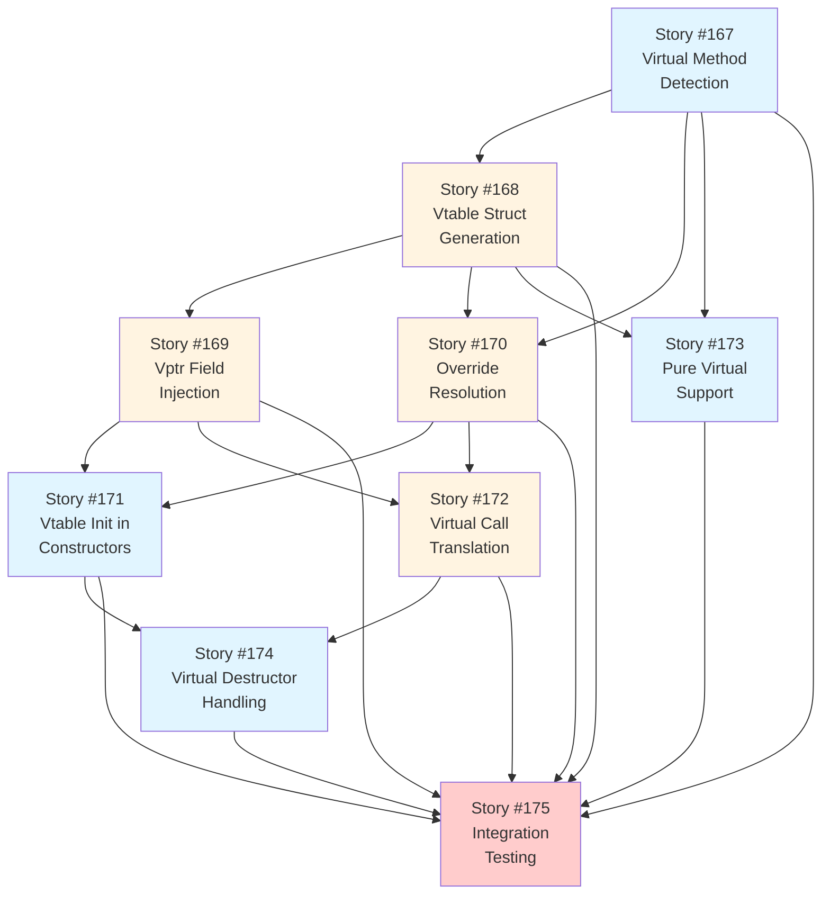

# User Stories Traceability Matrix - Epic #41

**Epic:** [#41 Virtual Functions + Vtables](https://github.com/o2alexanderfedin/cpp-to-c-transpiler/issues/41)
**Phase:** Phase 3 - Advanced Features, Weeks 13-16
**Duration:** 4 weeks (with parallelization where possible)
**Total Story Points:** 21

## Overview

This document provides traceability from Epic #41 to its User Stories, showing how virtual function dispatch and vtable generation map to individual implementation stories. This epic implements runtime polymorphism by generating vtable structs, injecting vptr fields, and translating virtual calls to vtable lookups.

## Architecture Foundation

**Dependencies:**
- Epic #5 (RAII) - Complete ✅
- Epic #6 (Single Inheritance) - Complete ✅
- Epic #7 (Advanced Constructors) - Complete ✅
- Epic #8 (Templates) - Complete ✅

**Key Technical Concepts:**
1. **Vtable**: Const struct containing function pointers for all virtual methods
2. **Vptr**: Virtual table pointer (first field, offset 0 in polymorphic classes)
3. **Virtual Dispatch**: Transform `obj->method()` to `obj->vptr->method(obj)`
4. **Override Resolution**: Derived class vtables point to overridden implementations
5. **Pure Virtual**: Abstract classes with `= 0` methods (no implementation)

## User Stories Breakdown

### Story #158: Virtual Method Detection and AST Analysis

**GitHub Issue:** [#167](https://github.com/o2alexanderfedin/cpp-to-c-transpiler/issues/167)
**Title:** As a developer, I want virtual method detection so that I can identify polymorphic classes

**Priority:** Critical
**Effort:** S (2-4 hours)
**Story Points:** 3
**Dependencies:** Epic #6 (Inheritance support)

**Epic Acceptance Criteria Covered:**
- ✅ Detect classes with virtual methods (polymorphic classes)
- ✅ Identify virtual methods (virtual keyword or override specifier)
- ✅ Detect pure virtual methods (= 0 syntax)
- ✅ Track virtual methods through inheritance hierarchy

**Deliverables:**
- `VirtualMethodAnalyzer` class (80-120 LOC)
- `isPolymorphic(CXXRecordDecl*)` - checks if class has virtual methods
- `getVirtualMethods(CXXRecordDecl*)` - returns list of virtual methods
- `isPureVirtual(CXXMethodDecl*)` - checks for pure virtual
- `isAbstractClass(CXXRecordDecl*)` - checks if class has any pure virtual
- Unit tests for virtual method detection
- Integration with existing class analysis

**Technical Details:**
```cpp
// Detect virtual methods
bool isVirtual = method->isVirtual();
bool isPureVirtual = method->isPure();
bool isOverride = method->hasAttr<OverrideAttr>();

// Check polymorphic class
bool isPolymorphic = record->isPolymorphic();

// Get virtual methods (including inherited)
for (auto *method : record->methods()) {
    if (method->isVirtual()) {
        virtualMethods.push_back(method);
    }
}
```

**Testing:**
```cpp
TEST(VirtualMethodAnalyzerTest, DetectVirtualMethods) {
    // Test: Single virtual method
    class Base { virtual void foo(); };
    EXPECT_TRUE(analyzer.isPolymorphic(Base));
    EXPECT_EQ(analyzer.getVirtualMethods(Base).size(), 1);
}

TEST(VirtualMethodAnalyzerTest, DetectPureVirtual) {
    class Abstract { virtual void foo() = 0; };
    EXPECT_TRUE(analyzer.isPureVirtual(foo));
    EXPECT_TRUE(analyzer.isAbstractClass(Abstract));
}
```

**Acceptance Criteria:**
- [ ] Virtual methods detected correctly
- [ ] Pure virtual methods identified
- [ ] Abstract classes recognized
- [ ] Inherited virtual methods tracked
- [ ] Unit tests pass (5+ test cases)

---

### Story #159: Vtable Struct Generation

**GitHub Issue:** [#168](https://github.com/o2alexanderfedin/cpp-to-c-transpiler/issues/168)
**Title:** As a developer, I want vtable struct generation so that I can store function pointers for virtual methods

**Priority:** Critical
**Effort:** M (1-2 days)
**Story Points:** 5
**Dependencies:** Story #158

**Epic Acceptance Criteria Covered:**
- ✅ Generate vtable struct for each polymorphic class
- ✅ Include function pointers for all virtual methods
- ✅ Maintain consistent order (base methods first, then derived)
- ✅ Handle destructor as first entry

**Deliverables:**
- `VtableGenerator` class (150-200 LOC)
- `generateVtableStruct(CXXRecordDecl*)` - creates vtable struct definition
- `getVtableMethodOrder(CXXRecordDecl*)` - determines method order
- Naming convention: `struct ClassName_vtable`
- Function pointer types with correct signatures
- Unit tests for vtable generation
- Integration with `CodeGenerator`

**Technical Details:**
```c
// Generated vtable struct
struct Shape_vtable {
    void (*destructor)(struct Shape *this);
    double (*area)(struct Shape *this);
    void (*draw)(struct Shape *this);
};

struct Circle_vtable {
    void (*destructor)(struct Circle *this);
    double (*area)(struct Circle *this);
    void (*draw)(struct Circle *this);
};
```

**Vtable Method Order:**
1. Destructor (always first)
2. Virtual methods in declaration order
3. Override inherited methods (keep same slot)

**Testing:**
```cpp
TEST(VtableGeneratorTest, GenerateSimpleVtable) {
    class Base {
        virtual ~Base() {}
        virtual void foo() {}
    };

    auto vtableStruct = generator.generateVtableStruct(Base);
    EXPECT_EQ(vtableStruct->getName(), "Base_vtable");
    EXPECT_EQ(vtableStruct->field_size(), 2); // destructor + foo
}

TEST(VtableGeneratorTest, VtableMethodOrder) {
    class Derived : public Base {
        void foo() override {}
        virtual void bar() {}
    };

    auto order = generator.getVtableMethodOrder(Derived);
    EXPECT_EQ(order[0]->getName(), "__dtor");
    EXPECT_EQ(order[1]->getName(), "foo");
    EXPECT_EQ(order[2]->getName(), "bar");
}
```

**Acceptance Criteria:**
- [ ] Vtable structs generated for all polymorphic classes
- [ ] Function pointers have correct types
- [ ] Method order matches C++ ABI
- [ ] Destructor always first
- [ ] Unit tests pass (8+ test cases)
- [ ] Integration tests with inheritance

---

### Story #160: Vptr Field Injection in Class Layout

**GitHub Issue:** [#169](https://github.com/o2alexanderfedin/cpp-to-c-transpiler/issues/169)
**Title:** As a developer, I want vptr field injection so that objects can reference their vtable

**Priority:** Critical
**Effort:** M (1-2 days)
**Story Points:** 5
**Dependencies:** Story #159, Epic #6 (Inheritance)

**Epic Acceptance Criteria Covered:**
- ✅ Inject vptr as first field (offset 0)
- ✅ Type: `const struct ClassName_vtable *vptr`
- ✅ Compatible with inheritance (base class layout)
- ✅ Preserve ABI compatibility

**Deliverables:**
- `VptrInjector` class (100-150 LOC)
- `injectVptr(CXXRecordDecl*)` - adds vptr field to struct
- Update `ClassLayoutGenerator` to handle vptr
- Naming convention: `vptr` field name
- Const-qualified pointer type
- Unit tests for vptr injection
- Memory layout verification tests

**Technical Details:**
```c
// Generated struct with vptr
struct Shape {
    const struct Shape_vtable *vptr;  // Offset 0
};

struct Circle {
    const struct Circle_vtable *vptr;  // Offset 0
    double radius;                     // Offset 8
};

// Memory layout
// Circle: [vptr:8][radius:8] = 16 bytes
// Vptr MUST be at offset 0 for upcast compatibility
```

**Integration with Inheritance:**
```c
// Single inheritance: vptr still at offset 0
struct Derived {
    const struct Derived_vtable *vptr;  // Offset 0
    struct Base base_fields;             // Offset 8 (if Base non-polymorphic)
    int derived_field;
};

// If Base is polymorphic, it already has vptr at offset 0
// Derived reuses same vptr location (override, not add)
```

**Testing:**
```cpp
TEST(VptrInjectorTest, InjectVptrFirstField) {
    class Polymorphic { virtual void foo(); };

    auto structDecl = generator.generateStruct(Polymorphic);
    auto firstField = *structDecl->field_begin();
    EXPECT_EQ(firstField->getName(), "vptr");
    EXPECT_TRUE(firstField->getType()->isPointerType());
}

TEST(VptrInjectorTest, VptrOffsetZero) {
    class Polymorphic {
        virtual void foo();
        int data;
    };

    // Verify vptr at offset 0, data at offset 8
    auto layout = analyzer.getFieldOffsets(Polymorphic);
    EXPECT_EQ(layout["vptr"], 0);
    EXPECT_EQ(layout["data"], 8);
}

TEST(VptrInjectorTest, InheritanceVptrOffset) {
    class Base { virtual void foo(); };
    class Derived : public Base { int x; };

    auto layout = analyzer.getFieldOffsets(Derived);
    EXPECT_EQ(layout["vptr"], 0);  // Still at offset 0
    EXPECT_EQ(layout["x"], 8);      // After vptr
}
```

**Acceptance Criteria:**
- [ ] Vptr injected as first field
- [ ] Offset 0 verified
- [ ] Correct pointer type (const-qualified)
- [ ] Compatible with inheritance
- [ ] Unit tests pass (6+ test cases)
- [ ] Memory layout tests pass

---

### Story #161: Virtual Function Override Resolution

**GitHub Issue:** [#170](https://github.com/o2alexanderfedin/cpp-to-c-transpiler/issues/170)
**Title:** As a developer, I want override resolution so that derived classes use correct method implementations

**Priority:** Critical
**Effort:** M (1-2 days)
**Story Points:** 5
**Dependencies:** Story #158, Story #159

**Epic Acceptance Criteria Covered:**
- ✅ Resolve which method implementation to use
- ✅ Derived overrides replace base implementations
- ✅ Non-overridden methods inherit base implementation
- ✅ Maintain method slot consistency

**Deliverables:**
- `OverrideResolver` class (150-200 LOC)
- `resolveOverrides(CXXRecordDecl*)` - builds override map
- `getMethodImplementation(CXXMethodDecl*, CXXRecordDecl*)` - returns implementation
- Override map data structure
- Unit tests for override resolution
- Integration with vtable generation

**Technical Details:**
```cpp
// Override Resolution Algorithm
// 1. Start with base class virtual methods (establishes slots)
// 2. For each derived class method:
//    - If overrides base method, replace slot implementation
//    - If new virtual method, add new slot
// 3. Non-overridden methods inherit base implementation

// Example:
class Base {
    virtual void foo() {}  // Slot 1
    virtual void bar() {}  // Slot 2
};

class Derived : public Base {
    void foo() override {} // Overrides slot 1
    // bar() not overridden, inherits Base::bar (slot 2)
    virtual void baz() {}  // New slot 3
};

// Resolved vtable for Derived:
// Slot 1: Derived::foo (override)
// Slot 2: Base::bar (inherited)
// Slot 3: Derived::baz (new)
```

**Generated C Code:**
```c
// Base vtable
const struct Base_vtable __vtable_Base = {
    .destructor = Base__dtor,
    .foo = Base_foo,
    .bar = Base_bar
};

// Derived vtable
const struct Derived_vtable __vtable_Derived = {
    .destructor = Derived__dtor,
    .foo = Derived_foo,        // Overridden
    .bar = (void(*)(struct Derived*))Base_bar,  // Inherited (cast needed)
    .baz = Derived_baz         // New virtual method
};
```

**Testing:**
```cpp
TEST(OverrideResolverTest, SimpleOverride) {
    class Base { virtual void foo(); };
    class Derived : public Base { void foo() override; };

    auto impl = resolver.getMethodImplementation(foo, Derived);
    EXPECT_EQ(impl, Derived_foo);
}

TEST(OverrideResolverTest, PartialOverride) {
    class Base {
        virtual void foo();
        virtual void bar();
    };
    class Derived : public Base {
        void foo() override;  // Override foo
        // bar not overridden
    };

    auto fooImpl = resolver.getMethodImplementation(foo, Derived);
    auto barImpl = resolver.getMethodImplementation(bar, Derived);
    EXPECT_EQ(fooImpl, Derived_foo);
    EXPECT_EQ(barImpl, Base_bar);  // Inherited
}

TEST(OverrideResolverTest, MultiLevelInheritance) {
    class Base { virtual void foo(); };
    class Middle : public Base { void foo() override; };
    class Derived : public Middle { };  // Inherits Middle::foo

    auto impl = resolver.getMethodImplementation(foo, Derived);
    EXPECT_EQ(impl, Middle_foo);  // Inherited from Middle
}
```

**Acceptance Criteria:**
- [ ] Overridden methods resolved correctly
- [ ] Inherited methods tracked
- [ ] Multi-level inheritance works
- [ ] Method slot consistency maintained
- [ ] Unit tests pass (8+ test cases)

---

### Story #162: Vtable Initialization in Constructors

**GitHub Issue:** [#171](https://github.com/o2alexanderfedin/cpp-to-c-transpiler/issues/171)
**Title:** As a developer, I want vtable initialization so that objects have correct vptr at construction

**Priority:** Critical
**Effort:** S (2-4 hours)
**Story Points:** 3
**Dependencies:** Story #160, Story #161, Epic #7 (Constructors)

**Epic Acceptance Criteria Covered:**
- ✅ Initialize vptr in constructors
- ✅ Set vptr to class-specific vtable
- ✅ Vptr set before member initialization
- ✅ Handle constructor chaining

**Deliverables:**
- `VtableInitializer` class (80-120 LOC)
- `injectVtableInit(CXXConstructorDecl*)` - adds vptr initialization
- Naming convention: `__vtable_ClassName` for vtable instances
- Vptr initialization before member init
- Unit tests for vtable initialization
- Integration with constructor generation

**Technical Details:**
```c
// Generated constructor with vptr initialization
void Circle__ctor(struct Circle *this, double r) {
    // 1. Initialize vptr FIRST (before any other initialization)
    this->vptr = &__vtable_Circle;

    // 2. Call base constructor (if inheritance)
    // Shape__ctor((struct Shape*)this);  // Already sets vptr to Shape

    // 3. Re-set vptr to derived class (override base vptr)
    this->vptr = &__vtable_Circle;

    // 4. Initialize members
    this->radius = r;
}

// Vtable instance (global const)
const struct Circle_vtable __vtable_Circle = {
    .destructor = Circle__dtor,
    .area = Circle_area,
    .draw = (void(*)(struct Circle*))Shape_draw  // Inherited
};
```

**Constructor Vptr Semantics:**
- Base constructor sets vptr to Base vtable
- Derived constructor overrides with Derived vtable
- Virtual calls in constructors use "current class" vtable (not most-derived)

**Testing:**
```cpp
TEST(VtableInitializerTest, VptrInitInConstructor) {
    class Polymorphic {
        virtual void foo();
    public:
        Polymorphic() {}
    };

    auto ctor = generator.generateConstructor(Polymorphic);
    auto body = ctor->getBody();

    // First statement should be: this->vptr = &__vtable_Polymorphic;
    auto firstStmt = cast<BinaryOperator>(*body->child_begin());
    EXPECT_TRUE(isVptrAssignment(firstStmt));
}

TEST(VtableInitializerTest, VptrInitWithInheritance) {
    class Base { virtual void foo(); };
    class Derived : public Base { void foo() override; };

    auto ctor = generator.generateConstructor(Derived);
    auto body = ctor->getBody();

    // Should have two vptr assignments:
    // 1. Base ctor sets to __vtable_Base
    // 2. Derived ctor overrides to __vtable_Derived
    // We test derived ctor has vptr assignment
    EXPECT_TRUE(hasVptrAssignment(body, "__vtable_Derived"));
}
```

**Acceptance Criteria:**
- [ ] Vptr initialized in all constructors
- [ ] Initialization before member init
- [ ] Correct vtable reference
- [ ] Inheritance handling correct
- [ ] Unit tests pass (5+ test cases)

---

### Story #163: Virtual Call Translation to Vtable Dispatch

**GitHub Issue:** [#172](https://github.com/o2alexanderfedin/cpp-to-c-transpiler/issues/172)
**Title:** As a developer, I want virtual call translation so that calls dispatch through vtables

**Priority:** Critical
**Effort:** M (1-2 days)
**Story Points:** 5
**Dependencies:** Story #160, Story #161, Story #162

**Epic Acceptance Criteria Covered:**
- ✅ Transform `obj->method()` to `obj->vptr->method(obj)`
- ✅ Handle pointer and reference receivers
- ✅ Preserve argument list
- ✅ Correct `this` pointer passing

**Deliverables:**
- `VirtualCallTranslator` class (150-200 LOC)
- `translateVirtualCall(CXXMemberCallExpr*)` - transforms virtual call
- Detect virtual vs non-virtual calls
- Generate vtable dispatch expression
- Unit tests for call translation
- Integration tests with polymorphism

**Technical Details:**
```cpp
// C++ virtual call
Shape *s = new Circle(5.0);
double a = s->area();  // Virtual call

// Translated to C
struct Shape *s = (struct Shape*)Circle__create(5.0);
double a = s->vptr->area(s);  // Vtable dispatch
//             ^^^^       ^^^
//             |          |
//             |          Pass 'this' explicitly
//             Function pointer from vtable
```

**Call Translation Algorithm:**
1. Detect if method is virtual (check `CXXMethodDecl::isVirtual()`)
2. If virtual:
   - Extract receiver object: `s`
   - Generate vtable access: `s->vptr`
   - Generate method access: `s->vptr->method`
   - Generate call: `s->vptr->method(s, arg1, arg2, ...)`
3. If non-virtual:
   - Use direct call (existing translation)

**Generated Code Examples:**
```c
// Virtual call through pointer
void processShape(struct Shape *s) {
    double a = s->vptr->area(s);
    s->vptr->draw(s);
}

// Virtual call through reference (pointer in C)
void processShapeRef(struct Shape *s_ref) {
    s_ref->vptr->foo(s_ref);
}

// Non-virtual call (direct)
void callNonVirtual(struct Shape *s) {
    Shape_helper(s);  // Direct call
}
```

**Testing:**
```cpp
TEST(VirtualCallTranslatorTest, SimpleVirtualCall) {
    // s->foo()
    class Base { virtual void foo(); };

    auto call = parseCall("s->foo()");
    auto translated = translator.translateVirtualCall(call);

    // Should generate: s->vptr->foo(s)
    EXPECT_TRUE(isVtableDispatch(translated));
    EXPECT_EQ(getReceiver(translated), "s");
}

TEST(VirtualCallTranslatorTest, VirtualCallWithArgs) {
    // s->bar(42, "hello")
    class Base { virtual void bar(int, const char*); };

    auto call = parseCall("s->bar(42, \"hello\")");
    auto translated = translator.translateVirtualCall(call);

    // Should generate: s->vptr->bar(s, 42, "hello")
    auto callExpr = cast<CallExpr>(translated);
    EXPECT_EQ(callExpr->getNumArgs(), 3);  // this + 2 args
}

TEST(VirtualCallTranslatorTest, NonVirtualCall) {
    class Base { void foo(); };  // Non-virtual

    auto call = parseCall("s->foo()");
    auto translated = translator.translateVirtualCall(call);

    // Should generate: Base_foo(s) - direct call
    EXPECT_FALSE(isVtableDispatch(translated));
    EXPECT_TRUE(isDirectCall(translated, "Base_foo"));
}
```

**Acceptance Criteria:**
- [ ] Virtual calls translated to vtable dispatch
- [ ] Non-virtual calls use direct dispatch
- [ ] Arguments passed correctly
- [ ] `this` pointer passed explicitly
- [ ] Unit tests pass (10+ test cases)
- [ ] Integration tests with inheritance

---

### Story #164: Pure Virtual Function Support

**GitHub Issue:** [#173](https://github.com/o2alexanderfedin/cpp-to-c-transpiler/issues/173)
**Title:** As a developer, I want pure virtual support so that abstract classes cannot be instantiated

**Priority:** High
**Effort:** S (2-4 hours)
**Story Points:** 2
**Dependencies:** Story #158, Story #159

**Epic Acceptance Criteria Covered:**
- ✅ Detect pure virtual functions (`= 0`)
- ✅ Mark classes as abstract
- ✅ Prevent abstract class instantiation
- ✅ No implementation for pure virtual methods

**Deliverables:**
- `PureVirtualHandler` class (60-80 LOC)
- `handlePureVirtual(CXXMethodDecl*)` - process pure virtual
- Abstract class detection
- Compile-time error for abstract instantiation
- Unit tests for pure virtual handling
- Integration with vtable generation

**Technical Details:**
```cpp
// C++ pure virtual
class Shape {
public:
    virtual double area() = 0;  // Pure virtual
    virtual void draw() {}       // Non-pure virtual
};

// Generated C
struct Shape_vtable {
    void (*destructor)(struct Shape *this);
    double (*area)(struct Shape *this);  // Pointer exists, but...
    void (*draw)(struct Shape *this);
};

// Pure virtual has NO implementation
// double Shape_area(struct Shape *this);  // NOT GENERATED

// Vtable for Shape (incomplete - cannot instantiate)
// const struct Shape_vtable __vtable_Shape = {
//     .destructor = Shape__dtor,
//     .area = NULL,  // Or pure_virtual_stub
//     .draw = Shape_draw
// };
// NOT GENERATED - Shape is abstract

// Derived class must override
struct Circle_vtable __vtable_Circle = {
    .destructor = Circle__dtor,
    .area = Circle_area,  // Must provide implementation
    .draw = (void(*)(struct Circle*))Shape_draw
};
```

**Abstract Class Handling:**
- No constructors generated for abstract classes (cannot instantiate)
- No vtable instance generated
- Derived classes must override all pure virtuals

**Testing:**
```cpp
TEST(PureVirtualHandlerTest, DetectPureVirtual) {
    class Abstract { virtual void foo() = 0; };

    EXPECT_TRUE(handler.isPureVirtual(foo));
    EXPECT_TRUE(handler.isAbstractClass(Abstract));
}

TEST(PureVirtualHandlerTest, NoImplementationForPureVirtual) {
    class Abstract { virtual void foo() = 0; };

    // Should NOT generate Abstract_foo function
    auto functions = generator.generateMethods(Abstract);
    EXPECT_FALSE(hasFunctionNamed(functions, "Abstract_foo"));
}

TEST(PureVirtualHandlerTest, DerivedMustOverride) {
    class Abstract { virtual void foo() = 0; };
    class Concrete : public Abstract { void foo() override; };

    // Concrete should generate foo implementation
    auto functions = generator.generateMethods(Concrete);
    EXPECT_TRUE(hasFunctionNamed(functions, "Concrete_foo"));
}

TEST(PureVirtualHandlerTest, NoVtableForAbstract) {
    class Abstract { virtual void foo() = 0; };

    // Should NOT generate __vtable_Abstract
    auto vtables = generator.generateVtables(Abstract);
    EXPECT_TRUE(vtables.empty());
}
```

**Acceptance Criteria:**
- [ ] Pure virtual methods detected
- [ ] Abstract classes identified
- [ ] No implementation generated for pure virtual
- [ ] No vtable instance for abstract classes
- [ ] Unit tests pass (6+ test cases)

---

### Story #165: Virtual Destructor Handling

**GitHub Issue:** [#174](https://github.com/o2alexanderfedin/cpp-to-c-transpiler/issues/174)
**Title:** As a developer, I want virtual destructor handling so that correct destructors are called polymorphically

**Priority:** Critical
**Effort:** S (2-4 hours)
**Story Points:** 3
**Dependencies:** Story #162, Story #163, Epic #5 (RAII)

**Epic Acceptance Criteria Covered:**
- ✅ Virtual destructors in vtable
- ✅ Destructor always first entry
- ✅ Proper destructor chaining through vtable
- ✅ Polymorphic deletion works correctly

**Deliverables:**
- `VirtualDestructorHandler` class (80-120 LOC)
- `handleVirtualDestructor(CXXDestructorDecl*)` - process virtual destructor
- Vtable destructor entry generation
- Polymorphic delete support
- Unit tests for virtual destructors
- Integration with RAII (Epic #5)

**Technical Details:**
```cpp
// C++ virtual destructor
class Base {
public:
    virtual ~Base() { /* cleanup */ }
};

class Derived : public Base {
public:
    ~Derived() override { /* derived cleanup */ }
};

// Polymorphic delete
Base *b = new Derived();
delete b;  // Must call Derived::~Derived, then Base::~Base
```

**Generated C Code:**
```c
// Destructor declarations
void Base__dtor(struct Base *this);
void Derived__dtor(struct Derived *this);

// Destructor implementations
void Base__dtor(struct Base *this) {
    // Base cleanup
}

void Derived__dtor(struct Derived *this) {
    // Derived cleanup

    // Call base destructor
    Base__dtor((struct Base*)this);
}

// Vtables (destructor is first entry)
const struct Base_vtable __vtable_Base = {
    .destructor = Base__dtor,
    // ... other virtual methods
};

const struct Derived_vtable __vtable_Derived = {
    .destructor = Derived__dtor,  // Override base destructor
    // ... other virtual methods
};

// Polymorphic delete
void delete_Base(struct Base *b) {
    if (b) {
        b->vptr->destructor(b);  // Calls correct destructor via vtable
        free(b);
    }
}
```

**Destructor Chaining:**
1. Call most-derived destructor (via vtable)
2. Derived destructor body executes
3. Derived destructor calls base destructor explicitly
4. Base destructor body executes
5. Free memory

**Testing:**
```cpp
TEST(VirtualDestructorHandlerTest, DestructorInVtable) {
    class Base { virtual ~Base(); };

    auto vtable = generator.generateVtableStruct(Base);
    auto firstField = *vtable->field_begin();
    EXPECT_EQ(firstField->getName(), "destructor");
}

TEST(VirtualDestructorHandlerTest, DestructorChaining) {
    class Base { virtual ~Base(); };
    class Derived : public Base { ~Derived() override; };

    auto dtor = generator.generateDestructor(Derived);

    // Should call Base__dtor at end
    EXPECT_TRUE(callsBaseDestructor(dtor, "Base__dtor"));
}

TEST(VirtualDestructorHandlerTest, PolymorphicDelete) {
    class Base { virtual ~Base(); };
    class Derived : public Base { ~Derived() override; };

    // delete b; where b is Base*
    auto deleteExpr = parseDeleteExpr("delete b;");
    auto translated = translator.translateDelete(deleteExpr);

    // Should generate: b->vptr->destructor(b); free(b);
    EXPECT_TRUE(callsVtableDestructor(translated));
}
```

**Acceptance Criteria:**
- [ ] Virtual destructors in vtable (first entry)
- [ ] Destructor chaining works
- [ ] Polymorphic delete correct
- [ ] Integration with RAII
- [ ] Unit tests pass (6+ test cases)

---

### Story #166: Comprehensive Virtual Function Integration Testing

**GitHub Issue:** [#175](https://github.com/o2alexanderfedin/cpp-to-c-transpiler/issues/175)
**Title:** As a developer, I want comprehensive virtual function tests so that I can verify complete polymorphism support

**Priority:** Critical
**Effort:** M (1-2 days)
**Story Points:** 5
**Dependencies:** All previous stories (#167-174)

**Epic Acceptance Criteria Covered:**
- ✅ All virtual function features tested end-to-end
- ✅ Complex inheritance hierarchies work
- ✅ Polymorphic collections tested
- ✅ Memory layout verified
- ✅ Performance benchmarked

**Deliverables:**
- Integration test suite (300-400 LOC)
- Test cases covering all epic test scenarios
- Memory layout verification tests
- Polymorphic behavior tests
- Performance benchmarks
- CI/CD integration
- Test documentation

**Test Cases (from Epic #41):**

**1. Simple Virtual Call**
```cpp
class Base {
    virtual int getValue() { return 1; }
};

class Derived : public Base {
    int getValue() override { return 2; }
};

TEST(VirtualIntegrationTest, SimpleVirtualCall) {
    Base *b = new Derived();
    EXPECT_EQ(b->getValue(), 2);  // Calls Derived::getValue
}
```

**2. Pure Virtual (Abstract Class)**
```cpp
class Abstract {
    virtual int compute() = 0;
};

class Concrete : public Abstract {
    int compute() override { return 42; }
};

TEST(VirtualIntegrationTest, PureVirtual) {
    // Abstract *a = new Abstract();  // Should not compile
    Abstract *a = new Concrete();
    EXPECT_EQ(a->compute(), 42);
}
```

**3. Virtual Destructor**
```cpp
class Base {
    virtual ~Base() { /* log */ }
};

class Derived : public Base {
    ~Derived() override { /* log */ }
};

TEST(VirtualIntegrationTest, VirtualDestructor) {
    Base *b = new Derived();
    delete b;  // Must call Derived::~Derived, then Base::~Base
    // Verify through logs or instrumentation
}
```

**4. Multiple Overrides**
```cpp
class Shape {
    virtual double area() = 0;
    virtual double perimeter() = 0;
    virtual void draw() {}
};

class Rectangle : public Shape {
    double w, h;
public:
    Rectangle(double w, double h) : w(w), h(h) {}
    double area() override { return w * h; }
    double perimeter() override { return 2 * (w + h); }
    void draw() override { /* custom draw */ }
};

TEST(VirtualIntegrationTest, MultipleOverrides) {
    Shape *s = new Rectangle(3.0, 4.0);
    EXPECT_EQ(s->area(), 12.0);
    EXPECT_EQ(s->perimeter(), 14.0);
}
```

**5. Partial Override (Inherits Some Methods)**
```cpp
class Base {
    virtual void foo() {}
    virtual void bar() {}
};

class Derived : public Base {
    void foo() override {}
    // bar() inherited from Base
};

TEST(VirtualIntegrationTest, PartialOverride) {
    Base *b = new Derived();
    b->foo();  // Calls Derived::foo
    b->bar();  // Calls Base::bar (inherited)
}
```

**6. Multi-Level Inheritance**
```cpp
class Base {
    virtual int getValue() { return 1; }
};

class Middle : public Base {
    int getValue() override { return 2; }
};

class Derived : public Middle {
    int getValue() override { return 3; }
};

TEST(VirtualIntegrationTest, MultiLevelInheritance) {
    Base *b1 = new Middle();
    Base *b2 = new Derived();
    EXPECT_EQ(b1->getValue(), 2);
    EXPECT_EQ(b2->getValue(), 3);
}
```

**7. Polymorphic Collection**
```cpp
TEST(VirtualIntegrationTest, PolymorphicCollection) {
    Shape *shapes[] = {
        new Circle(5.0),
        new Rectangle(3.0, 4.0),
        new Triangle(3.0, 4.0, 5.0)
    };

    double totalArea = 0.0;
    for (int i = 0; i < 3; i++) {
        totalArea += shapes[i]->area();  // Virtual dispatch
    }

    EXPECT_NEAR(totalArea, 84.539, 0.001);
}
```

**8. Upcast Preserves Virtual Dispatch**
```cpp
TEST(VirtualIntegrationTest, UpcastPreservesDispatch) {
    Derived d;
    Base *b = &d;  // Upcast
    EXPECT_EQ(b->getValue(), d.getValue());  // Same behavior
}
```

**9. Virtual Call in Constructor (C++ Semantics)**
```cpp
class Base {
    virtual int getValue() { return 1; }
public:
    Base() { logValue(getValue()); }  // Calls Base::getValue, not Derived
};

class Derived : public Base {
    int getValue() override { return 2; }
};

TEST(VirtualIntegrationTest, VirtualCallInConstructor) {
    // During Derived construction, Base ctor calls Base::getValue (not Derived)
    Derived d;
    // Verify log shows value 1 (from Base), not 2 (from Derived)
}
```

**Memory Layout Verification:**
```cpp
TEST(VirtualIntegrationTest, MemoryLayout) {
    class Polymorphic {
        virtual void foo();
        int data;
    };

    // Verify vptr at offset 0
    EXPECT_EQ(offsetof(Polymorphic, vptr), 0);
    EXPECT_EQ(offsetof(Polymorphic, data), 8);
}

TEST(VirtualIntegrationTest, InheritanceLayout) {
    class Base { virtual void foo(); };
    class Derived : public Base { int x; };

    // Verify vptr still at offset 0
    EXPECT_EQ(offsetof(Derived, vptr), 0);
    EXPECT_EQ(offsetof(Derived, x), 8);
}
```

**Performance Benchmarks:**
```cpp
TEST(VirtualIntegrationTest, VirtualCallOverhead) {
    // Benchmark: 1M virtual calls
    Base *b = new Derived();
    auto start = now();
    for (int i = 0; i < 1000000; i++) {
        b->getValue();
    }
    auto end = now();

    // Virtual call overhead should be < 10% vs direct call
    auto overhead = calculateOverhead(end - start);
    EXPECT_LT(overhead, 0.10);
}
```

**Acceptance Criteria:**
- [ ] All 9 test cases pass
- [ ] Memory layout verified
- [ ] Performance benchmarks complete
- [ ] Integration tests pass (20+ test cases)
- [ ] CI/CD pipeline green
- [ ] Test coverage > 95%
- [ ] Documentation complete

---

## Story Dependencies Graph



**Legend:**
- Blue: Analysis/Detection (can start early)
- Yellow: Core Implementation (parallel where possible)
- Red: Integration/Validation (depends on all)

## Execution Strategy

### Week 1: Foundation (Stories #158, #159, #160)
- **Day 1-2:** Story #158 (Virtual Method Detection)
- **Day 3-4:** Story #159 (Vtable Struct Generation)
- **Day 4-5:** Story #160 (Vptr Field Injection) - parallel with #159

### Week 2: Override & Initialization (Stories #161, #162, #164)
- **Day 1-2:** Story #161 (Override Resolution)
- **Day 3:** Story #162 (Vtable Initialization)
- **Day 4:** Story #164 (Pure Virtual Support) - parallel with #162

### Week 3: Virtual Dispatch (Stories #163, #165)
- **Day 1-3:** Story #163 (Virtual Call Translation)
- **Day 4-5:** Story #165 (Virtual Destructor Handling)

### Week 4: Integration & Testing (Story #166)
- **Day 1-5:** Story #166 (Comprehensive Integration Testing)
- **Continuous:** Bug fixes, refinements, documentation

## Success Metrics

**By End of Epic #41:**
- ✅ All 7 user stories complete
- ✅ 21 story points delivered
- ✅ 50+ unit tests passing
- ✅ 20+ integration tests passing
- ✅ 9 epic test cases verified
- ✅ Memory layout matches C++ ABI
- ✅ Virtual dispatch performance < 10% overhead
- ✅ Zero regressions in existing features
- ✅ Code review approved
- ✅ Documentation complete

## Related Epics

**Depends on:**
- Epic #5 (RAII) ✅
- Epic #6 (Single Inheritance) ✅
- Epic #7 (Constructors) ✅
- Epic #8 (Templates) ✅

**Enables:**
- Epic #10 (Exception Handling) - needs virtual destructors
- Epic #11 (RTTI) - needs vtables for type info
- Epic #12 (Virtual Inheritance) - extends vtable support
- Epic #13 (Multiple Inheritance) - multiple vtables

## References

**Architecture:**
- [ARCHITECTURE.md - Phase 3, Weeks 13-16](../docs/ARCHITECTURE.md#weeks-13-16-virtual-functions--vtables)
- [ARCHITECTURE.md - Virtual Functions](../docs/ARCHITECTURE.md#45-other-features-brief)
- [ARCHITECTURE.md - Memory Layout](../docs/ARCHITECTURE.md#53-memory-layout)

**External:**
- [Itanium C++ ABI - Virtual Tables](https://itanium-cxx-abi.github.io/cxx-abi/abi.html#vtable)
- [Itanium C++ ABI - Virtual Functions](https://itanium-cxx-abi.github.io/cxx-abi/abi.html#virtual-functions)

---

**Created:** 2025-12-09
**Status:** Ready for Implementation

🤖 Generated with [Claude Code](https://claude.com/claude-code)

Co-Authored-By: Claude Sonnet 4.5 <noreply@anthropic.com>
