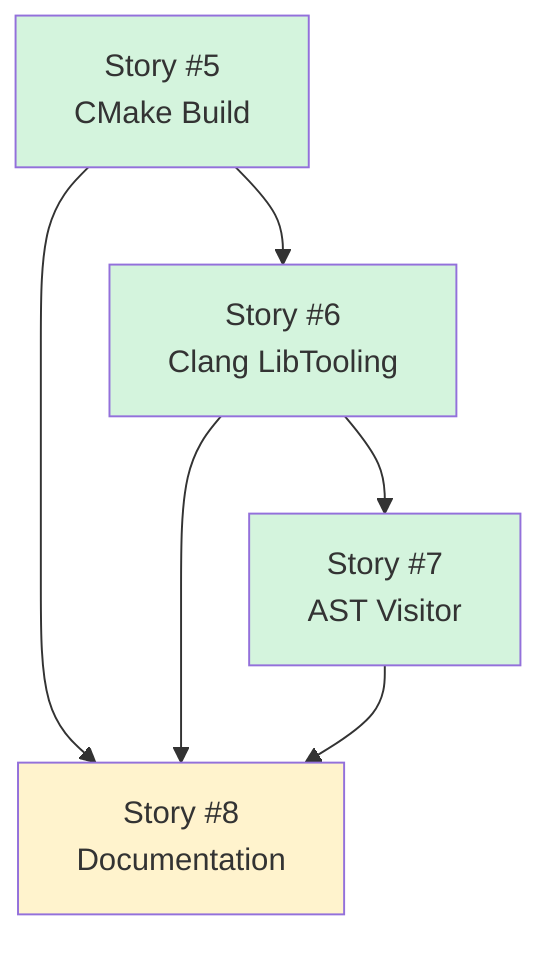
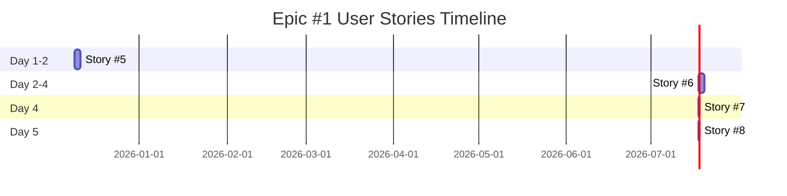

# User Stories Traceability Matrix - Epic #1

**Epic:** [#1 Infrastructure Setup & Clang Integration](https://github.com/o2alexanderfedin/cpp-to-c-transpiler/issues/1)
**Phase:** Phase 1 POC - Week 1
**Duration:** 4-5 days (with sequential dependencies)
**Total Story Points:** 15

## Overview

This document provides traceability from Epic #1 to its User Stories, showing how the Epic's acceptance criteria map to individual stories.

## User Stories Breakdown

### Story #5: CMake Build System Configuration

**GitHub Issue:** [#5](https://github.com/o2alexanderfedin/cpp-to-c-transpiler/issues/5)
**Title:** As a developer, I want CMake build system configured with Clang/LLVM so that I can compile the transpiler tool

**Priority:** High
**Effort:** M (1-2 days)
**Story Points:** 5
**Dependencies:** None

**Epic Acceptance Criteria Covered:**
- ✅ CMakeLists.txt with Clang/LLVM 15+ integration
- ✅ Successfully links against Clang libraries (clangTooling, clangAST, clangFrontend)
- ✅ Builds on macOS and Linux
- ✅ C++17 standard enabled

**Deliverables:**
- CMakeLists.txt in project root
- Executable target `cpptoc` that builds successfully
- Clang libraries linked (clangTooling, clangAST, clangFrontend, clangBasic)

**Testing:**
```bash
cmake -B build -DCMAKE_BUILD_TYPE=Debug
cmake --build build
ls -l build/cpptoc  # Should exist
```

---

### Story #6: Clang LibTooling Integration

**GitHub Issue:** [#6](https://github.com/o2alexanderfedin/cpp-to-c-transpiler/issues/6)
**Title:** As a developer, I want Clang LibTooling integrated so that I can parse C++ files and access their AST

**Priority:** High
**Effort:** M (1-2 days)
**Story Points:** 5
**Dependencies:** Story #5 (CMake build system)

**Epic Acceptance Criteria Covered:**
- ✅ FrontendAction that creates ASTConsumer
- ✅ ASTConsumer that creates RecursiveASTVisitor
- ✅ Tool can parse C++ file and access AST

**Deliverables:**
- `CppToCFrontendAction` class (inherits from `ASTFrontendAction`)
- `CppToCConsumer` class (inherits from `ASTConsumer`)
- `main.cpp` with ClangTool setup
- Tool parses C++ file and prints confirmation

**Testing:**
```bash
./build/cpptoc test.cpp --
# Output: Parsed file: test.cpp
#         Translation unit has N declarations
```

---

### Story #7: RecursiveASTVisitor Skeleton

**GitHub Issue:** [#7](https://github.com/o2alexanderfedin/cpp-to-c-transpiler/issues/7)
**Title:** As a developer, I want RecursiveASTVisitor skeleton created so that I can traverse C++ AST nodes

**Priority:** High
**Effort:** S (2-4 hours)
**Story Points:** 3
**Dependencies:** Story #6 (Clang LibTooling)

**Epic Acceptance Criteria Covered:**
- ✅ Visitor skeleton with empty Visit* methods
- ✅ Tool can parse C++ file and access AST
- ✅ Prints AST node count or basic info

**Deliverables:**
- `CppToCVisitor` class (inherits from `RecursiveASTVisitor<CppToCVisitor>`)
- `VisitCXXRecordDecl()` - handles class declarations
- `VisitCXXMethodDecl()` - handles member functions
- `VisitVarDecl()` - handles variables
- Visitor integrated into ASTConsumer

**Testing:**
```bash
# Test file with class
./build/cpptoc test.cpp --
# Output: Found class: Point
#         Found variable: x
#         Found method: Point::Point
```

---

### Story #8: Build Documentation

**GitHub Issue:** [#8](https://github.com/o2alexanderfedin/cpp-to-c-transpiler/issues/8)
**Title:** As a developer, I want build documentation in README so that others can compile the transpiler

**Priority:** Medium
**Effort:** XS (< 2 hours)
**Story Points:** 2
**Dependencies:** Stories #5, #6, #7 (validate instructions work)

**Epic Acceptance Criteria Covered:**
- ✅ README with build instructions
- ✅ Compiles without errors (documented in README)
- ✅ Can parse simple C++ file (usage example in README)

**Deliverables:**
- README.md with complete build instructions
- Prerequisites section (Clang/LLVM 15+, CMake 3.20+, C++17)
- Installation instructions (macOS and Linux)
- Build commands (configure + build)
- Usage examples
- Troubleshooting section

**Testing:**
- Follow README instructions on clean macOS machine
- Follow README instructions in Linux container
- Verify all commands work as documented

---

## Dependency Graph



**Legend:**
- Green: High priority (critical path)
- Yellow: Medium priority (documentation)

## Implementation Timeline



**Total Duration:** 4-5 days (sequential with some parallelization)

## Story Points Summary

| Story | Priority | Effort | Points | Duration |
|-------|----------|--------|--------|----------|
| #5 CMake | High | M | 5 | 1-2 days |
| #6 LibTooling | High | M | 5 | 1-2 days |
| #7 Visitor | High | S | 3 | 2-4 hours |
| #8 Documentation | Medium | XS | 2 | < 2 hours |
| **Total** | | | **15** | **4-5 days** |

**Velocity Estimate:** 15 story points / 1 week = baseline velocity for future sprints

## Epic Completion Criteria

Epic #1 is complete when:
- ✅ All 4 User Stories marked as Done
- ✅ All acceptance criteria met
- ✅ Tool compiles and runs on macOS and Linux
- ✅ Tool can parse simple C++ class and print AST info
- ✅ README documents complete build and usage process
- ✅ Code committed to `develop` branch

## Next Steps After Epic #1

Once Epic #1 is complete:
1. **Epic #2: CNodeBuilder Helper Library** (Week 2)
   - Break down into User Stories
   - Implement helper methods for C node creation
   - Write unit tests

2. **Sprint Planning**
   - Review velocity from Epic #1 (15 story points)
   - Plan Sprint 1 capacity
   - Select stories from Epic #2

## Traceability Matrix

| Epic Acceptance Criteria | Story | Status |
|--------------------------|-------|--------|
| CMakeLists.txt with Clang/LLVM 15+ | #5 | ⏳ Todo |
| Links against Clang libraries | #5 | ⏳ Todo |
| Builds on macOS and Linux | #5 | ⏳ Todo |
| C++17 standard enabled | #5 | ⏳ Todo |
| FrontendAction creates ASTConsumer | #6 | ⏳ Todo |
| ASTConsumer creates Visitor | #6 | ⏳ Todo |
| Visitor with Visit* methods | #7 | ⏳ Todo |
| Tool parses C++ file | #6, #7 | ⏳ Todo |
| Prints AST info | #7 | ⏳ Todo |
| README with build instructions | #8 | ⏳ Todo |

**Legend:** ⏳ Todo | 🔄 In Progress | ✅ Done

## References

**Epic Documentation:**
- [Epic #1](https://github.com/o2alexanderfedin/cpp-to-c-transpiler/issues/1) - Infrastructure Setup & Clang Integration
- [EPICS.md](EPICS.md) - Complete Epic traceability
- [ARCHITECTURE.md](docs/ARCHITECTURE.md) - Technical architecture

**GitHub Project:**
- [Project #14](https://github.com/users/o2alexanderfedin/projects/14) - C++ to C Transpiler

**External References:**
- [Clang LibTooling Tutorial](https://clang.llvm.org/docs/LibTooling.html)
- [RecursiveASTVisitor API](https://clang.llvm.org/doxygen/classclang_1_1RecursiveASTVisitor.html)
- [CMake find_package](https://cmake.org/cmake/help/latest/command/find_package.html)

---

**Created:** 2025-12-08
**Last Updated:** 2025-12-08
**Epic Status:** Ready for Implementation
**Next Epic:** #2 CNodeBuilder Helper Library (Week 2)

*This document will be updated as User Stories progress through implementation.*
