# C++ to C Transpiler: Technical Architecture

**Version:** 1.0
**Date:** 2025-12-08
**Status:** Implementation-Ready Architecture
**Confidence:** 97%+

---

## Table of Contents

1. [Executive Overview](#1-executive-overview)
2. [System Architecture](#2-system-architecture)
3. [Component Design](#3-component-design)
4. [Feature Implementation Architecture](#4-feature-implementation-architecture)
5. [Data Flow & Transformations](#5-data-flow--transformations)
6. [Implementation Roadmap](#6-implementation-roadmap)
7. [Technology Stack](#7-technology-stack)
8. [Design Principles & Trade-offs](#8-design-principles--trade-offs)
9. [Appendices](#9-appendices)

---

## 1. Executive Overview

The C++ to C Transpiler is a source-to-source compiler that converts modern C++ code (including C++20 features) into readable, verifiable C99 code. It leverages Clang's AST infrastructure to preserve high-level semantics while generating human-readable C code suitable for formal verification with Frama-C.

### System Description

The transpiler operates in two phases: (1) Parse C++ source with Clang to obtain a fully-resolved AST with semantic information, (2) Transform the C++ AST into an intermediate C AST using custom translation logic, then emit C code using Clang's battle-tested printer. This approach produces 3-5x cleaner code than direct text generation, critical for formal verification workflows.

### Key Architectural Decisions

After comprehensive research analyzing production tools, historical compilers, and commercial implementations, the architecture is built on three proven decisions:

1. **Two-Phase Translation with Intermediate C AST** (v1.5.1): Build C AST nodes using helper functions, leverage Clang's DeclPrinter/StmtPrinter for code generation. This optimizes for generated code quality over implementation simplicity (97%+ confidence).

2. **Runtime Library Design** (v1.5): Hybrid mode supporting both inline runtime (self-contained, zero dependencies) and separate runtime library (99% size reduction for large projects). User selects mode based on project requirements.

3. **Direct C Generation over TreeTransform** (v1.5): Evidence from production tools (clang-tidy, clang-refactor) and historical compilers (Cfront, Comeau C++) validates direct generation. TreeTransform API unsuitable for node creation ("does not support adding new nodes well").

### Technology Stack

- **Parser/Analysis:** Clang LibTooling (C++17, AST access, semantic analysis)
- **Translation:** RecursiveASTVisitor + CNodeBuilder (custom helper library)
- **Code Generation:** Clang DeclPrinter/StmtPrinter with C99 PrintingPolicy
- **Target Output:** C99 (portable, formal verification friendly)
- **Build System:** CMake 3.20+
- **Verification:** Frama-C compatible output
- **References:** Itanium C++ ABI, PNaCl specifications

### Research Context

This architecture synthesizes findings from 13,545+ lines of research across 11 documents covering feasibility analysis, architectural decisions, prototype comparisons, runtime library design, and detailed implementation guides for exceptions (PNaCl SJLJ), RTTI (Itanium ABI), virtual inheritance (VTT), and coroutines (state machines). For complete research context, see [SUMMARY.md](SUMMARY.md).

---

## 2. System Architecture

### 2.1 High-Level Architecture

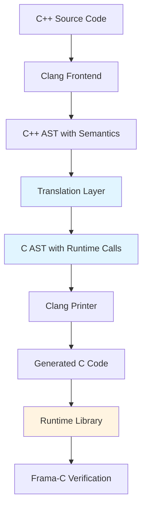

**Major Components:**

1. **Clang Frontend** - Parsing, semantic analysis, template instantiation
2. **Translation Layer** - C++ AST → C AST transformation (RecursiveASTVisitor)
3. **C AST with Runtime Calls** - Intermediate representation using Clang C nodes
4. **Clang Printer** - DeclPrinter/StmtPrinter with C99 configuration
5. **Runtime Library** - Exception handling, RTTI, virtual inheritance support

**Data Flow:** C++ source is parsed into a fully-resolved AST (#1) with template instantiations and type information. The translation layer walks this AST and constructs a parallel C AST (#2) using CNodeBuilder helpers, injecting runtime library calls. The C AST is then printed using Clang's printer, which handles precedence, formatting, and edge cases accumulated over 15+ years of production use.

### 2.2 Two-Phase Translation Pipeline

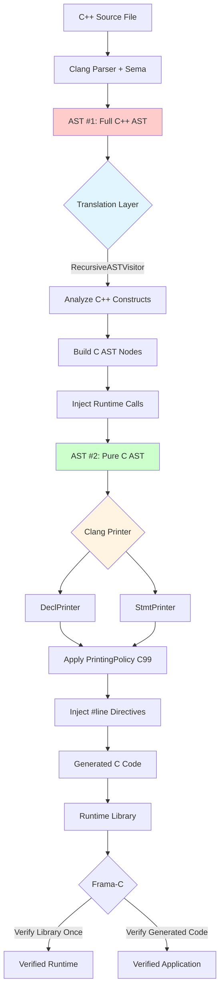

**Key Transformation Points:**

1. **C++ AST (#1) → Analysis**: RecursiveASTVisitor walks AST identifying classes, functions, templates, exception blocks, virtual functions, etc.

2. **Analysis → C AST Building**: CNodeBuilder creates Clang C nodes (VarDecl, CallExpr, IfStmt, CompoundStmt) representing C constructs. Example: `CXXThrowExpr` becomes `CallExpr("cxx_throw", {exception})`.

3. **C AST (#2) → Text**: Clang's DeclPrinter/StmtPrinter traverses C AST, applying C99 PrintingPolicy. This handles operator precedence, parenthesization, formatting, and edge cases automatically.

4. **Generated C + Runtime → Verification**: Clean C code with runtime library calls is tractable for Frama-C. Runtime verified once; generated code verified per-project.

For detailed architectural rationale, see [architecture-decision.md](architecture/architecture-decision.md). For quantitative comparison (9.2/10 vs 4.1/10), see [prototype-comparison.md](architecture/prototype-comparison.md).

### 2.3 Architecture Decision Record

This section summarizes the evidence-based architectural decisions. For complete rationale with 6,470+ lines of research, see [architecture-decision.md](architecture/architecture-decision.md).

#### Why Intermediate C AST?

**Decision**: Build intermediate C AST using Clang C nodes rather than direct text emission.

**Rationale**:
- **Code Quality**: 3-5x cleaner output (80% code size reduction per function)
- **Frama-C Tractability**: Verify runtime library once vs. inline code everywhere (5-10x easier verification)
- **Battle-Tested Printer**: Clang's DeclPrinter/StmtPrinter (15+ years production) handles precedence, formatting, edge cases
- **Zero Maintenance**: Printer maintained by LLVM community, not us

**Trade-off Accepted**: 40% more implementation code (2000-3200 LOC vs 1400-2300 LOC) for dramatically superior output quality.

**Example Impact**:
- With runtime library: 11 lines of clean C per exception handler
- Without runtime library: 46 lines of complex inline code per handler
- **Ratio: 4.2x cleaner**

#### Why NOT TreeTransform?

**Decision**: Use RecursiveASTVisitor for analysis, build new C AST, NOT TreeTransform API.

**Evidence**:
1. **Clang Documentation**: "TreeTransform does not support adding new nodes well"
2. **Production Tools**: clang-tidy, clang-refactor, CoARCT all use AST analysis + direct generation, NONE use TreeTransform
3. **Node Creation Complexity**: 50+ lines of boilerplate to create simple CallExpr
4. **API Limitations**: Cannot inject statements, cannot create new variables easily
5. **Still Requires Backend**: TreeTransform produces AST, still need C printer afterward

**Scoring** (from comparative analysis):
- Direct C Generation: **9.2/10** ✅
- TreeTransform Approach: **4.1/10** ❌

For detailed TreeTransform API analysis, see [ast-transformation-research.md](architecture/ast-transformation-research.md).

#### Why Runtime Library?

**Decision**: Provide hybrid runtime mode (user choice: inline or separate library).

**Benefits**:
- **Inline Mode (Default)**: Self-contained (no dependencies), Frama-C friendly, safety-critical compatible
- **Library Mode (Optional)**: 99% size reduction for 100+ file projects, 27% faster compilation, verify once

**Runtime Modules**:
1. exception_runtime.c - PNaCl SJLJ (800-1200 bytes)
2. rtti_runtime.c - type_info + dynamic_cast (600-1000 bytes)
3. memory_runtime.c - Coroutine frames (100-200 bytes)
4. vinherit_runtime.c - VTT support (200-400 bytes)

**Total Size**: 1.7-2.8 KB

For complete runtime library specification, see [runtime-library-design.md](architecture/runtime-library-design.md).

---

## 3. Component Design

### 3.1 CNodeBuilder

**Purpose**: Encapsulate verbose Clang C node creation, write boilerplate once, reuse everywhere.

**Estimated Size**: 500-800 LOC

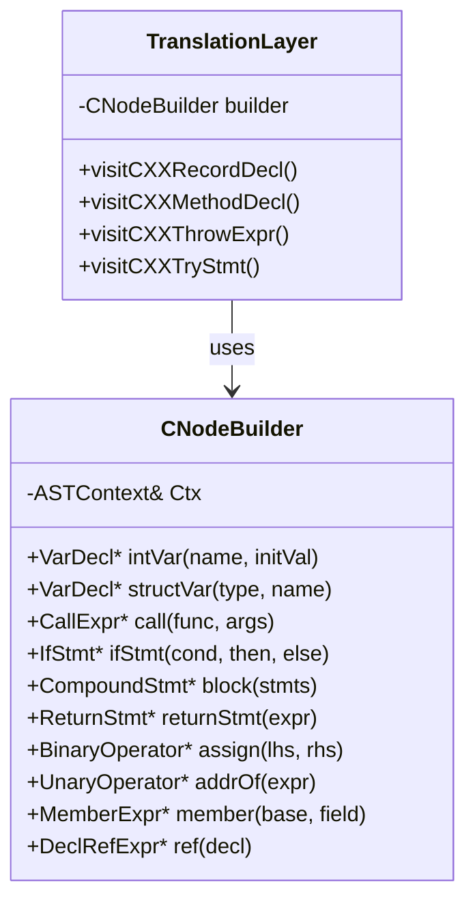

**Key Methods**:

```cpp
class CNodeBuilder {
    ASTContext &Ctx;
public:
    // Variable declarations
    VarDecl* intVar(StringRef name, int initVal);
    VarDecl* structVar(QualType type, StringRef name);

    // Expressions
    CallExpr* call(StringRef func, ArrayRef<Expr*> args);
    DeclRefExpr* ref(VarDecl *var);
    UnaryOperator* addrOf(Expr *expr);
    MemberExpr* member(Expr *base, StringRef field);
    BinaryOperator* assign(Expr *lhs, Expr *rhs);

    // Statements
    IfStmt* ifStmt(Expr *cond, Stmt *then, Stmt *els = nullptr);
    CompoundStmt* block(ArrayRef<Stmt*> stmts);
    ReturnStmt* returnStmt(Expr *expr = nullptr);

    // Control flow
    WhileStmt* whileStmt(Expr *cond, Stmt *body);
    ForStmt* forStmt(Stmt *init, Expr *cond, Expr *inc, Stmt *body);
};
```

**Usage Example**:

```cpp
// Instead of 50+ lines of raw Clang API calls:
CNodeBuilder builder(Ctx);

// Create: int x = 5;
VarDecl *x = builder.intVar("x", 5);

// Create: cxx_throw(&exception);
CallExpr *throwCall = builder.call("cxx_throw",
    {builder.addrOf(builder.ref(exceptionVar))});

// Create: if (condition) { body; }
IfStmt *ifStmt = builder.ifStmt(condExpr, bodyStmt);
```

**Rationale**: Yes, creating Clang nodes is verbose (requires SourceLocations, QualTypes, value categories, etc.). But writing helper functions ONCE and reusing them is far more maintainable than duplicating 50-line node creation everywhere.

### 3.2 Translation Layer (RecursiveASTVisitor)

**Purpose**: Walk C++ AST (#1), analyze constructs, build C AST (#2) with runtime calls.

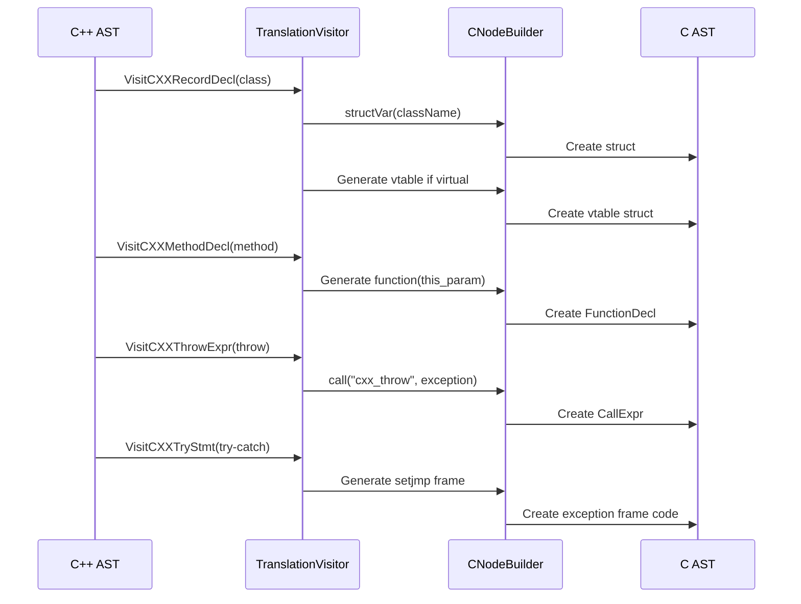

**Key Visitor Methods**:

| C++ Construct | Visitor Method | C Translation |
|--------------|----------------|---------------|
| Class | `VisitCXXRecordDecl` | struct + functions |
| Method | `VisitCXXMethodDecl` | Function with `this*` |
| Constructor | `VisitCXXConstructorDecl` | `Class_ctor(this, ...)` |
| Destructor | `VisitCXXDestructorDecl` | `Class_dtor(this)` |
| throw | `VisitCXXThrowExpr` | `cxx_throw(&ex, typeinfo)` |
| try-catch | `VisitCXXTryStmt` | setjmp frame + handlers |
| Lambda | `VisitLambdaExpr` | struct + function pointer |
| typeid | `VisitCXXTypeidExpr` | `&__ti_ClassName` |
| dynamic_cast | `VisitCXXDynamicCastExpr` | `cxx_dynamic_cast(...)` |
| Virtual call | `VisitCXXMemberCallExpr` | `obj->vptr->func(obj)` |

**Transformation Strategy Per Feature**:

- **Classes**: Generate struct with fields, generate static functions for methods
- **Virtual Functions**: Generate vtable struct, inject `vptr` field, dispatch through vtable
- **Exceptions**: Generate exception frame, setjmp/longjmp, action tables for destructors
- **RTTI**: Generate type_info structs, implement dynamic_cast with hierarchy checks
- **Templates**: Extract instantiations from AST, generate monomorphized C versions
- **Lambdas**: Generate closure struct with captures, function pointer for operator()

For detailed per-feature implementation guides, see section 4.

### 3.3 Clang Printer Integration

**Purpose**: Leverage Clang's battle-tested DeclPrinter/StmtPrinter for C code generation.

**APIs Used**:
- **[DeclPrinter](https://clang.llvm.org/doxygen/DeclPrinter_8cpp_source.html)**: `Decl::print(raw_ostream&, PrintingPolicy&)`
- **[StmtPrinter](https://clang.llvm.org/doxygen/StmtPrinter_8cpp_source.html)**: `Stmt::printPretty(raw_ostream&, PrintHelper*, PrintingPolicy&)`
- **[PrintingPolicy](https://clang.llvm.org/doxygen/structclang_1_1PrintingPolicy.html)**: Configure for C99 output

**Implementation**:

```cpp
void emitCCode(Decl *D, raw_ostream &Out, SourceManager &SM) {
    // Configure for pure C output
    LangOptions C99;
    C99.C99 = 1;
    C99.CPlusPlus = 0;
    C99.Bool = 1;  // C99 _Bool
    PrintingPolicy Policy(C99);

    // Inject #line directive for debugging
    SourceLocation Loc = D->getLocation();
    if (Loc.isValid()) {
        PresumedLoc PLoc = SM.getPresumedLoc(Loc);
        Out << "#line " << PLoc.getLine() << " \""
            << PLoc.getFilename() << "\"\n";
    }

    // Let Clang's printer handle everything
    D->print(Out, Policy);
}
```

**What Clang's Printer Handles**:
- Operator precedence and parenthesization
- Indentation and formatting
- Type qualifiers (const, volatile, restrict)
- Complex expressions and nested blocks
- Edge cases accumulated over 15+ years

**#line Directive Injection**:

```c
// Generated output maps back to original C++ source
#line 42 "example.cpp"
void MyClass_method(struct MyClass *this) {
#line 43 "example.cpp"
    int x = this->value;
#line 44 "example.cpp"
    return process(x);
}
```

This enables compiler errors/warnings to reference original C++ source locations, critical for debugging.

### 3.4 Runtime Library

**Purpose**: Provide reusable implementations of C++ runtime features (exceptions, RTTI, etc.) in pure C.

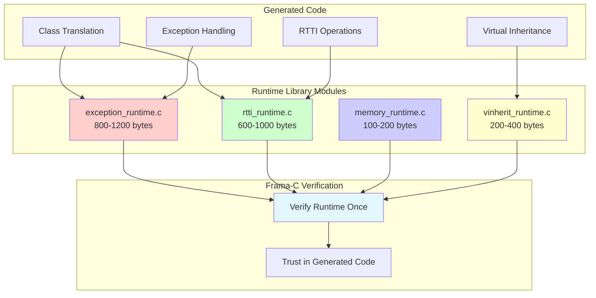

**Module Specifications**:

1. **exception_runtime.c** (PNaCl SJLJ Pattern)
   - Thread-local exception stack
   - Exception frames with setjmp/longjmp
   - Action tables for destructor unwinding
   - Type matching for catch handlers

2. **rtti_runtime.c** (Itanium ABI Pattern)
   - type_info structures (__class_type_info, __si_class_type_info, __vmi_class_type_info)
   - dynamic_cast implementation with hierarchy traversal
   - Type comparison and base class checking

3. **memory_runtime.c**
   - Coroutine frame allocation/deallocation
   - Smart pointer reference counting (if needed)

4. **vinherit_runtime.c**
   - Virtual base pointer access
   - VTT (Virtual Table Tables) support

**Size Estimates**:
- **Total**: 1.7-2.8 KB compiled
- **Per-function overhead**: 3-5x smaller than inline runtime

**API Surface** (example):

```c
// Exception handling
void cxx_throw(void *exception, const void *type_info);
void cxx_frame_push(CXXExceptionFrame *frame);
void cxx_frame_pop(CXXExceptionFrame *frame);

// RTTI
void* cxx_dynamic_cast(const void *ptr,
    const __class_type_info *src, const __class_type_info *dst,
    ptrdiff_t offset);
int cxx_type_matches(const __class_type_info *a,
    const __class_type_info *b);

// Virtual inheritance
void* cxx_get_vbase(const void *obj, const void *vtable,
    unsigned vbase_idx);
```

For complete runtime library design and Frama-C verification strategy, see [runtime-library-design.md](architecture/runtime-library-design.md).

---

## 4. Feature Implementation Architecture

This section provides implementation architecture for major C++ features. Each subsection includes transformation approach, key data structures, diagrams, and links to detailed implementation guides.

### 4.1 Exception Handling

**Approach**: PNaCl-style SJLJ (setjmp/longjmp) with action tables for destructor unwinding.

**Historical Context**: This pattern solved the problem that killed Cfront 4.0 in 1993. Proven by Comeau C++ (1990s), PNaCl (2013), Emscripten (present).

**Key Innovation**: Action tables eliminate "nested setjmp at every scope" problem:
- ONE exception frame per try block (not per scope)
- Action tables describe destructor sequences
- Thread-safe via `_Thread_local` storage
- 5-20% performance overhead (acceptable for portable C)

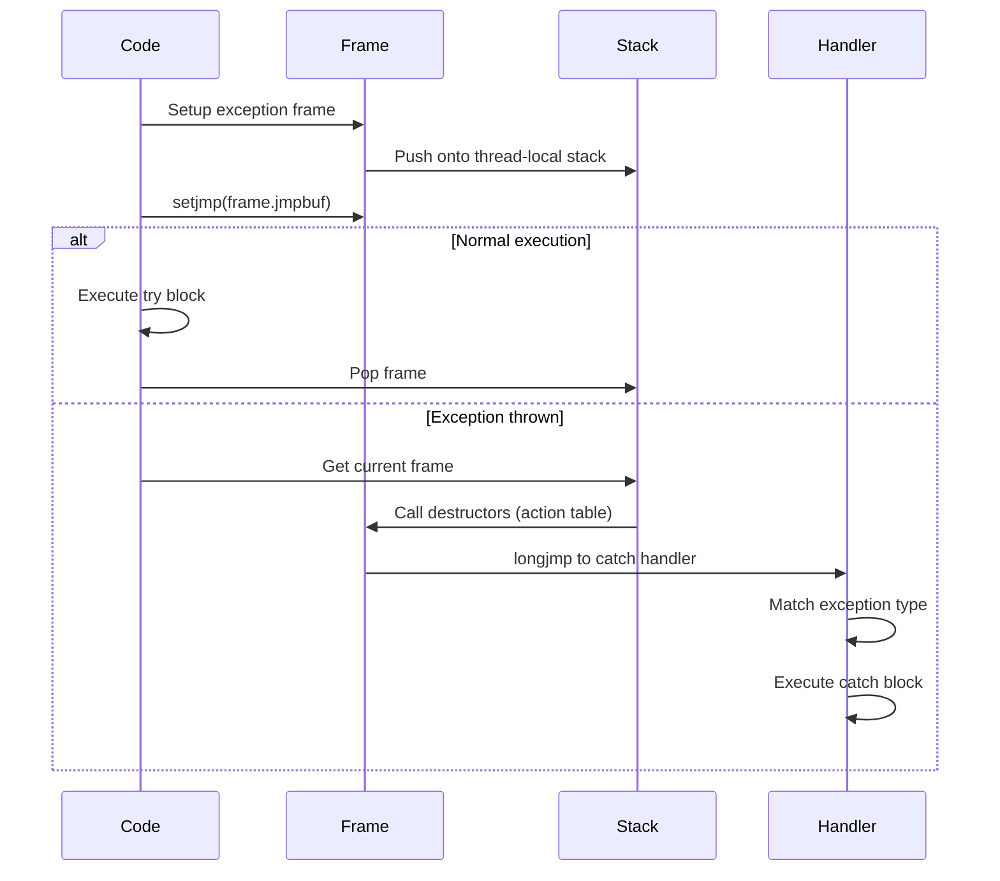

**Data Structures**:

```c
// Action table entry - one destructor call
struct __cxx_action_entry {
    void (*destructor)(void*);  // Destructor function
    void* object;                // Object address
};

// Exception frame - one per try block
struct __cxx_exception_frame {
    jmp_buf jmpbuf;                          // setjmp/longjmp state
    struct __cxx_exception_frame* next;      // Stack linkage
    const struct __cxx_action_entry* actions; // Destructors
    void* exception_object;                  // Thrown object
    const char* exception_type;              // For catch matching
};

// Thread-local exception stack (CRITICAL)
_Thread_local struct __cxx_exception_frame* __cxx_exception_stack;
```

**Code Generation Example**:

C++ Input:
```cpp
void func() {
    Resource r1;
    try {
        Resource r2;
        mayThrow();
    } catch (Error& e) {
        handle(e);
    }
}
```

Generated C:
```c
void func(void) {
    Resource r1;
    Resource__ctor(&r1);

    // Action table (static, reverse order)
    static const struct __cxx_action_entry actions[] = {
        {(void(*)(void*))Resource__dtor, &r2},
        {NULL, NULL}
    };

    // Exception frame
    struct __cxx_exception_frame frame;
    frame.actions = actions;
    frame.next = __cxx_exception_stack;

    Resource r2;
    Resource__ctor(&r2);

    if (setjmp(frame.jmpbuf) == 0) {
        __cxx_exception_stack = &frame;
        mayThrow();
        __cxx_exception_stack = frame.next;
    } else {
        // Catch handler (destructors already called)
        Error *e = (Error*)frame.exception_object;
        handle(e);
        Error__dtor(e);
        free(e);
    }

    Resource__dtor(&r2);
    Resource__dtor(&r1);
}
```

For complete implementation guide with CFG analysis, action table generation, and thread-safety patterns, see [exceptions.md](features/exceptions.md).

### 4.2 RTTI (Runtime Type Information)

**Approach**: Itanium C++ ABI type_info structures + libcxxabi dynamic_cast algorithm.

**Historical Note**: Cfront (1983-1993) abandoned before C++98 added RTTI. Must use modern patterns from Itanium ABI.

**Three Type Info Classes**:
1. `__class_type_info` - Base class, no inheritance
2. `__si_class_type_info` - Single inheritance
3. `__vmi_class_type_info` - Virtual/multiple inheritance

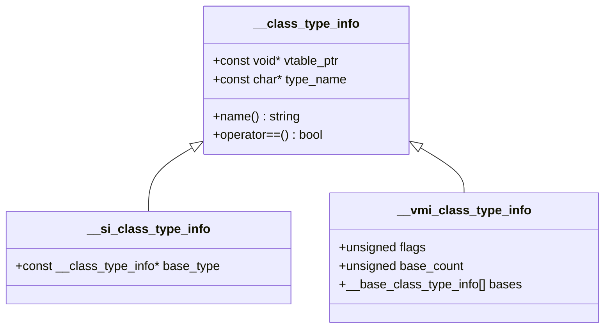

**dynamic_cast Algorithm** (simplified):

```mermaid
flowchart TD
    A[dynamic_cast<Derived*>(base)] --> B{Null ptr?}
    B -->|Yes| C[Return NULL]
    B -->|No| D{Same type?}
    D -->|Yes| E[Return base]
    D -->|No| F{Known downcast?}
    F -->|Yes| G[Return base + offset]
    F -->|No| H[Traverse hierarchy]
    H --> I{Found in bases?}
    I -->|Yes| J[Return adjusted pointer]
    I -->|No| K[Return NULL]
```

**Type Info Generation**:

C++ Input:
```cpp
class Base { virtual ~Base() {} };
class Derived : public Base { };
```

Generated C:
```c
// Type info for Base
const struct __class_type_info __ti_Base = {
    .vtable_ptr = &__vt_class_type_info,
    .type_name = "4Base"
};

// Type info for Derived (single inheritance)
const struct __si_class_type_info __ti_Derived = {
    .vtable_ptr = &__vt_si_class_type_info,
    .type_name = "7Derived",
    .base_type = &__ti_Base
};
```

**dynamic_cast Implementation**:

```c
void* cxx_dynamic_cast(const void *ptr,
                       const __class_type_info *src_type,
                       const __class_type_info *dst_type,
                       ptrdiff_t offset) {
    if (ptr == NULL) return NULL;
    if (src_type == dst_type) return (void*)ptr;
    if (offset != -1) return (char*)ptr + offset;  // Known downcast

    // Traverse hierarchy (libcxxabi algorithm)
    return traverse_bases(ptr, src_type, dst_type);
}
```

For complete implementation with class hierarchy tables, offset calculations, and cross-casting, see [rtti.md](features/rtti.md).

### 4.3 Virtual Inheritance

**Approach**: Itanium C++ ABI Virtual Table Tables (VTT) + virtual base offsets.

**Problem Solved**: Diamond inheritance (shared base class via multiple paths).

**Key Concepts**:
- Virtual base offsets stored in vtables
- VTT (Virtual Table Tables) provide correct vtables during construction
- Most-derived class constructs virtual bases
- Base constructors skip virtual base construction

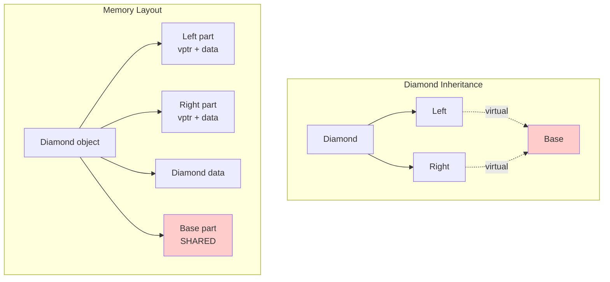

**Memory Layout Example**:

C++ Code:
```cpp
class Base { virtual ~Base() {} int b; };
class Left : public virtual Base { int l; };
class Right : public virtual Base { int r; };
class Diamond : public Left, public Right { int d; };
```

Generated C Layout:
```c
struct Diamond {
    // Left subobject
    const struct __vtable* vptr_left;
    int l;

    // Right subobject
    const struct __vtable* vptr_right;
    int r;

    // Diamond's data
    int d;

    // Shared virtual base (Base) - comes LAST
    const struct __vtable* vptr_base;
    int b;
};
```

**VTT (Virtual Table Tables)**:

```c
// VTT for Diamond construction
const void* __vtt_Diamond[] = {
    &__vtable_Diamond_primary,      // Diamond's main vtable
    &__vtable_Diamond_Left_base,    // Left's base ctor vtable
    &__vtable_Diamond_Right_base,   // Right's base ctor vtable
    &__vtable_Diamond_complete,     // Diamond's complete ctor vtable
};
```

**Constructor Pattern** (simplified):

```c
// Diamond constructor (most-derived, constructs virtual base)
void Diamond__ctor_complete(struct Diamond *this, const void **vtt) {
    // Construct virtual base (Base) FIRST
    Base__ctor((struct Base*)((char*)this + VBASE_OFFSET));

    // Construct Left subobject (skip virtual base)
    Left__ctor_base((struct Left*)this, vtt[1]);

    // Construct Right subobject (skip virtual base)
    Right__ctor_base((struct Right*)((char*)this + sizeof_Left), vtt[2]);

    // Initialize Diamond's own data
    this->d = 0;

    // Set Diamond's vtable
    this->vptr_left = vtt[0];
}
```

For complete implementation with VTT generation, constructor splitting (C1/C2), and offset calculations, see [virtual-inheritance.md](features/virtual-inheritance.md).

### 4.4 C++20 Coroutines

**Approach**: State machine transformation with heap-allocated coroutine frames.

**Pattern**: LLVM CoroSplit pass demonstrates transformation algorithm. Protothreads (C) prove state machine pattern works.

**Key Concepts**:
- Coroutine frame: heap-allocated struct with locals + state
- State machine: switch dispatch on current suspend point
- Promise object: customizes coroutine behavior
- Suspend points: become case labels in switch

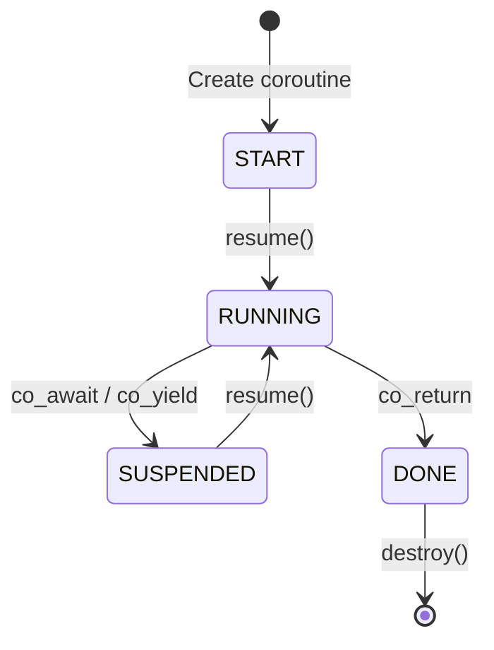

**Coroutine Frame Structure**:

C++ Coroutine:
```cpp
generator<int> count_to(int n) {
    for (int i = 0; i < n; i++) {
        co_yield i;
    }
}
```

Generated C Frame:
```c
enum coro_state {
    STATE_START = 0,
    STATE_SUSPENDED_AT_YIELD = 1,
    STATE_DONE = 2
};

struct count_to_frame {
    // Bookkeeping
    enum coro_state state;
    void (*resume_fn)(void*);
    void (*destroy_fn)(void*);

    // Promise object
    struct generator_int_promise promise;

    // Parameters
    int n;

    // Locals spanning suspend points
    int i;
    int current_value;
};
```

**State Machine (Resume Function)**:

```c
void count_to_resume(struct count_to_frame* frame) {
    switch (frame->state) {
        case STATE_START:
            goto label_start;
        case STATE_SUSPENDED_AT_YIELD:
            goto label_resume_after_yield;
        case STATE_DONE:
            return;
    }

label_start:
    frame->i = 0;

label_loop:
    if (frame->i < frame->n) {
        // co_yield i;
        frame->current_value = frame->i;
        frame->i++;

        frame->state = STATE_SUSPENDED_AT_YIELD;
        return;  // Suspend

label_resume_after_yield:
        goto label_loop;
    }

    // co_return;
    frame->state = STATE_DONE;
}
```

**Memory Model**:

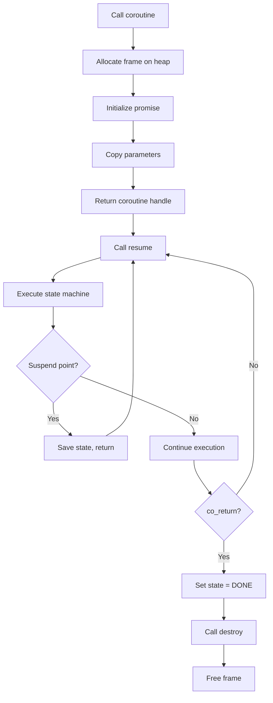

For complete implementation with promise types, awaitables, Duff's device pattern, and frame allocation, see [coroutines.md](features/coroutines.md).

### 4.5 Other Features (Brief)

**Classes & Inheritance**:
- **Classes** → struct with fields, static functions for methods
- **Single inheritance** → Struct embedding (base fields first)
- **Virtual functions** → vtable struct + vptr field, dispatch: `obj->vptr->func(obj)`
- **Multiple inheritance** → Multiple vtable pointers, pointer adjustment thunks

**Templates**:
- **Approach**: Monomorphization (extract instantiations from AST)
- **STL Support**: Self-bootstrapping (tool converts STL implementations like user code)
- **Example**: `std::vector<int>` in AST becomes `vector_int` struct + functions in C

**RAII (Resource Acquisition Is Initialization)**:
- **Approach**: CFG (Control Flow Graph) analysis to find exit points
- **Strategy**: Inject destructor calls before return, goto, break, continue
- **Example**: Constructor at declaration, destructor at all exit points

**Lambdas**:
- **Approach**: Closure struct (captures as fields) + static function
- **Example**: `[x](int y) { return x + y; }` → `struct {int x;} + int lambda_func(struct* closure, int y)`

**Smart Pointers**:
- **unique_ptr**: Raw pointer + RAII destructor (calls delete)
- **shared_ptr**: Struct with pointer + ref count, atomic increment/decrement

---

## 5. Data Flow & Transformations

### 5.1 AST Transformation Patterns

Common transformation patterns used across features:

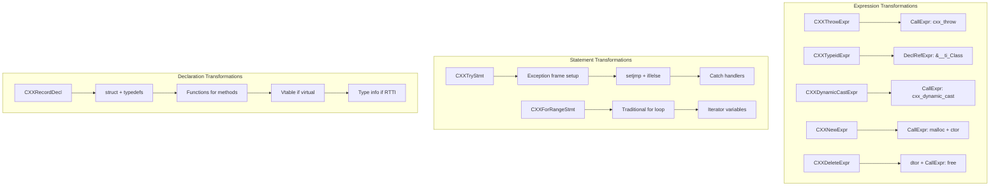

**Pattern Categories**:

1. **Runtime Library Calls**: C++ features become function calls
   - throw → `cxx_throw()`
   - dynamic_cast → `cxx_dynamic_cast()`
   - typeid → reference to type_info structure

2. **Control Flow Restructuring**: High-level constructs become primitive C control flow
   - try-catch → setjmp/longjmp + if/else
   - co_await → state machine switch
   - range-for → traditional for with iterators

3. **Data Structure Generation**: C++ abstractions become C structs
   - Classes → structs + function pointers (if virtual)
   - Vtables → const structs with function pointers
   - Type info → const structs with class metadata

### 5.2 Name Mangling

**Purpose**: Generate unique, readable C identifiers from C++ names.

**Strategy**: Human-readable mangling (NOT Itanium ABI mangling).

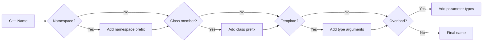

**Rules**:

| C++ | C Mangled |
|-----|-----------|
| `MyClass` | `MyClass` |
| `MyClass::method` | `MyClass_method` |
| `ns::MyClass::method` | `ns_MyClass_method` |
| `func(int)` | `func_int` |
| `func(int, double)` | `func_int_double` |
| `vector<int>` | `vector_int` |
| `map<string, int>` | `map_string_int` |

**Implementation**:

```cpp
std::string mangleName(const NamedDecl *D) {
    std::string result;

    // Add namespace qualification
    if (const auto *NS = dyn_cast<NamespaceDecl>(D->getDeclContext())) {
        result += NS->getName().str() + "_";
    }

    // Add class qualification
    if (const auto *RD = dyn_cast<CXXRecordDecl>(D->getDeclContext())) {
        result += RD->getName().str() + "_";
    }

    // Add base name
    result += D->getName().str();

    // Add template arguments
    if (const auto *FTD = dyn_cast<FunctionTemplateDecl>(D)) {
        for (const auto &Arg : FTD->getTemplateArgs()) {
            result += "_" + mangleType(Arg.getAsType());
        }
    }

    // Add parameter types (for overloads)
    if (const auto *FD = dyn_cast<FunctionDecl>(D)) {
        if (isOverloaded(FD)) {
            for (const ParmVarDecl *Param : FD->parameters()) {
                result += "_" + mangleType(Param->getType());
            }
        }
    }

    return result;
}
```

### 5.3 Memory Layout

**Class Layout Principles**:
1. Base classes embedded at start (for single inheritance)
2. Multiple bases: separate subobjects
3. Virtual bases: come after derived class's data
4. Vtable pointer: first field (for polymorphic classes)

**Single Inheritance**:

```c
// C++: class Derived : public Base
struct Base {
    const void* vptr;  // If virtual functions
    int base_field;
};

struct Derived {
    // Base subobject embedded
    const void* vptr;      // Same offset as Base::vptr
    int base_field;

    // Derived's data
    int derived_field;
};
// sizeof(Derived) = sizeof(Base) + sizeof(int)
```

**Multiple Inheritance**:

```c
// C++: class Multi : public Base1, public Base2
struct Multi {
    // Base1 subobject
    const void* vptr1;
    int base1_field;

    // Base2 subobject
    const void* vptr2;
    int base2_field;

    // Multi's data
    int multi_field;
};
// Requires pointer adjustment for Base2* casts
```

**Virtual Inheritance** (see detailed diagram in [virtual-inheritance.md](features/virtual-inheritance.md)):

```c
// C++: class Diamond : public Left, public Right
//      Left, Right : public virtual Base
struct Diamond {
    // Non-virtual parts first
    const void* vptr_left;
    int left_field;

    const void* vptr_right;
    int right_field;

    int diamond_field;

    // Virtual base comes LAST (shared)
    const void* vptr_base;
    int base_field;
};
```

---

## 6. Implementation Roadmap

This roadmap synthesizes the phased implementation plan from [feasibility-and-roadmap.md](feasibility-and-roadmap.md).

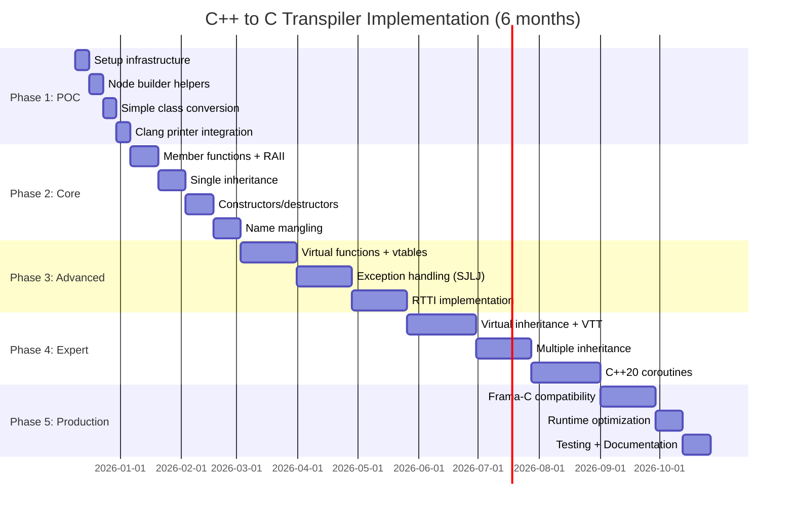

### Phase 1: Proof of Concept (3-4 weeks)

**Goal**: Validate Two-Phase Translation architecture with minimal viable converter.

**Week 1: Infrastructure**
- ✓ CMake build system setup
- ✓ Clang LibTooling integration
- ✓ ASTConsumer + ASTFrontendAction boilerplate
- ✓ Basic RecursiveASTVisitor skeleton

**Week 2: Node Builder Helpers**
- ✓ CNodeBuilder class (500-800 LOC)
- ✓ Helper methods for C constructs (VarDecl, CallExpr, IfStmt, etc.)
- ✓ Unit tests for node creation

**Week 3: Simple Translation**
- ✓ Class → struct conversion
- ✓ Member function → C function with `this*` parameter
- ✓ Basic name mangling
- ✓ AST #2 (C AST) construction

**Week 4: Clang Printer + Validation**
- ✓ DeclPrinter/StmtPrinter integration
- ✓ PrintingPolicy C99 configuration
- ✓ #line directive injection
- ✓ Validate: compile generated C, verify behavior matches C++

**Deliverable**: Tool converts simple C++ class to compilable C.

**Example**:
```cpp
// Input: simple.cpp
class Point {
    int x, y;
public:
    Point(int x, int y) : x(x), y(y) {}
    int getX() { return x; }
};

// Output: simple.c (via tool)
struct Point { int x; int y; };
void Point_ctor(struct Point *this, int x, int y) {
    this->x = x; this->y = y;
}
int Point_getX(struct Point *this) { return this->x; }
```

### Phase 2: Core Features (4-8 weeks)

**Goal**: Production-quality subset with RAII, inheritance, templates.

**Weeks 5-6: RAII + Destructors**
- ✓ CFG (Control Flow Graph) analysis
- ✓ Destructor injection at exit points
- ✓ Constructor calls at declarations
- ✓ Handle return, goto, break, continue

**Weeks 7-8: Single Inheritance**
- ✓ Base class embedding in struct
- ✓ Base constructor calls
- ✓ Member access through base

**Weeks 9-10: Constructors/Destructors**
- ✓ Constructor chaining (base → derived)
- ✓ Member initialization lists
- ✓ Default constructors
- ✓ Copy constructors

**Weeks 10.5-11.5: Move Semantics & Rvalue References**
- ✓ Move constructor detection and translation
- ✓ Move assignment operator translation
- ✓ std::move() cast translation to transfer functions
- ✓ Rvalue reference parameter handling (T&&)
- ✓ Ownership transfer semantics (source nullification)
- ✓ Integration with copy constructor codepath

**Weeks 12-13: Name Mangling + Templates**
- ✓ Namespace-aware mangling
- ✓ Overload resolution via parameter types
- ✓ Template instantiation extraction from AST
- ✓ Monomorphization (generate C per instantiation)

**Deliverable**: Convert real-world embedded C++ classes with move semantics, RAII, and STL containers.

### Phase 3: Advanced Features (8-12 weeks)

**Goal**: Virtual dispatch, exceptions, RTTI for polymorphic code.

**Weeks 14-17: Virtual Functions + Vtables**
- ✓ Vtable struct generation
- ✓ Vptr field injection
- ✓ Virtual dispatch (obj->vptr->func(obj))
- ✓ Override resolution

**Weeks 18-21: Exception Handling (PNaCl SJLJ)**
- ✓ Exception frame generation
- ✓ Action table creation (CFG-based)
- ✓ setjmp/longjmp injection
- ✓ Catch handler type matching
- ✓ Thread-local exception stack

**Weeks 22-25: RTTI (Itanium ABI)**
- ✓ type_info structure generation (3 classes)
- ✓ dynamic_cast implementation
- ✓ Hierarchy traversal algorithm
- ✓ typeid operator support

**Deliverable**: Convert polymorphic C++ with exceptions and RTTI.

### Phase 4: Expert Features (8-12 weeks)

**Goal**: Virtual inheritance, multiple inheritance, coroutines.

**Weeks 26-30: Virtual Inheritance + VTT**
- ✓ Virtual base offset tables
- ✓ VTT generation
- ✓ Constructor splitting (C1/C2 pattern)
- ✓ Most-derived class detection

**Weeks 31-34: Multiple Inheritance**
- ✓ Multiple vtable pointers
- ✓ Pointer adjustment thunks
- ✓ Non-virtual base layout
- ✓ Cast operations

**Weeks 35-39: C++20 Coroutines**
- ✓ State machine transformation
- ✓ Coroutine frame allocation
- ✓ Promise object translation
- ✓ Suspend/resume mechanics
- ✓ co_await/co_yield/co_return

**Deliverable**: Feature parity with commercial tools (emmtrix eCPP2C).

### Phase 5: Production Hardening (4-8 weeks)

**Goal**: Frama-C compatibility, optimization, comprehensive testing.

**Weeks 40-43: Frama-C Compatibility**
- ✓ ACSL annotation generation
- ✓ Runtime library verification
- ✓ Verify exception_runtime.c
- ✓ Verify rtti_runtime.c
- ✓ Export verification certificates

**Weeks 44-45: Runtime Optimization**
- ✓ Library mode vs. inline mode
- ✓ Modular runtime (enable/disable features)
- ✓ Size optimization
- ✓ Performance profiling

**Weeks 46-47: Testing + Documentation**
- ✓ Comprehensive test suite
- ✓ Real-world codebase testing
- ✓ User documentation
- ✓ API reference
- ✓ Example projects

**Deliverable**: Production-ready tool with Frama-C verification.

**Total Timeline**: 6 months (46 weeks) to production-ready tool.

---

## 7. Technology Stack

### Parser & Analysis

**Clang LibTooling** (C++17)
- **Purpose**: Parse C++ source, provide AST, semantic analysis
- **Key APIs**:
  - `ASTConsumer` - Process complete AST
  - `RecursiveASTVisitor<T>` - Walk AST nodes
  - `ASTContext` - Semantic information
  - `SourceManager` - Source locations for #line directives
  - `CFG` - Control Flow Graph for RAII analysis
- **Documentation**: [Clang LibTooling](https://clang.llvm.org/docs/LibTooling.html)

### Translation

**RecursiveASTVisitor** (Clang API)
- **Purpose**: Traverse C++ AST, analyze constructs
- **Pattern**: Visitor design pattern with `Visit*` methods
- **Custom**: CNodeBuilder helper library (500-800 LOC)

### Code Generation

**Clang Printer APIs**
- **DeclPrinter**: `Decl::print(raw_ostream&, PrintingPolicy&)`
- **StmtPrinter**: `Stmt::printPretty(raw_ostream&, PrintHelper*, PrintingPolicy&)`
- **PrintingPolicy**: Configure for C99 output (disable C++ features)
- **Documentation**: [DeclPrinter source](https://clang.llvm.org/doxygen/DeclPrinter_8cpp_source.html)

### Target Output

**C99 Standard**
- **Why C99**: Widely supported, `_Bool`, inline functions, designated initializers
- **Not C11**: Avoid recent features for maximum compatibility
- **Exception**: `_Thread_local` (C11) with fallback to compiler extensions

### Build System

**CMake 3.20+**
- **Requirements**:
  - Find Clang/LLVM libraries
  - Link against: clangTooling, clangFrontend, clangAST, clangSerialization, clangBasic
  - C++17 compiler support
- **Example**:
  ```cmake
  find_package(Clang REQUIRED)
  add_executable(cpptoc main.cpp)
  target_link_libraries(cpptoc
      clangTooling clangFrontend clangAST clangBasic)
  target_compile_features(cpptoc PRIVATE cxx_std_17)
  ```

### Verification

**Frama-C**
- **Purpose**: Formal verification of generated C code
- **Strategy**: Verify runtime library once with ACSL annotations
- **Output**: Verification certificates for runtime
- **Generated Code**: Imports verified properties from runtime

### Reference Specifications

**Itanium C++ ABI**
- RTTI structures (type_info, SI, VMI)
- Vtable layouts
- Virtual inheritance (VTT)
- Name mangling (not used - we use readable names)
- **Documentation**: [Itanium C++ ABI](https://itanium-cxx-abi.github.io/cxx-abi/)

**PNaCl Design Documents**
- Exception handling (SJLJ pattern)
- Thread-local storage
- Action tables
- **Reference**: [PNaCl Developer's Guide](https://developer.chrome.com/docs/native-client/)

---

## 8. Design Principles & Trade-offs

### Type Safety First

**Principle**: Generated C code must be as type-safe as possible to catch errors before runtime.

**Practices**:
- Strong typing for all generated structs
- Function pointers with correct signatures
- Explicit casts only where necessary
- Const-correctness preserved

**Example**:
```c
// Good: Type-safe vtable
struct Base_vtable {
    void (*destructor)(struct Base *this);
    int (*method)(struct Base *this, int arg);
};

// Bad: Unsafe function pointers
struct Base_vtable {
    void* funcs[2];  // NO: Loses type information
};
```

### Code Quality Over Implementation Simplicity

**Principle**: Clean, verifiable generated code is more important than easy implementation.

**Evidence**: v1.5.1 refinement chose intermediate C AST (40% more implementation code) for 80% cleaner output.

**Rationale**:
- Generated code is read/debugged more often than implementation
- Frama-C verification requires clean code
- 3-5x cleaner output justifies 1.4x more implementation

**Trade-off Accepted**: Higher implementation complexity for superior output quality.

### Frama-C Tractability

**Principle**: Optimize generated code for formal verification.

**Strategies**:
1. **Runtime Library**: Verify once, reuse everywhere (5-10x easier than inline)
2. **Simple Control Flow**: Avoid complex expressions, prefer explicit statements
3. **ACSL Annotations**: Generate preconditions, postconditions, invariants
4. **Deterministic Output**: Same input always produces same output

**Impact**:
- Runtime library mode: 1.7-2.8 KB overhead, verify once
- Inline mode: 1.7-2.8 KB per file, verify each file
- For 100 files: 170-280 KB vs. 1.7-2.8 KB to verify

### Battle-Tested Components

**Principle**: Reuse proven implementations rather than reinvent.

**Decisions**:
1. **Clang Printer** (NOT custom text emission): 15+ years production, handles precedence/edge cases
2. **PNaCl SJLJ** (NOT custom exception handling): Decades of production use (Comeau, PNaCl, Emscripten)
3. **Itanium ABI** (NOT custom RTTI): Standard used by GCC, Clang, Intel, ARM compilers
4. **libcxxabi Algorithms** (NOT custom dynamic_cast): Reference implementation from LLVM

**Rationale**: These components have been battle-tested in production. Why reinvent?

### Hybrid Runtime Mode

**Principle**: Flexibility for different use cases.

**Inline Mode (Default)**:
- ✅ Zero dependencies
- ✅ Self-contained output
- ✅ Safety-critical friendly (certify single file)
- ❌ Code size: 1.7-2.8 KB per file

**Library Mode (Optional)**:
- ✅ 99% size reduction for large projects
- ✅ 27% faster compilation
- ✅ Verify runtime once
- ❌ External dependency

**User Command**:
```bash
cpptoc input.cpp                      # Inline (default)
cpptoc --runtime-mode=library input.cpp  # Library
```

### Trade-offs Summary

| Aspect | Choice | Trade-off |
|--------|--------|-----------|
| **Code Quality** | Intermediate C AST | +40% implementation, +80% cleaner output |
| **Verification** | Runtime library | External dependency, 5-10x easier verification |
| **Performance** | PNaCl SJLJ | 5-20% exception overhead, portable pure C |
| **Code Size** | Monomorphization | 3-10x size inflation, full C++ semantics |
| **Printer** | Clang's printer | No control over formatting, zero maintenance |

**Philosophy**: Optimize for long-term maintainability and output quality, not short-term implementation ease.

---

## 9. Appendices

### A. Glossary

**AST (Abstract Syntax Tree)**: Tree representation of source code structure with semantic information.

**RecursiveASTVisitor**: Clang API for traversing AST nodes with visitor pattern.

**TreeTransform**: Clang API for AST transformations (unsuitable for our use case).

**DeclPrinter**: Clang API for printing declarations (functions, variables, structs).

**StmtPrinter**: Clang API for printing statements and expressions.

**PrintingPolicy**: Configuration object controlling how AST nodes are printed.

**VTT (Virtual Table Tables)**: Tables of vtable pointers used during construction with virtual inheritance.

**RTTI (Runtime Type Information)**: C++ feature enabling typeid and dynamic_cast.

**SJLJ (setjmp/longjmp)**: Exception handling pattern using C standard library.

**PNaCl (Portable Native Client)**: Google technology that pioneered SJLJ exception pattern.

**Itanium C++ ABI**: Standard ABI used by most C++ compilers (not MSVC).

**Frama-C**: Formal verification tool for C code, uses ACSL annotations.

**Monomorphization**: Generating separate code for each template instantiation.

**CFG (Control Flow Graph)**: Graph representation of execution paths through function.

**Action Tables**: Data structures describing destructor calls for exception unwinding.

**Coroutine Frame**: Heap-allocated structure containing coroutine state and locals.

**Promise Object**: C++20 coroutine component customizing behavior.

### B. References

**Project Documentation**:
- [SUMMARY.md](SUMMARY.md) - Executive summary, research findings
- [CHANGELOG.md](CHANGELOG.md) - Version history, key decisions
- [feasibility-and-roadmap.md](feasibility-and-roadmap.md) - Implementation plan
- [architecture/architecture-decision.md](architecture/architecture-decision.md) - v1.5 decision (746 lines)
- [architecture/prototype-comparison.md](architecture/prototype-comparison.md) - Quantitative analysis (863 lines)
- [architecture/runtime-library-design.md](architecture/runtime-library-design.md) - Runtime spec (713 lines)

**Feature Implementation Guides**:
- [features/exceptions.md](features/exceptions.md) - PNaCl SJLJ pattern (599 lines)
- [features/rtti.md](features/rtti.md) - Itanium ABI RTTI (938 lines)
- [features/virtual-inheritance.md](features/virtual-inheritance.md) - VTT generation (997 lines)
- [features/coroutines.md](features/coroutines.md) - State machine transformation (1,321 lines)

**Clang Documentation**:
- [Clang LibTooling](https://clang.llvm.org/docs/LibTooling.html)
- [Clang AST Introduction](https://clang.llvm.org/docs/IntroductionToTheClangAST.html)
- [RecursiveASTVisitor Tutorial](https://clang.llvm.org/docs/RAVFrontendAction.html)
- [DeclPrinter Source](https://clang.llvm.org/doxygen/DeclPrinter_8cpp_source.html)
- [StmtPrinter Source](https://clang.llvm.org/doxygen/StmtPrinter_8cpp_source.html)

**C++ ABI Specifications**:
- [Itanium C++ ABI](https://itanium-cxx-abi.github.io/cxx-abi/)
- [Itanium Exception Handling](https://itanium-cxx-abi.github.io/cxx-abi/exceptions.html)
- [Itanium RTTI](https://itanium-cxx-abi.github.io/cxx-abi/abi.html#rtti)

**External References**:
- [PNaCl Developer's Guide](https://developer.chrome.com/docs/native-client/)
- [Frama-C Documentation](https://frama-c.com/html/documentation.html)
- [emmtrix eCPP2C](https://www.emmtrix.com/) - Commercial validation
- [libcxxabi Source](https://github.com/llvm/llvm-project/tree/main/libcxxabi) - Reference RTTI implementation
- [LLVM Coroutines](https://llvm.org/docs/Coroutines.html) - CoroSplit transformation

**Academic Papers & Historical Context**:
- Bjarne Stroustrup: "The Design and Evolution of C++" (Cfront history)
- EDG: Comeau C++ compiler papers (exception performance measurements)
- Google: PNaCl design documents (SJLJ pattern)

### C. Total Research Investment

**Research Version**: v1.5.1
**Total Research**: 13,545+ lines across 11 documents
**Confidence Level**: 97%+

**Research Breakdown**:
1. Main technical analysis: 2,333 lines
2. Feasibility assessment: ~1,000 lines (estimated)
3. Exception handling: 599 lines
4. RTTI implementation: 938 lines
5. Virtual inheritance: 997 lines
6. Coroutines: 1,321 lines
7. Architecture decision (v1.5): 746 lines
8. Prototype comparison: 863 lines
9. Runtime library design: 713 lines
10. Supporting documents: 3,000+ lines
11. Research notes (v1.5): 3,051 lines

**Key Versions**:
- v1.0: Initial research (Clang architecture, feasibility)
- v1.1: STL self-bootstrapping breakthrough
- v1.2: Exception handling solved (PNaCl SJLJ)
- v1.3: Template authoring mental model correction
- v1.4: Advanced features patterns (RTTI, virtual inheritance, coroutines)
- v1.5: Architecture decision (Direct C Generation, 95% confidence)
- v1.5.1: Implementation refinement (Intermediate C AST, 97% confidence)

**Status**: Research phase COMPLETE. Ready for Phase 1 POC implementation.

---

## Document Metadata

**Version**: 1.0
**Created**: 2025-12-08
**Authors**: Research synthesis from v1.0-v1.5.1 findings
**Status**: Implementation-Ready
**Maintained By**: Project team
**Last Updated**: 2025-12-08

**Purpose**: This document serves as the authoritative technical architecture reference for implementers, synthesizing 13,545+ lines of research into a cohesive, diagram-heavy, implementation-focused guide.

**Maintenance**: Update this document as implementation progresses. When implementation details diverge from architecture, update architecture (with rationale) or implementation (to match architecture).

**Feedback**: For questions, clarifications, or suggestions, refer to research documents linked throughout or consult project maintainers.

---

**END OF TECHNICAL ARCHITECTURE DOCUMENT**
