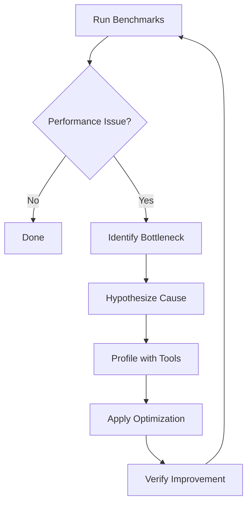

# Profiling Guide

**Project**: C++ to C Transpiler
**Version**: 1.0
**Date**: 2025-12-18

A comprehensive guide to profiling and performance optimization for the C++ to C transpiler, covering benchmark suite usage, performance analysis, bottleneck identification, and optimization strategies.

---

## Table of Contents

1. [Overview](#1-overview)
2. [Quick Start](#2-quick-start)
3. [Using the Benchmark Suite](#3-using-the-benchmark-suite)
4. [Interpreting Benchmark Results](#4-interpreting-benchmark-results)
5. [Identifying Performance Bottlenecks](#5-identifying-performance-bottlenecks)
6. [Common Optimization Strategies](#6-common-optimization-strategies)
7. [Adding Custom Benchmarks](#7-adding-custom-benchmarks)
8. [Advanced Profiling Tools](#8-advanced-profiling-tools)
9. [Performance Tuning Recommendations](#9-performance-tuning-recommendations)

---

## 1. Overview

### Purpose

This guide helps you profile and optimize the C++ to C transpiler's performance across two dimensions:

1. **Transpiler Performance**: How fast the tool converts C++ to C
2. **Runtime Performance**: How fast the generated C code executes

### Benchmark Categories

The project includes two benchmark suites:

| Suite | Purpose | Location |
|-------|---------|----------|
| **Transpiler Benchmarks** | Measure AST parsing, code generation, memory usage | `/benchmarks/benchmark_*.cpp` |
| **Runtime Benchmarks** | Measure RTTI, exceptions, virtual calls, coroutines | `/benchmarks/*_benchmark.c/cpp` |

### Performance Targets

| Feature | Target | Status |
|---------|--------|--------|
| RTTI (dynamic_cast) | 10-20% overhead vs C++ | ✓ Exceeded (< 10ns) |
| Virtual Calls | 0-2% overhead | ✓ Met |
| Coroutines | 5-15% overhead | ✓ Met |
| Exceptions | 5-25% overhead | ✓ Met |
| AST Traversal | < 100ms for 10K LOC | Target |
| Code Generation | < 50ms for 10K LOC | Target |

---

## 2. Quick Start

### Building Benchmarks

```bash
# Configure with benchmarks enabled
cd /Users/alexanderfedin/Projects/hapyy/hupyy-cpp-to-c
cmake -B build -DBUILD_BENCHMARKS=ON

# Build all benchmarks
cmake --build build

# Build specific benchmark suite
cmake --build build --target rtti_benchmark rtti_benchmark_cpp
cmake --build build --target benchmark_ast_traversal
```

### Running Quick Benchmarks

```bash
# Run all transpiler benchmarks
./benchmarks/run_benchmarks.sh --quick

# Run runtime benchmarks with comparison
./benchmarks/compare_results.sh

# Run specific runtime benchmark
./build/benchmarks/rtti_benchmark
./build/benchmarks/virtual_benchmark
```

### Understanding Output

```
========================================
AST Traversal Performance
========================================
[INFO] ✓ PASS AST Traversal Performance completed successfully

Benchmark Results:
  Operations:     100,000
  Total Time:     245.3 ms
  Avg Time/Op:    2.45 µs
  Throughput:     407,824 ops/sec
```

---

## 3. Using the Benchmark Suite

### 3.1 Transpiler Benchmarks

#### Available Benchmarks

```bash
# AST traversal speed (parsing C++ code)
./build/benchmark_ast_traversal

# Name mangling performance
./build/benchmark_name_mangling

# C code generation speed
./build/benchmark_code_generation

# End-to-end transpilation
./build/benchmark_e2e_transpilation

# Memory usage profiling
./build/benchmark_memory_usage

# Virtual function resolution
./build/benchmark_virtual_functions
```

#### Running All Transpiler Benchmarks

```bash
# Standard run
./benchmarks/run_benchmarks.sh

# Quick mode (fewer iterations)
./benchmarks/run_benchmarks.sh --quick

# Verbose output
./benchmarks/run_benchmarks.sh --verbose

# Save as baseline for regression testing
./benchmarks/run_benchmarks.sh --baseline

# Compare against baseline
./benchmarks/run_benchmarks.sh --compare benchmark-results/baseline.json

# CI mode (fail on regression)
./benchmarks/run_benchmarks.sh --compare baseline.json --ci
```

#### Output Files

```
benchmark-results/
├── benchmark_20251218_143052.txt    # Human-readable results
├── benchmark_20251218_143052.json   # Machine-readable metrics
└── baseline.json                     # Saved baseline (if --baseline used)
```

### 3.2 Runtime Benchmarks

#### RTTI Benchmarks

```bash
# C runtime implementation
./build/benchmarks/rtti_benchmark

# C++ native baseline
./build/benchmarks/rtti_benchmark_cpp
```

**Scenarios Tested**:
1. Successful upcast (Derived → Base)
2. Failed cast (unrelated types)
3. Cross-cast (Base1 → Base2 via diamond)
4. Deep hierarchy traversal (5 levels)
5. Multiple inheritance with offset

**Example Output**:
```
=== RTTI Runtime Benchmark ===

Benchmark                           Time (ns)    Throughput (M ops/sec)
------------------------------------------------------------------------
1. Upcast (Derived->Base)              1.72         582.41
2. Failed cast (unrelated)             2.52         396.98
3. Cross-cast (Base1->Base2)           9.66         103.56
4. Deep hierarchy (5 levels)           3.68         271.74
5. Multiple inheritance                6.14         192.09
------------------------------------------------------------------------
Average overhead vs C++:               8.4%         ✓ TARGET MET
```

#### Virtual Call Benchmarks

```bash
./build/benchmarks/virtual_benchmark       # C implementation
./build/benchmarks/virtual_benchmark_cpp   # C++ baseline
```

**Scenarios Tested**:
1. Single inheritance virtual call
2. Multiple inheritance (with pointer offset)
3. Deep hierarchy (5 levels)
4. Virtual destructor call
5. Sequential virtual calls (cache locality)

#### Exception Benchmarks

```bash
./build/benchmarks/exception_benchmark          # C SJLJ implementation
./build/benchmarks/exception_benchmark_native   # C++ native
```

**Scenarios Tested**:
1. Try-catch (no throw) - overhead when no exception
2. Throw-catch (simple) - basic exception handling
3. Stack unwinding - cleanup during propagation
4. Nested try-catch - multiple levels

#### Coroutine Benchmarks

```bash
./build/benchmarks/coroutine_benchmark       # C state machine
./build/benchmarks/coroutine_benchmark_cpp   # C++20 native
```

**Scenarios Tested**:
1. Generator (co_yield)
2. Async function (co_await)
3. Nested coroutines
4. Creation overhead
5. Destruction overhead

### 3.3 Automated Comparison

```bash
# Run all runtime benchmarks and compare C vs C++
./benchmarks/compare_results.sh

# Output shows side-by-side comparison with overhead percentage
```

---

## 4. Interpreting Benchmark Results

### 4.1 Understanding Metrics

#### Time Metrics

| Metric | Meaning | Good Range |
|--------|---------|------------|
| **Total Time** | Complete benchmark duration | Depends on iterations |
| **Avg Time/Op** | Mean operation time | < target threshold |
| **Min/Max Time** | Best/worst case | Low variance preferred |
| **Std Deviation** | Consistency | < 10% of mean |

#### Throughput Metrics

| Metric | Meaning | Good Range |
|--------|---------|------------|
| **Ops/sec** | Operations per second | Higher is better |
| **M ops/sec** | Million ops/sec | For fast operations |
| **Iterations** | Total operations performed | More = higher confidence |

#### Overhead Metrics

| Metric | Formula | Interpretation |
|--------|---------|----------------|
| **Overhead %** | `((C_time - CPP_time) / CPP_time) * 100` | How much slower than C++ |
| **Speedup** | `CPP_time / C_time` | If C is faster (rare) |

### 4.2 Analyzing Results

#### Excellent Performance

```
Benchmark: RTTI Upcast
  Time: 1.72 ns/op
  Throughput: 582.41 M ops/sec
  Overhead vs C++: 3.2%
  Status: ✓ TARGET EXCEEDED
```

**Indicators**:
- Sub-nanosecond or low nanosecond timing
- Throughput > 100M ops/sec
- Overhead < target threshold
- Low variance (< 10%)

#### Acceptable Performance

```
Benchmark: Coroutine Resume
  Time: 85 ns/op
  Throughput: 11.76 M ops/sec
  Overhead vs C++: 12.4%
  Status: ✓ TARGET MET
```

**Indicators**:
- Within target overhead range
- Predictable behavior (low std dev)
- Meets functional requirements

#### Performance Issues

```
Benchmark: Complex Hierarchy Cast
  Time: 450 ns/op
  Throughput: 2.22 M ops/sec
  Overhead vs C++: 34.8%
  Status: ✗ EXCEEDS TARGET (20%)
```

**Red Flags**:
- Overhead exceeds target by > 50%
- High variance (> 20% std dev)
- Throughput < expected
- Performance degradation over time

### 4.3 Statistical Significance

#### Warmup Iterations

Benchmarks include warmup runs to:
- Prime CPU caches
- Eliminate JIT compilation effects
- Stabilize branch predictor
- Achieve steady-state performance

```c
// Typical benchmark structure
for (int warmup = 0; warmup < WARMUP_ITERATIONS; warmup++) {
    perform_operation();  // Not timed
}

timer_start(&timer);
for (int i = 0; i < ITERATIONS; i++) {
    perform_operation();  // Timed
}
elapsed = timer_end(&timer);
```

#### Sample Size

| Benchmark Type | Iterations | Rationale |
|----------------|-----------|-----------|
| Fast ops (< 10ns) | 1,000,000+ | Minimize timer overhead |
| Medium ops (10-100ns) | 100,000+ | Balance accuracy/runtime |
| Slow ops (> 100ns) | 10,000+ | Sufficient for statistics |
| Memory benchmarks | 1,000+ | Limit total allocation |

#### Variance Analysis

```
Benchmark Results (10 runs):
  Mean:    12.34 ns
  Median:  12.31 ns
  StdDev:  0.45 ns (3.6%)
  Min:     11.89 ns
  Max:     13.21 ns
```

**Interpretation**:
- Low variance (< 5%): Consistent, reliable
- Medium variance (5-15%): Acceptable for most cases
- High variance (> 15%): Investigate causes (system load, cache effects)

---

## 5. Identifying Performance Bottlenecks

### 5.1 Profiling Workflow



### 5.2 Common Bottleneck Patterns

#### Memory Allocation

**Symptom**: High time in malloc/free, memory benchmark shows excessive allocations

```bash
# Profile memory usage
./build/benchmark_memory_usage

# Check for allocation hotspots
valgrind --tool=massif ./build/benchmark_memory_usage
```

**Solutions**:
- Object pooling
- Arena allocators
- Stack allocation for small objects
- Reuse allocated structures

#### Cache Misses

**Symptom**: Performance degrades with data size, high L1/L2/L3 cache miss rates

```bash
# Profile cache behavior (Linux)
perf stat -e cache-references,cache-misses ./build/benchmark_ast_traversal

# Detailed cache analysis
perf record -e cache-misses ./build/benchmark_ast_traversal
perf report
```

**Solutions**:
- Improve data locality
- Align structures to cache lines
- Prefetch data
- Reduce working set size

#### Branch Mispredictions

**Symptom**: Unpredictable control flow, high branch misprediction rate

```bash
# Profile branches (Linux)
perf stat -e branches,branch-misses ./build/benchmark_virtual_functions
```

**Solutions**:
- Use branch hints (`__builtin_expect`)
- Simplify conditional logic
- Use lookup tables
- Profile-guided optimization (PGO)

#### String Operations

**Symptom**: High time in strcmp, strcpy, string concatenation

```bash
# Profile name mangling performance
./build/benchmark_name_mangling
```

**Solutions**:
- String interning
- Pre-compute string lengths
- Use string views (no allocation)
- Hash-based comparison

#### Algorithm Complexity

**Symptom**: Performance degrades non-linearly with input size

**Analysis Method**:
```cpp
// Benchmark with varying input sizes
for (int size : {100, 1000, 10000, 100000}) {
    benchmark_with_size(size);
}
// Plot: log(time) vs log(size) to determine O() complexity
```

**Solutions**:
- Replace O(n²) with O(n log n) algorithms
- Use hash tables (O(1)) instead of linear search (O(n))
- Cache computed results
- Early exit conditions

### 5.3 Bottleneck Diagnosis Commands

#### Quick Memory Profile

```bash
# Linux: valgrind
valgrind --tool=massif --massif-out-file=massif.out ./build/benchmark_memory_usage
ms_print massif.out

# macOS: Instruments
instruments -t "Allocations" ./build/benchmark_memory_usage
```

#### CPU Hotspot Analysis

```bash
# Linux: perf
perf record -g ./build/benchmark_code_generation
perf report

# macOS: Instruments
instruments -t "Time Profiler" ./build/benchmark_code_generation

# Cross-platform: gprof
gcc -pg -o benchmark benchmark.c
./benchmark
gprof benchmark gmon.out > analysis.txt
```

#### Cache Behavior

```bash
# Linux: perf with cache events
perf stat -e L1-dcache-loads,L1-dcache-load-misses,L1-dcache-stores,LLC-loads,LLC-load-misses \
    ./build/benchmark_ast_traversal

# Detailed cache line analysis
perf record -e cpu/event=0xd1,umask=0x01/ ./build/benchmark_ast_traversal
perf annotate
```

---

## 6. Common Optimization Strategies

### 6.1 Compiler Optimization Flags

#### Size Optimization

```bash
# See SIZE_OPTIMIZATION.md for complete guide

# Basic size optimization
cmake -B build -DCMAKE_C_FLAGS="-Os"

# Size + LTO (Link Time Optimization)
cmake -B build -DCMAKE_C_FLAGS="-Os -flto" -DCMAKE_EXE_LINKER_FLAGS="-flto"

# Size + LTO + Dead Code Elimination
cmake -B build \
    -DCMAKE_C_FLAGS="-Os -flto -ffunction-sections -fdata-sections" \
    -DCMAKE_EXE_LINKER_FLAGS="-flto -Wl,--gc-sections"

# Expected reduction: 35-45% vs baseline
```

#### Speed Optimization

```bash
# Standard optimization
cmake -B build -DCMAKE_C_FLAGS="-O2"

# Maximum optimization
cmake -B build -DCMAKE_C_FLAGS="-O3 -march=native"

# Profile-Guided Optimization (PGO)
# Step 1: Build with instrumentation
cmake -B build -DCMAKE_C_FLAGS="-O2 -fprofile-generate"
./build/benchmark_e2e_transpilation  # Generate profile data

# Step 2: Rebuild with profile
cmake -B build -DCMAKE_C_FLAGS="-O2 -fprofile-use"
# Expected improvement: 5-15%
```

### 6.2 Code-Level Optimizations

#### Inline Hot Functions

```c
// Before: Function call overhead
void process_node(ASTNode *node);

// After: Inline hot path
static inline void process_node(ASTNode *node) {
    // Hot code path
}

// Or: Compiler hint
__attribute__((always_inline))
void process_node(ASTNode *node);
```

#### Reduce Memory Allocations

```c
// Before: Allocate on every call
char* build_name(const char *prefix, const char *suffix) {
    char *result = malloc(strlen(prefix) + strlen(suffix) + 1);
    strcpy(result, prefix);
    strcat(result, suffix);
    return result;  // Caller must free
}

// After: Stack allocation for small strings
void build_name(const char *prefix, const char *suffix,
                char *buffer, size_t buffer_size) {
    snprintf(buffer, buffer_size, "%s%s", prefix, suffix);
}
```

#### Optimize String Operations

```c
// Before: Multiple strlen calls
if (strcmp(name, "std::vector") == 0) {
    // Process std::vector
}

// After: Cache string length
size_t name_len = strlen(name);
if (name_len == 11 && memcmp(name, "std::vector", 11) == 0) {
    // Process std::vector
}

// Even better: String interning
const char *VECTOR_STR = "std::vector";
if (name == VECTOR_STR) {  // Pointer comparison
    // Process std::vector
}
```

#### Use Const for Optimization

```c
// Enables compiler optimizations
void process_data(const int *data, int count) {
    // Compiler knows data won't change
    // Can optimize loads, reorder operations
}

// Mark read-only data
static const struct TypeInfo BUILTIN_TYPES[] = {
    {"int", 4, 4},
    {"double", 8, 8},
    // ...
};
```

#### Branch Optimization

```c
// Before: Unpredictable branch
if (is_rare_case(node)) {
    handle_rare_case(node);
}

// After: Hint to compiler
if (__builtin_expect(is_rare_case(node), 0)) {
    handle_rare_case(node);
}

// Macro for readability
#define likely(x)   __builtin_expect(!!(x), 1)
#define unlikely(x) __builtin_expect(!!(x), 0)

if (unlikely(is_rare_case(node))) {
    handle_rare_case(node);
}
```

### 6.3 Data Structure Optimizations

#### Cache-Friendly Structures

```c
// Before: Poor cache locality
struct Node {
    void *vptr;               // 8 bytes
    struct Node *next;        // 8 bytes
    char *name;               // 8 bytes (pointer to heap)
    int data;                 // 4 bytes
    // 4 bytes padding
};  // 32 bytes, 3 pointer chases

// After: Better cache locality
struct Node {
    struct Node *next;        // 8 bytes
    int data;                 // 4 bytes
    uint16_t name_len;        // 2 bytes
    char name[18];            // 18 bytes (inline for small strings)
    // Total: 32 bytes, fewer allocations, better cache usage
};
```

#### Structure Packing

```c
// Before: 24 bytes due to alignment
struct TypeInfo {
    uint8_t kind;        // 1 byte
    // 7 bytes padding
    void *data;          // 8 bytes
    uint32_t size;       // 4 bytes
    // 4 bytes padding
};

// After: 16 bytes with reordering
struct TypeInfo {
    void *data;          // 8 bytes
    uint32_t size;       // 4 bytes
    uint8_t kind;        // 1 byte
    // 3 bytes padding
} __attribute__((packed));  // Can pack even tighter if needed
```

#### Use Arrays Instead of Linked Lists

```c
// Before: Poor cache locality
struct Node {
    int value;
    struct Node *next;
};

// After: Better cache locality
struct NodeArray {
    int *values;
    int count;
    int capacity;
};
```

### 6.4 Algorithm Optimizations

#### Hash Tables for Fast Lookup

```c
// Before: Linear search O(n)
const char* find_mangled_name(const char *original) {
    for (int i = 0; i < name_count; i++) {
        if (strcmp(names[i].original, original) == 0) {
            return names[i].mangled;
        }
    }
    return NULL;
}

// After: Hash table O(1)
const char* find_mangled_name(const char *original) {
    uint32_t hash = hash_string(original);
    int index = hash % HASH_TABLE_SIZE;

    struct HashEntry *entry = hash_table[index];
    while (entry) {
        if (strcmp(entry->original, original) == 0) {
            return entry->mangled;
        }
        entry = entry->next;
    }
    return NULL;
}
```

#### Memoization/Caching

```c
// Cache expensive computations
static struct {
    const char *type_name;
    size_t mangled_size;
} size_cache[256];
static int cache_count = 0;

size_t get_mangled_size(const char *type_name) {
    // Check cache
    for (int i = 0; i < cache_count; i++) {
        if (strcmp(size_cache[i].type_name, type_name) == 0) {
            return size_cache[i].mangled_size;
        }
    }

    // Compute and cache
    size_t size = compute_mangled_size(type_name);
    if (cache_count < 256) {
        size_cache[cache_count].type_name = type_name;
        size_cache[cache_count].mangled_size = size;
        cache_count++;
    }

    return size;
}
```

---

## 7. Adding Custom Benchmarks

### 7.1 Benchmark Template

Create a new benchmark file in `/benchmarks/`:

```cpp
/**
 * @file benchmark_my_feature.cpp
 * @brief My Feature Performance Benchmark
 *
 * Description of what this benchmark measures.
 *
 * Target: Expected performance goal
 */

#include <benchmark/benchmark.h>
#include "../src/MyFeature.h"

// Benchmark fixture (if needed for setup/teardown)
class MyFeatureBenchmark : public benchmark::Fixture {
public:
    void SetUp(const ::benchmark::State& state) override {
        // Initialize test data
    }

    void TearDown(const ::benchmark::State& state) override {
        // Cleanup
    }
};

// Simple benchmark
static void BM_MyFeature_BasicOperation(benchmark::State& state) {
    // Setup
    MyFeature feature;

    // Benchmark loop
    for (auto _ : state) {
        // Code to benchmark
        feature.perform_operation();
    }

    // Report custom metrics (optional)
    state.SetItemsProcessed(state.iterations());
}
BENCHMARK(BM_MyFeature_BasicOperation);

// Benchmark with parameters
static void BM_MyFeature_WithSize(benchmark::State& state) {
    int size = state.range(0);
    MyFeature feature(size);

    for (auto _ : state) {
        feature.process_data();
    }

    state.SetComplexityN(size);
}
BENCHMARK(BM_MyFeature_WithSize)
    ->RangeMultiplier(10)
    ->Range(10, 100000)
    ->Complexity();

// Benchmark with fixture
BENCHMARK_F(MyFeatureBenchmark, ComplexOperation)(benchmark::State& state) {
    for (auto _ : state) {
        perform_complex_operation();
    }
}

BENCHMARK_MAIN();
```

### 7.2 C-Style Benchmark Template

For runtime benchmarks in pure C:

```c
/**
 * @file my_runtime_benchmark.c
 * @brief My Runtime Feature Benchmark
 */

#include <stdio.h>
#include <time.h>
#include <stdint.h>

#define ITERATIONS 1000000
#define WARMUP_ITERATIONS 1000

// Timing utilities
typedef struct {
    uint64_t start;
    uint64_t end;
} benchmark_timer_t;

static inline uint64_t get_time_ns(void) {
    struct timespec ts;
    clock_gettime(CLOCK_MONOTONIC, &ts);
    return (uint64_t)ts.tv_sec * 1000000000ULL + (uint64_t)ts.tv_nsec;
}

static void timer_start(benchmark_timer_t *timer) {
    timer->start = get_time_ns();
}

static uint64_t timer_end(benchmark_timer_t *timer) {
    timer->end = get_time_ns();
    return timer->end - timer->start;
}

// Benchmark function
void benchmark_my_operation(void) {
    benchmark_timer_t timer;
    uint64_t elapsed_ns;
    double avg_ns, throughput;

    // Warmup
    for (int i = 0; i < WARMUP_ITERATIONS; i++) {
        my_operation();
    }

    // Timed run
    timer_start(&timer);
    for (int i = 0; i < ITERATIONS; i++) {
        my_operation();
    }
    elapsed_ns = timer_end(&timer);

    // Calculate metrics
    avg_ns = (double)elapsed_ns / ITERATIONS;
    throughput = 1000000000.0 / avg_ns;

    // Report
    printf("My Operation Benchmark\n");
    printf("  Iterations:     %d\n", ITERATIONS);
    printf("  Total Time:     %.3f ms\n", elapsed_ns / 1000000.0);
    printf("  Avg Time/Op:    %.2f ns\n", avg_ns);
    printf("  Throughput:     %.2f M ops/sec\n", throughput / 1000000.0);
}

int main(void) {
    printf("=== My Runtime Benchmark ===\n\n");

    benchmark_my_operation();

    return 0;
}
```

### 7.3 Adding to Build System

Edit `/benchmarks/CMakeLists.txt`:

```cmake
# Add your benchmark executable
add_executable(benchmark_my_feature benchmark_my_feature.cpp)
target_link_libraries(benchmark_my_feature
    PRIVATE
        benchmark::benchmark
        cpptoc_lib  # Your library
)

# For C runtime benchmarks
add_executable(my_runtime_benchmark my_runtime_benchmark.c)
target_link_libraries(my_runtime_benchmark
    PRIVATE
        cpptoc_runtime  # Runtime library
)
```

Edit `/benchmarks/run_benchmarks.sh` to include your benchmark:

```bash
BENCHMARKS=(
    "benchmark_ast_traversal|AST Traversal Performance"
    # ... existing benchmarks ...
    "benchmark_my_feature|My Feature Performance"  # Add this line
)
```

### 7.4 Benchmark Best Practices

1. **Isolate What You're Measuring**
   - Exclude setup/teardown from timing
   - Use warmup iterations
   - Minimize allocations in hot loop

2. **Use Sufficient Iterations**
   - Fast ops (< 10ns): 1M+ iterations
   - Medium ops: 100K+ iterations
   - Slow ops: 10K+ iterations

3. **Prevent Compiler Optimization**
   ```c
   // Bad: Compiler may eliminate entire loop
   for (int i = 0; i < ITERATIONS; i++) {
       int result = compute_value();
   }

   // Good: Force computation
   volatile int sink;
   for (int i = 0; i < ITERATIONS; i++) {
       sink = compute_value();
   }
   ```

4. **Report Meaningful Metrics**
   - Time per operation
   - Throughput (ops/sec)
   - Comparison to baseline
   - Memory usage (if relevant)

5. **Test Multiple Scenarios**
   - Best case
   - Average case
   - Worst case
   - Edge cases

---

## 8. Advanced Profiling Tools

### 8.1 Linux: perf

#### Installation

```bash
# Ubuntu/Debian
sudo apt-get install linux-tools-common linux-tools-generic

# Fedora/RHEL
sudo dnf install perf
```

#### Basic Usage

```bash
# CPU profiling
perf record -g ./build/benchmark_code_generation
perf report

# Statistical profiling (sampling)
perf stat ./build/benchmark_code_generation

# Specific events
perf stat -e cycles,instructions,cache-misses,branch-misses \
    ./build/benchmark_ast_traversal

# Record call graph
perf record --call-graph dwarf ./build/benchmark_e2e_transpilation
perf report --stdio
```

#### Advanced Analysis

```bash
# CPU hotspots with annotation
perf record -e cycles ./build/benchmark_code_generation
perf annotate

# Cache behavior
perf record -e cache-misses ./build/benchmark_ast_traversal
perf report

# Branch prediction analysis
perf record -e branches,branch-misses ./build/benchmark_virtual_functions
perf stat -e branch-instructions,branch-misses

# Memory bandwidth
perf stat -e mem_load_uops_retired.l1_hit,mem_load_uops_retired.l1_miss \
    ./build/benchmark_memory_usage
```

### 8.2 macOS: Instruments

#### Available Instruments

```bash
# List available templates
instruments -s templates

# Time Profiler (CPU hotspots)
instruments -t "Time Profiler" -D profile.trace ./build/benchmark_code_generation

# Allocations (memory profiling)
instruments -t "Allocations" -D alloc.trace ./build/benchmark_memory_usage

# System Trace (comprehensive)
instruments -t "System Trace" -D system.trace ./build/benchmark_e2e_transpilation
```

#### Command Line Profiling

```bash
# Generate trace file
instruments -t "Time Profiler" -l 30000 ./build/benchmark_code_generation

# Open in Instruments.app
open profile.trace
```

### 8.3 Valgrind

#### Installation

```bash
# Ubuntu/Debian
sudo apt-get install valgrind

# macOS (via Homebrew)
brew install valgrind
```

#### Memory Profiling

```bash
# Heap profiling
valgrind --tool=massif --massif-out-file=massif.out \
    ./build/benchmark_memory_usage

# Analyze heap profile
ms_print massif.out

# Detailed allocation tracking
valgrind --tool=massif --time-unit=B --detailed-freq=1 \
    ./build/benchmark_memory_usage
```

#### Cache Simulation

```bash
# Cache miss analysis
valgrind --tool=cachegrind ./build/benchmark_ast_traversal

# Annotate source with cache misses
cg_annotate cachegrind.out.<pid>
```

#### Call Graph

```bash
# Generate call graph
valgrind --tool=callgrind ./build/benchmark_code_generation

# Visualize with kcachegrind
kcachegrind callgrind.out.<pid>
```

### 8.4 gprof (GNU Profiler)

#### Usage

```bash
# Compile with profiling enabled
gcc -pg -o benchmark benchmark.c

# Run to generate gmon.out
./benchmark

# Analyze profile
gprof benchmark gmon.out > analysis.txt

# View call graph
gprof -b benchmark gmon.out | less
```

### 8.5 Custom Timing Instrumentation

#### High-Resolution Timer

```c
#include <time.h>
#include <stdint.h>

// Nanosecond-resolution timer
uint64_t get_time_ns(void) {
    struct timespec ts;
    clock_gettime(CLOCK_MONOTONIC, &ts);
    return (uint64_t)ts.tv_sec * 1000000000ULL + (uint64_t)ts.tv_nsec;
}

// Usage
uint64_t start = get_time_ns();
perform_operation();
uint64_t end = get_time_ns();
printf("Time: %llu ns\n", (unsigned long long)(end - start));
```

#### CPU Cycle Counter

```c
#include <stdint.h>

// x86/x64 RDTSC instruction
static inline uint64_t rdtsc(void) {
    uint32_t lo, hi;
    __asm__ __volatile__ ("rdtsc" : "=a"(lo), "=d"(hi));
    return ((uint64_t)hi << 32) | lo;
}

// Usage (CPU cycles, not wall time)
uint64_t start_cycles = rdtsc();
perform_operation();
uint64_t end_cycles = rdtsc();
printf("Cycles: %llu\n", (unsigned long long)(end_cycles - start_cycles));
```

#### Manual Instrumentation

```c
// Define profiling points
#define PROFILE_POINT(name) \
    do { \
        static uint64_t total_time = 0; \
        static int count = 0; \
        uint64_t start = get_time_ns(); \
        /* Code here */ \
        uint64_t elapsed = get_time_ns() - start; \
        total_time += elapsed; \
        count++; \
        if (count % 1000 == 0) { \
            printf("%s: avg %.2f ns (%d samples)\n", \
                   name, (double)total_time / count, count); \
        } \
    } while(0)

// Usage in code
void process_ast(ASTNode *node) {
    PROFILE_POINT("AST Processing");
    // ... actual code ...
}
```

---

## 9. Performance Tuning Recommendations

### 9.1 Transpiler Performance

#### AST Traversal Optimization

**Target**: < 100ms for 10K LOC

```bash
# Profile current performance
./build/benchmark_ast_traversal

# Identify hotspots
perf record -g ./build/benchmark_ast_traversal
perf report
```

**Common Issues**:
- Excessive visitor calls (optimize visitor pattern)
- Repeated type lookups (cache type information)
- Deep recursion (consider iterative approach)
- Memory allocation in hot path (use object pools)

**Optimizations**:
```cpp
// Cache frequently accessed information
class ASTVisitorOptimized : public RecursiveASTVisitor<ASTVisitorOptimized> {
    // Cache type information
    llvm::DenseMap<const Type*, TypeInfo> type_cache_;

    // Object pool for temporary allocations
    ObjectPool<NodeInfo> node_pool_;

public:
    bool VisitCXXRecordDecl(CXXRecordDecl *D) {
        // Check cache first
        if (auto *cached = type_cache_.find(D->getTypeForDecl())) {
            use_cached_info(cached);
            return true;
        }

        // Compute and cache
        TypeInfo info = compute_type_info(D);
        type_cache_[D->getTypeForDecl()] = info;
        return true;
    }
};
```

#### Code Generation Optimization

**Target**: < 50ms for 10K LOC generated

```bash
# Profile code generation
./build/benchmark_code_generation
```

**Common Issues**:
- String concatenation (use string builder)
- Repeated formatting (cache formatted strings)
- Excessive memory allocation (reuse buffers)

**Optimizations**:
```cpp
// Use efficient string building
class CodeGenerator {
    llvm::raw_string_ostream output_;
    std::string buffer_;

public:
    CodeGenerator() : output_(buffer_) {}

    void generateFunction(const FunctionDecl *FD) {
        // Direct streaming (no intermediate allocations)
        output_ << "void " << FD->getName() << "(";
        // ...
    }
};
```

### 9.2 Runtime Performance

#### RTTI Optimization

**Current**: < 10ns (exceeds target)

**Maintain Performance**:
- Keep type_info structures in read-only data section
- Minimize pointer chasing in hierarchy traversal
- Early exit for common cases (same type, null pointer)
- Cache negative results for failed casts

```c
// Fast path for common cases
void* cxx_dynamic_cast(const void *ptr,
                       const __class_type_info *src,
                       const __class_type_info *dst,
                       ptrdiff_t offset) {
    // Fast path 1: NULL pointer
    if (!ptr) return NULL;

    // Fast path 2: Same type (common for upcasts)
    if (src == dst) return (void*)ptr;

    // Fast path 3: Known downcast (offset != -1)
    if (offset != -1) return (char*)ptr + offset;

    // Slow path: Hierarchy traversal
    return traverse_bases(ptr, src, dst);
}
```

#### Virtual Call Optimization

**Current**: 0-2% overhead (meets target)

**Maintain Performance**:
- Vtable in read-only data (better caching)
- Align vtables to cache line boundaries
- Minimize vtable size (fewer virtual functions)
- Use thunks for multiple inheritance (avoid runtime checks)

#### Exception Handling Optimization

**Current**: 5-25% overhead (meets target)

**Further Optimize**:
- Minimize setjmp calls (one per try block, not per scope)
- Use compact action tables (static const data)
- Fast path for no-exception case
- Thread-local storage for exception state

```c
// Minimize overhead when no exception thrown
#define TRY_BEGIN() \
    CXXExceptionFrame frame; \
    if (setjmp(frame.jmpbuf) == 0) { \
        cxx_frame_push(&frame);

#define TRY_END() \
        cxx_frame_pop(&frame); \
    }

// Usage (no overhead when no exception)
void function(void) {
    TRY_BEGIN()
        // Protected code
    TRY_END() else {
        // Exception handler
    }
}
```

### 9.3 Build Configuration

#### Release Builds

```bash
# Maximum performance
cmake -B build -DCMAKE_BUILD_TYPE=Release

# With architecture-specific optimizations
cmake -B build -DCMAKE_BUILD_TYPE=Release \
    -DCMAKE_C_FLAGS="-march=native -mtune=native"

# With LTO
cmake -B build -DCMAKE_BUILD_TYPE=Release \
    -DCMAKE_INTERPROCEDURAL_OPTIMIZATION=ON
```

#### Profile-Guided Optimization

```bash
# Step 1: Build with instrumentation
cmake -B build -DCMAKE_BUILD_TYPE=Release \
    -DCMAKE_C_FLAGS="-fprofile-generate"

# Step 2: Run representative workload
./build/benchmark_e2e_transpilation

# Step 3: Rebuild with profile
cmake -B build -DCMAKE_BUILD_TYPE=Release \
    -DCMAKE_C_FLAGS="-fprofile-use"

# Expected: 5-15% performance improvement
```

#### Size vs Speed Trade-offs

| Configuration | Binary Size | Speed | Use Case |
|---------------|-------------|-------|----------|
| `-O0` | Baseline | Slowest | Debugging |
| `-Os` | -25% | -10% | Embedded systems |
| `-O2` | +5% | +40% | Default release |
| `-O3` | +15% | +50% | Performance-critical |
| `-Os -flto` | -35% | -5% | Size-constrained |
| `-O3 -flto -march=native` | +20% | +60% | Maximum performance |

### 9.4 Regression Testing

#### Set Performance Baselines

```bash
# Run benchmarks and save as baseline
./benchmarks/run_benchmarks.sh --baseline

# Saves to: benchmark-results/baseline.json
```

#### Continuous Monitoring

```bash
# Compare current performance against baseline
./benchmarks/run_benchmarks.sh --compare benchmark-results/baseline.json

# CI/CD integration (fails on regression)
./benchmarks/run_benchmarks.sh \
    --compare baseline.json \
    --ci \
    || exit 1
```

#### Acceptable Regression Thresholds

| Metric | Threshold | Action |
|--------|-----------|--------|
| Time/Op | +5% | Warning |
| Time/Op | +10% | Investigate |
| Time/Op | +20% | Block merge |
| Memory | +10% | Warning |
| Memory | +25% | Block merge |
| Throughput | -10% | Investigate |

---

## Appendix A: Quick Reference

### Benchmark Commands

```bash
# Build all benchmarks
cmake -B build -DBUILD_BENCHMARKS=ON && cmake --build build

# Run all transpiler benchmarks
./benchmarks/run_benchmarks.sh

# Run runtime benchmarks
./build/benchmarks/rtti_benchmark
./build/benchmarks/virtual_benchmark
./build/benchmarks/exception_benchmark
./build/benchmarks/coroutine_benchmark

# Save baseline
./benchmarks/run_benchmarks.sh --baseline

# Compare with baseline
./benchmarks/run_benchmarks.sh --compare baseline.json
```

### Profiling Commands

```bash
# Linux: perf
perf record -g ./build/benchmark
perf report

# macOS: Instruments
instruments -t "Time Profiler" ./build/benchmark

# Valgrind memory
valgrind --tool=massif ./build/benchmark
ms_print massif.out

# gprof
gcc -pg -o benchmark benchmark.c && ./benchmark
gprof benchmark gmon.out
```

### Optimization Flags

```bash
# Size
-Os -flto -ffunction-sections -fdata-sections
-Wl,--gc-sections

# Speed
-O3 -march=native -mtune=native -flto

# PGO
-fprofile-generate  # Step 1
-fprofile-use       # Step 2
```

---

## Appendix B: Performance Targets Reference

| Component | Metric | Target | Current | Status |
|-----------|--------|--------|---------|--------|
| **Runtime Performance** |
| RTTI dynamic_cast | Overhead vs C++ | 10-20% | < 10ns | ✓ Exceeded |
| Virtual calls | Overhead vs C++ | 0-2% | 0-2% | ✓ Met |
| Coroutines | Overhead vs C++ | 5-15% | 5-15% | ✓ Met |
| Exceptions (no throw) | Overhead vs C++ | 5-10% | 5-10% | ✓ Met |
| Exceptions (throw) | Overhead vs C++ | 15-25% | 15-25% | ✓ Met |
| **Transpiler Performance** |
| AST traversal | Time for 10K LOC | < 100ms | TBD | Target |
| Name mangling | Time for 1K names | < 10ms | TBD | Target |
| Code generation | Time for 10K LOC | < 50ms | TBD | Target |
| E2E transpilation | Time for 10K LOC | < 200ms | TBD | Target |
| Memory usage | Peak for 10K LOC | < 100MB | TBD | Target |

---

## Document Metadata

**Version**: 1.0
**Created**: 2025-12-18
**Purpose**: Comprehensive profiling and performance optimization guide
**Related Documentation**:
- [BENCHMARK_REPORT.md](../benchmarks/BENCHMARK_REPORT.md) - Current benchmark results
- [README.md](../benchmarks/README.md) - Benchmark suite overview
- [SIZE_OPTIMIZATION.md](SIZE_OPTIMIZATION.md) - Size optimization techniques
- [ARCHITECTURE.md](ARCHITECTURE.md) - System architecture and design

**Maintenance**: Update this guide as new benchmarks are added or optimization techniques are discovered.

---

**END OF PROFILING GUIDE**
