# C++ to C Transpiler: Architecture and Motivation

**Version:** 1.0
**Date:** 2025-12-26
**Purpose:** Understand the 3-stage pipeline architecture and why it was designed this way

---

## Table of Contents

1. [Overview](#overview)
2. [The 3-Stage Pipeline](#the-3-stage-pipeline)
3. [Why This Architecture?](#why-this-architecture)
4. [Key Design Principles](#key-design-principles)
5. [Alternative Approaches Considered](#alternative-approaches-considered)
6. [Benefits in Practice](#benefits-in-practice)

---

## Overview

The C++ to C transpiler converts modern C++ code into clean, readable, formally-verifiable C99 code. The architecture is built around a **3-stage pipeline** that separates concerns and optimizes for **output code quality** over implementation simplicity.

### The Core Insight

There are three common approaches to transpilation, and one novel approach (ours):

1. **Direct text emission from source AST** - Walk C++ AST, emit text strings
2. **LLVM IR/bytecode approach** - Lower to LLVM IR, emit from bytecode
3. **LLM-based transpilation** - Use GPT/Claude to translate source code
4. **Intermediate AST approach** (our novel approach) - C++ AST → **separate C AST** → text

**For production-quality, human-readable, verifiable C code, approaches 1-3 fail:**

**Approach 1 (Direct text emission):**
- ❌ Messy output with incorrect precedence
- ❌ Missing parentheses causing bugs
- ❌ Thousands of edge cases to handle manually
- ❌ Unreadable generated code

**Approach 2 (LLVM IR):**
- ❌ Loses high-level structure (names, types, control flow)
- ❌ Output is machine-like, not human-readable
- ❌ Cannot preserve source semantics for verification
- ✅ Works for JIT/VM targets (Emscripten, WASM)
- ✅ Good for performance-critical backends

**Approach 3 (LLM-based transpilation):**
- ❌ **Hallucinations** - Invents APIs, functions, syntax that don't exist
- ❌ **Inconsistency** - Same input produces different outputs
- ❌ **Context limits** - Cannot process large codebases coherently
- ❌ **No guarantees** - Cannot prove correctness or completeness
- ❌ **Missing edge cases** - Fails on corner cases not in training data
- ❌ **Non-deterministic** - Cannot reproduce builds
- ⚠️ **Poor context engineering** - Struggles with cross-file dependencies
- ✅ Useful for prototypes, learning, simple one-off conversions
- ✅ Good for human-in-the-loop assisted migration

**Our novel solution (Approach 4):** Build a **separate, complete C AST** (using Clang's C node types) and let Clang's battle-tested printer handle code generation.

**What makes this novel:**
- Most transpilers emit text directly (Approach 1) or use LLVM IR (Approach 2)
- Clang's TreeTransform API modifies AST in-place, doesn't create separate output AST
- We build an entirely new AST using **only C-compatible node types** (RecordDecl, FunctionDecl, CallExpr, etc.)
- Then we leverage Clang's printer which has solved all the hard problems over 15+ years
- No known C++ to C transpiler uses this architecture (as of 2025)

**Why this matters for our goals:**
- ✅ Preserves high-level semantics (unlike LLVM IR)
- ✅ Clean, readable output (unlike direct emission)
- ✅ Suitable for Frama-C verification (unlike LLM approach)
- ✅ Deterministic and reproducible (unlike LLM approach)
- ✅ Debuggable with source mapping
- ✅ Handles edge cases systematically (unlike LLM approach)

---

## The 3-Stage Pipeline


### Stage 1: C++ AST Generation
**What:** Parse C++ source code using Clang frontend
**Input:** C++ source files
**Output:** Fully-resolved C++ AST with type information, template instantiations, semantic analysis
**Why:** Leverage Clang's world-class C++ parser instead of building our own

### Stage 2: C++ AST → C AST Translation
**What:** Walk C++ AST and build equivalent C AST using handler chain
**Input:** C++ AST from Stage 1
**Output:** Pure C AST with only C-compatible nodes
**Why:** Make ALL translation decisions here, create proper C structures

### Stage 3: C Code Emission
**What:** Print C AST to text using Clang's DeclPrinter/StmtPrinter
**Input:** C AST from Stage 2
**Output:** Clean, formatted C source code
**Why:** Leverage 15+ years of production-tested code generation

---

## Why This Architecture?

### Problem: Direct Text Emission is Fragile

**Naive Approach (What We DON'T Do):**
```cpp
// BAD: Emit text directly from C++ AST
void emitExpression(Expr* E) {
    if (BinaryOperator* BO = dyn_cast<BinaryOperator>(E)) {
        emitExpression(BO->getLHS());
        OS << " " << BO->getOpcodeStr() << " ";
        emitExpression(BO->getRHS());
        // PROBLEM: What about precedence?
        // PROBLEM: What about parentheses?
        // PROBLEM: What about edge cases?
    }
}
```

**Issues:**
- ❌ Incorrect operator precedence: `a + b * c` becomes `(a + b) * c`
- ❌ Missing parentheses cause subtle bugs
- ❌ Edge cases pile up (pointer-to-member, overloaded operators, etc.)
- ❌ Thousands of lines of brittle string concatenation
- ❌ Hard to verify output correctness

### Solution: Intermediate C AST

**Our Approach (What We DO):**
```cpp
// GOOD: Build C AST nodes
Expr* translateExpression(Expr* E) {
    if (BinaryOperator* BO = dyn_cast<BinaryOperator>(E)) {
        Expr* lhs = translateExpression(BO->getLHS());
        Expr* rhs = translateExpression(BO->getRHS());
        return builder.createBinaryOp(BO->getOpcode(), lhs, rhs);
        // Clang's printer handles precedence automatically!
    }
}
```

**Benefits:**
- ✅ Clang's printer handles precedence, parentheses, formatting
- ✅ 15+ years of edge cases already fixed
- ✅ Zero maintenance burden for code generation
- ✅ Output is clean and verifiable

### The Numbers: Output Quality

| Metric | Direct Emission | Intermediate AST | Improvement |
|--------|----------------|------------------|-------------|
| **Lines per exception handler** | 46 lines | 11 lines | **4.2x cleaner** |
| **Code size** | 100% | 20% | **80% reduction** |
| **Frama-C verification time** | 100% | 10-20% | **5-10x faster** |
| **Implementation LOC** | 1,400-2,300 | 2,000-3,200 | +40% code |

**Trade-off (Pre-AI Era, 2015-2023):** We accepted 40% more implementation code for 80% cleaner output.

**Trade-off (AI Era, 2024+):** With AI-assisted development (Claude Code, Cursor, Copilot), implementation effort is now comparable to direct emission while retaining 80% cleaner output.

**Rationale:** Generated code is read/debugged/verified far more often than implementation code. With AI handling boilerplate, we get superior output quality without developer productivity cost.

---

## Key Design Principles

### 1. Separation of Concerns

Each stage has ONE clear responsibility:

| Stage | Responsibility | Does NOT Do |
|-------|---------------|-------------|
| **Stage 1** | Parse C++ | ❌ Translation decisions |
| **Stage 2** | Decide C representation | ❌ Text generation |
| **Stage 3** | Format text output | ❌ Translation logic |

**Golden Rule:** Stage 2 decides WHAT to emit, Stage 3 decides HOW to format it.

### 2. Testability

Each stage can be unit tested independently:

```cpp
// Test Stage 2 WITHOUT running Stage 3
TEST(TranslationTest, ClassToStruct) {
    // Given: C++ class in AST
    CXXRecordDecl* cppClass = ...;

    // When: Translate to C
    RecordDecl* cStruct = translator.translate(cppClass);

    // Then: Verify C AST structure (no text output needed!)
    EXPECT_EQ(cStruct->getName(), "MyClass");
    EXPECT_EQ(cStruct->fields().size(), 2);
}
```

### 3. Battle-Tested Components

**Don't Reinvent the Wheel:**

- **Clang's Parser** → Used by Apple, Google, Microsoft
- **Clang's Printer** → 15+ years in production
- **PNaCl Exception Handling** → Used by Chrome Native Client
- **Itanium ABI RTTI** → Standard used by GCC, Clang, ICC

**Result:** Stand on the shoulders of giants.

### 4. Frama-C First

Optimize for formal verification:

**Runtime Library Approach:**
```c
// Instead of inlining 46 lines of exception handling:
try_block() {
    // 46 lines of complex setjmp/longjmp code
}

// We call runtime library:
try_block() {
    cxx_frame_push(&frame);  // 11 lines total
    if (setjmp(frame.jmpbuf) == 0) {
        // try body
    } else {
        // catch handler
    }
    cxx_frame_pop(&frame);
}
```

**Benefits:**
- Verify runtime library ONCE with Frama-C
- Generated code just calls verified functions
- 5-10x easier to verify

---

## Alternative Approaches Considered

### Comparison of Transpilation Approaches

Here's how the three common approaches plus our novel approach compare for our use case:

| Aspect | Direct Text Emission | LLVM IR Approach | LLM-Based | Separate C AST (Novel) |
|--------|---------------------|------------------|-----------|-------------------------|
| **Input** | C++ AST | LLVM Bytecode | Source Text | C++ AST |
| **Output Quality** | ❌ Poor (precedence bugs) | ❌ Machine-like | ⚠️ Varies (non-deterministic) | ✅ Clean, readable |
| **Preserves Structure** | ⚠️ Partial | ❌ Lost | ⚠️ Sometimes | ✅ Yes |
| **Variable Names** | ✅ Preserved | ❌ Lost to SSA | ✅ Usually preserved | ✅ Preserved |
| **Control Flow** | ✅ Preserved | ❌ Basic blocks | ⚠️ May change | ✅ Preserved |
| **Correctness Guarantees** | ⚠️ Manual testing | ✅ Semantic preserving | ❌ None (hallucinations) | ✅ AST-level correctness |
| **Deterministic Output** | ✅ Yes | ✅ Yes | ❌ No | ✅ Yes |
| **Handles Edge Cases** | ❌ Manual effort | ✅ Systematic | ❌ Training-dependent | ✅ Systematic |
| **Frama-C Verification** | ⚠️ Difficult | ❌ Incompatible | ❌ Unreliable | ✅ Optimized |
| **Implementation Effort (2025)** | ⚠️ Medium | ⚠️ Medium | ✅ Low (API calls) | ✅ Medium (AI-assisted) |
| **Implementation Effort (Pre-AI)** | ⚠️ Medium | ⚠️ Medium | N/A | ❌ High (verbose) |
| **Maintenance Burden** | ❌ High | ✅ Low | ⚠️ Model-dependent | ✅ Low |
| **Best For** | Quick prototypes | JIT/VM/WASM | Learning, assisted migration | Production transpilers |

**Note on Implementation Effort (2025):**

The intermediate AST approach was previously considered "high effort" due to verbose Clang API calls. **With AI-assisted development in 2025**, this is no longer true:

- ✅ **AI generates boilerplate**: CNodeBuilder helper functions written by AI (Claude Code, Cursor, Copilot)
- ✅ **AI handles Clang API complexity**: 50-line node creation → AI-generated in seconds
- ✅ **AI assists with visitor patterns**: RecursiveASTVisitor implementation scaffolded automatically
- ✅ **Focus on high-level logic**: Developers specify WHAT to translate, AI handles HOW
- ✅ **This project itself**: Built with AI assistance - validates the approach!

**Result:** Implementation effort is now **medium** (comparable to other approaches) while retaining all quality benefits.

**Example: Simple C++ Function**

```cpp
// Input C++
class Calculator {
    int value;
public:
    int add(int x) { return value + x; }
};
```

**Approach 1 - Direct Text Emission (Buggy):**
```c
// Output - Missing parentheses, wrong precedence
int Calculator_add(struct Calculator *this, int x) {
    return this->value + x;  // OK for this case
    // But complex expressions become: a + b * c + d
    // Should be: (a + b) * (c + d)  ← Bug!
}
```

**Approach 2 - LLVM IR (Machine-Like):**
```llvm
; Output LLVM IR
%class.Calculator = type { i32 }

define i32 @Calculator_add(%class.Calculator* %this, i32 %x) {
entry:
  %value.addr = getelementptr inbounds %class.Calculator, %class.Calculator* %this, i32 0, i32 0
  %0 = load i32, i32* %value.addr
  %1 = add nsw i32 %0, %x
  ret i32 %1
}
; Converting back to C loses readability
```

**Approach 3 - Intermediate AST (Ours - Clean):**
```c
// Output C - Clean, correct, readable
struct Calculator {
    int value;
};

int Calculator_add(struct Calculator *this, int x) {
    return this->value + x;  // Clang printer guarantees correctness
}
```

### Alternative 1: TreeTransform API

**What:** Use Clang's TreeTransform API to modify C++ AST in-place

**Why We Rejected It:**
- Clang documentation: "TreeTransform does not support adding new nodes well"
- Requires 50+ lines of boilerplate per node type
- Cannot inject statements or create new variables easily
- Still need a printer afterward
- **Score:** 4.1/10 (see docs/architecture/prototype-comparison.md)

**Decision:** Direct C AST generation scores 9.2/10

### Alternative 2: Direct Text Emission

**What:** Walk C++ AST and emit text strings directly

**Why We Rejected It:**
- Fragile operator precedence handling
- Thousands of edge cases to handle manually
- Unreadable output with missing parentheses
- Impossible to verify correctness
- **Result:** 3-5x worse output quality

**Decision:** Intermediate AST + Clang printer

### Alternative 3: LLVM IR Lowering

**What:** Use LLVM backend to lower C++ to LLVM IR, then emit C from IR

**Valid Use Cases for LLVM IR:**
- ✅ Emscripten (C/C++ → WebAssembly) - Machine code target
- ✅ JIT compilation - Runtime optimization
- ✅ Cross-platform VMs - Portable bytecode
- ✅ Optimization-heavy backends - Leverage LLVM passes

**Why We Rejected It for Human-Readable C:**
- ❌ Loses high-level semantics (class names, variable names, structure)
- ❌ Output is SSA form (Single Static Assignment), not readable C
- ❌ Control flow becomes basic blocks and phi nodes
- ❌ Cannot preserve source structure for code review
- ❌ Not suitable for formal verification (Frama-C needs readable C)
- **Example:** `int add(int a, int b) { return a + b; }` becomes:
  ```llvm
  define i32 @add(i32 %a, i32 %b) {
  entry:
    %0 = add nsw i32 %a, %b
    ret i32 %0
  }
  ```
  Converting back to C loses names, structure, and readability

**Decision:** Stay at AST level, preserve high-level structure for human consumption

**Note:** LLVM IR is an excellent choice for machine-targeted transpilation (WebAssembly, JVM bytecode, native code), just not for our goal of human-readable, verifiable C.

### Alternative 4: LLM-Based Transpilation

**What:** Use Large Language Models (GPT-4, Claude, etc.) to translate source code via prompts

**Valid Use Cases for LLM Transpilation:**
- ✅ Quick prototypes and proof-of-concepts
- ✅ Learning and educational purposes
- ✅ Human-in-the-loop assisted migration (developer reviews each output)
- ✅ One-off conversions of small codebases
- ✅ Migration planning and strategy development

**Why We Rejected It for Production Transpiler:**
- ❌ **Hallucinations**: Invents non-existent functions, APIs, or syntax
  - Example: `std::vector::fast_sort()` (doesn't exist)
  - Creates plausible-looking but incorrect code
- ❌ **Non-deterministic**: Same input produces different outputs
  - Run 1: Uses approach A
  - Run 2: Uses approach B (equally valid but different)
  - Cannot reproduce builds
- ❌ **Context window limits**: Cannot coherently process large files
  - 100K token limit = ~30K lines of code
  - Loses consistency across large codebases
  - Forgets earlier decisions
- ❌ **Poor context engineering**: Struggles with cross-file dependencies
  - Missing type definitions from headers
  - Incorrect function signatures
  - Lost namespace context
- ❌ **No correctness guarantees**: Cannot prove output matches input semantics
  - Might compile but behave differently
  - Subtle bugs in edge cases
  - Cannot verify with formal methods
- ❌ **Training data bias**: Fails on patterns not in training set
  - Modern C++20 features may be under-represented
  - Domain-specific patterns (embedded, safety-critical) may be mishandled
  - Non-standard compiler extensions likely wrong
- ❌ **Cost and latency**: API calls per file add up
  - Large project = thousands of API calls
  - Latency makes iteration slow
  - Cost scales with codebase size

**Example of LLM Hallucination:**
```cpp
// Input C++
std::vector<int> vec = {1, 2, 3};
vec.shrink_to_fit();
```

**LLM might output (WRONG):**
```c
// Hallucinated - realloc doesn't exist in this context!
int* vec = malloc(3 * sizeof(int));
vec = realloc_shrink(vec, 3);  // Function doesn't exist!
```

**Correct AST-based output:**
```c
// Correct - systematic translation
struct vector_int {
    int* data;
    size_t size;
    size_t capacity;
};
vector_int__shrink_to_fit(&vec);  // Calls runtime function
```

**Decision:** AST-based approach provides deterministic, verifiable, production-quality output.

**Note:** LLMs are powerful tools for assisted development and code exploration, but not suitable for automated production transpilation where correctness and reproducibility are critical.

---

## Benefits in Practice

### 1. Clean, Readable Output

**C++ Input:**
```cpp
class Point {
    int x, y;
public:
    Point(int x, int y) : x(x), y(y) {}
    int getX() const { return x; }
};
```

**Generated C (Actual Output):**
```c
struct Point {
    int x;
    int y;
};

void Point_ctor(struct Point *this, int x, int y) {
    this->x = x;
    this->y = y;
}

int Point_getX(const struct Point *this) {
    return this->x;
}
```

**Note:** No extra parentheses, correct formatting, human-readable.

### 2. Debugging with #line Directives

Generated code maps back to original C++ source:

```c
#line 42 "example.cpp"
void MyClass_method(struct MyClass *this) {
#line 43 "example.cpp"
    int x = this->value;
#line 44 "example.cpp"
    return process(x);
}
```

Compiler errors reference **original C++ line numbers**, not generated C.

### 3. Zero Maintenance for Code Generation

Clang's printer is maintained by LLVM community:
- ✅ Automatic bug fixes
- ✅ New C standard features
- ✅ Performance improvements
- ✅ Edge case handling

**We never touch the printer code.**

### 4. Formal Verification

Frama-C can verify:
```c
/*@ requires this != NULL;
  @ ensures this->x == x && this->y == y;
  @*/
void Point_ctor(struct Point *this, int x, int y);
```

Runtime library verified ONCE, reused everywhere.

---

## The Bottom Line

### Why 3 Stages?

1. **Stage 1 (Clang Parse):** Let Clang handle the hard part (C++ parsing)
2. **Stage 2 (Translation):** We control C representation (our expertise)
3. **Stage 3 (Clang Print):** Let Clang handle the hard part (text generation)

### Why Our Novel Intermediate C AST Approach?

**What's different from other transpilers:**
- Most C++ transpilers emit text directly (fragile, buggy)
- Some use LLVM IR (unreadable, loses structure)
- We build a **separate, complete C AST** - to our knowledge, first of its kind

**Why this works:**

**Pre-AI Era (2015-2023):** We traded implementation complexity for output quality:
- +40% more implementation code (verbose Clang API)
- -80% generated code size
- 3-5x cleaner output
- 5-10x easier verification

**AI Era (2024+):** We get the best of both worlds:
- ✅ AI handles verbose boilerplate → implementation effort comparable to direct emission
- ✅ Still get 80% cleaner output
- ✅ Still get 5-10x easier verification
- ✅ Zero maintenance burden (Clang printer)

**For a transpiler, output quality is everything. With AI assistance, we no longer sacrifice developer productivity to achieve it.**

### Why This Matters

This architecture enables:
- ✅ Clean C code suitable for code review
- ✅ Formal verification with Frama-C
- ✅ Debugging with original source locations
- ✅ Safety-critical embedded systems use
- ✅ Long-term maintainability

**Result:** A production-quality transpiler, not a research prototype.

### Why We Believe This is Novel

**Research conducted:**
- Analyzed historical transpilers (Cfront, Comeau C++)
- Studied modern tools (Emscripten, emmtrix eCPP2C)
- Examined Clang tooling (TreeTransform, clang-tidy, clang-refactor)
- Reviewed academic literature on source-to-source translation

**Findings:**
- **Cfront (1983-1993):** Likely emitted text directly, no public AST-building documentation
- **Emscripten:** Uses LLVM IR → asm.js/WASM path, not C AST
- **emmtrix eCPP2C:** Commercial tool, no public architecture details, likely proprietary approach
- **Clang TreeTransform:** Modifies AST in-place, doesn't create separate C AST
- **Academic tools:** Focus on analysis/refactoring, not complete transpilation

**Our contribution:**
- First documented approach to build **separate C AST from C++ AST**
- Systematically use Clang's C node types (not C++ nodes) for output
- Leverage printer as zero-maintenance backend
- Optimize for formal verification (Frama-C)

**Caveat:** Other proprietary transpilers may use similar techniques but haven't published their architectures. If you know of prior art, please let us know!

---

## Meta: This Project Validates AI-Assisted Development

**This transpiler was built with AI assistance (Claude Code),** validating our architectural choice:

**Pre-AI Concern (2015-2023):**
- "Intermediate AST requires too much boilerplate"
- "Clang API is too verbose for manual coding"
- "Direct text emission is faster to implement"

**AI-Era Reality (2024+):**
- ✅ **CNodeBuilder helpers**: AI generated 500+ lines in minutes
- ✅ **Visitor patterns**: AI scaffolded RecursiveASTVisitor implementations
- ✅ **AST node creation**: AI handles 50-line Clang API calls automatically
- ✅ **Documentation**: AI helped write this comprehensive architecture doc
- ✅ **Tests**: AI assists with test generation for edge cases

**Result:** We implemented the "high-effort" approach in the time it would have taken to do "quick" direct emission, but got production-quality output.

**Lesson:** In 2025, **architectural decisions should prioritize output quality over implementation simplicity**, because AI handles implementation complexity.

---

## Further Reading

- **Implementation Details:** [docs/architecture/01-pipeline-architecture.md](architecture/01-pipeline-architecture.md)
- **Design Decision Rationale:** [docs/architecture/architecture-decision.md](architecture/architecture-decision.md)
- **Prototype Comparison:** [docs/architecture/prototype-comparison.md](architecture/prototype-comparison.md)
- **Complete Architecture:** [docs/ARCHITECTURE.md](ARCHITECTURE.md)

---

## Visual Summary

```mermaid
flowchart TD
    Goal["🎯 GOAL<br/>Clean, Verifiable C Code<br/>from Modern C++"]

    Challenge["⚠️ CHALLENGE<br/>Direct text emission → messy output<br/>LLVM IR → loses structure<br/>LLM → hallucinations"]

    Solution["💡 SOLUTION<br/>Build intermediate C AST<br/>Use Clang's battle-tested printer"]

    Architecture["3-Stage Pipeline Architecture"]

    Stage1["Stage 1: Parse C++<br/>───────────<br/>Clang Frontend<br/><i>(Clang's expertise)</i>"]
    Stage2["Stage 2: Translate<br/>───────────<br/>C++ AST → C AST<br/><i>(Our expertise)</i>"]
    Stage3["Stage 3: Emit Text<br/>───────────<br/>C Code Generation<br/><i>(Clang's expertise)</i>"]

    Result["✅ RESULT<br/>80% cleaner output<br/>Verifiable with Frama-C<br/>Deterministic & Reproducible"]

    Goal --> Challenge
    Challenge --> Solution
    Solution --> Architecture
    Architecture --> Stage1
    Architecture --> Stage2
    Architecture --> Stage3
    Stage1 -->|C++ AST| Stage2
    Stage2 -->|C AST| Stage3
    Stage3 --> Result

    style Goal fill:#e1f5ff
    style Challenge fill:#ffe1e1
    style Solution fill:#e1ffe1
    style Architecture fill:#fff3e0
    style Stage1 fill:#e1f5ff
    style Stage2 fill:#fff3e0
    style Stage3 fill:#e1f5ff
    style Result fill:#e1ffe1
```



---

**Document Status:** Living Document
**Maintained By:** Project Team
**Questions?** See [Contributing Guide](../CONTRIBUTING.md)
