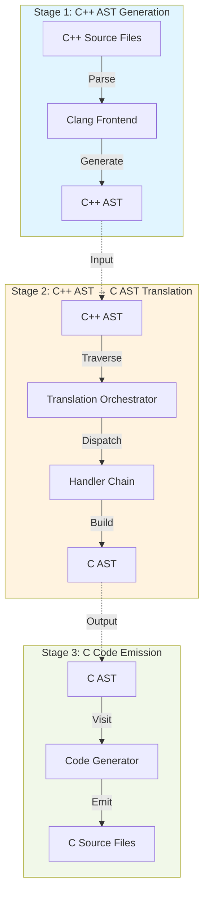
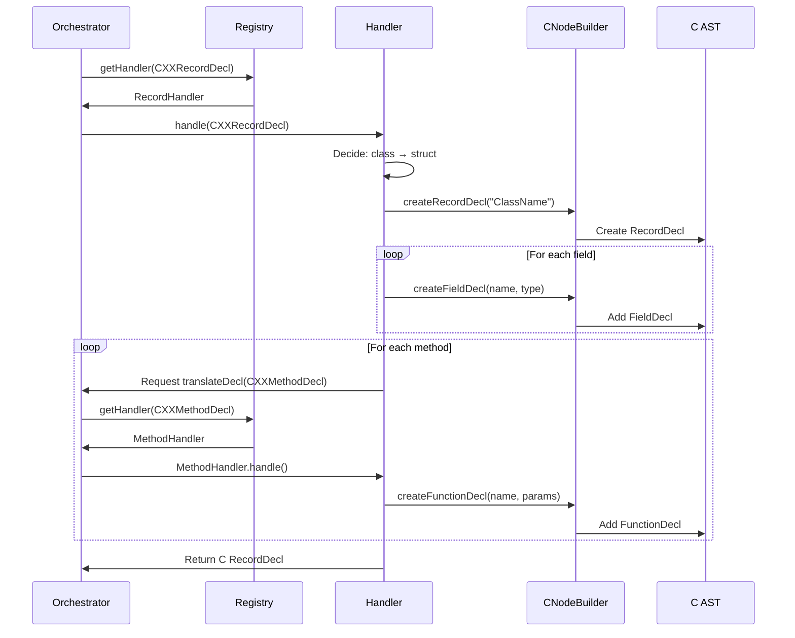
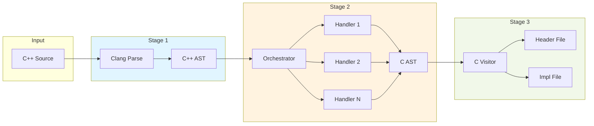

# C++ to C Transpiler: 3-Stage Pipeline Architecture

## Overview

The transpiler operates as a **3-stage pipeline** where each stage is independent, testable, and has a single clear responsibility.



## Stage 1: C++ AST Generation (Clang Frontend)

**Responsibility**: Parse C++ source code into Abstract Syntax Tree

### Input
- C++ source files (.cpp, .h)
- Compiler flags and includes

### Process
- Clang frontend parses C++ code
- Performs semantic analysis
- Generates fully-resolved C++ AST with type information

### Output
- **C++ AST**: `clang::TranslationUnitDecl` containing all declarations
- Complete type information via `clang::ASTContext`

### Key Components
- `clang::CompilerInstance`
- `clang::ASTConsumer`
- `clang::ASTContext`

### What Stage 1 DOES
✅ Parse C++ syntax
✅ Resolve types and templates
✅ Create semantic AST nodes
✅ Handle includes and preprocessing

### What Stage 1 DOES NOT DO
❌ Make C translation decisions
❌ Generate C AST
❌ Emit code

---

## Stage 2: C++ AST → C AST Translation (Handler Chain)

**Responsibility**: Transform C++ constructs into equivalent C constructs

### Input
- **C++ AST**: Complete `TranslationUnitDecl` from Stage 1
- **C AST Builder**: `CNodeBuilder` for creating C nodes

### Process
1. **Translation Orchestrator** traverses C++ AST
2. For each C++ node, **dispatch to appropriate handler**
3. Handler **decides how to represent in C**
4. Handler **creates C AST nodes** using `CNodeBuilder`
5. C AST nodes stored in **C TranslationUnitDecl**

### Output
- **C AST**: `clang::TranslationUnitDecl` containing C declarations
- All translation decisions complete
- Ready for code emission

### Key Components

#### Translation Orchestrator
```cpp
class TranslationOrchestrator {
    HandlerRegistry& handlers;
    HandlerContext& context;
    TranslationUnitDecl* c_tu;

public:
    void translateDecl(Decl* cppDecl);
    void translateStmt(Stmt* cppStmt);
    void translateExpr(Expr* cppExpr);
};
```

#### Handler Registry
```cpp
class HandlerRegistry {
    std::map<ASTNodeKind, ASTHandler*> handlers;

public:
    void registerHandler(ASTNodeKind kind, ASTHandler* handler);
    ASTHandler* getHandler(Decl* decl);
    ASTHandler* getHandler(Stmt* stmt);
    ASTHandler* getHandler(Expr* expr);
};
```

#### Handler Context
```cpp
class HandlerContext {
    ASTContext& cppContext;
    ASTContext& cContext;
    CNodeBuilder& builder;

    // Symbol tracking
    std::map<const Decl*, Decl*> declMap;
    std::map<const CXXMethodDecl*, FunctionDecl*> methodMap;
    std::map<const EnumConstantDecl*, EnumConstantDecl*> enumMap;

    // Type tracking
    std::map<QualType, QualType> typeMap;

    // Current state
    const FileEntry* currentFile;
    const CXXRecordDecl* currentClass;

public:
    // Symbol registration
    void registerDecl(const Decl* cpp, Decl* c);
    Decl* lookupDecl(const Decl* cpp);

    // Type translation
    QualType translateType(QualType cppType);

    // State management
    void enterClass(const CXXRecordDecl* cls);
    void exitClass();
};
```

### Handler Chain Flow



### What Stage 2 DOES
✅ **Decide** how to represent C++ in C
✅ Transform classes → structs
✅ Transform methods → functions with `this`
✅ Transform scoped enums → prefixed constants
✅ Transform references → pointers
✅ Transform templates → concrete types (monomorphization)
✅ Create C AST nodes for all C declarations
✅ Track symbol mappings (C++ decl → C decl)

### What Stage 2 DOES NOT DO
❌ Emit text/code
❌ Format output
❌ Manage files
❌ Print anything

---

## Stage 3: C Code Emission (Code Generator)

**Responsibility**: Convert C AST to formatted C source code

### Input
- **C AST**: `TranslationUnitDecl` from Stage 2
- All translation decisions already made

### Process
1. **C AST Visitor** walks the C AST
2. For each node, **emit corresponding C text**
3. Format code (indentation, spacing)
4. Manage output files (header vs implementation)

### Output
- **C header files** (.h): Declarations
- **C implementation files** (.c): Definitions

### Key Components

#### C AST Visitor
```cpp
class CASTVisitor {
    llvm::raw_ostream& headerOS;
    llvm::raw_ostream& implOS;
    int indentLevel;

public:
    void visitTranslationUnit(TranslationUnitDecl* TU);
    void visitRecordDecl(RecordDecl* RD);
    void visitFunctionDecl(FunctionDecl* FD);
    void visitVarDecl(VarDecl* VD);
    void visitStmt(Stmt* S);
    void visitExpr(Expr* E);

private:
    void emitType(QualType T);
    void emitIndent();
};
```

### What Stage 3 DOES
✅ Visit C AST nodes
✅ Emit C syntax text
✅ Format code (indentation, spacing)
✅ Separate declarations (header) from definitions (impl)
✅ Print exactly what's in C AST

### What Stage 3 DOES NOT DO
❌ Make translation decisions
❌ Transform C++ constructs
❌ Decide how to represent anything
❌ Look at C++ AST

---

## Critical Separation of Concerns

### ❌ WRONG: Translation in Stage 3
```cpp
// CodeGenerator (Stage 3) - BAD!
void printExpr(Expr* E) {
    if (DeclRefExpr* DRE = dyn_cast<DeclRefExpr>(E)) {
        if (EnumConstantDecl* ECD = dyn_cast<EnumConstantDecl>(DRE->getDecl())) {
            // WRONG: Making translation decision in code generator!
            if (isScoped) {
                OS << getEnumName() << "__" << ECD->getName();
            } else {
                OS << ECD->getName();
            }
        }
    }
}
```

### ✅ CORRECT: Translation in Stage 2
```cpp
// EnumHandler (Stage 2) - GOOD!
Expr* handleDeclRefExpr(DeclRefExpr* cppDRE) {
    if (EnumConstantDecl* cppECD = dyn_cast<EnumConstantDecl>(cppDRE->getDecl())) {
        // Lookup C enum constant (already translated with prefix if scoped)
        EnumConstantDecl* cECD = context.lookupEnumConstant(cppECD);
        return builder.createDeclRefExpr(cECD);
    }
}

// CodeGenerator (Stage 3) - GOOD!
void printExpr(Expr* E) {
    if (DeclRefExpr* DRE = dyn_cast<DeclRefExpr>(E)) {
        // Just emit the name - translation already done!
        OS << DRE->getDecl()->getNameAsString();
    }
}
```

---

## Data Flow



---

## Testing Strategy

### Stage 1 Testing
- **Given**: C++ source code
- **When**: Parse with Clang
- **Then**: Verify C++ AST structure is correct
- **Tools**: Clang's AST dump, AST matchers

### Stage 2 Testing
- **Given**: C++ AST node (mock or from Clang)
- **When**: Handler processes node
- **Then**: Verify correct C AST nodes created
- **Tools**: AST matchers, C AST inspection
- **Key**: Test handlers **independently** without code emission

### Stage 3 Testing
- **Given**: C AST (created by test or Stage 2)
- **When**: Visitor emits code
- **Then**: Verify C code text is correct
- **Tools**: String comparison, C compiler verification

### Integration Testing
- **Given**: C++ source file
- **When**: Run all 3 stages
- **Then**:
  - Generated C code compiles
  - Generated C code produces same output as C++
- **Tools**: Compiler, runtime execution comparison

---

## Benefits of 3-Stage Separation

### 1. Testability
- Each stage can be unit tested independently
- Mock inputs/outputs for each stage
- Isolate bugs to specific stage

### 2. Maintainability
- Clear responsibilities prevent "magic servlet" anti-pattern
- Changes to translation logic isolated to Stage 2
- Changes to code formatting isolated to Stage 3

### 3. Extensibility
- Add new handlers without touching other stages
- Modify C code formatting without touching translation
- Replace Stage 3 with different emitter (JSON, XML, etc.)

### 4. Debugging
- Inspect C++ AST (Stage 1 output)
- Inspect C AST (Stage 2 output)
- Inspect final C code (Stage 3 output)
- Identify exactly where problems occur

### 5. Performance
- Stages can be optimized independently
- Potential for parallel processing (multiple files through Stage 2)

---

## Detailed Documentation

For complete specifications of each stage, see:

- **Stage 1 (Clang Frontend)**: Standard Clang documentation
- **Stage 2 (Handler Chain)**:
  - [Handler Chain Pattern](02-handler-chain-pattern.md) - Complete architecture with interfaces
  - [Handler Specifications](handlers/) - Individual handler specs (9 handlers)
  - [Test Strategy](03-test-strategy.md) - TDD approach for handlers
- **Stage 3 (Code Generator)**: [Code Generator Specification](04-code-generator.md) - C AST visitor

---

## Summary

| Stage | Input | Output | Responsibility | Key Principle |
|-------|-------|--------|----------------|---------------|
| **1** | C++ source | C++ AST | Parse C++ | Let Clang do its job |
| **2** | C++ AST | C AST | Translate C++→C | Make ALL decisions here |
| **3** | C AST | C source | Emit text | Just print, don't think |

**Golden Rule**: Stage 2 decides WHAT to emit, Stage 3 decides HOW to format it.
