# Handler Chain Pattern: Stage 2 Architecture

## Overview

The **Handler Chain Pattern** (Chain of Responsibility) is the core architectural pattern for **Stage 2** of the transpiler pipeline. It splits the monolithic `CppToCVisitor` into specialized, single-responsibility handlers that each translate a specific C++ construct.

### Why Handler Chain?

**Current Problem**: `CppToCVisitor` is a "magic servlet" that:
- Handles 20+ different AST node types
- Manages file organization, template monomorphization, destructor injection
- Mixes concerns: translation, mapping, code generation prep
- Hard to understand, test, and maintain (violates SRP)

**Solution**: Chain of Responsibility Pattern
- Each handler has ONE clear responsibility
- Handlers are independently testable
- Easy to extend without modifying existing handlers (OCP)
- Clear data flow through the chain

---

## Chain of Responsibility Pattern

### Pattern Overview


### Handler Lifecycle


---

## Base Handler Interface

### ASTHandler Abstract Base Class

```cpp
namespace cpptoc {

/**
 * @class ASTHandler
 * @brief Abstract base class for all C++ AST to C AST translation handlers
 *
 * Each handler is responsible for translating a specific C++ construct.
 * Handlers are registered with HandlerRegistry and dispatched by
 * TranslationOrchestrator.
 *
 * Design Principles:
 * - Single Responsibility: Each handler translates ONE C++ construct
 * - Open/Closed: New handlers can be added without modifying existing ones
 * - Liskov Substitution: All handlers can be used interchangeably
 * - Interface Segregation: Only implement methods relevant to handler type
 * - Dependency Inversion: Depend on HandlerContext abstraction, not concrete types
 */
class ASTHandler {
public:
    virtual ~ASTHandler() = default;

    /**
     * @brief Check if this handler can process the given declaration
     * @param D C++ declaration to check
     * @return true if handler can process this declaration
     *
     * Example:
     * @code
     *   bool EnumTranslator::canHandle(const Decl* D) {
     *       return isa<EnumDecl>(D);
     *   }
     * @endcode
     */
    virtual bool canHandle(const clang::Decl* D) const { return false; }

    /**
     * @brief Check if this handler can process the given statement
     * @param S C++ statement to check
     * @return true if handler can process this statement
     */
    virtual bool canHandle(const clang::Stmt* S) const { return false; }

    /**
     * @brief Check if this handler can process the given expression
     * @param E C++ expression to check
     * @return true if handler can process this expression
     */
    virtual bool canHandle(const clang::Expr* E) const { return false; }

    /**
     * @brief Translate C++ declaration to C declaration
     * @param D C++ declaration to translate
     * @param ctx Shared context for symbol tables, type mappings, state
     * @return Translated C declaration, or nullptr if cannot translate
     *
     * The handler should:
     * 1. Cast D to specific declaration type (e.g., CXXRecordDecl)
     * 2. Use ctx to lookup/translate types
     * 3. Use ctx.builder to create C AST nodes
     * 4. Register mapping in ctx (ctx.registerDecl)
     * 5. Return created C declaration
     */
    virtual clang::Decl* handleDecl(const clang::Decl* D, HandlerContext& ctx) {
        return nullptr;
    }

    /**
     * @brief Translate C++ statement to C statement
     * @param S C++ statement to translate
     * @param ctx Shared context for symbol tables, type mappings, state
     * @return Translated C statement, or nullptr if cannot translate
     */
    virtual clang::Stmt* handleStmt(const clang::Stmt* S, HandlerContext& ctx) {
        return nullptr;
    }

    /**
     * @brief Translate C++ expression to C expression
     * @param E C++ expression to translate
     * @param ctx Shared context for symbol tables, type mappings, state
     * @return Translated C expression, or nullptr if cannot translate
     */
    virtual clang::Expr* handleExpr(const clang::Expr* E, HandlerContext& ctx) {
        return nullptr;
    }
};

} // namespace cpptoc
```

---

## HandlerContext: Shared State

### Context Overview

`HandlerContext` provides shared state and services to all handlers:
- Symbol tables (C++ decl → C decl mappings)
- Type translation cache
- Current file/class context
- Access to `CNodeBuilder` for C AST creation

### HandlerContext Interface

```cpp
namespace cpptoc {

/**
 * @class HandlerContext
 * @brief Shared context passed between handlers during translation
 *
 * Provides:
 * - Symbol table for tracking C++ → C declaration mappings
 * - Type translation and caching
 * - Current translation state (file, class)
 * - Access to CNodeBuilder for C AST creation
 *
 * Design:
 * - Separates concerns: handlers don't need to manage global state
 * - Thread-safe if needed (future enhancement)
 * - Testable: can create mock contexts for unit tests
 */
class HandlerContext {
private:
    // AST Contexts
    clang::ASTContext& cppContext_;
    clang::ASTContext& cContext_;
    clang::CNodeBuilder& builder_;

    // Symbol tables: C++ → C mappings
    std::map<const clang::Decl*, clang::Decl*> declMap_;
    std::map<const clang::CXXMethodDecl*, clang::FunctionDecl*> methodMap_;
    std::map<const clang::CXXConstructorDecl*, clang::FunctionDecl*> ctorMap_;
    std::map<const clang::CXXDestructorDecl*, clang::FunctionDecl*> dtorMap_;
    std::map<const clang::EnumConstantDecl*, clang::EnumConstantDecl*> enumMap_;

    // Type translation cache
    std::map<clang::QualType, clang::QualType> typeMap_;

    // Current translation state
    const clang::FileEntry* currentFile_;
    const clang::CXXRecordDecl* currentClass_;

public:
    /**
     * @brief Construct handler context
     * @param cppCtx C++ ASTContext (input)
     * @param cCtx C ASTContext (output)
     * @param builder CNodeBuilder for creating C nodes
     */
    HandlerContext(clang::ASTContext& cppCtx,
                   clang::ASTContext& cCtx,
                   clang::CNodeBuilder& builder)
        : cppContext_(cppCtx), cContext_(cCtx), builder_(builder),
          currentFile_(nullptr), currentClass_(nullptr) {}

    // ========================================================================
    // AST Context Access
    // ========================================================================

    clang::ASTContext& getCppContext() { return cppContext_; }
    clang::ASTContext& getCContext() { return cContext_; }
    clang::CNodeBuilder& getBuilder() { return builder_; }

    // ========================================================================
    // Symbol Registration and Lookup
    // ========================================================================

    /**
     * @brief Register C++ declaration → C declaration mapping
     * @param cppDecl C++ declaration (source)
     * @param cDecl C declaration (target)
     *
     * Allows later lookups to find the C equivalent of a C++ declaration.
     */
    void registerDecl(const clang::Decl* cppDecl, clang::Decl* cDecl) {
        declMap_[cppDecl] = cDecl;

        // Also store in specialized maps
        if (auto* method = llvm::dyn_cast<clang::CXXMethodDecl>(cppDecl)) {
            if (auto* func = llvm::dyn_cast<clang::FunctionDecl>(cDecl)) {
                methodMap_[method] = func;
            }
        }
        if (auto* ctor = llvm::dyn_cast<clang::CXXConstructorDecl>(cppDecl)) {
            if (auto* func = llvm::dyn_cast<clang::FunctionDecl>(cDecl)) {
                ctorMap_[ctor] = func;
            }
        }
        if (auto* dtor = llvm::dyn_cast<clang::CXXDestructorDecl>(cppDecl)) {
            if (auto* func = llvm::dyn_cast<clang::FunctionDecl>(cDecl)) {
                dtorMap_[dtor] = func;
            }
        }
        if (auto* enumConst = llvm::dyn_cast<clang::EnumConstantDecl>(cppDecl)) {
            if (auto* cEnumConst = llvm::dyn_cast<clang::EnumConstantDecl>(cDecl)) {
                enumMap_[enumConst] = cEnumConst;
            }
        }
    }

    /**
     * @brief Lookup C declaration for C++ declaration
     * @param cppDecl C++ declaration to lookup
     * @return C declaration, or nullptr if not found
     */
    clang::Decl* lookupDecl(const clang::Decl* cppDecl) const {
        auto it = declMap_.find(cppDecl);
        return it != declMap_.end() ? it->second : nullptr;
    }

    /**
     * @brief Lookup C function for C++ method
     * @param cppMethod C++ method to lookup
     * @return C function, or nullptr if not found
     */
    clang::FunctionDecl* lookupMethod(const clang::CXXMethodDecl* cppMethod) const {
        auto it = methodMap_.find(cppMethod);
        return it != methodMap_.end() ? it->second : nullptr;
    }

    /**
     * @brief Lookup C enum constant for C++ enum constant
     * @param cppEnum C++ enum constant to lookup
     * @return C enum constant, or nullptr if not found
     */
    clang::EnumConstantDecl* lookupEnumConstant(const clang::EnumConstantDecl* cppEnum) const {
        auto it = enumMap_.find(cppEnum);
        return it != enumMap_.end() ? it->second : nullptr;
    }

    // ========================================================================
    // Type Translation
    // ========================================================================

    /**
     * @brief Translate C++ type to C type
     * @param cppType C++ type to translate
     * @return C type
     *
     * Handles:
     * - References (T&) → pointers (T*)
     * - Classes → structs
     * - Scoped enums → int
     * - Templates → monomorphized types
     */
    clang::QualType translateType(clang::QualType cppType) {
        // Check cache
        auto it = typeMap_.find(cppType);
        if (it != typeMap_.end()) {
            return it->second;
        }

        // Translate based on type kind
        clang::QualType cType;

        if (cppType->isReferenceType()) {
            // T& → T*
            clang::QualType pointee = cppType->getPointeeType();
            cType = cContext_.getPointerType(translateType(pointee));
        }
        else if (auto* recordType = cppType->getAs<clang::RecordType>()) {
            // Class → struct (lookup in declMap)
            if (auto* cxxRecord = llvm::dyn_cast<clang::CXXRecordDecl>(recordType->getDecl())) {
                if (auto* cRecord = llvm::dyn_cast_or_null<clang::RecordDecl>(lookupDecl(cxxRecord))) {
                    cType = cContext_.getRecordType(cRecord);
                } else {
                    cType = cppType; // Fallback
                }
            } else {
                cType = cppType; // Plain struct, no translation needed
            }
        }
        else if (cppType->isEnumeralType()) {
            // Scoped enum → int
            if (auto* enumType = cppType->getAs<clang::EnumType>()) {
                if (auto* enumDecl = enumType->getDecl()) {
                    if (enumDecl->isScoped()) {
                        cType = cContext_.IntTy;
                    } else {
                        cType = cppType; // Unscoped enum, keep as-is
                    }
                }
            }
        }
        else {
            // Default: no translation
            cType = cppType;
        }

        // Cache result
        typeMap_[cppType] = cType;
        return cType;
    }

    // ========================================================================
    // Current State Management
    // ========================================================================

    /**
     * @brief Enter class context (for translating methods)
     * @param cls C++ class being translated
     */
    void enterClass(const clang::CXXRecordDecl* cls) {
        currentClass_ = cls;
    }

    /**
     * @brief Exit class context
     */
    void exitClass() {
        currentClass_ = nullptr;
    }

    /**
     * @brief Get current class context
     * @return Current class, or nullptr if not in class
     */
    const clang::CXXRecordDecl* getCurrentClass() const {
        return currentClass_;
    }

    /**
     * @brief Set current file being translated
     * @param file Current file
     */
    void setCurrentFile(const clang::FileEntry* file) {
        currentFile_ = file;
    }

    /**
     * @brief Get current file being translated
     * @return Current file, or nullptr if not set
     */
    const clang::FileEntry* getCurrentFile() const {
        return currentFile_;
    }
};

} // namespace cpptoc
```

---

## HandlerRegistry: Handler Management

### Registry Overview

`HandlerRegistry` manages handler registration and dispatch:
- Maps AST node kinds to appropriate handlers
- Provides lookup for declarations, statements, expressions
- Supports handler chaining (multiple handlers for same node type)

### HandlerRegistry Interface

```cpp
namespace cpptoc {

/**
 * @class HandlerRegistry
 * @brief Registry for AST handlers
 *
 * Manages handler registration and dispatch based on AST node type.
 * Supports multiple handlers per node type (chain).
 *
 * Usage:
 * @code
 *   HandlerRegistry registry;
 *   registry.registerHandler(std::make_unique<EnumTranslator>());
 *   registry.registerHandler(std::make_unique<ClassToStructTranslator>());
 *
 *   ASTHandler* handler = registry.getHandler(enumDecl);
 *   if (handler) {
 *       Decl* cDecl = handler->handleDecl(enumDecl, ctx);
 *   }
 * @endcode
 */
class HandlerRegistry {
private:
    // Handlers organized by category
    std::vector<std::unique_ptr<ASTHandler>> declHandlers_;
    std::vector<std::unique_ptr<ASTHandler>> stmtHandlers_;
    std::vector<std::unique_ptr<ASTHandler>> exprHandlers_;

public:
    /**
     * @brief Register a declaration handler
     * @param handler Handler to register (takes ownership)
     */
    void registerHandler(std::unique_ptr<ASTHandler> handler) {
        declHandlers_.push_back(std::move(handler));
    }

    /**
     * @brief Find handler for declaration
     * @param D Declaration to handle
     * @return Handler that can process D, or nullptr if none found
     *
     * Searches registered handlers in order, returns first that canHandle(D).
     */
    ASTHandler* getHandler(const clang::Decl* D) const {
        for (const auto& handler : declHandlers_) {
            if (handler->canHandle(D)) {
                return handler.get();
            }
        }
        return nullptr;
    }

    /**
     * @brief Find handler for statement
     * @param S Statement to handle
     * @return Handler that can process S, or nullptr if none found
     */
    ASTHandler* getHandler(const clang::Stmt* S) const {
        for (const auto& handler : stmtHandlers_) {
            if (handler->canHandle(S)) {
                return handler.get();
            }
        }
        return nullptr;
    }

    /**
     * @brief Find handler for expression
     * @param E Expression to handle
     * @return Handler that can process E, or nullptr if none found
     */
    ASTHandler* getHandler(const clang::Expr* E) const {
        for (const auto& handler : exprHandlers_) {
            if (handler->canHandle(E)) {
                return handler.get();
            }
        }
        return nullptr;
    }
};

} // namespace cpptoc
```

---

## TranslationOrchestrator: Handler Coordination

### Orchestrator Overview

`TranslationOrchestrator` coordinates the handler chain:
- Traverses C++ AST using `RecursiveASTVisitor`
- Dispatches nodes to appropriate handlers via `HandlerRegistry`
- Manages C TranslationUnitDecl construction

### TranslationOrchestrator Interface

```cpp
namespace cpptoc {

/**
 * @class TranslationOrchestrator
 * @brief Coordinates handler chain for C++ AST → C AST translation
 *
 * Responsibilities:
 * - Traverse C++ AST
 * - Dispatch nodes to handlers
 * - Build C TranslationUnitDecl
 *
 * Design:
 * - Delegates translation to specialized handlers
 * - Maintains handler registry and context
 * - Single entry point for Stage 2 translation
 */
class TranslationOrchestrator : public clang::RecursiveASTVisitor<TranslationOrchestrator> {
private:
    HandlerRegistry& registry_;
    HandlerContext& context_;
    clang::TranslationUnitDecl* c_tu_;

public:
    /**
     * @brief Construct orchestrator
     * @param registry Handler registry
     * @param context Shared handler context
     * @param c_tu C TranslationUnitDecl to populate
     */
    TranslationOrchestrator(HandlerRegistry& registry,
                           HandlerContext& context,
                           clang::TranslationUnitDecl* c_tu)
        : registry_(registry), context_(context), c_tu_(c_tu) {}

    /**
     * @brief Translate C++ declaration to C
     * @param D C++ declaration
     * @return C declaration, or nullptr if cannot translate
     */
    clang::Decl* translateDecl(const clang::Decl* D) {
        // Find handler
        ASTHandler* handler = registry_.getHandler(D);
        if (!handler) {
            return nullptr; // No handler for this node type
        }

        // Delegate to handler
        clang::Decl* cDecl = handler->handleDecl(D, context_);
        if (cDecl) {
            // Add to C TranslationUnit
            c_tu_->addDecl(cDecl);
        }

        return cDecl;
    }

    /**
     * @brief Translate C++ statement to C
     * @param S C++ statement
     * @return C statement, or nullptr if cannot translate
     */
    clang::Stmt* translateStmt(const clang::Stmt* S) {
        ASTHandler* handler = registry_.getHandler(S);
        if (!handler) {
            return nullptr;
        }

        return handler->handleStmt(S, context_);
    }

    /**
     * @brief Translate C++ expression to C
     * @param E C++ expression
     * @return C expression, or nullptr if cannot translate
     */
    clang::Expr* translateExpr(const clang::Expr* E) {
        ASTHandler* handler = registry_.getHandler(E);
        if (!handler) {
            return nullptr;
        }

        return handler->handleExpr(E, context_);
    }

    // ========================================================================
    // RecursiveASTVisitor interface
    // ========================================================================

    /**
     * @brief Visit translation unit declaration
     */
    bool VisitTranslationUnitDecl(clang::TranslationUnitDecl* TU) {
        // Traverse all top-level declarations
        for (auto* D : TU->decls()) {
            translateDecl(D);
        }
        return true;
    }

    /**
     * @brief Visit record declaration (class/struct)
     */
    bool VisitCXXRecordDecl(clang::CXXRecordDecl* D) {
        translateDecl(D);
        return true;
    }

    /**
     * @brief Visit enum declaration
     */
    bool VisitEnumDecl(clang::EnumDecl* D) {
        translateDecl(D);
        return true;
    }

    /**
     * @brief Visit function declaration
     */
    bool VisitFunctionDecl(clang::FunctionDecl* D) {
        translateDecl(D);
        return true;
    }

    // Additional Visit methods for other node types...
};

} // namespace cpptoc
```

---

## Specialized Handlers

### Example: EnumTranslator

```cpp
namespace cpptoc {

/**
 * @class EnumTranslator
 * @brief Translates C++ enums to C enums
 *
 * Handles:
 * - Scoped enums (enum class) → unscoped enums with prefixed constants
 * - Enum constant references → prefixed references
 * - Enum type → int (for scoped enums)
 */
class EnumTranslator : public ASTHandler {
public:
    bool canHandle(const clang::Decl* D) const override {
        return llvm::isa<clang::EnumDecl>(D);
    }

    bool canHandle(const clang::Expr* E) const override {
        if (auto* DRE = llvm::dyn_cast<clang::DeclRefExpr>(E)) {
            return llvm::isa<clang::EnumConstantDecl>(DRE->getDecl());
        }
        return false;
    }

    clang::Decl* handleDecl(const clang::Decl* D, HandlerContext& ctx) override {
        auto* enumDecl = llvm::cast<clang::EnumDecl>(D);
        bool isScoped = enumDecl->isScoped();
        std::string enumName = enumDecl->getNameAsString();

        // Create C enum
        clang::CNodeBuilder& builder = ctx.getBuilder();
        clang::EnumDecl* cEnum = builder.createEnumDecl(enumName);

        // Translate enum constants
        for (auto* enumConst : enumDecl->enumerators()) {
            std::string constName = enumConst->getNameAsString();

            // Prefix if scoped: GameState::Menu → GameState__Menu
            if (isScoped) {
                constName = enumName + "__" + constName;
            }

            // Create C enum constant
            clang::EnumConstantDecl* cConst =
                builder.createEnumConstant(constName, enumConst->getInitVal());

            // Register mapping
            ctx.registerDecl(enumConst, cConst);
        }

        // Register enum mapping
        ctx.registerDecl(enumDecl, cEnum);

        return cEnum;
    }

    clang::Expr* handleExpr(const clang::Expr* E, HandlerContext& ctx) override {
        auto* DRE = llvm::cast<clang::DeclRefExpr>(E);
        auto* enumConst = llvm::cast<clang::EnumConstantDecl>(DRE->getDecl());

        // Lookup C enum constant (already translated with prefix)
        clang::EnumConstantDecl* cConst = ctx.lookupEnumConstant(enumConst);
        if (!cConst) {
            return nullptr; // Not translated yet
        }

        // Create reference to C enum constant
        return ctx.getBuilder().createDeclRefExpr(cConst);
    }
};

} // namespace cpptoc
```

### Example: ClassToStructTranslator

```cpp
namespace cpptoc {

/**
 * @class ClassToStructTranslator
 * @brief Translates C++ classes to C structs
 *
 * Handles:
 * - Class fields → struct fields
 * - Access specifiers → ignored (C has no access control)
 * - Base classes → embedded struct fields (if needed)
 */
class ClassToStructTranslator : public ASTHandler {
public:
    bool canHandle(const clang::Decl* D) const override {
        return llvm::isa<clang::CXXRecordDecl>(D);
    }

    clang::Decl* handleDecl(const clang::Decl* D, HandlerContext& ctx) override {
        auto* cxxRecord = llvm::cast<clang::CXXRecordDecl>(D);
        std::string className = cxxRecord->getNameAsString();

        // Create C struct
        clang::CNodeBuilder& builder = ctx.getBuilder();
        clang::RecordDecl* cStruct = builder.createRecordDecl(className);

        // Enter class context (for method translation)
        ctx.enterClass(cxxRecord);

        // Translate fields
        for (auto* field : cxxRecord->fields()) {
            clang::QualType cppType = field->getType();
            clang::QualType cType = ctx.translateType(cppType);
            std::string fieldName = field->getNameAsString();

            // Create C field
            clang::FieldDecl* cField = builder.createFieldDecl(fieldName, cType);
            cStruct->addDecl(cField);
        }

        // Register mapping
        ctx.registerDecl(cxxRecord, cStruct);

        // Exit class context
        ctx.exitClass();

        return cStruct;
    }
};

} // namespace cpptoc
```

### Example: MethodToFunctionTranslator

```cpp
namespace cpptoc {

/**
 * @class MethodToFunctionTranslator
 * @brief Translates C++ methods to C functions
 *
 * Handles:
 * - Method → function with explicit `this` parameter
 * - Method calls → function calls with `this` argument
 * - Member access → pointer dereference
 */
class MethodToFunctionTranslator : public ASTHandler {
public:
    bool canHandle(const clang::Decl* D) const override {
        return llvm::isa<clang::CXXMethodDecl>(D);
    }

    clang::Decl* handleDecl(const clang::Decl* D, HandlerContext& ctx) override {
        auto* method = llvm::cast<clang::CXXMethodDecl>(D);
        auto* parentClass = method->getParent();

        std::string className = parentClass->getNameAsString();
        std::string methodName = method->getNameAsString();
        std::string funcName = className + "_" + methodName;

        // Lookup parent struct
        clang::RecordDecl* cStruct =
            llvm::dyn_cast_or_null<clang::RecordDecl>(ctx.lookupDecl(parentClass));
        if (!cStruct) {
            return nullptr; // Parent not translated yet
        }

        // Build parameter list: this + original params
        clang::CNodeBuilder& builder = ctx.getBuilder();
        std::vector<clang::ParmVarDecl*> cParams;

        // Add `this` parameter: ClassName* this
        clang::QualType thisType = ctx.getCContext().getPointerType(
            ctx.getCContext().getRecordType(cStruct));
        clang::ParmVarDecl* thisParam = builder.createParmVarDecl("this", thisType);
        cParams.push_back(thisParam);

        // Add original parameters
        for (auto* param : method->parameters()) {
            clang::QualType cppType = param->getType();
            clang::QualType cType = ctx.translateType(cppType);
            std::string paramName = param->getNameAsString();

            clang::ParmVarDecl* cParam = builder.createParmVarDecl(paramName, cType);
            cParams.push_back(cParam);
        }

        // Create C function
        clang::QualType returnType = ctx.translateType(method->getReturnType());
        clang::FunctionDecl* cFunc = builder.createFunctionDecl(
            funcName, returnType, cParams);

        // Register mapping
        ctx.registerDecl(method, cFunc);

        return cFunc;
    }
};

} // namespace cpptoc
```

---

## Handler Dispatch Flow

### Complete Dispatch Sequence


---

## Testing Strategy

### Unit Testing Handlers

Each handler can be tested independently:

```cpp
// Test: EnumTranslator handles scoped enums
TEST(EnumTranslatorTest, ScopedEnumGetsPrefixedConstants) {
    // Setup
    ASTContext cppCtx = createMockCppContext();
    ASTContext cCtx = createMockCContext();
    CNodeBuilder builder(cCtx);
    HandlerContext ctx(cppCtx, cCtx, builder);

    EnumTranslator translator;

    // Create C++ scoped enum
    EnumDecl* cppEnum = createScopedEnum("GameState", {"Menu", "Playing", "GameOver"});

    // Translate
    Decl* result = translator.handleDecl(cppEnum, ctx);

    // Assert
    ASSERT_NE(result, nullptr);
    EnumDecl* cEnum = dyn_cast<EnumDecl>(result);
    ASSERT_NE(cEnum, nullptr);

    // Check constants are prefixed
    std::vector<std::string> expectedNames = {
        "GameState__Menu",
        "GameState__Playing",
        "GameState__GameOver"
    };
    EXPECT_EQ(getEnumConstantNames(cEnum), expectedNames);
}
```

### Integration Testing Handler Chain

Test multiple handlers working together:

```cpp
// Test: Full class translation (class → struct + methods → functions)
TEST(HandlerChainTest, ClassWithMethodsTranslatesToStructWithFunctions) {
    // Setup
    HandlerRegistry registry;
    registry.registerHandler(std::make_unique<FileOriginFilter>());
    registry.registerHandler(std::make_unique<ClassToStructTranslator>());
    registry.registerHandler(std::make_unique<MethodToFunctionTranslator>());

    HandlerContext ctx(cppCtx, cCtx, builder);
    TranslationOrchestrator orchestrator(registry, ctx, c_tu);

    // Input: C++ class with method
    CXXRecordDecl* cppClass = parseCpp(R"(
        class Point {
            int x, y;
        public:
            void move(int dx, int dy);
        };
    )");

    // Translate
    orchestrator.translateDecl(cppClass);

    // Assert: C struct created
    RecordDecl* cStruct = dyn_cast<RecordDecl>(ctx.lookupDecl(cppClass));
    ASSERT_NE(cStruct, nullptr);
    EXPECT_EQ(cStruct->getNameAsString(), "Point");

    // Assert: Fields preserved
    EXPECT_EQ(cStruct->field_count(), 2);

    // Assert: Method → function with `this`
    FunctionDecl* moveFunc = findFunctionByName(c_tu, "Point_move");
    ASSERT_NE(moveFunc, nullptr);
    EXPECT_EQ(moveFunc->getNumParams(), 3); // this + dx + dy
    EXPECT_EQ(moveFunc->getParamDecl(0)->getNameAsString(), "this");
}
```

---

## Handler Hierarchy

### Current Handlers in Codebase

Based on existing code, these are candidates for refactoring into handlers:

```mermaid
classDiagram
    class ASTHandler {
        <<interface>>
    }

    %% File filtering
    class FileOriginFilter {
        +canHandle(Decl) bool
        +handleDecl(Decl, ctx) Decl*
    }

    %% Declaration handlers
    class EnumTranslator {
        +handleDecl(EnumDecl) EnumDecl*
        +handleExpr(DeclRefExpr) Expr*
    }

    class ClassToStructTranslator {
        +handleDecl(CXXRecordDecl) RecordDecl*
    }

    class MethodToFunctionTranslator {
        +handleDecl(CXXMethodDecl) FunctionDecl*
    }

    class ConstructorTranslator {
        +handleDecl(CXXConstructorDecl) FunctionDecl*
    }

    class DestructorTranslator {
        +handleDecl(CXXDestructorDecl) FunctionDecl*
    }

    class FunctionTranslator {
        +handleDecl(FunctionDecl) FunctionDecl*
    }

    class VariableTranslator {
        +handleDecl(VarDecl) VarDecl*
    }

    %% Template handlers
    class TemplateMonomorphizer {
        +handleDecl(ClassTemplateDecl) RecordDecl*
    }

    %% Expression handlers
    class MemberAccessTranslator {
        +handleExpr(MemberExpr) Expr*
    }

    class MethodCallTranslator {
        +handleExpr(CXXMemberCallExpr) CallExpr*
    }

    class ConstructorCallTranslator {
        +handleExpr(CXXConstructExpr) CallExpr*
    }

    class ReferenceTranslator {
        +handleExpr(Expr) Expr*
    }

    %% Statement handlers
    class CompoundStmtTranslator {
        +handleStmt(CompoundStmt) CompoundStmt*
    }

    class ReturnStmtTranslator {
        +handleStmt(ReturnStmt) ReturnStmt*
    }

    class IfStmtTranslator {
        +handleStmt(IfStmt) IfStmt*
    }

    class ForStmtTranslator {
        +handleStmt(ForStmt) ForStmt*
    }

    class WhileStmtTranslator {
        +handleStmt(WhileStmt) WhileStmt*
    }

    %% Advanced features (existing specialized handlers)
    class VirtualMethodHandler {
        +handleDecl(CXXMethodDecl) FunctionDecl*
    }

    class ExceptionHandler {
        +handleStmt(CXXTryStmt) Stmt*
        +handleExpr(CXXThrowExpr) Expr*
    }

    class RTTIHandler {
        +handleExpr(CXXTypeidExpr) Expr*
        +handleExpr(CXXDynamicCastExpr) Expr*
    }

    ASTHandler <|.. FileOriginFilter
    ASTHandler <|.. EnumTranslator
    ASTHandler <|.. ClassToStructTranslator
    ASTHandler <|.. MethodToFunctionTranslator
    ASTHandler <|.. ConstructorTranslator
    ASTHandler <|.. DestructorTranslator
    ASTHandler <|.. FunctionTranslator
    ASTHandler <|.. VariableTranslator
    ASTHandler <|.. TemplateMonomorphizer
    ASTHandler <|.. MemberAccessTranslator
    ASTHandler <|.. MethodCallTranslator
    ASTHandler <|.. ConstructorCallTranslator
    ASTHandler <|.. ReferenceTranslator
    ASTHandler <|.. CompoundStmtTranslator
    ASTHandler <|.. ReturnStmtTranslator
    ASTHandler <|.. IfStmtTranslator
    ASTHandler <|.. ForStmtTranslator
    ASTHandler <|.. WhileStmtTranslator
    ASTHandler <|.. VirtualMethodHandler
    ASTHandler <|.. ExceptionHandler
    ASTHandler <|.. RTTIHandler
```



---

## Implementation Roadmap

### Phase 1: Foundation (Before Refactoring)

1. **Get to 100% test pass rate** with current architecture
2. **Write integration tests** for all 5 validation cases
3. **Document current behavior** (this ensures no regression)

### Phase 2: Create Handler Infrastructure

1. **Create base classes**:
   - `ASTHandler` (abstract base)
   - `HandlerContext` (shared state)
   - `HandlerRegistry` (handler management)
   - `TranslationOrchestrator` (coordination)

2. **Write tests** for infrastructure:
   - Mock handlers for testing
   - Context state management
   - Registry dispatch

### Phase 3: Extract Handlers One-by-One

For each handler (start simple, build up):

1. **Extract handler** (e.g., `EnumTranslator`)
2. **Write unit tests** for handler
3. **Update orchestrator** to use handler
4. **Run integration tests** (should still pass)
5. **Commit** (one handler per commit)

**Order**:
1. `FileOriginFilter` (already exists, refactor to handler)
2. `EnumTranslator` (simple, no dependencies)
3. `ClassToStructTranslator` (moderate complexity)
4. `MethodToFunctionTranslator` (depends on ClassToStructTranslator)
5. `ConstructorTranslator`
6. `DestructorTranslator`
7. `TemplateMonomorphizer` (complex, already partially extracted)
8. Expression handlers
9. Statement handlers

### Phase 4: Deprecate CppToCVisitor

1. **Move all logic** to handlers
2. **Make CppToCVisitor** a thin wrapper around `TranslationOrchestrator`
3. **Eventually remove** CppToCVisitor entirely

---

## Benefits of Handler Chain

### Single Responsibility Principle (SRP)

**Before**:
```cpp
// CppToCVisitor: 3000+ lines, 20+ responsibilities
class CppToCVisitor {
    void VisitEnumDecl();
    void VisitCXXRecordDecl();
    void VisitCXXMethodDecl();
    void VisitCXXConstructorDecl();
    void VisitFunctionDecl();
    void VisitVarDecl();
    void printExpr();  // Mixing translation + emission!
    void monomorphize();
    void injectDestructor();
    // ...
};
```

**After**:
```cpp
// EnumTranslator: 100 lines, 1 responsibility
class EnumTranslator : public ASTHandler {
    Decl* handleDecl(EnumDecl*, ctx);  // Only enum translation
};

// ClassToStructTranslator: 150 lines, 1 responsibility
class ClassToStructTranslator : public ASTHandler {
    Decl* handleDecl(CXXRecordDecl*, ctx);  // Only class→struct
};
```

### Open/Closed Principle (OCP)

**Before**: Adding new translation requires modifying `CppToCVisitor`

**After**: Adding new translation = create new handler, register it
```cpp
// Add C++20 coroutine support: just create handler, no changes to existing code
class CoroutineTranslator : public ASTHandler { /* ... */ };
registry.registerHandler(std::make_unique<CoroutineTranslator>());
```

### Liskov Substitution Principle (LSP)

All handlers can be used interchangeably through `ASTHandler` interface:
```cpp
void processDecl(Decl* D, ASTHandler* handler, HandlerContext& ctx) {
    // Works with ANY handler
    if (handler->canHandle(D)) {
        handler->handleDecl(D, ctx);
    }
}
```

### Interface Segregation Principle (ISP)

Handlers only implement methods they need:
```cpp
// EnumTranslator only handles decls + exprs, not stmts
class EnumTranslator : public ASTHandler {
    bool canHandle(const Decl* D) override { /* enum check */ }
    bool canHandle(const Expr* E) override { /* enum ref check */ }
    Decl* handleDecl(const Decl* D, ctx) override { /* translate */ }
    Expr* handleExpr(const Expr* E, ctx) override { /* translate */ }
    // No handleStmt - not needed
};
```

### Dependency Inversion Principle (DIP)

Handlers depend on `HandlerContext` abstraction, not concrete types:
```cpp
class EnumTranslator : public ASTHandler {
    Decl* handleDecl(const Decl* D, HandlerContext& ctx) {
        // Depend on HandlerContext interface, not CppToCVisitor
        CNodeBuilder& builder = ctx.getBuilder();
        ctx.registerDecl(cpp, c);
    }
};
```

---

## Summary

### Handler Chain Pattern Key Points

1. **Single Responsibility**: Each handler translates ONE C++ construct
2. **Chain of Responsibility**: Handlers registered and dispatched by registry
3. **Shared Context**: `HandlerContext` provides symbol tables, type cache, state
4. **Independent Testing**: Each handler unit tested separately
5. **Incremental Refactoring**: Extract handlers one-by-one, tests prevent regression

### Next Steps

1. Review this architecture document
2. Get current tests to 100% pass rate
3. Write integration tests
4. Start extracting handlers (begin with `EnumTranslator`)

### Related Documentation

- [01-pipeline-architecture.md](01-pipeline-architecture.md) - 3-stage pipeline overview
- [ARCHITECTURE.md](../ARCHITECTURE.md) - Overall transpiler architecture
- [EXTENSION_GUIDE.md](EXTENSION_GUIDE.md) - How to extend the transpiler
