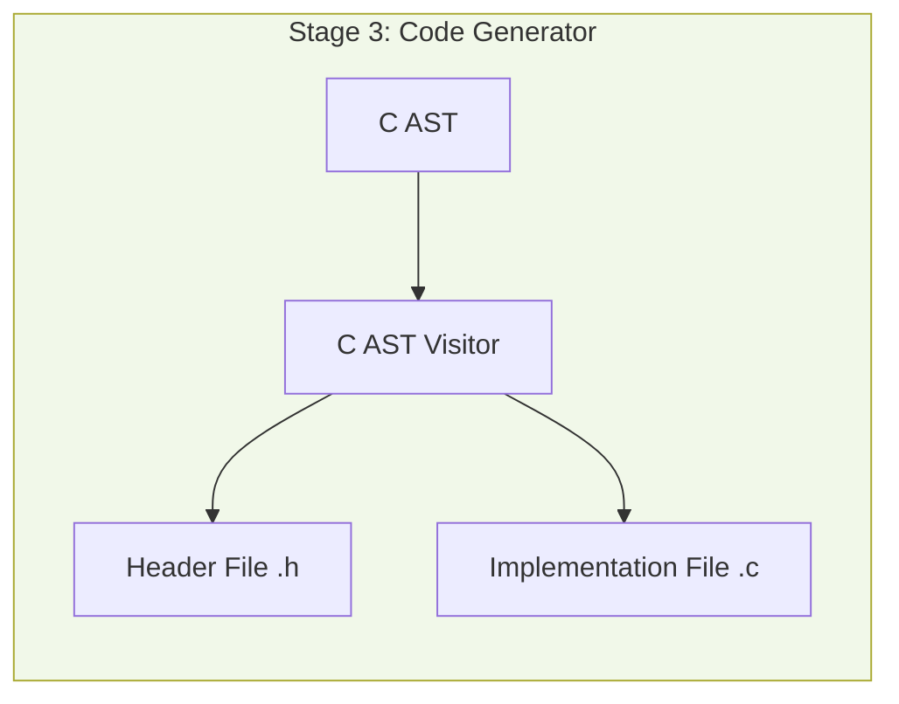
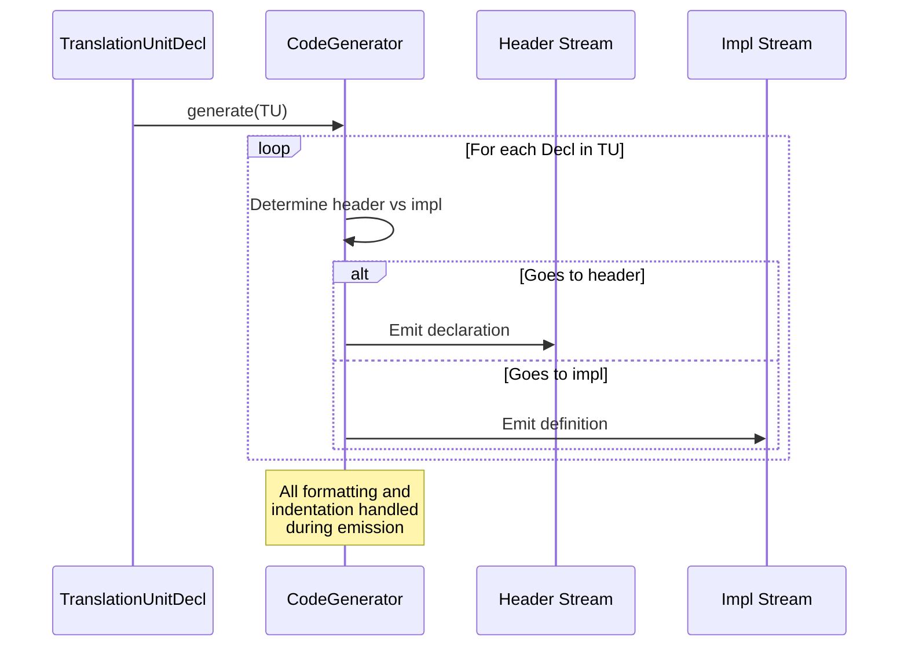

# Code Generator: C AST Visitor Specification

## Overview

The Code Generator is **Stage 3** of the transpilation pipeline. It is a pure emission component that walks the C AST created by Stage 2 and generates formatted C source code.



## Responsibility

**ONLY ONE THING**: Convert C AST nodes to formatted C text.

### What Code Generator DOES
✅ Walk C AST tree
✅ Emit C syntax text for each node
✅ Format code (indentation, spacing, newlines)
✅ Separate declarations (header) from definitions (implementation)
✅ Manage file output streams

### What Code Generator DOES NOT DO
❌ Make translation decisions
❌ Transform C++ constructs
❌ Decide how to represent anything
❌ Look at C++ AST
❌ Access HandlerContext or translation state

## Critical Principle

**"Just print what's in the AST - don't think"**

All translation decisions were already made in Stage 2. The C AST contains fully-translated C nodes with correct names, types, and structure. Code Generator simply converts AST structure to text.

---

## Architecture

### Class Structure

```cpp
class CodeGenerator {
    // Output streams
    llvm::raw_ostream& headerStream;
    llvm::raw_ostream& implStream;

    // AST context
    ASTContext& cContext;

    // Formatting state
    int indentLevel;

public:
    CodeGenerator(llvm::raw_ostream& header,
                  llvm::raw_ostream& impl,
                  ASTContext& ctx);

    // Entry point
    void generate(TranslationUnitDecl* TU);

private:
    // Visitor methods
    void visitTranslationUnit(TranslationUnitDecl* TU);
    void visitDecl(Decl* D);
    void visitRecordDecl(RecordDecl* RD);
    void visitFunctionDecl(FunctionDecl* FD);
    void visitVarDecl(VarDecl* VD);
    void visitEnumDecl(EnumDecl* ED);

    void visitStmt(Stmt* S);
    void visitCompoundStmt(CompoundStmt* CS);
    void visitIfStmt(IfStmt* IS);
    void visitWhileStmt(WhileStmt* WS);
    void visitForStmt(ForStmt* FS);
    void visitReturnStmt(ReturnStmt* RS);

    void visitExpr(Expr* E);
    void visitBinaryOperator(BinaryOperator* BO);
    void visitUnaryOperator(UnaryOperator* UO);
    void visitDeclRefExpr(DeclRefExpr* DRE);
    void visitMemberExpr(MemberExpr* ME);
    void visitCallExpr(CallExpr* CE);
    void visitIntegerLiteral(IntegerLiteral* IL);

    // Helper methods
    void emitType(QualType T);
    void emitIndent();
    void emitNewline();
    bool shouldGoToHeader(Decl* D);
    bool shouldGoToImpl(Decl* D);
};
```

---

## Visitor Flow



---

## Emission Rules

### Header vs Implementation Split

**Header file (.h):**
- Struct/enum declarations
- Function declarations (prototypes)
- Global variable declarations (extern)
- Type definitions

**Implementation file (.c):**
- Function definitions (with body)
- Global variable definitions (with initialization)
- Static functions (internal linkage)

### Decision Logic

```cpp
bool CodeGenerator::shouldGoToHeader(Decl* D) {
    if (RecordDecl* RD = dyn_cast<RecordDecl>(D)) {
        return true;  // Struct declarations in header
    }

    if (EnumDecl* ED = dyn_cast<EnumDecl>(D)) {
        return true;  // Enum declarations in header
    }

    if (FunctionDecl* FD = dyn_cast<FunctionDecl>(D)) {
        return !FD->hasBody();  // Prototype in header, definition in impl
    }

    if (VarDecl* VD = dyn_cast<VarDecl>(D)) {
        return VD->hasExternalStorage();  // Extern in header, definition in impl
    }

    return false;
}
```

---

## Emission Examples

### Example 1: Struct Declaration

**C AST Input:**
```
RecordDecl "Counter"
  ├─ FieldDecl "count" : int
  └─ FieldDecl "step" : int
```

**Header Output:**
```c
struct Counter {
    int count;
    int step;
};
```

**Implementation:**
```cpp
void CodeGenerator::visitRecordDecl(RecordDecl* RD) {
    headerStream << "struct " << RD->getNameAsString() << " {\n";
    indentLevel++;

    for (FieldDecl* FD : RD->fields()) {
        emitIndent();
        emitType(FD->getType());
        headerStream << " " << FD->getNameAsString() << ";\n";
    }

    indentLevel--;
    headerStream << "};\n\n";
}
```

### Example 2: Function Declaration and Definition

**C AST Input:**
```
FunctionDecl "add" : int(int, int)
  ├─ ParmVarDecl "a" : int
  ├─ ParmVarDecl "b" : int
  └─ CompoundStmt
      └─ ReturnStmt
          └─ BinaryOperator '+'
              ├─ DeclRefExpr "a"
              └─ DeclRefExpr "b"
```

**Header Output:**
```c
int add(int a, int b);
```

**Implementation Output:**
```c
int add(int a, int b) {
    return a + b;
}
```

**Implementation:**
```cpp
void CodeGenerator::visitFunctionDecl(FunctionDecl* FD) {
    // Emit return type
    emitType(FD->getReturnType());
    llvm::raw_ostream& os = FD->hasBody() ? implStream : headerStream;

    os << " " << FD->getNameAsString() << "(";

    // Emit parameters
    for (unsigned i = 0; i < FD->getNumParams(); i++) {
        if (i > 0) os << ", ";
        ParmVarDecl* PVD = FD->getParamDecl(i);
        emitType(PVD->getType());
        os << " " << PVD->getNameAsString();
    }

    os << ")";

    if (FD->hasBody()) {
        os << " ";
        visitStmt(FD->getBody());  // Emit function body
    } else {
        os << ";";  // Just prototype
    }

    os << "\n\n";
}
```

### Example 3: Enum with Prefixed Constants (Already Translated)

**C AST Input:**
```
EnumDecl "State"
  ├─ EnumConstantDecl "State__Idle" = 0
  ├─ EnumConstantDecl "State__Running" = 1
  └─ EnumConstantDecl "State__Stopped" = 2
```

**Header Output:**
```c
enum State {
    State__Idle = 0,
    State__Running = 1,
    State__Stopped = 2
};
```

**Implementation:**
```cpp
void CodeGenerator::visitEnumDecl(EnumDecl* ED) {
    headerStream << "enum " << ED->getNameAsString() << " {\n";
    indentLevel++;

    auto enumerators = ED->enumerators();
    for (auto it = enumerators.begin(); it != enumerators.end(); ++it) {
        EnumConstantDecl* ECD = *it;
        emitIndent();

        // JUST EMIT THE NAME - no translation logic!
        // The name is already "State__Idle" from Stage 2
        headerStream << ECD->getNameAsString();

        if (ECD->getInitExpr()) {
            headerStream << " = ";
            visitExpr(ECD->getInitExpr());
        }

        if (std::next(it) != enumerators.end()) {
            headerStream << ",";
        }
        headerStream << "\n";
    }

    indentLevel--;
    headerStream << "};\n\n";
}
```

**Critical Point:** Notice there's NO logic checking if the enum is scoped and adding prefix. The name is already `State__Idle` in the C AST node - Stage 2 did the translation.

### Example 4: Expression Emission

**C AST Input:**
```
BinaryOperator '+'
  ├─ DeclRefExpr "a"
  └─ DeclRefExpr "b"
```

**Output:**
```c
a + b
```

**Implementation:**
```cpp
void CodeGenerator::visitBinaryOperator(BinaryOperator* BO) {
    llvm::raw_ostream& os = getCurrentStream();

    os << "(";
    visitExpr(BO->getLHS());
    os << " " << BO->getOpcodeStr() << " ";
    visitExpr(BO->getRHS());
    os << ")";
}

void CodeGenerator::visitDeclRefExpr(DeclRefExpr* DRE) {
    llvm::raw_ostream& os = getCurrentStream();

    // JUST EMIT THE NAME - it's already correct from Stage 2
    os << DRE->getDecl()->getNameAsString();
}
```

---

## Formatting Helpers

### Indentation Management

```cpp
void CodeGenerator::emitIndent() {
    llvm::raw_ostream& os = getCurrentStream();
    for (int i = 0; i < indentLevel; i++) {
        os << "    ";  // 4 spaces per indent level
    }
}

void CodeGenerator::emitNewline() {
    getCurrentStream() << "\n";
}
```

### Type Emission

```cpp
void CodeGenerator::emitType(QualType T) {
    llvm::raw_ostream& os = getCurrentStream();

    // Handle const qualifier
    if (T.isConstQualified()) {
        os << "const ";
    }

    // Handle pointer types
    if (const PointerType* PT = T->getAs<PointerType>()) {
        emitType(PT->getPointeeType());
        os << "*";
        return;
    }

    // Handle builtin types
    if (const BuiltinType* BT = T->getAs<BuiltinType>()) {
        os << BT->getName(PrintingPolicy(LangOptions()));
        return;
    }

    // Handle record types
    if (const RecordType* RT = T->getAs<RecordType>()) {
        RecordDecl* RD = RT->getDecl();
        os << "struct " << RD->getNameAsString();
        return;
    }

    // Handle enum types
    if (const EnumType* ET = T->getAs<EnumType>()) {
        EnumDecl* ED = ET->getDecl();
        os << "enum " << ED->getNameAsString();
        return;
    }

    // Fallback
    os << T.getAsString();
}
```

---

## Complete Example: Class Translation Output

### Input C AST (Already Translated by Stage 2)

```
RecordDecl "Counter"
  └─ FieldDecl "count" : int

FunctionDecl "Counter_init" : void(struct Counter*)
  ├─ ParmVarDecl "this" : struct Counter*
  └─ CompoundStmt
      └─ BinaryOperator '='
          ├─ MemberExpr "this->count"
          └─ IntegerLiteral 0

FunctionDecl "Counter_increment" : void(struct Counter*)
  ├─ ParmVarDecl "this" : struct Counter*
  └─ CompoundStmt
      └─ UnaryOperator '++'
          └─ MemberExpr "this->count"
```

### Header Output (.h)

```c
struct Counter {
    int count;
};

void Counter_init(struct Counter* this);
void Counter_increment(struct Counter* this);
```

### Implementation Output (.c)

```c
void Counter_init(struct Counter* this) {
    this->count = 0;
}

void Counter_increment(struct Counter* this) {
    this->count++;
}
```

### Implementation Code

```cpp
void CodeGenerator::generate(TranslationUnitDecl* TU) {
    visitTranslationUnit(TU);
}

void CodeGenerator::visitTranslationUnit(TranslationUnitDecl* TU) {
    // First pass: emit all declarations to header
    for (Decl* D : TU->decls()) {
        if (shouldGoToHeader(D)) {
            visitDecl(D);
        }
    }

    // Second pass: emit all definitions to implementation
    for (Decl* D : TU->decls()) {
        if (shouldGoToImpl(D)) {
            visitDecl(D);
        }
    }
}

void CodeGenerator::visitDecl(Decl* D) {
    if (RecordDecl* RD = dyn_cast<RecordDecl>(D)) {
        visitRecordDecl(RD);
    } else if (FunctionDecl* FD = dyn_cast<FunctionDecl>(D)) {
        visitFunctionDecl(FD);
    } else if (VarDecl* VD = dyn_cast<VarDecl>(D)) {
        visitVarDecl(VD);
    } else if (EnumDecl* ED = dyn_cast<EnumDecl>(D)) {
        visitEnumDecl(ED);
    }
    // ... other decl types
}
```

---

## Anti-Patterns: What NOT to Do

### ❌ WRONG: Translation Logic in Code Generator

```cpp
// BAD - Stage 3 should NOT make translation decisions!
void CodeGenerator::visitDeclRefExpr(DeclRefExpr* DRE) {
    if (EnumConstantDecl* ECD = dyn_cast<EnumConstantDecl>(DRE->getDecl())) {
        EnumDecl* ED = cast<EnumDecl>(ECD->getDeclContext());
        if (ED->isScoped()) {
            // WRONG: Deciding to add prefix in Stage 3
            os << ED->getNameAsString() << "__" << ECD->getNameAsString();
        } else {
            os << ECD->getNameAsString();
        }
    }
}
```

**Why wrong:** This is a translation decision. Stage 2 should have already created the C EnumConstantDecl with name `State__Idle`. Stage 3 just emits the name.

### ✅ CORRECT: Pure Emission

```cpp
// GOOD - Just emit what's in the AST
void CodeGenerator::visitDeclRefExpr(DeclRefExpr* DRE) {
    os << DRE->getDecl()->getNameAsString();
}
```

### ❌ WRONG: Accessing C++ AST or HandlerContext

```cpp
// BAD - Stage 3 should NOT look at C++ AST or Stage 2 state!
void CodeGenerator::visitFunctionDecl(FunctionDecl* FD) {
    // WRONG: Looking up original C++ method
    CXXMethodDecl* cppMethod = context.lookupMethod(FD);
    if (cppMethod) {
        // Emit method comment...
    }
}
```

**Why wrong:** Code Generator only has C AST. It doesn't know about C++ AST or HandlerContext. All that information is in Stage 2.

### ✅ CORRECT: Work Only with C AST

```cpp
// GOOD - Only use information in C AST nodes
void CodeGenerator::visitFunctionDecl(FunctionDecl* FD) {
    emitType(FD->getReturnType());
    os << " " << FD->getNameAsString() << "(";
    // ... emit from C AST only
}
```

---

## Testing Strategy

### Unit Tests for Code Generator

Test emission without translation:

```cpp
TEST(CodeGeneratorTest, EmitSimpleStruct) {
    // 1. Create C AST manually (no translation)
    ASTContext cCtx = createCContext();
    RecordDecl* RD = createRecordDecl(cCtx, "Point");
    addField(RD, "int", "x");
    addField(RD, "int", "y");

    // 2. Generate code
    std::string headerOutput;
    llvm::raw_string_ostream headerOS(headerOutput);
    std::string implOutput;
    llvm::raw_string_ostream implOS(implOutput);

    CodeGenerator generator(headerOS, implOS, cCtx);
    generator.visitRecordDecl(RD);

    // 3. Verify output text
    std::string expected = R"(struct Point {
    int x;
    int y;
};

)";

    EXPECT_EQ(normalizeWhitespace(headerOutput),
              normalizeWhitespace(expected));
}
```

### Integration Tests (Stage 2 + Stage 3)

```cpp
TEST(IntegrationTest, ClassWithMethodTranslation) {
    // 1. C++ AST input
    ASTContext cppCtx = createCppContext();
    CXXRecordDecl* cppClass = createClass(cppCtx, "Counter");
    addField(cppClass, "int", "count");
    addMethod(cppClass, "void", "increment");

    // 2. Run Stage 2 (translation)
    TranslationOrchestrator orchestrator(...);
    TranslationUnitDecl* C_TU = orchestrator.translate(cppClass);

    // 3. Run Stage 3 (emission)
    std::string headerOutput, implOutput;
    CodeGenerator generator(...);
    generator.generate(C_TU);

    // 4. Verify both AST structure AND text output
    // ... AST checks
    // ... text output checks
}
```

---

## Performance Considerations

### Single-Pass Emission
- Visit each AST node exactly once
- No re-traversal needed

### Streaming Output
- Write directly to output streams
- No intermediate string buffers (unless needed for formatting)

### Minimal State
- Only track indentation level
- No complex state management

---

## Summary

**Code Generator Responsibility:** Convert C AST → C text

**Key Principles:**
1. **Pure emission** - no translation decisions
2. **Work only with C AST** - never look at C++ AST or Stage 2 context
3. **Just print what's there** - all names, types, structures already correct
4. **Format consistently** - indentation, spacing, newlines
5. **Separate header/impl** - declarations vs definitions

**Testing Focus:**
- Unit test emission logic with manually-created C AST
- Verify text output matches expected C syntax
- Integration tests verify Stage 2 + Stage 3 together

**Complexity:** Level 2 (straightforward tree traversal with formatting)

**Lines of Code:** ~500-800 lines for complete visitor

**Next Steps:**
- Implement basic visitor framework
- Add declaration emission (struct, enum, function prototypes)
- Add definition emission (function bodies, variable definitions)
- Add statement and expression emission
- Add formatting helpers (indentation, type emission)
- Write unit tests for each emission method
