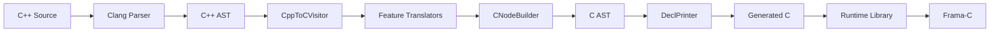

# Architecture Overview

**C++ to C Transpiler System Architecture**

This document provides a high-level overview of the transpiler's architecture for contributors and maintainers.

## Table of Contents

1. [System Overview](#system-overview)
2. [Core Philosophy](#core-philosophy)
3. [Two-Phase Translation](#two-phase-translation)
4. [Major Components](#major-components)
5. [Data Flow](#data-flow)
6. [Extension Points](#extension-points)

## System Overview

The C++ to C transpiler converts modern C++ (including C++20) into clean, readable, formally-verifiable C99 code. It leverages Clang's AST infrastructure to preserve high-level semantics while generating human-readable output suitable for tools like Frama-C.

### Key Characteristics

- **Input**: C++ source code (C++98 through C++20)
- **Output**: Clean C99 code + runtime library
- **Target Use**: Embedded systems, safety-critical applications, formal verification
- **Approach**: Two-phase translation with intermediate C AST
- **Quality Focus**: Generated code clarity over implementation simplicity

### Design Goals

1. **Readable Output**: Generated C code should be as readable as hand-written C
2. **Verifiable**: Compatible with Frama-C and other formal verification tools
3. **Zero-Cost Abstractions**: C++ abstractions compile to efficient C
4. **Modular Runtime**: Optional runtime library for size optimization
5. **Maintainable**: Clean architecture for long-term maintenance

## Core Philosophy

### 1. Quality Over Simplicity

We prioritize generated code quality over implementation simplicity. The v1.5.1 architecture chose intermediate C AST generation (40% more implementation code) for 80% cleaner output.

**Rationale**: Generated code is read/debugged more often than implementation code.

### 2. Battle-Tested Components

Reuse proven implementations rather than reinvent:

- **Clang Printer**: 15+ years of production use
- **PNaCl SJLJ**: Decades of exception handling experience
- **Itanium ABI**: Standard RTTI used by major compilers
- **libcxxabi**: Reference dynamic_cast implementation

### 3. Frama-C First

Optimize for formal verification:

- Runtime library approach (verify once, reuse everywhere)
- Simple control flow (avoid complex expressions)
- ACSL annotation generation
- Deterministic output

### 4. Hybrid Runtime Mode

Flexibility for different use cases:

- **Inline Mode** (default): Zero dependencies, self-contained
- **Library Mode** (optional): 99% size reduction for large projects

## Two-Phase Translation

The transpiler uses a two-phase approach optimized for output quality:

```
┌─────────────────┐
│  C++ Source     │
└────────┬────────┘
         │ Clang Parse + Sema
         ▼
┌─────────────────┐
│  C++ AST #1     │ ← Read Only
│  (Full C++)     │   Template instantiations
│                 │   Type information
│                 │   Semantic analysis
└────────┬────────┘
         │ RecursiveASTVisitor
         │ + CNodeBuilder
         ▼
┌─────────────────┐
│  C AST #2       │ ← Generated
│  (Pure C)       │   CallExpr to runtime
│                 │   IfStmt + CompoundStmt
│                 │   No C++ constructs
└────────┬────────┘
         │ Clang DeclPrinter/StmtPrinter
         │ + PrintingPolicy (C99)
         ▼
┌─────────────────┐
│  Generated C    │ + Runtime Library
│  + #line        │   → Frama-C
└─────────────────┘
```

### Phase 1: C++ AST Analysis

**Input**: C++ source code
**Tool**: Clang Parser + Sema
**Output**: Fully-resolved C++ AST with:
- Template instantiations
- Type information
- Semantic annotations
- Control flow graphs

**Purpose**: Leverage Clang's world-class C++ understanding.

### Phase 2: C AST Generation

**Input**: C++ AST (#1)
**Tool**: RecursiveASTVisitor + CNodeBuilder
**Output**: Pure C AST with:
- Only C-compatible nodes
- Runtime library calls
- Explicit control flow
- Type-safe constructs

**Purpose**: Generate clean, verifiable C structures.

### Phase 3: C Code Emission

**Input**: C AST (#2)
**Tool**: Clang DeclPrinter/StmtPrinter
**Output**: Readable C code with:
- Proper precedence
- Clean formatting
- #line directives
- C99 compliance

**Purpose**: Leverage Clang's proven printer.

## Major Components

### 1. Frontend (Clang Integration)

**Location**: `src/CppToCFrontendAction.cpp`, `src/CppToCConsumer.cpp`

**Responsibilities**:
- Parse C++ source files
- Configure Clang for full semantic analysis
- Create AST consumer
- Manage compilation unit

**Key Classes**:
- `CppToCFrontendAction`: Clang FrontendAction implementation
- `CppToCConsumer`: AST consumer for translation unit

### 2. Translation Layer

**Location**: `src/CppToCVisitor.cpp`

**Responsibilities**:
- Walk C++ AST
- Analyze C++ constructs
- Build intermediate C AST
- Inject runtime calls

**Key Classes**:
- `CppToCVisitor`: RecursiveASTVisitor implementation
- Visitor methods for each C++ construct

### 3. Node Builder Library

**Location**: `include/CNodeBuilder.h`

**Responsibilities**:
- Simplify Clang C node creation
- Encapsulate boilerplate
- Provide type-safe API

**Key Functions**:
- `intVar()`, `structVar()`: Variable declarations
- `call()`, `ref()`: Expressions
- `ifStmt()`, `block()`: Statements

### 4. Feature Translators

**Location**: `src/*Translator.cpp`, `src/*Generator.cpp`

Specialized translation for complex features:

- **Exception Handling**: `ThrowTranslator`, `TryCatchTransformer`, `ExceptionFrameGenerator`
- **RTTI**: `TypeInfoGenerator`, `DynamicCastTranslator`, `TypeidTranslator`
- **Virtual Functions**: `VtableGenerator`, `VirtualCallTranslator`, `VptrInjector`
- **Virtual Inheritance**: `VTTGenerator`, `VirtualInheritanceAnalyzer`
- **Coroutines**: `CoroutineDetector`, `StateMachineTransformer`, `PromiseTranslator`
- **Templates**: `TemplateExtractor`, `TemplateMonomorphizer`

### 5. Output Management

**Location**: `src/FileOutputManager.cpp`, `src/CodeGenerator.cpp`

**Responsibilities**:
- Generate .h/.c file pairs
- Manage include guards
- Handle dependencies
- Apply #line directives

**Key Classes**:
- `FileOutputManager`: Coordinate file generation
- `HeaderSeparator`: Split declarations/definitions
- `IncludeGuardGenerator`: Generate guards
- `DependencyAnalyzer`: Track includes

### 6. Runtime Library

**Location**: `runtime/` directory

**Modules**:
- `exception_runtime.c`: PNaCl SJLJ exception handling
- `rtti_runtime.c`: Itanium ABI RTTI implementation
- `memory_runtime.c`: Coroutine frame allocation
- `vinherit_runtime.c`: Virtual inheritance support

**Size**: 1.7-2.8 KB total

## Data Flow

### Translation Pipeline



### Typical Transformation

**C++ Input**:
```cpp
class Point {
    int x, y;
public:
    Point(int x, int y) : x(x), y(y) {}
    int getX() { return x; }
};
```

**Step 1: C++ AST**
```
TranslationUnitDecl
└─ CXXRecordDecl 'Point'
   ├─ FieldDecl 'x' int
   ├─ FieldDecl 'y' int
   ├─ CXXConstructorDecl 'Point'
   └─ CXXMethodDecl 'getX'
```

**Step 2: C AST**
```
TranslationUnitDecl
├─ RecordDecl 'Point'
│  ├─ FieldDecl 'x' int
│  └─ FieldDecl 'y' int
├─ FunctionDecl 'Point_ctor'
│  └─ ParmVarDecl 'this' struct Point*
└─ FunctionDecl 'Point_getX'
   └─ ParmVarDecl 'this' struct Point*
```

**Step 3: Generated C**
```c
struct Point {
    int x;
    int y;
};

void Point_ctor(struct Point* this, int x, int y) {
    this->x = x;
    this->y = y;
}

int Point_getX(struct Point* this) {
    return this->x;
}
```

## Extension Points

The architecture provides several extension points for new features:

### 1. New Visitor Methods

Add handler for new C++ construct:

```cpp
class CppToCVisitor : public RecursiveASTVisitor<CppToCVisitor> {
public:
    bool VisitNewCppConstruct(NewCppConstruct* node) {
        // Analyze node
        // Build C AST equivalent
        // Return true to continue visiting
        return true;
    }
};
```

### 2. New Feature Translators

Create specialized translator for complex features:

```cpp
class NewFeatureTranslator {
    ASTContext& Ctx;
    CNodeBuilder& Builder;

public:
    Decl* translate(NewFeatureDecl* decl) {
        // Analyze feature
        // Generate C structures
        // Return translated declaration
    }
};
```

### 3. New Runtime Modules

Add runtime support for new feature:

```c
// runtime/new_feature_runtime.c
void cxx_new_feature_operation(void* data) {
    // Implement feature at runtime
}
```

### 4. New Node Builder Helpers

Simplify common C node patterns:

```cpp
class CNodeBuilder {
public:
    Stmt* newCommonPattern(Expr* arg) {
        // Create common C AST pattern
        // Reuse across translation
    }
};
```

## Performance Characteristics

### Compilation Time

| Phase | Time | Bottleneck |
|-------|------|------------|
| Clang Parse | 60% | Template instantiation |
| AST Traversal | 25% | Visitor overhead |
| C AST Building | 10% | Node allocation |
| Code Emission | 5% | I/O |

### Memory Usage

| Component | Size |
|-----------|------|
| C++ AST | 100-200 MB (large project) |
| C AST | 50-100 MB |
| Symbol tables | 20-40 MB |
| Peak usage | 300-500 MB |

### Generated Code Quality

| Metric | Result |
|--------|--------|
| Code size vs inline | 80% reduction (library mode) |
| Lines per function | 3-5x cleaner than direct emission |
| Frama-C proof time | 5-10x faster (runtime verified once) |

## Further Reading

- [MODULES.md](MODULES.md) - Detailed module documentation
- [CONTRIBUTING.md](CONTRIBUTING.md) - Contribution guidelines
- [EXTENSION_GUIDE.md](EXTENSION_GUIDE.md) - How to extend the transpiler
- [../ARCHITECTURE.md](../ARCHITECTURE.md) - Complete technical architecture

## Quick Navigation

- **Implementation Status**: See `/README.md`
- **Feature Guides**: See `/docs/features/`
- **Research Background**: See `/docs/SUMMARY.md`
- **API Reference**: See source code documentation

---

**Document Version**: 1.0
**Last Updated**: 2025-12-18
**Maintained By**: Project Team
